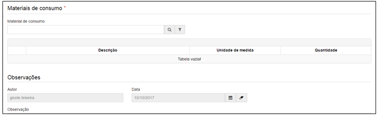

title: Requisição de materiais
Description: Requisição de materiais

# Requisição de materiais

Como acessar
------------

Em “Administração de Materiais”, clique em “Requisição de materiais” no submenu
“Almoxarifado”, para iniciar o registro de uma requisição de materiais.

Como cadastrar
--------------

Ao clicar em cadastrar, será apresentada a seguinte tela:

   
   
   

**Figura 1 - Tela de requisição de materiais**

Preencha os campos do formulário conforme instruções abaixo:

-   **Número da requisição**: o sistema preencherá automaticamente o número da
    requisição.

-   **Almoxarifado**: nome do estoque.

    -   Ao digitar o nome do estoque, o sistema apresentará o estoque já
        cadastrado.

-   **Data da requisição**: data do dia da requisição de materiais.

-   **Unidade requisitante**: nome da unidade requisitante do material.

    -   Ao digitar o nome da unidade requisitante, o sistema apresentará uma
        lista de unidades já cadastradas.

-   **Centro de custo**: o centro de custo possui um número e um nome associado.

    -   Ao digitar número ou nome, o sistema apresentará uma lista de centros já
        cadastrados.

-   **Materiais**: selecione o material a ser requisitado e a quantidade.

-   **Observações**: insira as observações necessárias.
