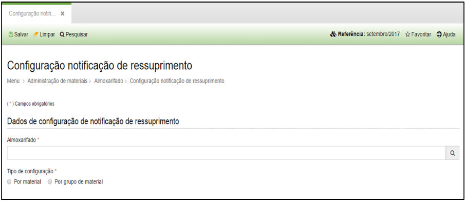
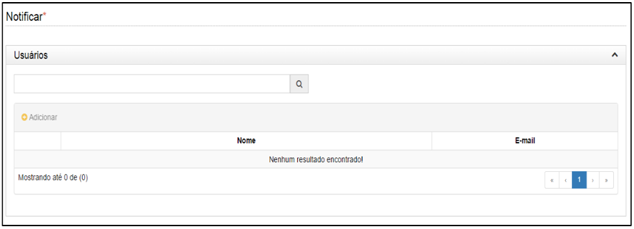
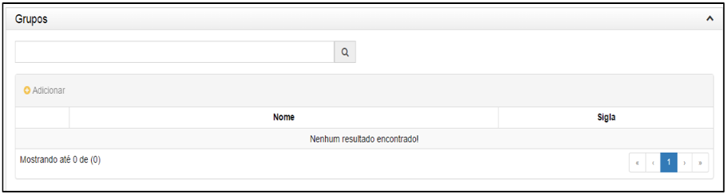

title: Configuração de notificação de ressuprimento
Description: Configuração de notificação de ressuprimento

# Configuração de notificação de ressuprimento

Como acessar
------------

Em “Administração de Materiais”, clique em “Configuração notificação
Ressuprimento” no submenu “Almoxarifado” para configurar uma notificação de
ressuprimento.

Como configurar
---------------

Ao clicar em “Cadastrar”, o sistema apresentará a seguinte tela:

  
  
  
  
  

**Figura 1 - Tela de Ressuprimento**

Preencha os campos do formulário conforme instruções abaixo:

-   **Almoxarifado**: local do estoque.

-   **Tipo de configuração**: Selecione a opção “Por material” ou “Por grupo de
    material”;

-   Caso a opção escolhida em “tipo de configuração” tenha sido material:
    Adicione o material.

    -   **Material**: nome do material para gerar o alerta.

    -   **Tempo de aquisição (em meses)**: Tempo de aquisição do material em
        meses.

    -   Intervalo de aquisição.

    -   **Estoque de segurança**: Digite o número entre 0 e 100%

    -   Clique em Adicionar após o preenchimento.

    -   Caso a opção escolhida em “tipo de configuração” tenha sido material:
        Adicione o material.

    -   Tempo de aquisição.

    -   Intervalo de aquisição em meses.

    -   Estoque de segurança: Digite o número entre 0 e 100%.

!!! tip "About"

    <b>Product/Version:</b> CITSmart | 8.00 &nbsp;&nbsp;
    <b>Updated:</b>08/16/2019 – Anna Martins
