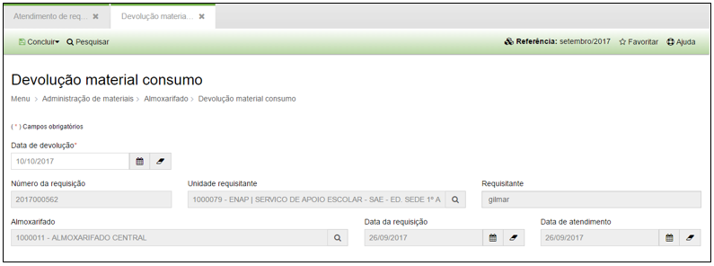
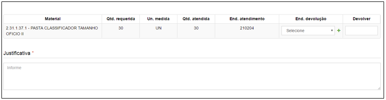
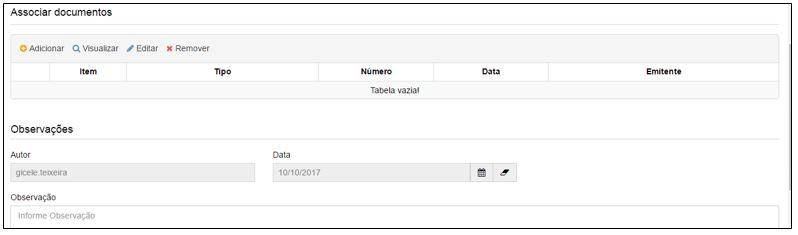

title: Devolução de material de consumo
Description: Devolução de material de consumo

# Devolução de material de consumo

Como acessar
------------

Em “Administração de Materiais”, clique em “Devolução material consumo” no
submenu “Almoxarifado” para cadastrar a devolução de material de consumo.

Como devolver
-------------

Ao selecionar uma requisição e clicar em “Devolver”, o sistema apresentará a
seguinte tela:

   

   
   
   

   **Figura 1 - Tela de cadastro de devolução de material de consumo**

Preencha os campos do formulário conforme instruções abaixo:

-   **Data de devolução**: data do dia da devolução do material de consumo.

-   **Justificativa**: Justifica da devolução do material de consumo.

-   Selecione e preencha o endereço de devolução.

-   Digite no campo “A ser devolvida” a quantidade do material a ser devolvido.

Clique em “Salvar” para concluir a devolução de materiais.

!!! tip "About"

    <b>Product/Version:</b> CITSmart | 8.00 &nbsp;&nbsp;
    <b>Updated:</b>08/16/2019 – Anna Martins
