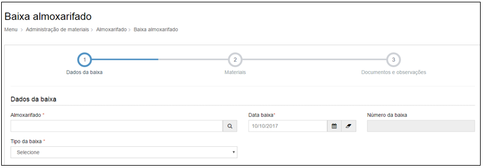

title: Baixa de almoxarifado
Description:Baixa de almoxarifado

# Baixa de almoxarifado

Como acessar
------------

Em “Administração de Materiais”, clique em “Baixa almoxarifado” no submenu
“Almoxarifado” para baixar itens no almoxarifado.

Ao clicar em “Cadastrar”, o sistema apresentará a seguinte tela:

   
   
   **Figura 1 - Tela de cadastro de baixa almoxarifado - Etapa 1**

Preencha os campos do formulário conforme instruções abaixo:

-   **Número da baixa**: o sistema preencherá automaticamente o número da baixa

-   **Almoxarifado**: nome do estoque.

-   **Data baixa**: dia da baixa.

-   **Tipo de baixa**: selecione um dos tipos de baixa cadastrados.

-   **Destino**: Defina o local para o destino da baixa

Após preencher os campos da etapa 1, clique na etapa 02 e informe os materiais
para compor a baixa:

-   Digite no campo “Material” o material que deseja realizar a baixa.

-   No campo “endereço de estoque” selecione o endereço de estoque do material.

-   No campo “Qtd. a baixar” informe a quantidade com um número inteiro de
    quantos materiais você deseja baixar.

Para armazenar documentos referentes ao cadastro dos materiais, clique na opção
“Adicionar” em “Associar Documentos”. No passo 3, para associar documentos,
clique em adicionar.

!!! tip "About"

    <b>Product/Version:</b> CITSmart | 8.00 &nbsp;&nbsp;
    <b>Updated:</b>08/16/2019 – Anna Martins
