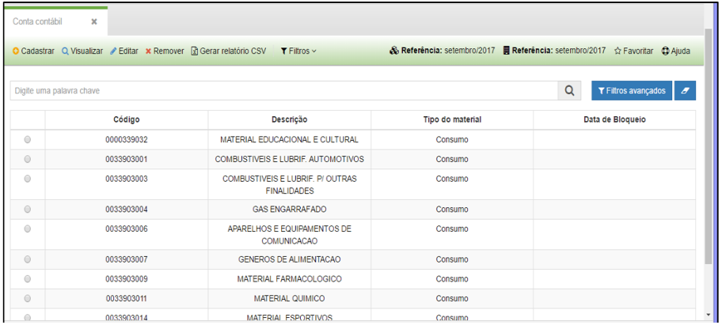
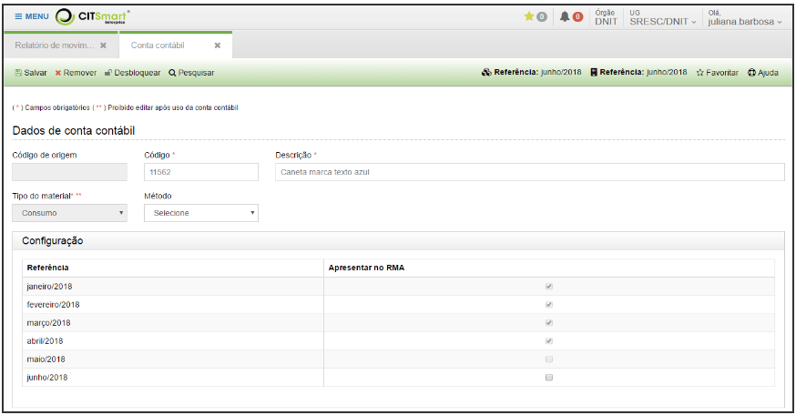

title: Retirar conta contábil do relatório RMA
Description: Retirar conta contábil do relatório RMA

# Retirar conta contábil do relatório RMA

Como acessar
----------

Em “Administração de Materiais”, clique em “Conta contábil” no submenu
“Financeiro”.

Como configurar
--------------

Aparecerá a seguinte tela:

   
   
   **Figura 1 - Submenu Financeiro**

Selecione a conta contábil que deverá ser removida do RMA. Clique em Editar.

   

   **Figura 2 - Editar configurações de conta contábil.**

Desmarcar a opção Apresentar no RMA.

!!! warning "ATENÇÃO"

    Você só pode desmarcar a opção Apresentar RMA para a referência atual.
    Essa opção ficará desabilitada para essa conta nas referências seguinte.

!!! tip "About"

    <b>Product/Version:</b> CITSmart | 8.00 &nbsp;&nbsp;
    <b>Updated:</b>08/16/2019 – Anna Martins
