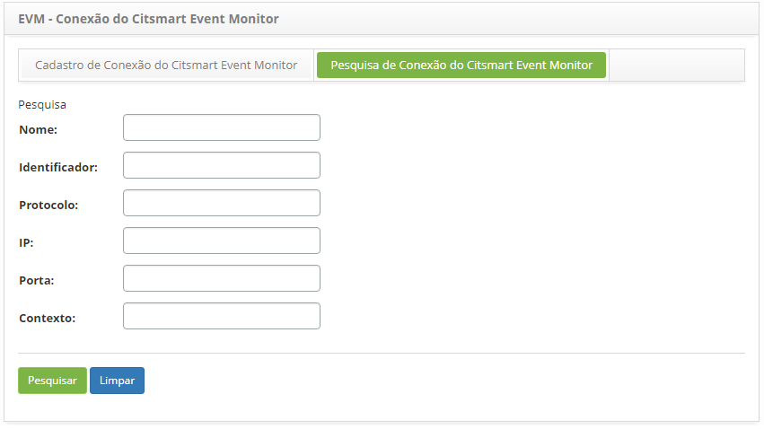
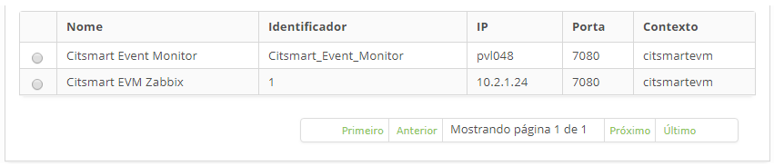
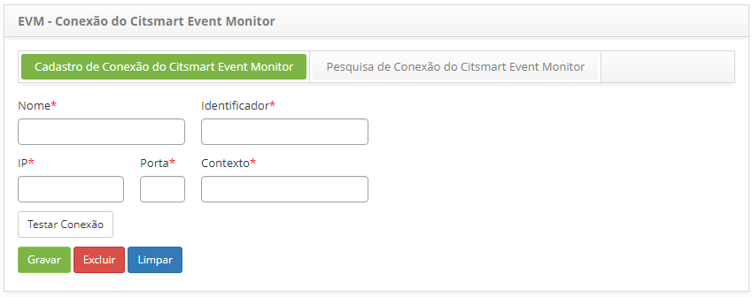

title: Conexão CITSmart Event Monitor
Description: Esta funcionalidade tem como objetivo cadastrar todas as
propriedades referentes à conexão do CITSmart Event Monitor, de acordo com o IP
e porta onde está instalado o Jboss do CITSmart Event Monitor.

# Conexão CITSmart Event Monitor

Esta funcionalidade tem como objetivo cadastrar todas as propriedades referentes
à conexão do CITSmart Event Monitor, de acordo com o IP e porta onde está
instalado o Jboss do CITSmart Event Monitor.

Como acessar
------------

1.  Acesse a funcionalidade de conexão do CITSmart event monitor através da
    navegação no menu principal **Processos ITIL > Gerência de Evento >  Conexões
    Event Monitor**.

Pré-condições
------------

1.  Não se aplica.

Filtros
------

1.  Os seguintes filtros possibilitam ao usuário restringir a participação de
    itens na listagem padrão da funcionalidade, facilitando a localização dos
    itens desejados, conforme ilustrado na figura abaixo:

    -   Nome;

    -   Identificador;

    -   Protocolo;

    -   IP;

    -   Porta;

    -   Conexão.

1.  Na tela de **EVM - Conexão do CITSmart Event Monitor**, clique na
    aba **Pesquisa de Conexão do CITSmart Event Monitor**. Será apresentada a
    tela de pesquisa conforme ilustrada na figura abaixo:

        

    **Figura 1 - Tela de pesquisa de conexão do CITSmart event monitor**

1.  Realize a pesquisa de conexão do CITSmart event monitor:

-   Informe os filtros (nome da conexão, identificador da conexão, protocolo,
    endereço IP do servidor, porta da conexão e/ou contexto da aplicação)
    conforme sua necessidade e clique no botão *Pesquisar*. Após isso, será
    exibido o registro da conexão do CITSmart event monitor conforme os dados
    informados.

-   Caso deseje listar todos os registros, basta clicar diretamente no
    botão *Pesquisar.*

Listagem de itens
----------------

1.  Os seguintes campos cadastrais estão disponíveis ao usuário para facilitar a
    identificação dos itens desejados na listagem padrão da
    funcionalidade: Nome, Identificador, IP, Porta e Contexto.

    
    
    **Figura 2 - Tela de listagem de conexão do CITSmart event monitor**

1.  Após a pesquisa, selecione o registro desejado. Feito isso, será direcionado
    para a tela de cadastro exibindo o conteúdo referente ao registro
    selecionado;

2.  Para alterar os dados do registro de conexão do CITSmart Event Monitor,
    basta modificar as informações dos campos desejados e clicar no
    botão *Gravar*

Preenchimento dos campos cadastrais
----------------------------------

1.  Acesse a funcionalidade, após isso, será apresentada a tela de cadastro
    de **Conexão do CITSmart Event Monitor**, conforme ilustrada na figura
    abaixo:

    
    
    **Figura 3 - Tela de cadastro de conexão do CITSmart event monitor**

1.  Nesta tela, os campos são autoexplicativos. Basta posicionar o mouse sobre o
    campo escolhido e será apresentada uma breve descrição. Portanto serão
    abordadas somente as informações principais para efetuar o registro da
    conexão;

2.  Informe os dados da conexão;

3.  O campo **Identificador** corresponde à propriedade
    “**idCitsmartEventMonitor**” do arquivo de propriedades
    “**evm_config.properties**”.

4.  Após informar os dados da conexão, clique no botão **Testar Conexão** para
    testar conexão com CITSmart Event Monitor.

5.  Clique no botão *Gravar* para efetuar o registro, onde a data, hora e
    usuário serão gravados automaticamente para uma futura auditoria.

!!! tip "About"

    <b>Product/Version:</b> CITSmart | 8.00 &nbsp;&nbsp;
    <b>Updated:</b>07/18/2019 – Anna Martins

