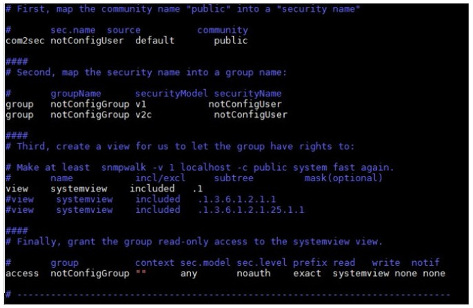

title:  Manual de instalação do componente EVM
Description: Neste documento, será apresentado o processo de Gerenciamento de Eventos. 
# Manual de instalação do componente EVM

Neste documento, será apresentado o processo de Gerenciamento de Eventos.

Segundo a ITIL, eventos é uma mudança de estado que possui significado para o gerenciamento de um item de configuração (IC) ou 
serviço de TI.

Exemplos de eventos:

- Um usuário logou no sistema;
- Um backup agendado não ocorreu;
- O sistema está sendo acessado pelo dobro de usuários do que o normal;
- Um usuário não autorizado acessou um local da rede;
- Um sistema está mais lento do que o normal;
- Excesso de ligações por engano para o service desk;
- Qualquer outro que tenha relevância para quem está gerindo os serviços de ti.

Eventos são tipicamente reconhecidos por meio de notificações criadas por um serviço de TI, IC (Item de Configuração) ou
ferramenta de monitoração.

O objetivo do Gerenciamento de Eventos é prover a capacidade de detectar eventos, analisá-los e determinar ações de controle
apropriadas. O Gerenciamento de Eventos é, portanto, a base para monitoração e controle operacional.

O Gerenciamento de Eventos pode ser relacionado com outros processos, como o Gerenciamento de Ativos e Configuração. Em relação a 
este processo, o Gerenciamento de Eventos poderá ajudar a determinar o status do ciclo de vida dos ativos. Por exemplo, um evento 
pode ser gerado para sinalizar que um ativo foi configurado de forma errada, impactando na operação e na entrega do serviço. Além
disso, a Gestão de Eventos pode ser uma rica fonte de informações para os Sistemas de Gestão de Conhecimento. Por exemplo, os 
padrões de desempenho podem ser correlacionados com as atividades empresariais e utilizados como embasamento para decisões 
estratégicas futuras.

Rotina do gerenciamento de eventos
--------------------------------------

Abaixo segue o desenho explicativo da rotina do Gerenciamento de Eventos:

**Figura 1 - Rotina do gerenciamento de eventos**

- **CMDB**: É um repositório de informações relacionadas a todos os componentes do CITSmart. Ele contém os detalhes dos [itens de 
configuração][1] (IC) na infraestrutura de TI.
- **Citsmart Event Monitor**: Aplicação responsável por capturar os eventos que ocorre na infraestrutura de TI.
- **Citsmart Inventory**: Aplicação responsável por realizar o inventário dos ativos e itens de configuração na rede e enviar os 
dados obtidos para o CITSmart armazenar no banco de dados.
- **MongoDB**: Banco de dados orientado a documentos, diferente dos bancos de dados tradicionais que seguem o modelo relacional.
Ele é de [grande armazenamento][2] de dados e de maior velocidade.
- **Nagios**: Ferramenta de monitoramento de rede. Ele pode monitorar tanto Hosts quanto Serviços, alertando quando ocorrerem 
problemas e também quando os problemas são resolvidos. Os hosts são os equipamentos e os Serviços são os recursos oferecidos 
pelos equipamentos.
- **Zabbix**: Ferramenta de monitoramento de redes, servidores e serviços, pensada para monitorar a disponibilidade, experiência
de usuário e qualidade de serviços. A arquitetura Zabbix e a flexibilidade dos módulos permitem que a ferramenta seja utilizada
para o monitoramento convencional (on/off), acompanhamento de desempenho de aplicações, análise de experiência de usuário e 
análise de causa raiz em ambientes complexos, através do servidor Zabbix e as regras de correlacionamento.

Funcionamento da rotina de gerenciamento de eventos
-------------------------------------------------------

A rotina do Gerenciamento de Eventos funciona da seguinte forma:

- O Citsmart Event Monitor se comunica com a ferramenta de monitoração (Nagios e/ou Zabbix) para receber as informações de 
eventos dos ativos da rede e enviar para o CITSmart disparar as ações de controle apropriadas.
- O Citsmart Inventory faz o levantamento de inventário dos ativos e itens de configuração da rede e se comunica com o Citsmart
Event Monitor para enviar essas informações, para que o mesmo processe as regras as quais foram definidas no CITSmart e envie as
ocorrências de eventos, que estão armazenadas no MongoDB, para o CITSmart disparar as devidas ações. Além disso o Citsmart 
Inventory também se comunica com o CITSmart e repassa os dados dos ativos capturados para o registro dos itens de configuração.

!!! note "NOTA"

    As regras utilizadas pelo Citsmart Event Monitor são criadas por uma linguagem chamada EPL (Linguagem de Processamento de
    Eventos).
    
!!! info "IMPORTANTE"

    Para que essa rotina funcione perfeitamente, é necessário realizar toda a configuração, corretamente, dos insumos do módulo
    de Gerenciamento de Eventos no CITSmart ITSM.
    
Integração do módulo de gerenciamento de eventos
-------------------------------------------------------

O Gerenciamento de Eventos é composto pelas seguintes aplicações:

- CITSmart - CMDB e plataforma ITSM;
- Citsmart EVM - Gerenciamento de Eventos;
- Citsmart Inventory - Inventário.

!!! info "IMPORTANTE"

    Cada aplicação deverá ser instalada em uma instância separada do JBoss.
    
!!! note "NOTA"

    As instâncias deverão ser baixadas no FTP da Central IT.
    
Para integrar o Módulo de Gerenciamento de Eventos deve levar em consideração os seguintes pontos:

- Se não possuir o CITSmart instalado, no caso de um cliente novo, deverá instalar o mesmo, e as aplicações Citsmart Inventory e
Citsmart Event Monitor.
- Caso já tenha o CITSmart instalado, deverá realizar a atualização do mesmo para a última versão oficial que possui o 
Gerenciamento de Eventos e instalar as aplicações Citsmart Inventory e Citsmart Event Monitor.

Procedimentos iniciais
------------------------

Agente de Captura CITSMART.NET e SNMP

*Agente de Captura CITSMART.NET* : é um componente da solução CITSmart, que é executado em máquinas Windows (é o mesmo componente
que é executado no Inventory Collection Server, a diferença é que ele é executado localmente com as políticas da Conta do 
Sistema Local - sem permissões Acesso à rede e outros equipamentos).

*SNMP*: o Protocolo de Gerenciamento de Rede Simples (SNMP) é um protocolo de camada de aplicação para gerenciamento de rede IP
típico que facilita a troca de informações entre dispositivos de rede, como cartões e computadores (switches) e impressoras. Para
que o SNMP funcione nos ambientes Windows e Linux, você precisa instalar os componentes / pacotes e habilitar as permissões.

O aplicativo Inventário captura os dados através da porta SNMP (161) e / ou do Agente de captura Citsmart.Net (porta 7103, 
desenvolvida pela Central IT). Inicialmente, o inventário executa um comando "ping" para verificar se a máquina está ativa. Se
você pode executar o comando, tente acessar a porta SNMP do item de configuração. Se o acesso à porta não for bem-sucedido, o 
Inventory tentará acessar através do agente de captura.

!!! note "NOTA"

    As configurações relacionadas ao Inventário Citsmart são realizadas no CITSmart ITSM, no menu 
    Processos ITIL > Gerenciamento de Eventos > Conexões de Inventário.
    
O Agente de captura Citsmart.Net pode ser usado como um "centralizador" de captura, ao qual os pedidos de captura de inventário
para todas as outras máquinas em uma rede seriam direcionados. Este é mesmo o caminho mais adequado para redes com uma grande 
quantidade de máquinas. Você também pode realizar o inventário sem o Agente de captura Citsmart.Net. Neste caso, é necessário
configurar o serviço "SNMP" de cada máquina. Por outro lado, o Capture Agent Citsmart.Net também pode ser instalado
individualmente em cada máquina (neste caso, eliminando a necessidade de configurar a porta SNMP de cada máquina).

Se for utilizado o Citsmart Inventory para a captura de Eventos, seguir as informações sobre o Agente de Captura CITSMART.NET e 
SNMP que está contido no conhecimento “Manual de instalação do componente Inventory”.

Instalando/Configurando SNMP no ambiente Windows
------------------------------------------------------

Para realizar a instalação/configuração do serviço SNMP no ambiente Windows, proceda conforme os passos descritos abaixo:

1. Abra a tela de recursos do Windows **Painel de Controle → Programas e Recursos → Ativar ou desativar recursos do Windows**;

    
    
    **Figura 2 - Tela de recurso do Windows**
    
2. Verifique se o recurso Protocolo SNMP está ativo, ou seja, se está selecionado, caso não esteja, selecione o mesmo e clique 
em Ok para ativação do protocolo SNMP, conforme indicado na figura abaixo;

    
    
    **Figura 3 - Tela de ativação de recursos do Windows**
    
3. Feito isso, abra a tela de serviços do Windows para configurar o SNMP;

    
    
    **Figura 4 - Busca do serviços do Windows**
    
4. Após abrir a tela de serviços do Windows, clique com o botão direito do mouse sobre o serviço SNMP e logo em seguida clique
em Propriedades, conforme indicado na figura abaixo;

    
    
    **Figura 5 - Tela de serviços do Windows**
    
5. Será apresentada a tela de Propriedades do Serviço SNMP. Clique na aba Segurança, marque a opção Aceitar pacotes SNMP de
qualquer host e clique em Adicionar para cria uma nova comunidade, conforme indicado na figura abaixo;

    
    
    **Figura 6 - Tela de propriedades de serviço SNMP**
    
6. Será apresentada a tela para informar os dados da nova comunidade. Informe o nome public para a comunidade e permaneça com a 
opção Somente Leitura para os direitos da comunidade e clique em Adicionar, conforme indicado na figura abaixo;

    
    
    **Figura 7 - Tela de configuração da comunidade do serviço SNMP**
    
7. Feito isso, será apresentada a nova comunidade na tela de Propriedades do Serviço SNMP, conforme ilustrado na figura abaixo;

    
    
    **Figura 8 - Configuração do serviço SNMP**
    
8. Para efetuar a configuração do Serviço SNMP, basta clicar no botão "Ok".

Instalação/Configuração do SNMP no ambiente Linux
-------------------------------------------------------

Para realizar a instalação/configuração do SNMP no ambiente Linux, proceda conforme os passos descritos abaixo:

*Instalação do SNMP no Sistema Operacional CentOS*

1. Execute o seguinte comando para instalar o pacote net-snmp:

    
    
2. O comando seguinte fará o backup do arquivo de configuração original do SNMP:

    
    
*Configurando o Arquivo snmpd.conf*

1. Edite o arquivo /etc/snmp/snmpd.conf;

Existem algumas premissas básicas ao configurar o SNMP, são elas:

    a. Configuração da comunidade
    
    Caso esta linha não exista você deverá criá-la, porém caso ela exista, deixe-a de acordo como está mostrado abaixo:
    
    
    
    b. Configuração do grupo
    
    Caso estas linhas não existam você deverá criá-las, porém caso elas existem, deixe-as de acordo como está demonstrado abaixo:
    
    
    
    c. Configuração da árvore SNMP
    
    Caso esta linha não exista você deverá criá-la, porém caso ela exista, deixe-a de acordo como está mostrado abaixo:
    
    
    
    d. Configuração de acesso do grupo
    
    Caso esta linha não exista você deverá criá-la, porém caso ela exista, deixe-a de acordo como está mostrado abaixo:
    
    
    
    e. A configuração completa deverá ficar similar ao apresentado abaixo:
    
    
    
    f. Reinicie o serviço SNMP com o seguinte comando:
    
    
    
    g. Após restartar o SNMP, realize o teste local com o objetivo de verificar se o SNMP está rodando:
    
    
    
    h. O teste deverá retornar o seguinte resultado:
    
    
    
Instalação do MongoDB
------------------------

Instale o MongoDB através do link: [https://www.mongodb.org/][3].

Para mais detalhes sobre a instalação e configuração de serviços verifique a documentação através do link:
[https://docs.mongodb.com/manual/administration/install-community/][4].

Configuração das aplicações
-------------------------------

Para realizar a integração do Módulo de Gerenciamento de Eventos, é necessário, proceder conforme os passos indicados abaixo:

1. Baixar o JBoss para ITSM no seguinte link: jboss-as-7.1.2.Final - CITSmart ITSM;

2. Baixe o JBoss para Event Monitor: jboss-as-7.1.2.Final - EVM;

3. Baixe o JBoss para Inventory no seguinte link: jboss-as-7.1.2.Final - Inventory;

4. Copie as últimas versões das aplicações (arquivos com extensão .war) para a pasta deployments das respectivas instâncias do
JBoss;

5. Altere o arquivo standalone-full.xml das respectivas instâncias do Jboss:

Os arquivos de configuração do JBoss se encontram na pasta configuration de cada instância do JBoss, disponibilizadas pela 
Central IT.

**standalone-full.xml (CITSmart ITSM)**

1. Altere a seguinte seção deste arquivo, conforme indicado abaixo.

    
    
    **standalone-full.xml (Citsmart Inventory)**
    
2. Altere a seguinte seção deste arquivo, conforme indicado abaixo.

    
    
    **standalone-full.xml (Citsmart Event Monitor)**
    
3. Altere a seguinte seção deste arquivo, conforme indicado abaixo.

    
    
    !!! info "IMPORTANTE"
    
        As configurações de cada aplicação (Citsmart ITSM, Citsmart EVM e Citsmart Inventory) estão contidas no arquivo 
        standalone-full.xml.
        
    !!! warning "ATENÇÃO"
    
        Na tag property das configurações acima <property name="citsmart.login" value=""/> , tanto da seção standalone-full.xml
        (Citsmart Inventory) quanto da seção standalone-full.xml (Citsmart Event Monitor), na propriedade “nome” o valor que 
        normalmente é o login do usuário, desde a versão 7.2.2.0 é preciso informar o contexto.
        
Configuração do módulo de gerenciamento de eventos
---------------------------------------------------------

**Figura 9- Processo de configuração de eventos com Inventory**

**Figura 10 - Processo de configuração de eventos com Nagios/Zabbix**

**Figura 11 - Processo de configuração de eventos Global**

**Figura 12- Processo de configuração do Inventory**

Configuração dos cadastros
-----------------------------

!!! note "NOTA"

    Todas as configurações para as aplicações do Gerenciamento de Eventos devem ser feitas no CITSmart ITSM.
    
Após as instâncias do JBoss de cada aplicação estiverem inicializadas, acesse o CITSmart no endereço:
http://<ip>[:<porta>]/citsmart, feito isso, realize as configurações dos cadastros mencionados abaixo.

Cadastro de horários
------------------------

1. Acesse o menu **Processos ITIL > Gerência de Evento > Horário**;

    
    
    **Figura 13 - Cadastro de horário**
    
2. Cadastre a frequência com que as ferramentas de monitoração serão consultadas sobre o status dos itens de configuração 
pré-cadastrados. Exemplo: a cada 2 minutos; a cada 40 minutos.

    !!! info "IMPORTANTE"
    
        Os horários cadastrados são convertidos em expressões cron.
        
    !!! note "NOTA"
    
        Por meio de expressões cron, é possível criar horários flexíveis, tais como “toda terça às 15:00”.
        
Cadastro de categoria de ocorrência
-------------------------------------

1. No CITSmart ITSM, acesse o menu **Processos ITIL > Gerência de Evento > Categoria de Ocorrência**;

    
    
    **Figura 14 - Cadastro de categoria de ocorrência**
    
2. Cadastre as categorias de ocorrências.

    !!! note "NOTA"
    
        Os tipos de eventos permitem agrupar ocorrências de eventos de um mesmo tipo.
        
    !!! abstract "SAIBA MAIS"
    
        Este tipos de eventos permitem agrupar ocorrências de eventos de um mesmo tipo.
        
Cadastro de ações automáticas - incidente/requisições
--------------------------------------------------------

1. Acesse o menu **Sistema > Ações Automáticas > Ações Incidentes / Requisições / Procedimentos**;

    
    
    **Figura 15- Cadastro de ações de incidente/requisições**
    
2. Cadastre os dados do incidente ou requisição que será aberto durante a execução de uma ação.

Cadastro de ações automáticas - problema
--------------------------------------------

1. Acesse o menu **Sistema > Ações Automáticas > Ações Problema**;

    
    
    **Figura 16 - Cadastro de ações de problema**
    
2. Cadastre os dados do problema que será aberto durante a execução de uma ação.

Cadastros de ações automáticas - mudança
------------------------------------------

1. Acesse o menu **Sistema > Ações Automáticas > Ações Mudança**;

    
    
    **Figura 17 - Cadastro de ações de mudança**
    
2. Cadastre os dados da mudança que será aberta durante a execução de uma ação.

Cadastro de ação de notificação
---------------------------------

1. Acesse o menu **Sistema > Ações Automáticas > Ações Notificação**;

    
    
    **Figura 18- Cadastro de ação de notificação**
    
2. Cadastre os usuários, grupos ou e-mails que serão notificados durante a execução de uma ação.

Cadastro de ação automática
-----------------------------

1. Acessar **Sistema > Ações Automáticas > Ações Automáticas**;

    
    
    **Figura 19 - Cadastro de ação automática**
    
2. Relacione as ações de notificação ou incidentes / requisições às ações automáticas.

    !!! note "NOTA"
    
        As ações automáticas são associadas no cadastro de gerentes de eventos. Estas ações serão disparadas sempre que ocorrer
        um evento, e deverão ser relacionadas de acordo com o tipo do evento. Exemplo: WARNING (advertência), EXCEPTION (exceção),
        etc.
        
Cadastro de conexões do CITSmart Inventory
--------------------------------------------

1. Acesse o menu **Processos ITIL > Gerência de Evento > Conexões Inventory**;

    
    
    **Figura 20 - Cadastro de conexão do Citsmart Inventory**
    
2. Cadastre todas as propriedades referentes à conexão do Citsmart Inventory, de acordo com o IP e porta onde está instalado o 
JBoss do Citsmart Inventory.

!!! note "NOTA"

    O campo Identificador Inventory corresponde à propriedade citsmart.inventory.id do standalone-full.xml do servidor de 
    aplicações onde está instalado o CITSmart Inventory.
    O campo IP Servidor Agente de Captura refere-se ao IP do servidor onde está instalado o Agente de Captura das informações das 
    máquinas.
    
Cadastro de conexões do CITSmart Event Monitor
-------------------------------------------------

1. Acesse o menu **Processo > Gerência de Evento > Conexões Event Monitor**;

    
    
    **Figura 21 - Cadastro de conexão do Citsmart Event Monitor**
    
2. Cadastre todas as propriedades referentes à conexão do Citsmart Event Monitor, de acordo com o IP e porta onde está instalado 
o JBoss do Citsmart Event Monitor.

Cadastro de Check
--------------------

1. Acesse o menu **Processos ITIL > Gerência de Evento > Check**.

    
    
    **Figura 22 - Cadastro de checks**
    
2. Realize o cadastro dos Checks que serão utilizados para monitoração dos itens de configuração.

Cadastro de gerentes de eventos Inventory
-------------------------------------------

1. Acesse o menu **Processos ITIL > Gerência de Evento > Gerente Inventory**;

    
    
    **Figura 23 - Cadastro de gerente de eventos Inventory**
    
2. Cadastre tantos gerentes quantos forem necessários para monitorar os itens de configuração cujos status serão consultados no
Citsmart Inventory.

    !!! info "IMPORTANTE"
    
        Cada gerente Inventory contém uma lista de itens de configuração que são associados aos seus respectivos checks que estão
        cadastrados no próprio Citsmart ITSM.
        
    !!! note "NOTA"
    
        Para cada item de configuração, é associada uma ação para warning (advertência) e/ou uma ação para exception (exceção).
        
Cadastro de ferramentas de monitoração
--------------------------------------------

1. Acesse o menu Processos ITIL → Gerência de Evento → Ferramentas de Monitoração;

    
    
    **Figura 24 - Cadastro de ferramenta de monitoração**
    
2. Cadastre as ferramentas que serão vinculadas ao Gerenciamento de Eventos (Event Monitor) para realizar a monitoração dos
diversos itens de configuração.

    !!! note "NOTA"
    
        Atualmente, o Gerenciamento de Eventos (Event Monitor) integra com as ferramentas Nagios, Zabbix e Citsmart Inventory 
        para realizar a monitoração dos ativos da rede.
        
    !!! info "IMPORTANTE"
    
        O Citsmart Inventory acumula a função de ferramenta de monitoração e inventário.
        
Cadastro de gerentes de eventos Zabbix
-----------------------------------------

1. Acesse o menu **Processos ITIL > Gerência de Evento > Gerente Zabbix**;

    

    **Figura 25 - Cadastro de gerente de eventos Zabbix**
    
2. Cadastre o Gerente de Eventos Zabbix, quantos forem necessários para monitorar os itens de configuração cujos status serão
consultados no Zabbix.

    !!! info "IMPORTANTE"
    
        Cada gerente Zabbix contém uma lista de itens de configuração que são associados às suas respectivas triggers que estão 
        cadastradas no Zabbix.
       
    !!! note "NOTA"
    
        Para cada item de configuração, é associada uma ação para warning (advertência) e/ou uma ação para exception (exceção).
        
Cadastro de gerente de eventos Nagios
----------------------------------------

1. Acesse o menu Processos ITIL → Gerência de Evento → Gerente Nagios;

    
    
    **Figura 26 - Cadastro de gerente de eventos Nagios**
    
2. Cadastre o Gerente de Eventos Nagios, quantos forem necessários para monitorar os itens de configuração cujos status serão 
consultados no Nagios.

    !!! info "IMPORTANTE"
    
        Cada gerente Nagios contém uma lista de itens de configuração que são associados aos seus respectivos serviços que estão
        cadastrados no Nagios.
        
    !!! note "NOTA"
    
        Para cada item de configuração, é associada uma ação para warning (advertência) e/ou uma ação para exception (exceção).
        
Cadastro de gerente de eventos Global
-----------------------------------------

1. Acesse o menu **Processo > Gerência de Evento > Gerente de Eventos Global**;

    
    
    **Figura 27 - Cadastro de gerente de eventos correlacionados**
    
2. Cadastre o Gerente de Eventos Correlacionados, quantos forem necessários.

    !!! info "IMPORTANTE"
    
        Cada gerente de Eventos Correlacionados contém uma EPL para Warning (advertência) e/ou Exception (exceção)
        
    !!! abstract "SAIBA MAIS"
    
        EPL é uma linguagem de correlação de eventos utilizada pelo Esper (Espertech). Na inicialização do Citsmart Event Monitor,
        estes EPL são importados para a engine do Esper, de modo que um novo evento correlacionado será criado toda vez que a
        condição definida na EPL for satisfeita.
        
Abaixo segue o exemplo de uma EPL que faz uma correlação entre os eventos do Citsmart Inventory e Nagios:

*@Description('Para qualquer evento do Nagios que ocorrer depois de um evento qualquer do Inventory, nos últimos 10 minutos')
select * from pattern [every a=EventoCheckInventory-> b=EventoServicoNagios where timer:within(10 minutes)]*

Esquema de Webservice para sistemas legados (monitoramento de negócios)
----------------------------------------------------------------------------

É a possibilidade de conexão com qualquer ferramenta, diferente das que o módulo de Gerenciamento de Eventos atualmente se 
integra (Nagios, Zabbix e Inventory). A ideia é que qualquer ferramenta possa se integrar ao módulo de Gerenciamento de Eventos,
desde que os dados enviados (via webservice) seguem um padrão pré-estabelecido. Uma vez que os dados são enviados para o Citsmart
Event Monitor, podem ser criadas regras (por exemplo, com o EPL do Esper) para que determinados eventos sejam disparados de 
acordo com alguma condição observada nos dados.

!!! example "EXEMPLO"

    Um caso de uso que podemos usar é de folha de pagamentos.
    Digamos que seja regra de uma empresa não contratar mais de 5 funcionários por setor.
    O programa de folha de pagamento poderia enviar os dados mínimos de cada contratação por departamento (definido no plano 
    orçamentário da empresa), de modo que sempre que o número de contração por departamento ultrapassar o limite 
    pré-estabelecido, um evento de “excesso de contratação” poderia ser disparado.
    
[Download][5]

!!! tip "About"

    <b>Product/Version:</b> CITSmart | 7.00 &nbsp;&nbsp;
    <b>Updated:</b>07/30/2019 - Larissa Lourenço
              
[1]:https://pt.wikipedia.org/wiki/Item_de_configura%C3%A7%C3%A3o
[2]:https://pt.wikipedia.org/wiki/Very_Large_Database
[3]:https://www.mongodb.com/
[4]:https://docs.mongodb.com/manual/administration/install-community/
[5]:https://itsm.citsmartcloud.com/citsmart/pages/visualizarUploadTemp/visualizarUploadTemp.load?path=ID=11897
