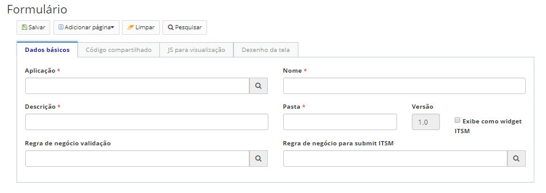

title:  Manual de criação de formulário no CITSmart Neuro para pesquisas de satisfação de atendimentos no CITSmart Enterprise ITSM
Description: Tem por objetivo a elaboração de pesquisa de satisfação a ser respondida pelo solicitante de um ticket. 
# Manual de criação de formulário no CITSmart Neuro para pesquisas de satisfação de atendimentos no CITSmart Enterprise ITSM

Esta funcionalidade tem por objetivo a elaboração de pesquisa de satisfação a ser respondida pelo solicitante de um ticket, cujos 
campos da pesquisa são personalizados por um formulário CITSmart Neuro.

Passos para personalizar uma pesquisa de satisfação
------------------------------------------------------

Criando o formulário no CITSmart Neuro
------------------------------------------

1. Acesse a funcionalidade através do menu **Neuro > Gerenciamento > Formulário**;

2. Conforme está descrito nos conhecimentos Formulário e Desenvolvendo aplicações, preencha os campos da primeira aba de acordo com a
sua necessidade;

    
    
    **Figura 1 - Tela de cadastro de formulário**
    
    !!! info "IMPORTANTE"
    
        Especificamente para a empresa CITSmart Corporation, deverá ser informado Integração ITSM_Builder no campo Aplicação e
        itsm_builder no campo Pasta.
        
3. Crie o lay-out do formulário será criado na aba Desenho de tela, conforme o exemplo abaixo.

    
    
    **Figura 2 - Exemplo de desenho de formulário Neuro**
    
4. Na opção de menu "Adicionar página", selecionar "Página de form padrão".

Vinculando o template de solicitação de serviço ao formulário CITSmart Neuro
-------------------------------------------------------------------------------

1. Acesse a funcionalidade através do menu Sistema → Template de Solicitação de Serviço;

2. Crie um novo template, preenchendo os campos abaixo (ver conhecimento 
Cadastro e pesquisa de template de solicitação de serviço);

    
    
    **Figura 3 - Exemplo de criação de template de serviço**
    
    !!! warning "ATENÇÃO"
    
        O Tipo de Template deverá ser sempre Neuro.
        
3. No campo Formulário Neuro, selecione o formulário Neuro criado anteriormente.

!!! note "NOTA"

    No campo Página Neuro deverá ser selecionado o tipo: default.
    
Vinculando o cadastro de atividades de serviços (portfólio) ao novo template de solicitação de serviço
---------------------------------------------------------------------------------------------------------

1. Acesse a funcionalidade através do menu **Processos ITIL > Gerência de Portfólio e Catálogo > Gerenciamento de Portfólio e
Catálogo**.

2. Selecione o portfólio desejado e clique em "Avançar";

3. Selecione o serviço desejado e clique em "Avançar";

4. Na aba Requisições, selecione a atividade desejada e clique em "Editar";

5. No campo **Template visualização**, vincule o template elaborado anteriormente, conforme a figura abaixo:

**Figura 4 - Vínculo de template à atividade**

Validando a personalização da pesquisa
-----------------------------------------

1. Acesse a funcionalidade **Processos ITIL > Gerência de Requisição e Incidente > Requisição de Serviços e Incidentes**.

2. Inicie o cadastramento de um novo ticket (ver conhecimento Gerenciamento de ticket (serviços));

!!! note "NOTA"

    O  ticket desta validação deve usar a atividade na qual foi vinculado o novo template.
    

**Figura 5 - Visualização da pesquisa de satisfação no ticket**

!!! tip "About"

    <b>Product/Version:</b> CITSmart | 7.00 &nbsp;&nbsp;
    <b>Updated:</b>08/07/2019 - Larissa Lourenço
