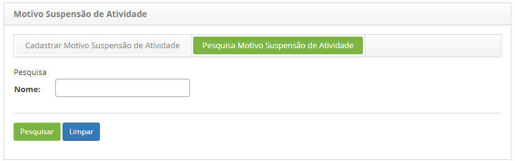
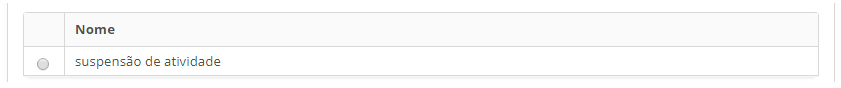
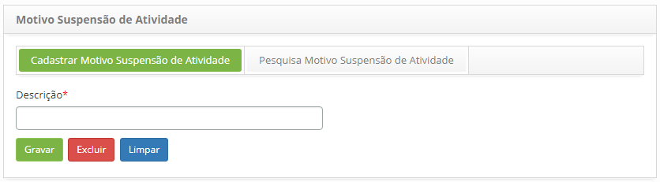

title: Cadastro e pesquisa de motivo de suspensão de atividade
Description: Esta funcionalidade tem por objetivo registrar o motivo da
suspensão da atividade periódica.

# Cadastro e pesquisa de motivo de suspensão de atividade

Como acessar
-----------

1.  Acesse o menu principal **Cadastros Gerais > Motivo Suspensão de
    Atividade**.

Pré-condições

1.  Não se aplica.

Filtros
------

1.  O seguinte filtro possibilita ao usuário restringir a participação de itens
    na listagem padrão da funcionalidade, facilitando a localização dos itens
    desejados:

-   Nome.

    
    
    **Figura 1 - Tela de pesquisa de motivo de suspensão de atividade**

1.  Realize a pesquisa de motivo de suspensão de atividade:

-   Informe o nome do motivo de suspensão de atividade que deseja pesquisar e
    clique no botão *Pesquisar*. Após isso, será exibido o registro do motivo de
    suspensão de atividade conforme a descrição informada;

-   Caso deseje listar todos os registros de motivo de suspensão de atividade,
    basta clicar diretamente no botão *Pesquisar*.

Listagem de itens
----------------

1.  O seguinte campo cadastral está disponível ao usuário para facilitar a
    identificação dos itens desejados na listagem padrão da
    funcionalidade:** Nome.**

    

    **Figura 2 - Tela de listagem de suspensão de atividade**

1.  Após a pesquisa, selecione o registro desejado. Feito isso, será direcionado
    para a tela de cadastro exibindo o conteúdo referente ao registro
    selecionado;

2.  Para alterar os dados do registro de motivo de suspensão de atividade, basta
    modificar as informações dos campos desejados e clicar no
    botão *Gravar* para que seja gravada a alteração realizada no registro, onde
    a data, hora e usuário serão gravados automaticamente para uma futura
    auditoria.

Preenchimento dos campos cadastrais
----------------------------------

1.  Será apresentada a tela de Cadastro de Motivo de Suspensão de Atividade,
    conforme ilustrada na figura abaixo:

    

    **Figura 3 - Tela de cadastro de motivo de suspensão de atividade**

1.  Informe a descrição do motivo da suspensão de atividade e clique no
    botão *Gravar* para efetuar o registro, onde a data, hora e usuário serão
    gravados automaticamente para uma futura auditoria.

!!! tip "About"

    <b>Product/Version:</b> CITSmart | 8.00 &nbsp;&nbsp;
    <b>Updated:</b>07/18/2019 – Anna Martins
