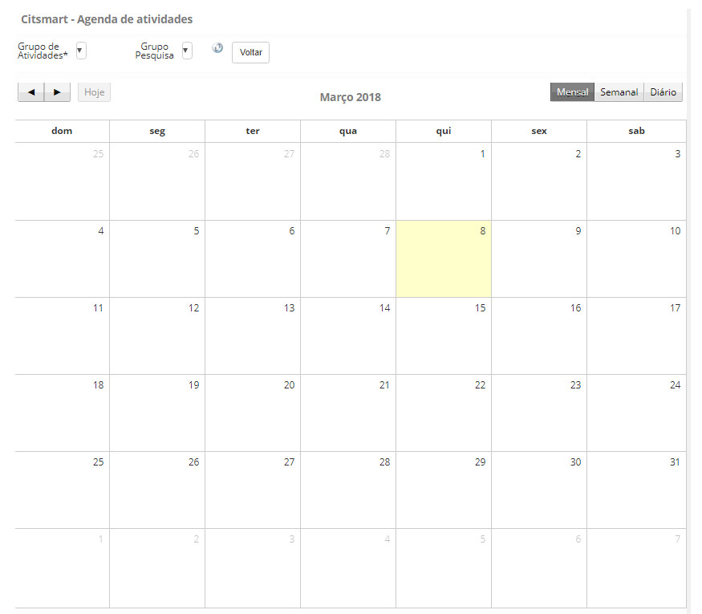
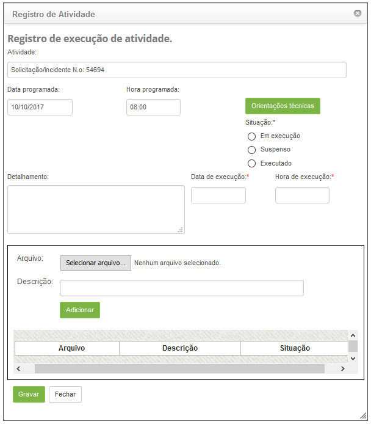
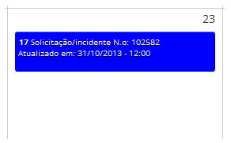
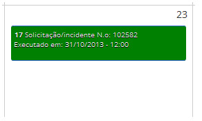
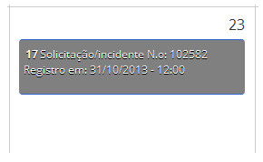

title:  Verificação das atividades periódicas agendadas
Description: Tem por objetivo verificar as atividades agendadas referentes ao gerenciamento de requisição e incidente. 
# Verificação das atividades periódicas agendadas

Esta funcionalidade tem por objetivo verificar as atividades agendadas referentes ao gerenciamento de requisição e incidente, 
gerenciamento de problema, gerenciamento de mudança e gerenciamento de liberação para execução das mesmas.

Como acessar
--------------

1. Acesse o menu **Gestão Integrada > Automação das Operações de TI > Agenda Ativ. Periódica**.

Pré-condições
---------------

1. Não se aplica.

Filtros
----------

1. Os seguintes filtros possibilitam ao usuário restringir a participação de itens na listagem padrão da funcionalidade, facilitando a 
localização dos itens desejados:

    - Grupo de Atividades;
    - Grupo Pesquisa;
    - Mensal;
    - Semanal;
    - Diário.
    
2. Será apresentada a tela de **Agenda de Atividades Periódicas**. A mesma é exibida em formato de calendário, onde poderá ser
visualizada as atividades. A figura abaixo ilustra essa tela:

    
    
    **Figura 1 - Agenda de atividades**
    
    - **Grupo de Atividades**: selecione o grupo executor de atividades periódicas para visualizar suas tarefas agendadas;
    - **Grupo Pesquisa**: selecione o gerenciamento que deseja visualizar a suas atividades de que foram agendadas.
    
3. As atividades podem ser visualizadas mensalmente, semanalmente ou diariamente. Para definir o tipo de visualização, clique em um 
dos botões localizados acima do calendário: **Mensal, Semanal** ou **Diária**.

Listagem de itens
--------------------

1. Não se aplica.

Preenchimento dos campos cadastrais
---------------------------------------

1. Para registrar a execução da atividade agendada, clique na mesma. Feito isso, será exibida a tela para cadastrar as informações
necessárias, conforme exemplo ilustrado na figura abaixo:

    
    
    **Figura 2 - Registro de execução de atividade**
    
    - **Situação**: selecione a situação que a atividade se encontra.
    - Clique no botão orientações técnicas, para verificar as orientações para execução da atividade;
    - Se a situação selecionada for “**Em execução**” ou “**Executado**”, preencha os campos:
        - **Detalhamento**: descreva os detalhes da execução da atividade;
        - **Data da execução**: informe a data da execução da atividade;
        - **Hora de execução**: informe a hora de execução da atividade.
    - Se a situação selecionada for “**Suspenso**”, preencha os campos:
        - **Motivo**: selecione o motivo da suspensão da atividade;
        - **Complemento**: informe o complemento do motivo da suspensão;
        - Informe a data e hora da suspensão da atividade.
    - Após os dados informados, clique no botão "Gravar" para efetuar o registro.
    - A atividade que estiver **em execução**, será exibida com a cor azul, conforme exemplo ilustrado na figura abaixo:
    
    
    
    **Figura 3 - Exemplo 1**
    
    - A atividade que for **executada**, será exibida com a cor verde, conforme exemplo ilustrado na figura abaixo:
    
    
    
    **Figura 4 - Exemplo 2**
    
    - A atividade que for **suspensa**, será exibida com a cor cinza, conforme exemplo ilustrado na figura abaixo:
    
    
    
    **Figura 5 - Exemplo 3**
    
!!! tip "About"

    <b>Product/Version:</b> CITSmart | 7.00 &nbsp;&nbsp;
    <b>Updated:</b>08/07/2019 - Larissa Lourenço
