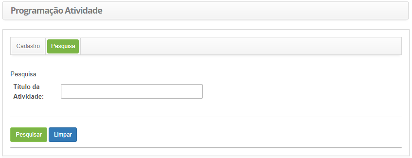
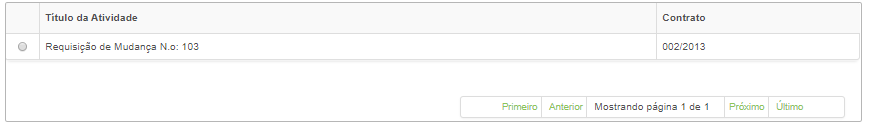
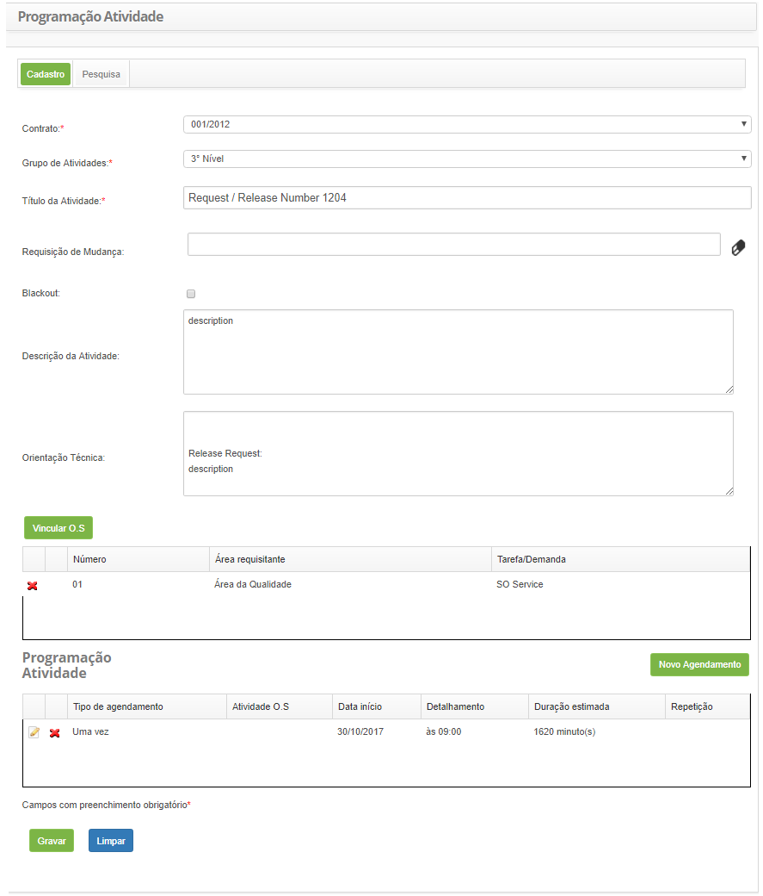
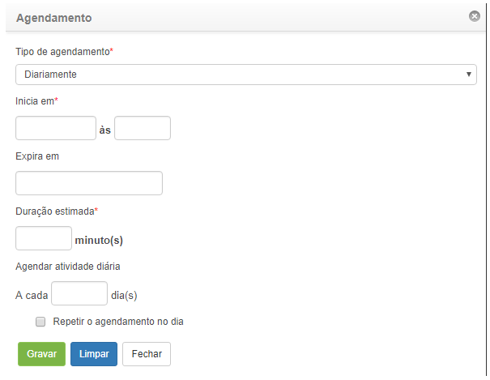

title: Cadastro e pesquisa de atividade periódica
Description: Esta funcionalidade permite registrar e verificar as atividades periódicas relacionadas aos contratos.

# Cadastro e pesquisa de atividade periódica

Esta funcionalidade permite registrar e verificar as atividades periódicas
relacionadas aos contratos.

Como acessar
-----------

1.  Acesse a funcionalidade de Atividade Periódica através da navegação no
    menu principal **Gestão Integrada > Automação das Operações de TI > Atividade
    Periódica.**

Pré-condições
------------

1.  Ter contrato cadastrado (ver conhecimento [Cadastro e pesquisa de
    contrato](/pt-br/citsmart-platform-7/additional-features/contract-management/use/register-contract.html);

2.  Ter grupo de atividade periódica cadastrado (ver conhecimento [Cadastro e
    pesquisa de grupo de atividade periódica](/pt-br/citsmart-platform-7/additional-features/automation-of-operation/configuration/periodic-activity-group.html).

Filtros
------

1.  O seguinte filtro possibilita ao usuário restringir a participação de itens
    na listagem padrão da funcionalidade, facilitando a localização dos itens
    desejados:

     -   Título da Atividade.

1.  Clique na aba **Pesquisa**. Feito isso, será apresentada a respectiva tela
    de pesquisa, conforme ilustrada na figura abaixo:

    
    
    **Figura 1 - Tela de pesquisa de atividade**

1.  Realize a pesquisa da atividade periódica:

-   Informe o título da atividade que deseja pesquisar e clique no
    botão *Pesquisar*. Após isso, será exibido o registro conforme o título
    informado;

-   Caso deseje listar todos os registros, basta clicar diretamente no
    botão *Pesquisar*.

Listagem de itens
----------------

1.  Os seguintes campos cadastrais estão disponíveis ao usuário para facilitar a
    identificação dos itens desejados na listagem padrão da
    funcionalidade: Título da Atividade e Contrato.

    
    
    **Figura 2 - Tela de listagem de atividade**

1.  Após a pesquisa, selecione o registro desejado. Feito isso, será direcionado
    para a tela de cadastro exibindo o conteúdo referente ao registro
    selecionado;

2.  Para alterar os dados do registro de atividade periódica, basta modificar as
    informações desejadas e clicar no botão *Gravar*.

Preenchimento dos campos cadastrais
----------------------------------

1.  Após isso, será apresentada a tela de **Cadastro de Atividade Periódica**,
    conforme ilustrada na figura abaixo:

    
    
    **Figura 3 - Tela de cadastro de atividade periódica**

1.  Preencha os campos conforme orientações abaixo:

    -   **Contrato**: selecione o contrato para o qual será cadastrada a atividade
    periódica;

    -   **Grupo de Atividade**: selecione o grupo de atividades, o qual será
    responsável pela execução da atividade;

    -   **Título da Atividade**: informe o título da atividade;

    -   **Requisição de Mudança**: informe a requisição de mudança, caso a atividade
    seja referente a uma requisição;

    -   **Blackout**: marque este campo se a atividade for referente a um blackout;

    -   **Descrição da Atividade**: informe a descrição da atividade;

    -   **Orientação Técnica**: informe a orientação técnica para execução da
    atividade;

    -   Relacione uma OS à atividade, caso seja necessário;

        -   Clique no botão *Vincular OS* Feito isso, será apresenta a tela de
        pesquisa de OS. Realize a pesquisa e selecione a OS que deseja associar
        a atividade;

        -   Caso queira remover a OS que foi vinculada à atividade, basta clicar no
        ícone  .

    -   Clique no botão *Novo Agendamento* para definir a periodicidade da
    atividade. Feito isso, será exibida a tela de agendamento, conforme
    ilustrada na figura abaixo:

    
    
    **Figura 4 - Agendamento de atividades**

       -  **Tipo de agendamento**: informe o tipo do agendamento da atividade
        (diariamente, semanalmente, mensalmente ou uma vez);

       -  **Inicia em**: informe a data e horário de início;

       -  **Expira em**: informe a data de expiração;

       -  **Duração estimada**: informe a duração estimada, em minutos;

       -  Informe os dados para agendar a atividade, de acordo com o tipo de
    agendamento escolhido;

      -   **Repetir o agendamento no dia**: marque essa opção, somente se desejar
    realizar esta ação;

      -   Após os campos preenchidos, clique no botão *Gravar* para efetuar a
    operação;

      -   Caso queira editar o agendamento da atividade, basta clicar no ícone   .

1.  Após os dados informados, clique no botão *Gravar* para registrar a
    operação, onde a data, hora e usuário serão gravados automaticamente para
    uma futura auditoria.

!!! tip "About"

    <b>Product/Version:</b> CITSmart | 8.00 &nbsp;&nbsp;
    <b>Updated:</b>07/18/2019 – Anna Martins
