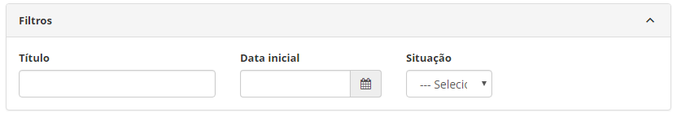
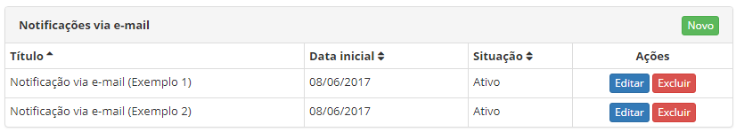
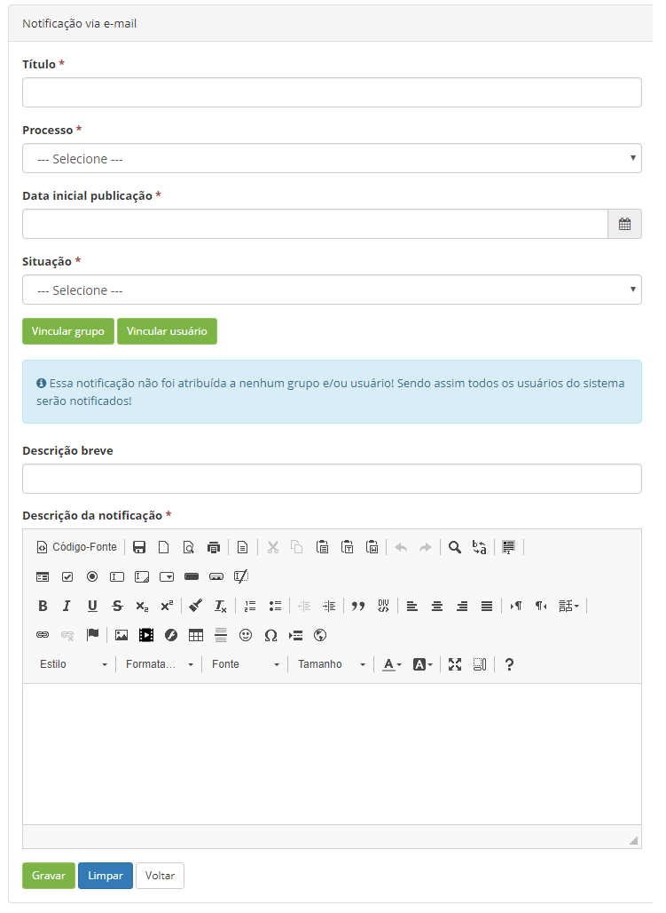

title: Cadastro e pesquisa de notificação via email
Description: A funcionalidade de Notificação via E-mail tem por objetivo enviar mensagens via e-mail no intuito de notificar os usuários sobre eventos que irão ocorrer no sistema.

# Cadastro e pesquisa de notificação via email

A funcionalidade de Notificação via E-mail tem por objetivo enviar mensagens via
e-mail no intuito de notificar os usuários sobre eventos que irão ocorrer no
sistema.

Como acessar
-----------

1.  Acesse o menu principal **Sistema > Notificações > Notificação via E-mail**.

Pré-condições
------------

1.  Não se aplica.

Filtros
-------

1.  Os seguintes filtros possibilitam ao usuário restringir a participação de
    itens na listagem padrão da funcionalidade, facilitando a localização dos
    itens desejados:

    -   Título;

    -   Data inicial;

    -   Situação.

1.  Na tela de Notificações via E-mail, são listadas as **Notificações via
    E-mail** que foram registradas, conforme exemplo ilustrado na figura abaixo:

**Figura 1 - Tela de pesquisa de notificação via e-mail**

Listagem de itens
----------------

1.  Os seguintes campos cadastrais estão disponíveis ao usuário para facilitar a
    identificação dos itens desejados na listagem padrão da
    funcionalidade: Título, Data inicial e Situação.

    

    **Figura 2 - Tela de listagem de notificação via e-mail**

1.  Existem botões de ação disponíveis ao usuário em relação a cada item da
    listagem, são eles: *Editar* e *Excluir*.

Preenchimento dos campos cadastrais
----------------------------------

1.  Será apresentada a tela de Notificações via E-mail;

2.  Clique no botão *Novo*. Feito isso, será apresentada a tela de Cadastro de
    Notificação via E-mail, conforme ilustrada na figura abaixo:

    
    
    **Figura 3 - Cadastro de notificação via e-mail**

1.  Preencha os campos conforme orientações abaixo:

    -   **Título**: informe o título da notificação via e-mail;

    -   **Processo**: informe o processo referente a notificação via e-mail;

    -   **Data inicial publicação**: informe a data inicial que será exibida a
        notificação via e-mail para o usuário;

    -   **Situação**: informe a situação da notificação via e-mail.

2.  Vincule grupo(s) à notificação via e-mail;

    -   Clique no botão *Vincular grupo*. Após isso, será apresentada a tela de
    pesquisa de grupos;

    -   Realize a pesquisa, selecione o grupo que deseja vincular à notificação via
    e-mail e clique no botão *Enviar* para efetuar a operação;

    -   Para remover o vínculo do grupo com a notificação via e-mail, clique
    em *Remover*. Se desejar remover todos os grupos vinculados, clique no
    botão *Remover todos*.

5.  Vincule usuário(s) à notificação via e-mail;

    -   Clique no botão *Vincular usuário*. Após isso, será apresentada a tela de
    pesquisa de usuários;

    -   Realize a pesquisa, selecione o(s) usuário(s) que deseja vincular à
    notificação de e-mail e clique no botão *Enviar* para efetuar a operação;

    -   Para remover o vínculo do usuário com a notificação via e-mail, clique
    em *Remover*. Se desejar remover todos os usuários vinculados, clique no
    botão *Remover todos*.

    !!! info "IMPORTANTE"

         Se a notificação via e-mail não for atribuída a nenhum grupo e/ou usuário,
         todos os usuários do sistema serão notificados.

   -  **Descrição breve**: informe uma descrição resumida da notificação via
    e-mail;

   -  **Descrição da notificação**: informe a descrição detalhada da notificação
    via e-mail.

6.  Após os dados informados, clique no botão *Gravar* para efetuar o registro,
    neste caso a data, hora e horário serão armazenados automaticamente para uma
    futura auditoria.

!!! tip "About"

    <b>Product/Version:</b> CITSmart | 8.00 &nbsp;&nbsp;
    <b>Updated:</b>07/18/2019 – Anna Martins
