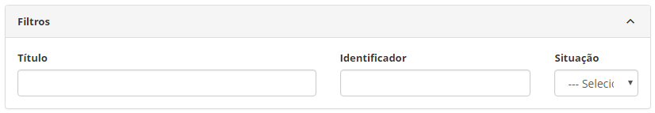
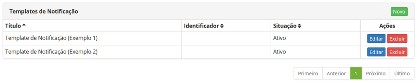
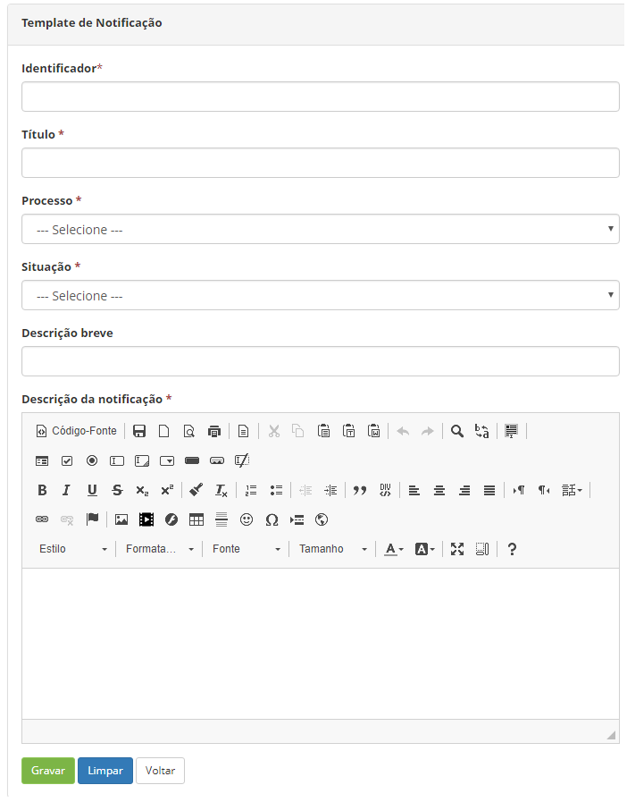

title: Cadastro e pesquisa de template de notificação
Description: A funcionalidade Template de Notificação tem por objetivo cria um
template de notificação para vincular ao Gerenciamento de Eventos e Base de
Conhecimento.

# Cadastro e pesquisa de template de notificação

A funcionalidade Template de Notificação tem por objetivo cria um template de
notificação para vincular ao Gerenciamento de Eventos e Base de Conhecimento.

Como acessar
-----------

1.  Acesse a funcionalidade de Template de Notificação através da navegação no
    menu principal **Sistema > Notificações > Template de Notificação**.

Pré-condições
------------

1.  Não se aplica.

Filtros
-------

1.  Os seguintes filtros possibilitam ao usuário restringir a participação de
    itens na listagem padrão da funcionalidade, facilitando a localização dos
    itens desejados, conforme ilustrado na figura abaixo:

    -   Título;

    -   Identificador;

    -   Situação.

1.  Na tela de Templates de Notificação, são listados os templates de
    notificação que foram registrados, conforme ilustrada na figura abaixo:

    
    
    **Figura 1 - Tela de pesquisa de templates de notificação**

1.  Para realizar a busca de um registro de template de notificação específico,
    basta preencher os filtros conforme sua necessidade.

Listagem de itens
----------------

1.  Os seguintes campos cadastrais estão disponíveis ao usuário para facilitar a
    identificação dos itens desejados na listagem padrão da
    funcionalidade: Título, Identificador e Situação.

2.  Existem botões de ação disponíveis ao usuário em relação a cada item da
    listagem, são eles: *Editar* e *Excluir*.

    
    
    **Figura 2 - Tela de listagem de template de notificação**

Preenchimento dos campos cadastrais
----------------------------------

1.  Acesse o menu principal. Após isso, será apresentada a tela de Template de
    Notificação;

2.  Clique no botão *Novo* (conforme a figura 2). Feito isso, será apresentada a
    tela de Cadastro de Template de Notificação, conforme ilustrada na figura
    abaixo:

    

    **Figura 3 - Cadastro de template de notificação**

1.  Preencha os campos conforme orientações abaixo:

    -   **Título**: informe o título do template de notificação;

    -   **Processo**: informe o processo referente ao template de notificação;

    -   **Situação**: informe a situação do template de notificação;

    -   **Descrição breve**: informe uma descrição resumida do template de
        notificação;

    -   **Descrição da notificação**: informe a descrição detalhada da
        notificação.

2.  Após os dados informados, clique no botão *Gravar* para efetuar o registro,
    neste caso a data, hora e horário serão armazenados automaticamente para uma
    futura auditoria.

!!! tip "About"

    <b>Product/Version:</b> CITSmart | 8.00 &nbsp;&nbsp;
    <b>Updated:</b>07/18/2019 – Anna Martins
