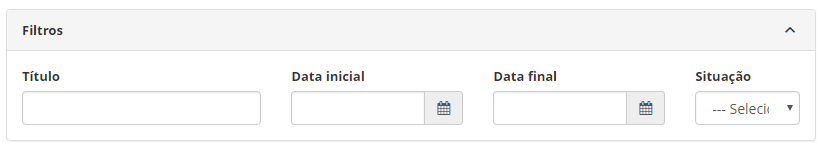
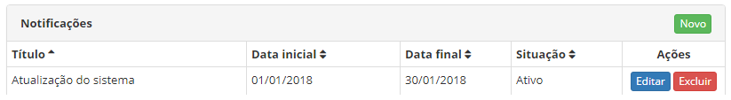
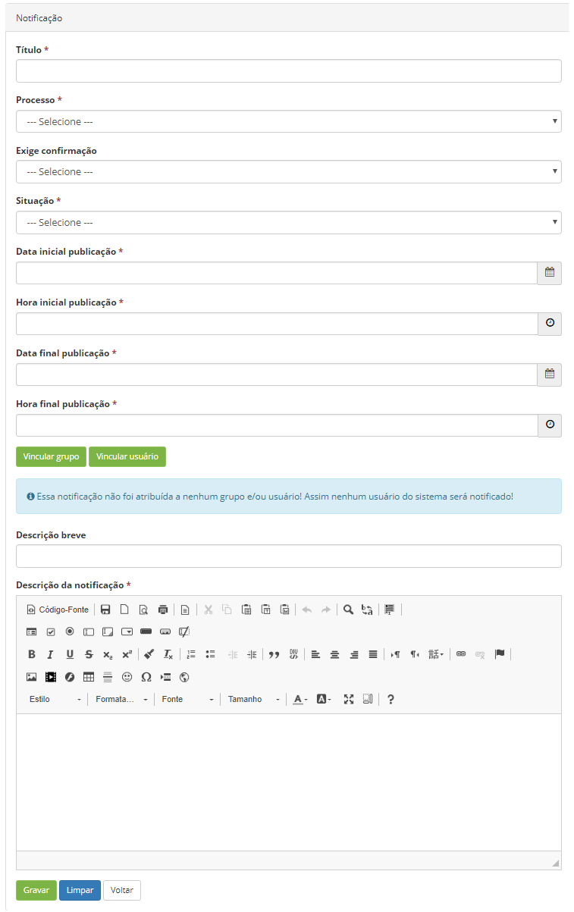
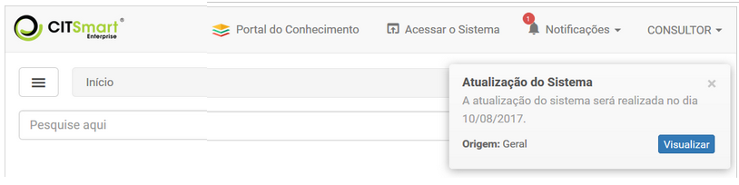
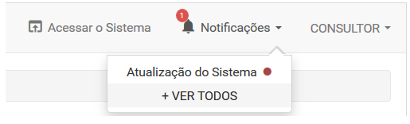
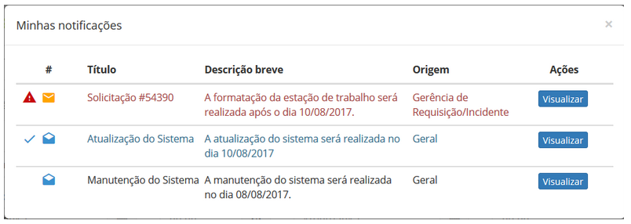
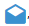

title: Cadastro e pesquisa de notificação
Description: A funcionalidade de Notificação tem por objetivo criar mensagem de
alerta no intuito de notificar os usuários sobre eventos que irão ocorrer no
sistema.

# Cadastro e pesquisa de notificação

A funcionalidade de Notificação tem por objetivo criar mensagem de alerta no
intuito de notificar os usuários sobre eventos que irão ocorrer no sistema.

Como acessar
----------

1.  Acesse a funcionalidade de Notificação através da navegação no menu
    principal **Sistema > Notificações > Notificação**.

Pré-condições
------------

1.  Não se aplica.

Filtros
------

1.  Os seguintes filtros possibilitam ao usuário restringir a participação de
    itens na listagem padrão da funcionalidade, facilitando a localização dos
    itens desejados, conforme ilustrado na figura abaixo:

    -   Título;

    -   Data Inicial;

    -   Data Final;

    -   Situação.

    
    
    **Figura 1 - Tela de pesquisa de notificação**

1.  Para verificar uma notificação específica, basta preencher os filtros
    conforme necessário e clicar no botão *Pesquisar*.

Listagem de itens
----------------

1.  Os seguintes campos cadastrais estão disponíveis ao usuário para facilitar a
    identificação dos itens desejados na listagem padrão da
    funcionalidade: Título, Data inicial, Data final e Situação.

2.  Existem botões de ação disponíveis ao usuário em relação a cada item da
    listagem, são eles: *Editar* e *Excluir*.

**Figura 2 - Tela de listagem de notificação**

Preenchimento dos campos cadastrais
----------------------------------

1.  Acesse o menu principal. Após isso, será apresentada a funcionalidade de
    Notificação;

2.  Na tela **Notificações**, clique no botão *Novo* (conforme a figura
    anterior). Feito isso, será apresentada a respectiva tela de cadastro de
    notificação, conforme ilustração abaixo:

        
    
    **Figura 3 - Cadastro de notificação**

1.  Preencha os campos conforme orientações abaixo:

    -   **Título**: informe o título da notificação;

    -   **Processo**: selecione o processo referente a notificação;

    -   **Exige confirmação**: defina se a notificação exige confirmação de
        leitura do usuário. Se informado sim, ao gravar as informações será
        apresentado um botão que permite verificar os usuários que confirmaram a
        leitura da notificação;

    -   **Situação**: informe a situação da notificação;

    -   **Data inicial publicação**: informe a data inicial que será exibida a
        notificação para o usuário;

    -   **Hora inicial publicação**: informe a hora inicial que será exibida a
        notificação;

    -   **Data final publicação**: informe a data final da exibição da
        notificação;

    -   **Hora final publicação**: informe a hora final da exibição da
        notificação;

    -   Adicione os grupos e/ou usuários que irão visualizar a notificação;

    -   **Descrição breve**: informe uma descrição resumida da notificação;

    -   **Descrição da notificação**: informe a descrição detalhada da
        notificação.

2.  Após os dados informados, clique no botão *Gravar* para efetuar o registro,
    neste caso a data, hora e horário serão armazenados automaticamente para uma
    futura auditoria.

!!! note "NOTA"

    As notificações registradas, serão exibidas durante o período estabelecido
    neste registro. Após passar o período, o sistema irá inativar as
    notificações.

Visualizando as notificações
---------------------------

1.  No momento em que apresentar a mensagem de alerta (conforme exemplo
    ilustrado na figura abaixo), clique no botão *Visualizar*, caso queira
    visualizar a notificação. Mas, caso queira visualizar a notificação, em um
    momento posterior, clique no botão *Fechar* da mensagem de alerta.

    
    
    **Figura 4 - Alerta de notificação**

   !!! info "IMPORTANTE"

       No determinado período, que foi configurado no registro da notificação,
       será apresentada a mensagem de alerta.

1.  Para visualizar todas as notificações do sistema, clique na
    opção **Notificações**, localizada na parte superior da tela. Será
    apresentada as notificações que ainda não foram visualizadas, conforme
    exemplo ilustrado na figura abaixo:
    
    
    
    **Figura 5 - Notificações**

    !!! info "IMPORTANTE"

         O sistema mostra o contador de notificação incrementado somente quando
         existir notificação que exige confirmação de leitura.

1.  Para ver todas as notificações, clique na opção "+VER TODOS", será
    apresentada a tela para verificação das notificações, conforme ilustrada na
    figura abaixo:

    
    
    **Figura 6 - Minhas notificações**

    -   A notificação com o ícone  , indica que a mesma foi visualizada;

    -   A notificação com o ícone  , indica que a mesma não foi visualizada;

    -   A notificação com o ícone  , indica que a mesma exija confirmação de
    leitura;

    -   A notificação com o ícone  , indica que a leitura da mesma foi confirmada.

1.  Clique no botão *Visualizar* da notificação. Após isso, será apresentada as
    informações da mesma. Caso a notificação exija a confirmação da leitura,
    basta clicar no botão *Marcar como lida*.

!!! tip "About"

    <b>Product/Version:</b> CITSmart | 8.00 &nbsp;&nbsp;
    <b>Updated:</b>07/18/2019 – Anna Martins
