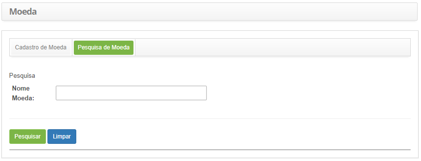
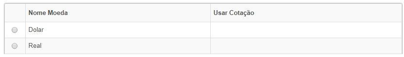
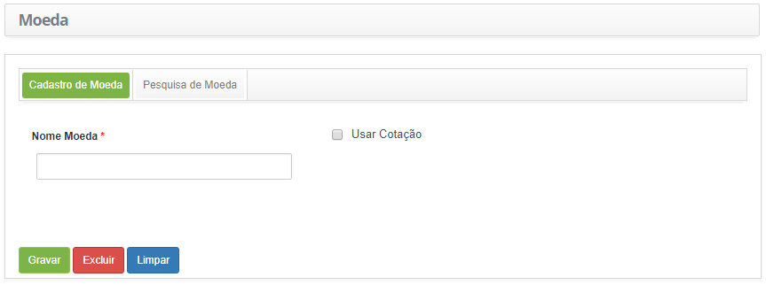

title: Cadastro e pesquisa de moeda
Description: Esta funcionalidade permite registrar as moedas que serão
utilizadas em outras rotinas do sistema.

# Cadastro e pesquisa de moeda

Esta funcionalidade permite registrar as moedas que serão utilizadas em outras
rotinas do sistema.

Como acessar
-----------

1.  Acesse a funcionalidade de Moeda** **através da navegação no menu
    principal **Gestão Integrada   Gerência de Contratos  Moeda.**

Pré-condições
------------

1.  Não se aplica.

Filtros
------

1.  O seguinte filtro possibilita ao usuário restringir a participação de itens
    na listagem padrão da funcionalidade, facilitando a localização dos itens
    desejados:

-   Nome Moeda.

    
    
    **Figura 1 – Tela de pesquisa de moeda**

1.  Realize a pesquisa de moeda:

-   Informe o nome da moeda que deseja pesquisar e clique no botão *Pesquisar*.
    Após isso, será exibido o registro da moeda conforme o nome informado;

-   Caso deseje listar todos os registros de moeda, basta clicar diretamente no
    botão *Pesquisar*.

Listagem de itens
----------------

1.  Os seguintes campos cadastrais estão disponíveis ao usuário para facilitar a
    identificação dos itens desejados na listagem padrão da
    funcionalidade:** Nome Moeda **e** Usar Cotação.**

    
    
    **Figura 2 - Tela de listagem de moeda**

1.  Após a pesquisa, selecione o registro desejado. Feito isso, será direcionado
    para a tela de cadastro exibindo o conteúdo referente ao registro
    selecionado;

2.  Para alterar os dados do registro de moeda, basta modificar as informações
    dos campos desejados e clicar no botão *Gravar* para que seja gravada a
    alteração realizada no registro, onde a data, hora e usuário serão gravados
    automaticamente para uma futura auditoria.

Preenchimento dos campos cadastrais
---------------------------------

1.  Será apresentada a tela de **Cadastro de Moeda**, conforme ilustrada na
    figura abaixo:

    
    
    **Figura 3 - Tela de cadastro de moeda**

1.  Preencha os campos conforme orientações abaixo:

    -   **Nome Moeda**: informe a descrição da moeda. Ex.: Real;

    -   **Usar Cotação**: marque este campo caso irá utilizar a cotação.

1.  Após informar os dados, clique no botão *Gravar* para efetuar o registro,
    onde a data, hora e usuário serão gravados automaticamente para uma futura
    auditoria.

!!! tip "About"

    <b>Product/Version:</b> CITSmart | 8.00 &nbsp;&nbsp;
    <b>Updated:</b>07/18/2019 – Anna Martins
