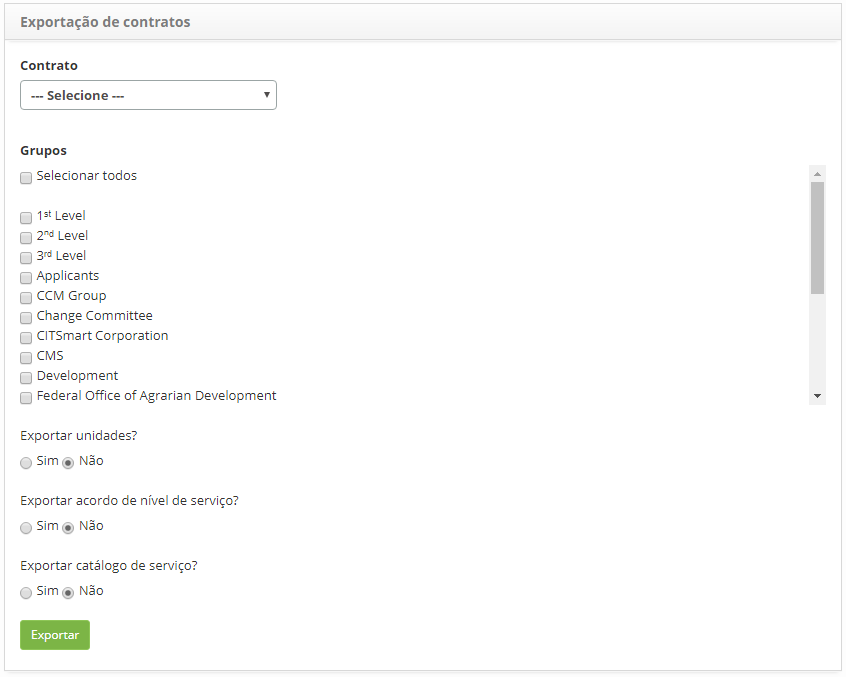

title: Exportação de dados de contratos
Description: Esta funcionalidade tem por objetivo de exportar os dados para facilitar a carga inicial dos dados relacionados aos contratos.

# Exportação de dados de contratos

Esta funcionalidade tem por objetivo de exportar os dados para facilitar a carga
inicial dos dados relacionados aos contratos.

Como acessar
-----------

1.  Acesse a funcionalidade de Exportação de Contratos através da navegação
    no menu principal **Gestão Integrada > Gerência de Contratos > Exportação de
    Contratos**.

Realizando a exportação de dados
-------------------------------

1.  Será apresentada a tela de **Exportação de Dados de Contratos,** conforme
    ilustrada na figura abaixo:

    
    
    **Figura 1 - Tela de exportação de dado**

1.  Informe os dados que serão exportados:

    -   **Contrato**: selecione o contrato que será usado como base de exportação,
    caso queira exportar os dados referente a um contrato;

    -   **Grupos**: selecione o(s) grupo(s) desejado(s) para exportação dos dados;

    -   **Exportar unidades**: defina se será feita a exportação dos dados de
    unidade;

    -   **Exportar acordo de nível de serviço**: defina se será feita a exportação
    dos dados de acordo de nível de serviço;

    -   **Exportar catálogo de serviço**: defina se será feita a exportação dos
    dados de catálogo de serviço.

1.  Após informação dos dados, clique no botão *Exportar*;

2.  Será exibida uma mensagem para confirmação da execução da exportação, clique
    em *Ok* para efetuar a operação;

3.  Será exportado os dados em um arquivo em formato XML.

!!! tip "About"

    <b>Product/Version:</b> CITSmart | 8.00 &nbsp;&nbsp;
    <b>Updated:</b>07/18/2019 – Anna Martins
