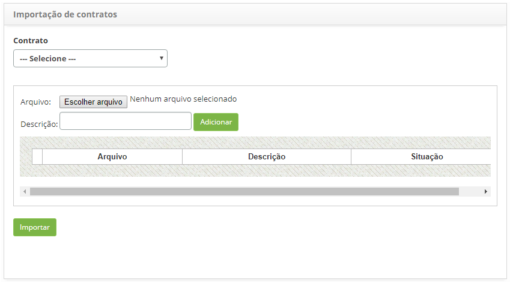

title: Importação de dados de contratos
Description: Esta funcionalidade tem o objetivo de realizar a importação dos
dados de contratos.

# Importação de dados de contratos

Esta funcionalidade tem o objetivo de realizar a importação dos dados de
contratos.

Como acessar
-----------

1.  Acesse a funcionalidade de Importação de Contratos através da navegação
    no menu principal **Gestão Integrada >  Gerência de Contratos > Importação de
    Contratos**.

Realizando a importação de dados
-------------------------------

1.  Será apresentada a tela de **Importação de Dados de Contrato,** conforme
    ilustrada na figura abaixo:

    
    
    **Figura 1 - Tela de importação de dados**

   !!! note “NOTA”

       Se o arquivo não fizer referência a um contrato, não se deve selecionar o
       contrato, basta adicionar o arquivo para importação dos dados.

1.  Adicione o arquivo para importação dos dados;

    -   Clique no botão *Adicionar arquivo*;

    -   Selecione o devido arquivo;

    -   Informe a descrição do arquivo e clique em *Adicionar*.

1.  Após adição do arquivo, clique no botão *Importar*;

2.  Será exibida uma mensagem para confirmação da execução da importação, clique
    em *Ok* para efetuar a operação.

!!! note “NOTA”

     Ao fazer a importação dos dados, o sistema irá manter os dados existentes
     e adicionar somente os dados não existentes.

!!! tip "About"

    <b>Product/Version:</b> CITSmart | 8.00 &nbsp;&nbsp;
    <b>Updated:</b>07/18/2019 – Anna Martins
