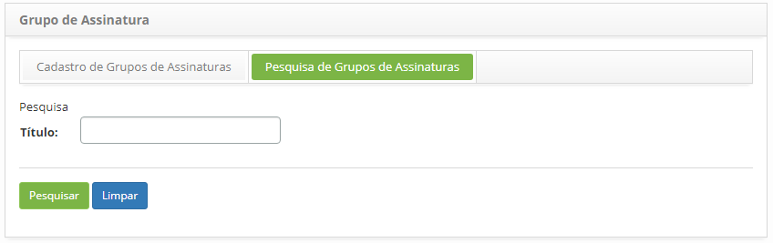
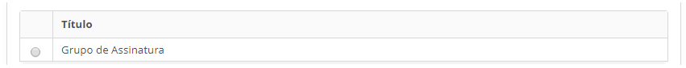
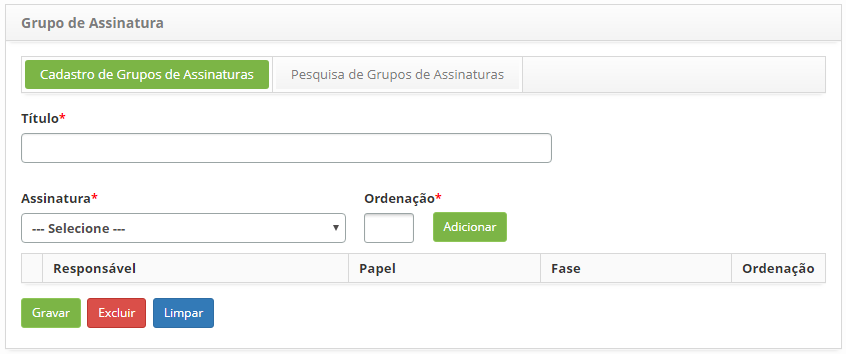
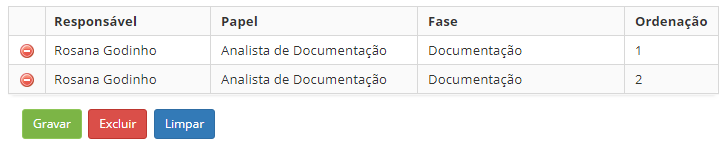

title: Cadastro e pesquisa de grupo de assinaturas

Description: Esta funcionalidade permite registrar os grupos de assinaturas que
serão impressos em relatórios.

# Cadastro e pesquisa de grupo de assinaturas

Como acessar
-----------

1.  Acesse a funcionalidade de Grupo de Assinatura através da navegação no
    menu principal **Gestão Integrada > Gerência de Contratos > Grupo
    de Assinaturas**.

Pré-condições
------------

1.  Para registrar o grupo de assinaturas é necessário ter a assinatura
    cadastrada (ver conhecimento [Cadastro e pesquisa de
    assinatura]().

Filtros
------

1.  O seguinte filtro possibilita ao usuário restringir a participação de itens
    na listagem padrão da funcionalidade, facilitando a localização dos itens
    desejados:

    -   Título.

1.  Na tela de Grupo de Assinatura, clique na guia **Pesquisa de Grupos de
    Assinaturas**, será apresentada a tela de pesquisa conforme ilustrada na
    figura abaixo:

    
    
    **Figura 1 - Tela de pesquisa de grupo de assinaturas**

1.  Realize a pesquisa do grupo de assinaturas:

-   Informe o título do grupo de assinaturas que deseja pesquisar e clique no
    botão *Pesquisar*. Após isso, será exibido o registro conforme o nome
    informado;

-   Caso deseje listar todos os registros de grupos de assinaturas, basta clicar
    diretamente no botão *Pesquisar*.

Listagem de itens
----------------

1.  O seguinte campo cadastral está disponível ao usuário para facilitar a
    identificação dos itens desejados na listagem padrão da
    funcionalidade: **Título**.

    
    
    **Figura 2 - Tela de listagem de grupo de assinatura**

1.  Após a pesquisa, selecione o registro desejado. Feito isso, será direcionado
    para a aba de cadastro exibindo o conteúdo referente ao registro
    selecionado;

2.  Para alterar os dados do registro de grupo de assinaturas, basta modificar
    as informações desejadas e clicar no botão *Gravar*.

Preenchimento dos campos cadastrais
----------------------------------

1.  Será apresentada a tela de **Cadastro de Grupo de Assinaturas**, conforme
    ilustrada na figura abaixo:

    
    
    **Figura 3 - Tela cadastro de grupo de assinaturas**

1.  Preencha os campos conforme orientações abaixo:

    -   **Título**: informe um título do grupo de assinaturas;

    -   **Assinatura**: selecione a assinatura;

    -   **Ordenação**: informe a ordem em que a assinatura aparecerá no quadro de
    assinaturas do relatório de OS. Ex.: 1;

    -   Clique no botão *Adicionar* para adição da assinatura ao grupo. De acordo
    com os quadros de assinaturas presentes no relatório de Ordem de Serviço,
    poderá ser adicionada várias assinaturas em cada grupo.

    
    
    **Figura 4 - Assinaturas adicionadas ao grupo**

1.  Clique no botão *Gravar* para efetuar o registro, neste caso a data, hora e
    horário serão armazenados automaticamente para uma futura auditoria.

!!! tip "About"

    <b>Product/Version:</b> CITSmart | 8.00 &nbsp;&nbsp;
    <b>Updated:</b>07/19/2019 – Anna Martins
