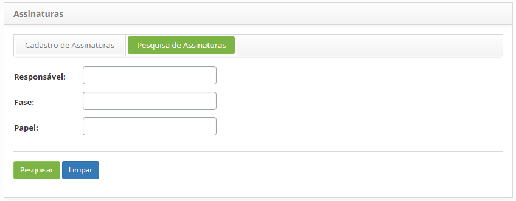
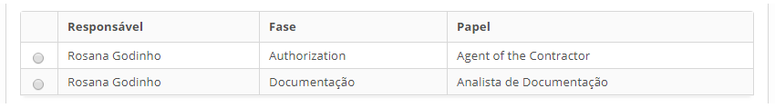
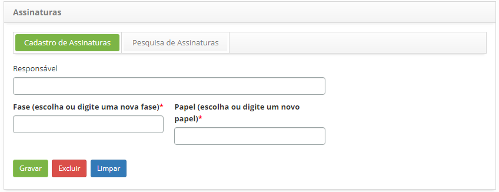

title: Cadastro e pesquisa de assinatura

Description: Esta funcionalidade tem o objetivo de registrar campos de assinaturas para serem associados a um grupo de assinatura, a fim da personalização de assinaturas presentes no relatório de Ordens de Serviço.

# Cadastro e pesquisa de assinatura

Esta funcionalidade tem o objetivo de registrar campos de assinaturas para serem
associados a um grupo de assinatura, a fim da personalização de assinaturas
presentes no relatório de Ordens de Serviço. Estes relatórios de Ordens de
Serviço são utilizados para registrar, comprovar e cobrar pelos serviços
prestados ao cliente.

Como acessar
-----------

1.  Acesse a funcionalidade de Assinaturas através da navegação no menu
    principal **Gestão Integrada > Gerência de Contratos > Assinaturas**.

Pré-condições
-------------

1.  Para cadastrar a assinatura é necessário ter o colaborador cadastrado (ver
    conhecimento [Cadastro e pesquisa de colaborador].

Filtros
-------

1.  Os seguintes filtros possibilitam ao usuário restringir a participação de
    itens na listagem padrão da funcionalidade, facilitando a localização dos
    itens desejados:

    -   Responsável

    -   Fase

    -   Papel

    
    
    **Figura 1 - Tela de pesquisa de assinaturas**

1.  Realize a pesquisa de assinaturas:

    -   Informe o nome do responsável da assinatura, fase do processo e/ou papel
    desempenhado pelo responsável, e clique no botão *Pesquisar*. Após isso,
    será exibido o registro conforme os dados informados;

    -   Caso deseje listar todos os registros de assinaturas, basta clicar
    diretamente no botão *Pesquisar*.

Listagem de itens
----------------

1.  Os seguintes campos cadastrais estão disponíveis ao usuário para facilitar a
    identificação dos itens desejados na listagem padrão da
    funcionalidade: Responsável, Fase e Papel.

    
    
    **Figura 2- Tela de listagem de assinatura**

1.  Após a pesquisa, selecione o registro desejado. Feito isso, será direcionado
    para a aba de cadastro exibindo o conteúdo referente ao registro
    selecionado;

2.  Para alterar os dados da assinatura, basta modificar as informações
    desejadas e clicar no botão *Gravar*.

Preenchimento dos campos cadastrais
----------------------------------

1.  Será apresentada a tela de **Cadastro de Assinatura**, conforme ilustrada na
    figura abaixo:

    
    
    **Figura 3 - Cadastro de assinaturas**

1.  Preencha os campos conforme orientações abaixo:

    -   **Responsável**: informe o colaborador responsável pela assinatura;

    -   **Fase (escolha ou digite uma nova fase)**: informe a fase do processo, no
    momento da assinatura;

    -   **Papel (escolha ou digite um novo papel)**: informe o nome do papel
    desempenhado pelo responsável.

1.  Após os dados informados, clique no botão *Gravar* para efetuar o registro,
    neste caso a data, hora e horário serão armazenados automaticamente para uma
    futura auditoria.

!!! tip "About"

    <b>Product/Version:</b> CITSmart | 8.00 &nbsp;&nbsp;
    <b>Updated:</b>07/19/2019 – Anna Martins
