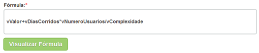

title: Cadastro e pesquisa de formula de ordem de serviços (OS)
Description: Esta funcionalidade tem o objetivo de registrar as fórmulas
personalizadas para configurar "como" será o cálculo do valor do custo total da
atividade do serviço do contrato.

# Cadastro e pesquisa de formula de ordem de serviços (OS)

Esta funcionalidade tem o objetivo de registrar as fórmulas personalizadas para
configurar "como" será o cálculo do valor do custo total da atividade do serviço
do contrato.

Como acessar
-----------

1.  Acesse a funcionalidade de Fórmula OS através da navegação no menu
    principal **Gestão Integrada > Gerência de Contratos >  Fórmula OS**.

Pré-condições
------------

1.  Não se aplica.

Filtros
-------

1.  Os seguintes filtros possibilitam ao usuário restringir a participação de
    itens na listagem padrão da funcionalidade, facilitando a localização dos
    itens desejados:

    -   Descrição;

    -   Situação.

    
    
    **Figura 1- Tela de pesquisa de fórmula OS**

1.  Realize a pesquisa de fórmula OS:

-   Informe a descrição e/ou a situação da fórmula OS que deseja pesquisar e
    clique no botão *Pesquisar*. Após isso, será exibido o registro conforme os
    dados informados;

-   Caso deseje listar todos os registros de fórmula, basta clicar diretamente
    no botão *Pesquisar*.

Listagem de itens
----------------

1.  Os seguintes campos cadastrais estão disponíveis ao usuário para facilitar a
    identificação dos itens desejados na listagem padrão da
    funcionalidade: Descrição e Fórmula.

    
    
    **Figura 2 - Tela de listagem de fórmula OS**

1.  Após a pesquisa, selecione o registro desejado. Feito isso, será direcionado
    para a tela de cadastro exibindo o conteúdo referente ao registro
    selecionado;

2.  Para alterar os dados da fórmula OS, basta modificar as informações
    desejadas e clicar no botão *Gravar*.

Preenchimento dos campos cadastrais
---------------------------------

1.  Será apresentada a tela de **Cadastro de Fórmula,** conforme ilustrada na
    figura abaixo:

    
    
    **Figura 3 - Tela de cadastro de fórmula OS**

1.  Preencha os campos conforme orientações abaixo:

    -   **Descrição**: informe o nome da fórmula;

    -   **Opções**: variáveis disponíveis para descrever a fórmula. Na tabela abaixo
    é apresentado a finalidade dessas variáreis para melhor entendimento.

    

    **Figura 4 - Exemplo 1 de fórmula**

    -   **Fórmula**: neste campo, permite descrever a personalização da fórmula
    utilizando as variáveis pré-definidas (explicado acima).

1.  Após descrever a fórmula, clique no botão *Visualizar Fórmula;*

2.  Este botão faz a validação da fórmula onde verifica se a mesma está descrita
    de forma correta e logo a seguir é apresentado o processo para o cálculo,
    que consistirá em substituir o nome das variáveis pelo valor informado por
    usuário ou método de retorno correspondente à variável, transformando o
    texto da fórmula numa expressão matemática e retornando o seu resultado
    calculado, depois de clicar em *Simular;*

3.  Tudo isso para o usuário ter uma ideia se a estrutura do cálculo é o
    esperado.

   
   
   **Figura 5 - Exemplo 2 de fórmula**

   !!! info "IMPORTANTE"

        Pode-se utilizar as chaves "{}" para delimitar um texto que deseje incluir
        na fórmula, onde o mesmo não influenciará o cálculo do valor da atividade

6.  Caso adicione um valor numérico próximo a uma variável, ele será concatenado
    com ela.

    -  **Situação**: informe a situação da fórmula.

7.  Após os dados informados, clique no botão *Gravar* para efetuar o registro,
    onde a data, hora e usuário serão gravados automaticamente para uma futura
    auditoria;

   !!! note "NOTA"

       Antes de gravar a fórmula, o sistema deve validar a sintaxe e só permitir
       a gravação se estiver correta.

8.  Será exibida uma mensagem confirmando o sucesso do registro de fórmula.

!!! tip "About"

    <b>Product/Version:</b> CITSmart | 8.00 &nbsp;&nbsp;
    <b>Updated:</b>07/19/2019 – Anna Martins
