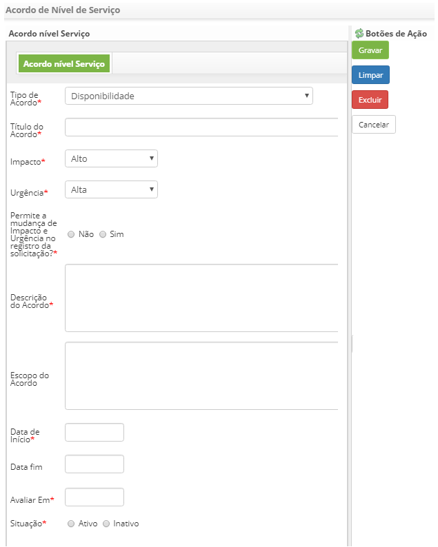
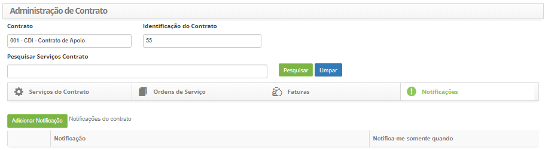

title: Administração de contratos

Description: A administração dos contratos é utilizada com o objetivo de
gerenciar os contratos já cadastrados no sistema.

# Administração de contratos

A administração dos contratos é utilizada com o objetivo de gerenciar os
contratos já cadastrados no sistema. Este processo permite verificar, adicionar
e excluir serviços, além de dispor de vínculos para a criação de OS, de fatura e
notificações.

Como acessar
-----------

1.  Acesse a funcionalidade de Administração de Contratos através da navegação
    no menu principal **Gestão Integrada > Gerência de Contratos > Administração
    de Contratos**.

Pré-condições
------------

1.  Cadastrar grupo (ver conhecimento [Cadastro e pesquisa de
    grupo]();

2.  Cadastrar contrato (ver conhecimento [Cadastro e pesquisa de
    contrato]();

3.  Cadastrar serviços (ver conhecimento [Cadastro de portfólio de
    serviços](); [Cadastro
    de
    serviço](); [Cadastro
    da atividade de
    serviço]();

4.  Cadastrar acordo de nível de serviço (geral) (ver conhecimento [Cadastro e
    pesquisa de acordo de nível de serviço
    geral]();

5.  Cadastrar modelo de e-mail (ver conhecimento [Cadastro e pesquisa de
    configuração de modelo de
    e-mail]().

Filtros
------

1.  Os seguintes filtros possibilitam ao usuário restringir a participação de
    itens na listagem padrão da funcionalidade, facilitando a localização dos
    itens desejados:

    -   Contrato;

    -   Identificação do Contrato;

    -   Pesquisar Serviços Contrato.

1.  Será apresentada a tela de Administração de Contratos, conforme ilustrada na
    figura abaixo:

**Figura 1 - Tela de pesquisa de contrato**

Listagem de itens
----------------

1.  Os seguintes campos cadastrais estão disponíveis ao usuário para facilitar a
    identificação dos itens desejados na listagem padrão da
    funcionalidade: Serviço, Situação, Tipo de demanda do Serviço, Tem SLA?,
    Data início e Data fim.

2.  Existem botões de ação disponíveis ao usuário em relação a cada item da
    listagem, são eles: *Editar o serviço*, *Acordos de Nível de
    Serviço* e *Atividades do Serviço*.

    
    
    **Figura 2 - Tela de listagem de contrato**

1.  Nesta tela, permite realizar uma série de ações referentes aos contratos
    existentes, sendo:

    -   Adicionar Serviço ao Contrato;

    -   Adicionar VÁRIOS Serviços ao Contrato;

    -   Desempenho do Contrato;

    -   Remover Serviço(s) do Contrato;

    -   Gerenciar SLAs Globais.

Vinculando um serviço ao contrato
-------------------------------

1.  Para vincular um serviço ao contrato, proceda conforme os passos descritos
    abaixo:

2.  Na guia de **Serviços do Contrato**, clique no botão *Adicionar Serviço ao
    Contrato*, conforme indicado na figura abaixo:

    
    
    **Figura 3 - Botão Adicionar Serviço ao Contrato**

1.  Será apresentada a tela de registro de vínculo do serviço ao contrato,
    conforme ilustrada na figura abaixo:

    
    
    **Figura 4 - Tela de Registro de Serviço do Contrato**

1.  Preencha os campos conforme orientação abaixo:

    -   **Serviços do Contrato**: informe o serviço que será vinculado ao contrato;

    -   **Condição de Operação**: selecione o período de execução do serviço;

    -   **Data de Início**: informe a data inicial do vínculo do serviço ao
    contrato;

    -   **Data Fim**: o preenchimento deste campo pode ser feito no momento do
    cadastro, informando uma data futura para inativação do serviço ou somente
    quando for inativar o serviço;

    -   **Observação**: descreva as possíveis observações referentes ao serviço;

    -   **Restrições e Pressupostos**: informe as possíveis restrições e
    pressupostos para a execução do serviço no contrato;

    -   **Objetivo**: informe o objetivo do serviço no contrato;

    -   **Descrição do Processo**: descreva o processo do serviço no contrato;

    -   **Link do Processo**: informe o link do desenho do processo do serviço, caso
    exista;

    -   **Área requisitante**: informe quem poderá solicitar o serviço;

    -   **Modelo de E-mail Abertura Incidente/Requisição**: selecione o modelo de
    e-mail de abertura de solicitação para envio de notificação ao registrar uma
    solicitação do serviço;

    -   **Modelo de E-mail Finalização Incidente/Requisição**: selecione o modelo de
    e-mail de finalização de solicitação para envio de notificação ao finalizar
    uma solicitação do serviço;

    -   **Modelo de E-mail Demais Ações Incidente/Requisição**: selecione o modelo
    de e-mail de andamento de solicitação para envio de notificação nas demais
    ações realizadas nas solicitações de serviço;

    -   **Grupo Escalação 1º Nível**: selecione o grupo para escalação do
    atendimento de 1º Nível;

    -   **Grupo Executor**: defina o grupo executor do serviço, caso não o informe,
    será considerado o grupo definido no parâmetro "**ID Grupo Nível 1**";

    -   **Grupo Aprovador**: defina o grupo aprovador do serviço;

    -   **Calendário**: selecione o calendário de trabalho;

    -   **Expandir tela de solicitação serviço**: caso queira a tela de solicitação
    do serviço seja ampliada, marque a opção "sim";

    -   Informe o fluxo de trabalho do serviço:

        a)  Clique no ícone    de fluxo do serviço;

        b)  Será exibida uma janela para informação do fluxo do serviço, conforme
        apresentado na figura abaixo:

    
    
    **Figura 5 - Registro de fluxo de trabalho do serviço**

    -   **Fluxo**, selecione o fluxo que o serviço deverá seguir;

    -   **Fase**, informe a fase em que o fluxo será iniciado;

    -   **Fluxo Principal**, informe se o fluxo é o principal.

   !!! info "IMPORTANTE"

       Caso seja necessário fazer uso de mais de um fluxo, é importante informar
       qual é o principal.

   c)  Clique em *Gravar* para efetuar a operação.

5.  Após os dados informados, clique no botão *Gravar* para efetuar o registro,
    onde a data, hora e usuário serão gravados automaticamente para uma futura
    auditoria.

Vinculando vários serviços ao contrato
-------------------------------------

1.  Para vincular vários serviços ao contrato, proceda conforme os passos
    descritos abaixo:

2.  Na guia de **Serviços do Contrato**, clique no botão *Adicionar VÁRIOS
    Serviços ao Contrato*, conforme indicado na figura abaixo:

    

    **Figura 6 - Botão Adicionar Vários Serviços ao Contrato**

1.  Será apresentada a tela de registro de vínculo dos serviços ao contrato,
    conforme ilustrada na figura abaixo:

    
    
    **Figura 7 - Tela de registro de serviços do contrato**

1.  Preencha os campos conforme orientação abaixo:

    -   **Condição de Operação**: selecione o período de execução dos serviços;

    -   **Data de Início**: informe a data inicial dos serviços no contrato;

    -   **Data Fim**: o preenchimento deste campo pode ser feito no momento do
    cadastro, informando uma data futura para inativação dos serviços ou somente
    quando for inativar os serviços;

    -   **Observação**: informe alguma informação que achar pertinente;

    -   **Restrições e Pressupostos**: informe as possíveis restrições e
    pressupostos para a execução dos serviços no contrato;

    -   **Objetivo**: informe o objetivo dos serviços no contrato;

    -   **Descrição do Processo**: descreva o processo dos serviços no contrato;

    -   **Link do Processo**: informe o link do desenho do processo dos serviços;

    -   **Área requisitante**: informe quem poderá solicitar o serviço;

    -   **Modelo de E-mail Abertura Incidente/Requisição**: selecione o modelo de
    e-mail de abertura de solicitação para envio de notificação ao registrar uma
    solicitação do serviço;

    -   **Modelo de E-mail Finalização Incidente/Requisição**: selecione o modelo de
    e-mail de finalização de solicitação para envio de notificação ao finalizar
    uma solicitação do serviço;

    -   **Modelo de E-mail Demais Ações Incidente/Requisição**: selecione o modelo
    de e-mail de andamento de solicitação para envio de notificação nas demais
    ações realizadas na solicitação de serviço;

    -   **Grupo Escalação 1º Nível**: selecione o grupo para escalação do
    atendimento 1º Nível;

    -   **Grupo Executor**: defina o grupo executor dos serviços, caso não o
    informe, será considerado o grupo definido no parâmetro "**ID Grupo Nível
    1**";

    -   **Grupo Aprovador**: selecione o grupo aprovador dos serviços;

    -   **Calendário**: selecione o calendário de trabalho;

    -   Informe os serviços que receberão a configuração:

        -   Clique no ícone  ;

        -   Será exibida uma janela para pesquisa do serviço;

        -   Realize a pesquisa e selecione os serviços desejados.

    -   Informe o fluxo de trabalho dos serviços:

        a)  Clique no ícone    de fluxo do serviço;

        b)  Será exibida uma janela para informação do fluxo do serviço, conforme
        apresentado na figura abaixo:

    

    **Figura 8 - Registro de fluxo de trabalho do serviço**

    -   **Fluxo**: selecione o fluxo que os serviços deverão seguir;

    -   **Fase**: informe a fase em que o fluxo será iniciado;

    -   **Fluxo Principal**: informe se o fluxo é o principal;

   !!! info "IMPORTANTE"

       Caso seja necessário fazer uso de mais de um fluxo, é importante informar
       qual será o principal.

  c)  Clique em *Gravar* para efetuar a operação.

5.  Após os dados informados, clique no botão *Gravar* para efetuar o registro,
    onde a data, hora e usuário serão gravados automaticamente para uma futura
    auditoria.

Verificando os serviços do contrato
----------------------------------

1.  Para verificar os serviços já vinculados no contrato, proceda conforme os
    passos descritos abaixo:

2.  Na guia de** Serviços do Contrato**, são apresentados todos os serviços que
    estão vinculados ao contrato, conforme ilustrado na figura abaixo:

    
    
    **Figura 9 - Serviços do contrato**

1.  Caso queira pesquisar um serviço específico, basta informar o nome dele no
    campo **Pesquisa Serviços Contrato** e clicar no botão *Pesquisar*.

Editando informações do vínculo do serviço ao contrato
-----------------------------------------------------

1.  Clique no ícone   do serviço que deseja editar;

2.  Será exibida a tela registro do vínculo do serviço do contrato com os campos
    preenchidos com o conteúdo referente ao serviço escolhido;

3.  Altere os dados desejados e clique no botão *Gravar* para que seja gravada a
    alteração realizada no serviço do contrato, onde a data, hora e usuário
    serão gravados automaticamente para uma futura auditoria.

Vinculando SLA específico ao serviço do contrato
-----------------------------------------------

1.  Na guia de **Serviço do Contrato**, são apresentados os serviços que estão
    vinculados ao contrato;

2.  Clique no ícone   do serviço desejado. Feito isso, serão exibidos dois
    botões *Vincular Acordo* e *Criar Acordo específico para este serviço*;

3.  Clique no botão *Criar Acordo específico para este serviço*;

4.  Após isso, será apresentada a tela de registro de acordo de nível de serviço
    específico, conforme ilustrada na figura abaixo:

    
    
    **Figura 10 - Tela de registro de acordo de nível de serviço**

1.  Preencha os campos conforme orientação abaixo:

    -   **Tipo de Acordo**: informe o tipo de acordo de serviço;

        -   **Disponibilidade**: esse tipo de acordo indica a disponibilidade do
            serviço, ou seja, se está acessível durante um período de tempo
            acordado. Ex.: ter o prestador de serviço monitorando o site da empresa
            cliente em tempo integral para ter certeza que os usuários possam ter
            acesso ao conteúdo do site em tempo integral;

        -   **Falhas repetitivas**: medir a quantidade de falhas ocorridas durante
        certo tempo acordado e se porventura ultrapassar a quantidade combinada,
        impor as devidas penalidades;

        -   **OS - Resultados Esperados**: OS (Ordem de Serviço) é um documento que
        irá fornecer a permissão de execução relativa a algum serviço. Este tipo
        de acordo estipula os limites desta modalidade de documento ao serviço
        escolhido;

        -   **Tempo (por fases)**:** **esse tipo de acordo** **vincula o tempo de
        atendimento a uma fase, ou seja, no lugar de calcular por tempo, o SLA
        será calculado por uma fase que corresponde a um período acordado para o
        período de captura e período de execução;

        -   **Informações diversas capturadas de outras fontes**: esse tipo de
        acordo estipula os limites da OS (Ordem de Serviço) ao serviço
        escolhido.

    -   **Título do Acordo**: informe o título do acordo de nível de serviço;

    -   **Impacto**: informe o impacto que causa a ausência do funcionamento do
    serviço dentro do ambiente organizacional;

    -   **Urgência**: informe a urgência do restabelecimento do serviço dentro do
    ambiente organizacional;

    -   **Permite a mudança de Impacto e Urgência no registro da solicitação?**:
    defina se será permitido a mudança do impacto e urgência no registro de
    solicitação de serviço;

    -   **Descrição do Acordo**: descreva os detalhes sobre o acordo de nível de
    serviço;

    -   **Escopo do Acordo**: descreva uma visão macro sobre o acordo de nível de
    serviço;

    -   **Data de Início**: informe a data de início do acordo de nível de serviço;

    -   **Data Fim**: informe a data de encerramento do acordo de nível de serviço.
    A mesma pode ser informada no momento de encerramento do acordo;

    -   **Avaliar Em**: informe a data na qual o acordo de nível de serviço será
    avaliado;

    -   **Situação**: informe a situação do acordo de nível de serviço: Ativo (em
    uso corrente) ou Inativo (desabilitado);

    -   Se o tipo de acordo informado for **Disponibilidade**, informe o índice de
    disponibilidade do serviço:
    
    
    
    **Figura 11 - Índice**

    -   Informe o percentual de disponibilidade do serviço, isto é, se definir 90%
    significa que a partir de 10% de indisponibilidade sobre o serviço o
    contrato poderá sofrer algum tipo de penalidade acordada sobre ele;

    -   Se o tipo de acordo informado for **Falhas repetitivas**, informe os dados
    do acordo de serviço por falhas repetitivas:

    
    
    **Figura 12 - Acordo por falha**

    -   Caso deseje informar outros dados do acordo de serviço por falhas
    repetitiva, basta clicar no ícone  e preencher os campos;

    -   **Percentual de desconto**: Informe o percentual de desconto;

    -   **Quantidade de Glosas**: informe a quantidade de glosas;

    -   Se o tipo de acordo informado for **OS - Resultados esperados**, informe os
    dados de resultados esperados e níveis de qualidade exigidos:

    
    
    **Figura 13 - Acordo por falha**

    -   **Resultados esperados**: informe os resultados que se espera do serviço;

    -   **Limites**: informe o valor limite da glosa;

    -   **Glosa**: descreva sobre a glosa;

    -   **Limite Glosa**: informe o limite da glosa;

1.  Caso deseje informar outros dados de resultados esperados e níveis de
    qualidade exigidos, basta clicar no ícone   e preencher os campos;

2.  Se o tipo de acordo informado for **Tempo (por fase)**, defina os prazos de
    SLA (acordo de nível de serviço), levando em consideração a prioridade:

    

    **Figura 14 - Prazos de SLA**

    -   **Captura**: defina o tempo de captura da solicitação do serviço, conforme a
    prioridade;

    -   **Resolução**: defina o tempo de resolução do serviço, conforme a
    prioridade;

    -   **Tempo de Ação**: informe o tempo para execução da solicitação do serviço;

    -   **Prioridade**: informe a prioridade do serviço;

    -   **Grupo**: informe o grupo executor do serviço.

    !!! note "NOTA"

        Após os N minutos configurados e caso não tenha realizado nenhuma ação na
        solicitação do serviço, o sistema atribuirá a Prioridade e escalará o Grupo
        que foram configurados para execução da solicitação do serviço.

1.  Indique a prioridade do serviço para cada unidade;

2.  Se o tipo de acordo informado for **Informações diversas capturadas de
    outras fontes**, informe os dados de **acordo de serviço**:

    
    
    **Figura 15 - Acordo de serviço**

    -   **Valor Limite**: informe o valor limite da glosa;

    -   **Unidade (do Valor Limite)**: informe a unidade monetário do valor limite
    da glosa;

    -   **Glosa**: descreva sobre a glosa;

    -   **Limite Glosa**: informe o limite da glosa.

1.  Após os dados informados, clique no botão *Gravar Dados* para efetuar a
    operação, onde a data, hora e usuário serão gravados automaticamente para
    uma futura auditoria;

2.  Para editar um acordo de nível de serviço que foi adicionado ao serviço de
    contrato, basta clicar no ícone   ao lado do acordo;

3.  Para copiar o acordo de nível de serviço para outros serviços do contrato,
    basta clicar no ícone   ao lado do acordo;

4.  Para excluir um acordo de nível de serviço que foi adicionado ao serviço de
    contrato, clique no ícone   ao lado do acordo, onde será aberta a tela de
    acordo de nível de serviço e clique no botão *Excluir Dados*.

Vinculando sla global ao serviço do contrato
-------------------------------------------

1.  Para vincular um SLA global ao Serviço do Contrato é necessário ter
    realizado o cadastro do Acordo de Nível de Serviço Global.

2.  Há duas formas de vincular o SLA global ao Serviço do Contrato, sendo:

**Primeira forma:**

1.  Na guia de **Serviços do Contrato**, clique no botão *Gerenciar SLAs
    Globais*, conforme indicado na figura abaixo:

    

    **Figura 16 - Acordo de nível de serviço global**

1.  Será apresentada a tela de Acordo de Nível de Serviço Global para realização
    do vínculo do SLA Global com Serviço do Contrato:

    

    **Figura 17 -** **Vínculo do acordo de nível de serviço global ao serviço do
    contrato**

1.  Selecione o Acordo de Nível de Serviço que deseja vincular ao Serviço do
    Contrato;

2.  Ao selecionar o acordo de nível de serviço será exibida uma lista de
    Serviços do Contrato;

3.  Selecione os serviços desejados e clique no botão *Gravar* para realização
    do vínculo do SLA com os serviços.

**Segunda forma**:

1.  Na guia de** Serviço do Contrato**, são apresentados os serviços que estão
    vinculados ao contrato. Clique no ícone   do serviço desejado;

2.  Feito isso, serão exibidos dois botões *Vincular Acordo* e *Criar Acordo
    específico para este serviço*;

3.  Clique no botão *Vincular Acordo;*

4.  Após isso, será apresentada a tela para realização do vínculo do SLA com
    Serviço, conforme ilustrada na figura abaixo:

    
    
    **Figura 18 -** **Vínculo do acordo de nível de serviço global ao serviço do
    contrato**

1.  Preencha os campos conforme orientação abaixo:

    -   **Acordo de Nível de Serviço**: selecione o acordo de nível de serviço;

    -   **Data Início**: informe a data de início do vínculo do acordo de nível de
    serviço ao serviço do contrato;

    -   **Data Fim**: informe a data final do vínculo do acordo de nível de serviço
    ao serviço do contrato, caso seja necessário;

    -   **Recursos (Disponibilidade)**: informe os recursos, caso o acordo de nível
    de serviço selecionado seja do tipo "Disponibilidade".

1.  Após os dados informados, clique no botão *Gravar Dados* para realização do
    vínculo do SLA com Serviço do Contrato, onde a data, hora e usuário serão
    gravados automaticamente para uma futura auditoria;

2.  Após o vínculo do acordo de nível de serviço ao serviço, clique
    em *Habilita* para que o SLA seja habilitado;

3.  Para editar um acordo de nível de serviço que foi vinculado ao serviço de
    contrato, basta clicar no ícone   ao lado do acordo.

Registrando atividades do serviço do contrato
--------------------------------------------

1.  Na guia de  **Serviço do Contrato**, são apresentados os serviços que estão
    vinculados ao contrato;

2.  Clique no ícone   do serviço desejado;

3.  Feito isso, será exibido o botão *Adicionar Nova Atividade* acima das
    atividades já existentes, clique no mesmo;

4.  Após isso, será exibida a tela de registro de atividade, conforme ilustrada
    na figura abaixo:

    
    
    **Figura 19 - Registro de atividades do serviço**

1.  Preencha os campos conforme orientação abaixo:

    -   **Descrição de Atividade**: descreva a atividade que será executada para
    entrega do serviço;

    -   **Observações**: descreva as observações da atividade, caso seja necessário;

    -   **Contabilizar**: informe se a atividade é para contabilizar as solicitações
    do serviço do contrato. Se "sim", informe o serviço do contrato;

   !!! info "IMPORTANTE"

       A contabilização será feita das solicitações "fechadas", no período da OS
       (Ordem de Serviço), do serviço do tipo requisição/incidente informado.

    -   **Tipo custo**: selecione o tipo de custo da atividade.

1.  Se o tipo de custo selecionado for **Custo Total**,** **proceda da seguinte
    forma:

    

    **Figura 20 - Custo Total**

    -   **Custo Total**: indicar o valor quantitativo corresponde ao custo da
    atividade acordado no contrato;

    -   **Complexidade**: informar o nível de complexidade (dificuldade)
    correspondente que a atividade requer para o desenvolvimento da tarefa.

1.  Se o tipo de custo selecionado for **Fórmula**, proceda da seguinte forma:

    
    
    **Figura 21 - Fórmula**

    -   Selecione a **fórmula** que será utilizada para obter o custo total da
    atividade do serviço, conforme estabelecida no contrato. Após isso, serão
    exibidos campos para serem preenchidos com os valores para o cálculo;

    -   **Horas**: definir as horas por dia, a serem trabalhadas dentro do período
    necessário para executar a tarefa;

    -   **Complexidade**: informar o nível de complexidade (dificuldade)
    correspondente que a atividade requer para o desenvolvimento da tarefa,
    lembre-se que os valores para este item já devem ter sido previamente
    cadastrados na tela de cadastro de contrato;

    -   **Quantidade**: campo referente ao período. Serve para indicar o número de
    vezes que essa atividade foi executada dentro do período. Exemplo:

    -   **Quantidade: 1. Período Mensal:** a atividade é realizada uma vez por mês;

    -   **Quantidade: 1. Período Semanal:** a atividade é realizada uma vez por
    semana;

    -   **Quantidade: 2. Período Diário: **a atividade é executada durante dois
    períodos por dia.

1.  Após os dados informados, clique no botão *Gravar* para efetuar a operação,
    onde a data, hora e usuário serão gravados automaticamente para uma futura
    auditoria;

2.  Para editar uma atividade que foi adicionada ao serviço do contrato, basta
    clicar no ícone   ao lado da mesma;

3.  Para excluir uma atividade que foi adicionada ao serviço do contrato, basta
    clicar no ícone   ao lado da mesma, onde será aberta a tela de atividade do
    serviço e clicar no botão *Excluir Dados* para efetuar a operação.

Verificando o desempenho do contrato
----------------------------------

1.  Na guia de  **Serviço do Contrato**, clique no botão *Desempenho do
    Contrato*. Feito isso, serão apresentadas as informações sobre o desempenho
    do contrato por serviço, conforme exemplo ilustrado na figura abaixo:

    
    
    **Figura 22 - Desempenho do contrato por serviço**

Excluindo vínculo dos serviços com o contrato
--------------------------------------------

1.  Na guia de **Serviço do Contrato**, são apresentados os serviços que estão
    vinculados ao contrato;

2.  Selecione os serviços que deseja excluir e clique no botão *Remover
    Serviço(s) do Contrato*, conforme indicado na figura abaixo:

    

    **Figura 23 - Exclusão de serviços do contrato**

1.  Será exibida uma mensagem para confirmação da exclusão dos serviços, basta
    clicar em *Ok* para efetuar a operação;

2.  Feito isso, será excluído com sucesso o vínculo dos serviços com o contrato.

Ordens de serviços (os)
----------------------

*Ordem de Serviço é um documento que irá fornecer a permissão de execução
relativa a algum serviço*.

1.  Na tela de **Administração de Contrato**, informe o contrato desejado e
    clique na guia **Ordens de Serviço**. Feito isso, será apresentada a tela
    onde permite verificar e gerenciar as ordens de serviços, conforme ilustrada
    na figura abaixo:

    
    
    **Figura 24 - Ordens de serviço**

1.  Nesta tela, é possível criar novas Ordens de Serviços, verificar as Ordens
    de Serviços do contrato e executar uma série de ações nas Ordens de Serviços
    existentes, sendo:

    -   Gerar Relatório de Atividade;

    -   Executar Ordem de Serviço;

    -   Imprimir Relatório de Atividade.

1.  Nos próximos tópicos será abordado sobre como proceder com essas ações.

Criando ordem de serviço (os)
----------------------------

1.  Para criar uma OS é necessário que o usuário tenha permissão para abertura
    de OS e que os seguintes procedimentos tenham sido realizados:

    -   Cadastro do serviço do tipo "Ordem de Serviço";

    -   Vínculo do serviço ao contrato (ver sessão *Vinculando um Serviço ao
    Contrato*);

    -   Vínculo do acordo de nível de serviço do tipo "OS - Resultados Esperados" ao
    serviço do contrato (ver sessão *Vinculando SLA Global ao Serviço do
    Contrato*);

    -   Registro das atividades, com os seus respectivos valores, sendo um custo
    total ou calculado por fórmula, do serviço do contrato (ver
    sessão *Registrando Atividades do Serviço do Contrato*).

1.  Na guia de **Ordem de Serviço**, clique no botão *Criar Ordem de Serviço*.
    Será apresentada a tela de registro de Ordem de Serviço, conforme ilustrada
    na figura abaixo:

    
    
    **Figura 25 - Registro de ordem de serviço**

1.  Preencha os campos conforme orientação abaixo:

    -   **Data Início**: informe a data de início da ordem de serviço;

    -   **Data Fim**: informe a data final da ordem de serviço;

    -   **Serviço**: selecione o serviço. Após selecionar o serviço, as informações
    referentes ao mesmo irão aparecer, incluindo suas atividades e seus
    respectivos valores;

   !!! info "IMPORTANTE"

       Será realizado o arredondamento do custo total da OS, após a soma dos
       custos totais de cada atividade do serviço.

    -   **Número**: informe o número da ordem de serviço;

    -   **Área requisitante**: informe a área requisitante da ordem de serviço;

    -   **Tarefa/Demanda**: descreva a tarefa/demanda da ordem de serviço;

    -   **Objetivo**: descreve o objetivo da ordem de serviço;

    -   **Situação**: selecione a situação da ordem de serviço;

    -   Caso o parâmetro "**243 - Ativar assinaturas personalizadas no relatório de
    Ordens de Serviço**" esteja habilitado, será exibido o campo **Grupo de
    Assinaturas**,** **onde deverá selecionar o grupo de assinaturas a ser
    utilizadas na impressão do relatório de ordem de serviço. A figura abaixo
    ilustra esse campo:

    
    
    **Figura 26 - Campo grupo de assinaturas**

1.  Após os dados informados, clique no botão *Gravar Dados* para efetuar o
    registro, onde a data, hora e usuário serão gravados automaticamente para
    uma futura auditoria.

Verificando as informações de ordem de serviço
---------------------------------------------

1.  Na guia de **Ordem de Serviço**, são apresentadas as ordens de serviços do
    contrato, conforme ilustrado na figura abaixo:

    
    
    **Figura 27 - Consulta de ordens de serviço**

1.  Utilize os botões contidos na barra (todas, em criação, solicitada,
    autorizada, aprovadas, em execução, executada e canceladas) para verificar
    as ordens de serviço por situação. Também poderá ser feita a busca das
    ordens de serviço por período.

    -   Ao clicar em um dos botões, serão listadas as Ordens de Serviços de
        acordo com a situação selecionada;

    -   Caso queira realizar uma consulta de Ordens de Serviços por período,
        basta informar o período desejado nos campos referentes e clicar em um
        dos botões;

    -   Ao lado de cada registro de Ordem de Serviço, serão exibidos ícones que
        possibilitarão a edição da OS, impressão da OS e RA, geração de RA e
        execução da OS.

Editando ordem de serviço
------------------------

1.  Para editar uma OS, proceda da seguinte forma:

-   Clique no ícone   ao da OS que deseja editar. Feito isso, será apresentada a
    tela de registro da ordem de serviço com os campos preenchidos com o
    conteúdo referente à OS escolhida para edição;

-   Altere os dados que achar necessário, como por exemplo, a situação da OS e
    clique no botão *Gravar* para efetuar a operação, onde a data, hora e
    usuário serão gravados automaticamente para uma futura auditoria.

Gerando impressão de ordem de serviço
------------------------------------

1.  Para gerar impressão de uma OS, proceda da seguinte forma:

-   Clique no ícone   da OS. Feito isso, será aberto o relatório da OS em
    formato PDF para impressão;

-   Clique no ícone   da OS. Feito isso, será aberto o relatório da OS em
    formato Excel para impressão.

   !!! note "NOTA"

       O R.A. só pode ser gerado a partir das ordens de serviço com uma situação
       "Aprovado".

Gerando R.A. (relatório de atividade)
------------------------------------

1.  Clique no ícone   da OS aprovada. Feito isso, será exibida uma janela para
    registro das informações a respeito da geração do relatório de atividade;

    
    
    **Figura 28 - Tela de geração de R.A.**

    -   **Data de início**: informe a data inicial da execução das atividades do
    serviço;

    -   **Data final**: informe a data final da execução das atividades do serviço;

    -   **Quantidade**: informe a quantidade executada das atividades do serviço. A
    quantidade informada neste campo, multiplicará o custo da OS no R.A.;

    -   Após os dados informados, clique no botão *Gravar* para efetuar a operação,
    onde a data, hora e usuário serão gravados automaticamente para uma futura
    auditoria.

    !!! note "NOTA"

       O R.A. (Relatório de Atividade) serve para comprovar que o serviço foi
       entregue*.

Executando ordem de serviço
--------------------------

!!! note "NOTA"

    Somente as Ordens de Serviço que foram geradas R.A. (Relatório de
    atividades) podem ser executadas.

1.  Após geração do R.A da OS, clique em *Em execução* e logo após no ícone   da
    OS para expandir a área. Feito isso, serão exibidos os R.A. da OS, conforme
    exemplo ilustrado na figura abaixo:

    
    
    **Figura 29 - R.A. da ordem de serviço**

1.  Clique no ícone do R.A. da OS. Após isso, será apresentada a tela de
    registro da Ordem de Serviço;

2.  Registre os dados necessários da execução da OS, modifique a situação da
    mesma para "Executada" e clique no botão *Gravar Dados*para efetuar a
    operação, onde a data, hora e usuário serão gravados automaticamente para
    uma futura auditoria;

3.  Clique no ícone   do R.A. da OS para geração do relatório de R.A. em formato
    PDF;

4.  Clique no ícone   do R.A. da OS para geração do relatório de R.A. em formato
    Excel.

!!! info "IMPORTANTE"

    Após execução da OS, pode ser gerada uma fatura para mesma**.**

Faturas
-------

1.  Na tela de **Administração de Contrato**, informe o contrato desejado e
    clique na guia **Faturas**. Feito isso, será apresentada a tela onde permite
    verificar e gerenciar as faturas do contrato, conforme ilustrada na figura
    abaixo:

    
    
    **Figura 30 - Faturas do contrato**

1.  Nesta tela, é possível criar novas faturas, verificar as faturas do contrato
    e atualizar a situação das mesmas. Nos próximos tópicos será abordado sobre
    como proceder com essas ações.

Criando fatura
--------------

1.  Na guia de **Faturas**, clique no botão *Criar Fatura*. Será apresentada a
    tela de registro de fatura, conforme ilustrada na figura abaixo:

    

    **Figura 31 - Criação de faturas**

1.  Preencha os campos conforme orientação abaixo:

    -   **Descrição**: informe a descrição da fatura;

    -   **Data Início**: informe a data de início da fatura;

    -   **Data Fim**: informe a data final da fatura;

    -   **Observação**: informe alguma observação que achar necessária;

    -   **Situação**: selecione a situação da fatura (em criação, aguardando
    aprovação, aprovada, rejeitada, em recebimento, recebida ou cancelada);

1.  Adicione a Ordem de Serviço (OS) à fatura:

    -   Clique no botão *Adicionar OS*;

    -   Será apresentada uma janela contendo as OS que foram executadas para
        associar à fatura;

    -   Selecione a OS desejada;

    -   Clique em *Associar* para efetuar a operação;

    -   Será exibida uma mensagem confirmando o sucesso da operação.

        -   Na parte inferior da tela de **Fatura**, serão exibidos os Acordos
            de Nível de Serviço do Contrato. Para cada acordo, informe
            o **detalhamento**, **valor apurado**, **% aplicado** e **valor
            glosado**;

        -   Os campos **Valor total da Fatura**, **Valor Executado**, **Valor de
            Total de Glosas da Fatura** e **Valor a receber** serão calculados
            após a gravação da fatura.

2.  Após os dados informados, clique no botão *Gravar Dados* para efetuar o
    registro, onde a data, hora e usuário serão gravados automaticamente para
    uma futura auditoria.

Verificando as informações de faturas
------------------------------------

1.  Na guia de **Faturas**, são apresentadas as faturas do contrato, conforme
    ilustrado na figura abaixo:

    

    **Figura 32 - Consulta de faturas**

1.  Utilize os botões contidos na barra (todas, em criação, aguardando
    aprovação, aprovadas, em recebimento, recebidas, rejeitadas e canceladas)
    para verificar as faturas por situação. Também poderá ser feita a busca das
    faturas por período.

    -   Ao clicar em um dos botões, serão listadas as faturas de acordo com a
    situação selecionada;

    -   Caso queira realizar a pesquisa da fatura por período, basta informar o
    período desejado nos campos referentes e clicar em um dos botões;

    -   Ao lado de cada fatura, serão exibidos ícones que possibilitarão a edição da
    fatura (em criação), impressão da fatura e apontamento da situação para
    fatura.

Editando fatura
--------------

!!! info "IMPORTANTE"

    Somente as faturas que estão "na criação" podem ser editadas.

1.  Clique no ícone  da fatura que deseja editar. Feito isso, será apresentada
    o registro de fatura com os campos preenchidos com o conteúdo referente à
    fatura escolhida para edição;

2.  Altere os dados necessários e clique em *Gravar Dados* para efetuar a
    operação, onde a data, hora e usuário serão gravados automaticamente para
    uma futura auditoria.

Gerando impressão da fatura
--------------------------

1.  Clique no ícone   da fatura. Feito isso, será exibido o relatório da fatura
    em formato PDF;

2.  Clique no ícone   da fatura. Feito isso, será exibido o relatório da fatura
    em formato Excel.

Apontando situação para fatura
-----------------------------

1.  Para apontar uma situação para uma fatura, ou seja, alterar a situação da
    fatura, proceda da seguinte forma:

-   Clique no ícone   da fatura que deseja apontar uma situação. Feito isso,
    será apresentado o registro da fatura com os campos preenchidos com o
    conteúdo referente à fatura escolhida para apontar uma situação;

-   Aponte a situação que deseja para a fatura e clique em *Atualizar Situação
    da Fatura* para efetuar a operação.

Notificações
-----------

1.  Na tela de **Administração de Contratos**, informe o contrato desejado e
    clique na guia **Notificações;**

2.  Feito isso, será apresentada a tela onde permite adicionar notificações
    referente ao contrato, conforme ilustrada na figura abaixo:

    
    
    **Figura 33 - Notificação do contrato**

1.  No próximo tópico será abordado sobre como adicionar notificações ao
    contrato.

Adicionando notificação
----------------------

1.  Na guia de **Notificação**, clique no botão *Adicionar Notificação;*

2.  Será apresentada a tela de notificação, conforme ilustrada na figura abaixo:

    
    
    **Figura 34 - Notificação**

    -   **Título**: informe o título da notificação;

    -   **Notifica-me somente quando**: selecione a situação de quando deve ser
    notificado o usuário e/ou grupo;

    -   Informe os usuários que serão notificados.

1.  Clique no ícone   . Feito isso, será exibida a tela para pesquisa de
    usuário. Realize a pesquisa do usuário desejado e selecione o mesmo;

2.  Informe os grupos que serão notificados;

3.  Clique no ícone   . Feito isso, será exibida a tela para pesquisa de grupo.
    Realize a pesquisa do grupo desejado e selecione o mesmo;

4.  Selecione os serviços do contrato, os quais deseja receber notificações
    sobre suas alterações;

5.  Após os dados informados, clique no botão *Gravar* para efetuar o registro,
    onde a data, hora e usuário serão gravados automaticamente para uma futura
    auditoria.

!!! tip "About"

    <b>Product/Version:</b> CITSmart | 8.00 &nbsp;&nbsp;
    <b>Updated:</b>07/19/2019 – Anna Martins
