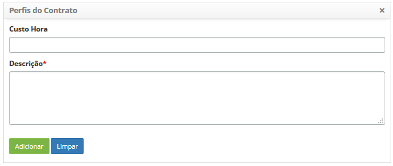
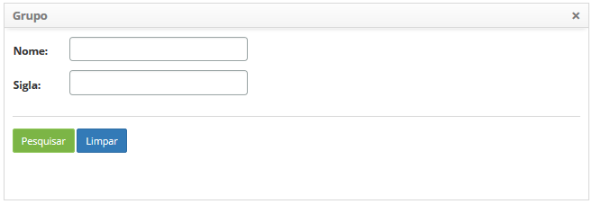
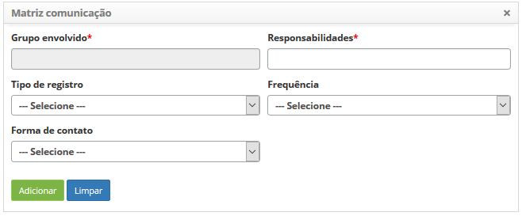
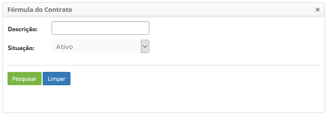
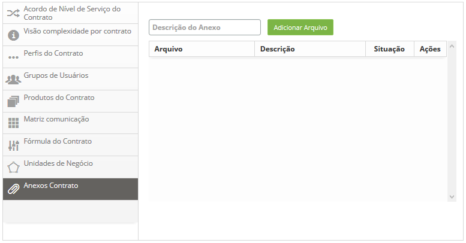
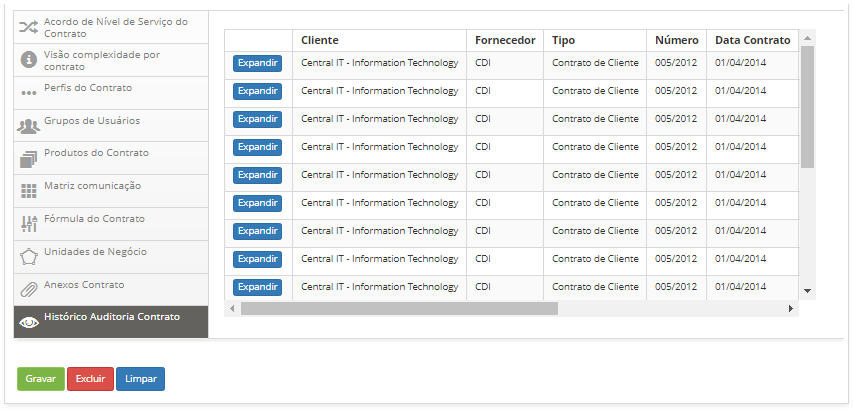

title: Cadastro e pesquisa de contrato
Description: O contrato é um acordo entre duas partes, que se obrigam a cumprir
o que foi entre elas combinado sob determinadas condições.

# Cadastro e pesquisa de contrato

O contrato é um acordo entre duas partes, que se obrigam a cumprir o que foi
entre elas combinado sob determinadas condições. O contrato pode ser do
tipo *contrato *(contrato entre o fornecedor do tipo provedor de serviços e
cliente externo), *acordo de nível operacional*(acordo interno entre os
departamentos da mesma organização, fornecedor interno com cliente interno)
ou *contrato de apoio* (contrato entre o fornecedor externo e cliente interno).

Como acessar
-----------

1.  Acesse o menu principal **Processos ITIL > Gerência de Portfólio e Catálogo 
     > Cadastro de Contratos**.

Pré-condições
------------

1.  Ter o fornecedor cadastrado (ver conhecimento [Cadastro e pesquisa de
    fornecedor]();

2.  Ter o cliente cadastrado (ver conhecimento [Cadastro e pesquisa de
    cliente]();

3.  Ter a moeda cadastrada (ver conhecimento [Cadastro e pesquisa de
    moeda]();

4.  Ter a condição de operação cadastrada (ver conhecimento [Cadastro e pesquisa
    de condição de
    operação]().

Filtros
-------

1.  Os seguintes filtros possibilitam ao usuário restringir a participação de
    itens na listagem padrão da funcionalidade, facilitando a localização dos
    itens desejados, conforme ilustrado na figura abaixo:

    -   Número do Contrato.

1.  Na tela de **Contratos**, clique na guia de **Listagem**. Será apresentada a
    tela de pesquisa, conforme ilustrada na figura abaixo:

    

    **Figura 1 - Tela de pesquisa de contrato**

1.  Realize a pesquisa do contrato;

    -   Informe o número do contrato e clique no botão *Pesquisar*. Após isso,
        será exibido o registro do contrato conforme o número informado.

    -   Caso deseje listar todos os registros de contrato, basta clicar
        diretamente no botão *Pesquisar*.

Listagem de itens
-----------------

1.  Os seguintes campos cadastrais estão disponíveis ao usuário para facilitar a
    identificação dos itens desejados na listagem padrão da
    funcionalidade: Número do Contrato, Nome Cliente e Fornecedor.

    

    **Figura 2 - Tela de item**

1.  Após a pesquisa, selecione o registro desejado. Feito isso, será direcionado
    para tela de cadastro exibindo o conteúdo referente ao registro selecionado;

2.  Para alterar os dados do registro de contrato, basta modificar as
    informações dos campos desejados e clicar no botão *Gravar* para efetuar a
    alteração realizada no registro.

Preenchimento de campos cadastrais

1.  Após o acesso a funcionalidade, será apresentada a tela de **Cadastro de
    Contrato**, conforme ilustrada na figura abaixo:

    
    
    **Figura 3 - Tela de cadastro de contrato**

1.  Preencha os campos conforme orientações abaixo:

    a)  **Tipo de Acordo/Contrato**: selecione o tipo de acordo/contrato;

       -   **Contrato**: refere-se ao contrato entre a empresa contratante e a
        empresa prestadora de serviços. Ao selecionar esse tipo, serão
        disponibilizados no campo "fornecedor" somente os fornecedores do tipo
        "provedor de serviços" e no campo "cliente" somente os clientes do tipo
        "externo" para seleção.

       -   **Acordo de Nível Operacional**: refere-se ao acordo interno entre os
        departamentos da mesma empresa. A selecionar esse tipo, serão
        disponibilizados no campo "fornecedor" somente os fornecedores tipo
        "interno" e no campo "cliente" somente os clientes do tipo "interno"
        para seleção.

       -   **Contrato de Apoio**: refere-se ao contrato entre a empresa provedora
        de serviços e um terceiro, fornecedor externo. Ao selecionar esse tipo,
        serão disponibilizados no campo "fornecedor" somente os fornecedores do
        tipo "externo" e no campo "cliente" somente os clientes do tipo
        "interno" para seleção.

    b)  **Fornecedor**: informe o prestador de serviços;

    c)  **Cliente**: informe o cliente, o qual contratou/solicitou os serviços;

    d)  **Fiscal**: informe o fiscal do contrato, ou seja, a pessoa designada para
    acompanhar e fiscalizar a execução contratual para o fim a que se destina;

    e)  **Gestor**: informe o gestor do contrato, ou seja, a pessoa responsável pela
    gestão do contrato;

    f)  **Grupo de Solicitante**: selecione o grupo de colaboradores que podem
    solicitar serviços no contrato;

    g)  **Número**: informe o número de identificação quantitativa do contrato;

    h)  **Situação**: selecione a situação do contrato;

    i) **Moeda**: selecione a moeda;

      -   **Real**: moeda corrente oficial do Brasil;

      -   **UST**:** **Unidade Serviço Técnico, quantificação monetária relativa aos
      serviços utilizados em determinados contratos públicos federais, conforme
      IN04, ou outras que porventura possam servir de métricas para a valoração de
      serviço.

    j)  **Cotação Moeda**: informe a cotação da moeda. No caso do uso da UST ou
    outra correspondente, quantificar o valor referente a 1 unidade da moeda.
    Caso o valor seja em Real, a cotação deve permanecer R\$ 0,00;

    k)  **Valor Estimado do Contrato**: informe o valor considerado para o contrato;

    l)  **Valor Mensal do Contrato**: Mostra o resultado do cálculo;

    !!! warning "ATENÇÃO"

        O campo Valor Mensal do Contrato é relevante para a gestão de ativos
        financeiros do sistema e seu cálculo leva em consideração: o valor total do
        contrato e as datas de início e fim do contrato.

m)  **Data do Contrato**: informe a data em que foi realizado o contrato;

n)  **Data Término do Contrato**: informe a data em que foi estipulado para o
    término do contrato;

o)  **Data de Revisão / Renovação**: informe a data da revisão / renovação do
    contrato;

p)  **Horas de Suporte**: informe o tempo de disponibilidade do suporte para
    execução do serviço;

q)  **Caixa de Saída de E-mail**: informe a caixa de saída de e-mail cadastrada;

r)  **Permite o cadastro de usuário (solicitante) caso o mesmo não seja
    encontrado**: informe se o operador do sistema poderá realizar o cadastro
    dos solicitantes de serviços que não estão previamente registrados no
    sistema, no momento do registro da solicitação;

s)  **Escopo**: descreva o escopo do contrato, ou seja, aquilo que se pretende
    atingir;

t)  **Objeto**: informe a descrição genérica dos serviços contemplados no
    contrato;

u)  Adicione as informações complementares do contrato. Essas informações podem
    ser inseridas no momento do registro do contrato ou posteriormente, conforme
    sua necessidade.

Vinculando acordo de nível de serviço do contrato
------------------------------------------------

**Acordo de Nível de Serviço do Contrato**: permite especificar o que foi
acordado no contrato entre o provedor de serviços e o cliente.

1.  Clique na guia **Acordo de Nível de Serviço do Contrato** e logo em seguida
    clique no botão *Novo*. Feito isso, será exibida a tela para cadastro do
    acordo de nível de serviço, conforme ilustrada na figura abaixo:

    
    
    **Figura 4 - Informações complementares – Registro de Acordo de Nível de Serviço
     do contrato**

-   **Descrição do Acordo**: descreva o que foi acordado no contrato, de forma
    macro. Exemplo: Disponibilidade mensal de atendimentos aos serviços
    críticos;

-   **Data início**: informe a data de início do acordo. Essa data pode divergir
    com a data do contrato em si, pois acordos podem ser inseridos
    posteriormente;

-   **Data fim**: informe a data prevista para o final do acordo;

-   **Valor Limite**: informe o valor limite para glosa. Esse valor pode ser um
    percentual de atendimento ou quantidade de eventos. Exemplo: o serviço deve
    alcançar mensalmente 99,7 % de disponibilidade ou podem ocorrer no mês até 4
    incidentes causados pela organização contratada. O excedente deste limite
    será penalizado com o valor especificado na Descrição de Glosa.

-   **Unidade do Valor Limite**: informe a unidade do valor limite para glosa.
    Exemplo: percentual ou quantidade de eventos;

-   **Detalhamento do Acordo**:** **descreva os detalhes do que foi acordado no
    contrato. Exemplo: A disponibilidade de uso para os serviços críticos deve
    ser de 24x7;

-   **Descrição da Glosa**: descreva os percentuais a serem pagos sobre o valor
    do contrato no caso do não cumprimento do acordo. Exemplo: 0,5% de glosa
    para cada décimo de falha no serviço ou 0,2% para cada falha de notificação
    superior à meta até 10 ocorrências, 0,5% até 20 ocorrências, etc.

-   Após informar os dados necessários, clique em *Adicionar* para adicionar o
    acordo de nível de serviço ao contrato.

Vinculando visão de complexidade do contrato
-------------------------------------------

**Visão de Complexidade do Contrato**: permite identificar os valores de
complexidade referentes aos custos operacionais do contrato. É muito utilizado
no caso de gerenciamento das Ordens de Serviços relacionadas à moeda UST.

1.  Clique na guia **Visão complexidade por contrato** e após isso, clique sobre
    a complexidade que deseja informar o valor:

    
    
    **Figura 5 - Informações complementares - Visão de complexidade**

-   **Valor Complexidade**: informe quanto vale cada nível de complexidade para
    organização. Exemplo: alta = 6, baixa = 1, especialista = 10.

-   Caso deseje remover o valor da complexidade, clique no botão *Limpa*r.

Vinculando perfis do contrato
----------------------------

**Perfis do Contrato**: permite definir os perfis dos profissionais que serão
fundamentais para desenvolvimento de um projeto relacionado ao contrato.

1.  Clique na guia **Perfis do Contrato** e logo em seguida clique no botão
    *Novo*. Feito isso, será exibida a tela para registrar o perfil do
    profissional, conforme ilustrada na figura abaixo:

    
    
    **Figura 6 - Informações complementares - Registro dos perfis do contrato**

-   **Custo Hora**: informe o custo da hora de trabalho relativo a função que
    será desempenhada no projeto;

-   **Descrição**: informe a descrição da função requerida para o projeto.
    Exemplo: Analista de Sistemas, Analista de Desenvolvimento e entre outros.

-   Após os dados informados, clique em *Adicionar* para adicionar o perfil do
    profissional ao contrato.

Vinculando grupos de usuários
----------------------------

**Grupos de Usuários**: permite vincular grupos ao contrato.

1.  Clique na guia **Grupos de Usuários** e logo em seguida clique
    em *Adicionar*. Feito isso, será exibida a tela para vincular grupo(s) de
    colaboradores(s) ao contrato, conforme ilustrada na figura abaixo:

    
    
    **Figura 7 - Informações complementares - Vínculo de grupos**

-   Informe o grupo e clique no botão *Adicionar* para vínculo do mesmo ao
    contrato.

Vinculando produtos do contrato
------------------------------

**Produtos do Contrato:** permite especificar os entregáveis do projeto
relacionado ao contrato.

1.  Clique na guia **Produtos do Contrato** e logo em seguida clique no botão
    *Novo*. Após isso, será exibida a tela para registro de produtos, conforme
    ilustrada na figura abaixo:

    
    
    **Figura 8 - Informações complementares - Cadastro de produtos**

-   Informe a descrição do produto, referente ao projeto, que será entregue.
    Exemplo: documentação, *deploy*, *script*, fluxo de trabalho e entre outros.

-   Clique no botão *Adicionar* para adição do mesmo no contrato.

Vinculando matriz comunicação
--------------------------

**Matriz Comunicação**: permite definir quais documentos serão comunicados, para
quais stakeholders, em que frequência (quando) e por qual meio (como).

1.  Clique na guia **Matriz comunicação** e logo em seguida clique no botão
    *Novo*. Após isso, será exibida a tela de cadastro de matriz de comunicação,
    conforme ilustrada na figura abaixo:

    
    
    **Figura 9 - Informações complementares - Registro de matriz de comunicação**

-   **Grupo envolvido**: informe o grupo que deve receber a informação. Exemplo:
    usuários, *stakeholders, *fornecedores, patrocinadores, etc.;

-   **Responsabilidades**: informe os responsáveis pela informação. Exemplo:
    gerente de projeto, analista de sistemas, etc.;

-   **Tipo de registo**: selecione o tipo de registro que deverá ser comunicado;

-   **Frequência**: informe quando que deve ocorrer a comunicação;

-   **Forma de contato**: selecione o meio de comunicação;

-   Após os dados informados, clique no botão *Adicionar* para adição da matriz
    de comunicação ao contrato.

Vinculando fórmula do contrato
-----------------------------

**Fórmula do Contrato:** permite vincular fórmulas ao contrato. Essas fórmulas
são utilizadas para obter o valor do custo total das atividades do serviço do
contrato.

1.  Clique na guia **Fórmula do Contrato** e clique no botão Novo. Após isso,
    será exibida a tela para vínculo da fórmula no contrato;

    
    
    **Figura 10 - Informações complementares – Vínculo de fórmulas**

-   Realize a pesquisa da fórmula que será utilizada para obter o valor do custo
    total da(s) atividade(s) do serviço do contrato;

-   Após a pesquisa, selecione a fórmula para adição no contrato.

Vinculando unidades de negócio
-----------------------------

**Unidades de Negócio:** permite vincular unidades de negócio ao contrato.

1.  Clique na guia **Unidades de Negócio** e logo em seguida clique no
    botão *Adicionar*. Após isso, será exibida a tela para vincular unidade(s)
    de negócio ao contrato, conforme ilustrada na figura abaixo:

    
    
    **Figura 11 - Informações complementares - Vínculo de unidades de negócio**

-   Realize a pesquisa da unidade e após isso, selecione a unidade para vincular
    ao contrato.

Vinculando anexos
----------------

**Anexos Contrato**: permite anexar arquivos ao contrato;

1.  Clique na guia **Anexos Contrato** e após isso, será apresentada a área de
    anexo de arquivo, conforme ilustrada na figura abaixo:

    
    
    **Figura 12 - Informações complementares - Anexo de arquivos**

    -   Informe a descrição do anexo, clique no botão *Adicionar Arquivo* e
    selecione o arquivo desejado;

    -   Após isso, será adicionado o arquivo ao contrato.

1.  Após os dados do contrato informados, clique no botão *Gravar* para efetuar
    o registro, onde a data, hora e usuário serão gravados automaticamente para
    uma futura auditoria.

Verificando o histórico de auditoria do contrato
----------------------------------------------

1.  Todas as vezes que é feita uma alteração no contrato, essa alteração é
    gravada no histórico para uma futura auditoria. A figura abaixo ilustra o
    registro das alterações feitas no contrato:

**Figura 13 - Histórico do contrato**

!!! tip "About"

    <b>Product/Version:</b> CITSmart | 8.00 &nbsp;&nbsp;
    <b>Updated:</b>07/19/2019 – Anna Martins
