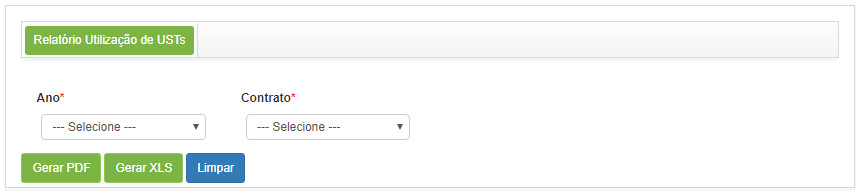
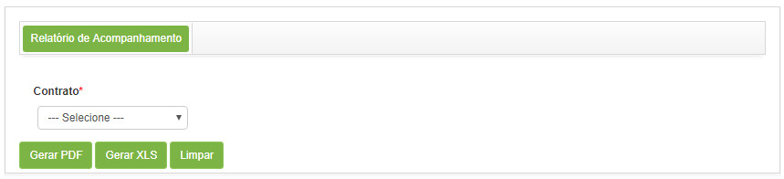

title:  Geração de relatórios - Gerência de Contratos
Description: Esse relatório tem o objetivo de apresentar as informações da utilização de UST nos contratos. 
# Geração de relatórios - Gerência de Contratos

Gerando relatório de uilização de UST
-----------------------------------------

*Esse relatório tem o objetivo de apresentar as informações da utilização de UST nos contratos.*

*Como acessar*

1. Acesse a funcionalidade de Relatório de Utilização de USTs através da navegação no menu principal 
**Relatórios > Gerência de Contratos > Utilização de USTs**.

*Filtros*

1. Os seguintes filtros possibilitam ao usuário restringir a participação de itens na listagem padrão da funcionalidade, 
facilitando a localização dos itens desejados:

    - Ano;
    - Contrato.
    
2. Será apresentada a tela de **Geração de Relatório de Utilização de USTs**, conforme ilustrada na figura a seguir:

    
    
    **Figura 1 - Tela de geração de relatório de utilização de USTs**
    
3. Defina os filtros conforme sua necessidade:

   - **Ano**: selecione o ano desejado;
   - **Contrato**: selecione o contrato para verificar as informações sobre a utilização de UST no mesmo.
   
Gerando relatório de acompanhamento de USTS
----------------------------------------------

*Esse relatório tem o objetivo de apresentar as informações de acompanhamento do uso das USTs.*

*Como acessar*

1. Acesse a funcionalidade de Relatório de Acompanhamento de USTs através da navegação no menu principal 
**Relatórios > Gerência de Contratos → Acompanhamento USTs**.

*Filtros*

1. Os seguintes filtros possibilitam ao usuário restringir a participação de itens na listagem padrão da funcionalidade, 
facilitando a localização dos itens desejados:

    - Contrato.
    
2. Será apresentada a tela de **Geração de Relatório de Acompanhamento de USTs**, conforme ilustrada na figura a seguir:

    
    
    **Figura 2 - Tela de geração de relatório de acompanhamento de USTs**
    
3. Selecione o contrato para verificar o uso de USts no mesmo.

!!! tip "About"

    <b>Product/Version:</b> CITSmart | 7.00 &nbsp;&nbsp;
    <b>Updated:</b>08/02/2019 - Larissa Lourenço
