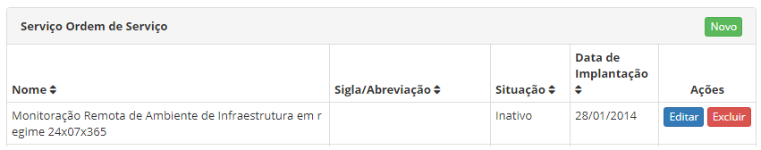
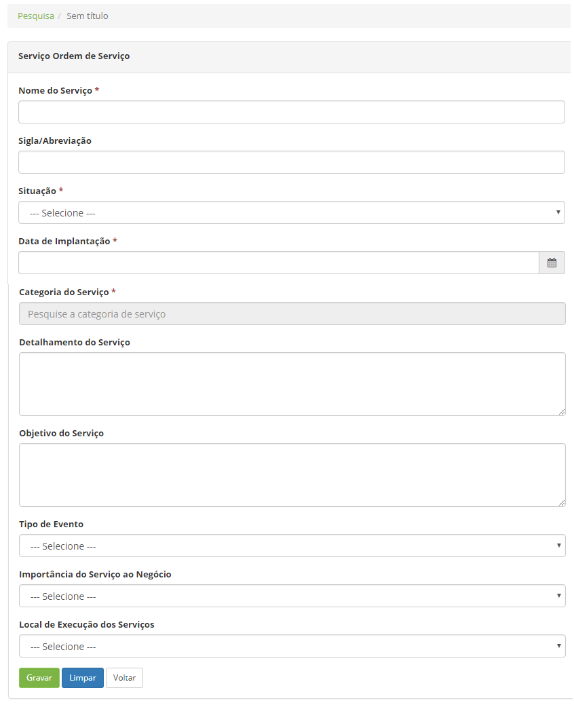

title: Cadastro e pesquisa de serviços de ordens de serviço (OS)
Description: Esta funcionalidade tem o objetivo de cadastrar os serviços de
ordens de serviço (OS).

# Cadastro e pesquisa de serviços de ordens de serviço (OS)

Esta funcionalidade tem o objetivo de cadastrar os serviços de ordens de serviço
(OS).

Como acessar
----------

1.  Acesse o menu principal **Gestão Integrada  > Gerência de Contratos >
    Cadastro de Serviços OS**. Após isso, será apresentada a tela de **Serviço
    Ordem de Serviço**.

Pré-condições
------------

1.  Ter a categoria de serviço cadastrada (ver conhecimento [Cadastro e pesquisa
    de categoria de
    serviço]();

2.  Ter o tipo de serviço cadastrado (ver conhecimento [Cadastro e pesquisa de
    tipo de
    serviço]().

Filtros
------

1.  O seguinte filtro possibilita ao usuário restringir a participação de itens
    na listagem padrão da funcionalidade, facilitando a localização dos itens
    desejados:

    -   Nome;

    -   Sigla/Abreviação;

    -   Situação;

    -   Data de implantação.

    

    **Figura 1 - Tela de serviço de OS**

1.  Para realizar a busca de um serviço de OS, informe a sigla/abreviação, nome,
    situação e/ou data de registro do mesmo.

Listagem de itens
----------------

1.  Os seguintes campos cadastrais estão disponíveis ao usuário para facilitar a
    identificação dos itens desejados na listagem padrão da
    funcionalidade: **Nome, Sigla/Abreviação, Situação** e **Data de
    implantação**.

2.  Existem botões de ação disponíveis ao usuário em relação a cada item da
    listagem, são eles: *Editar* e *Excluir*.

    
    
    **Figura 2 - Tela de listagem de serviços de OS**

1.  Após a pesquisa, selecione o registro desejado. Feito isso, será direcionado
    para a tela de cadastro exibindo o conteúdo referente ao registro
    selecionado;

2.  Para alterar os dados do registro de serviço de OS, clique no
    botão *Editar*. Feito isso, será direcionado para a tela de cadastro
    exibindo o conteúdo do determinado serviço.

Preenchimento dos campos cadastrais
----------------------------------

1.  Clique no botão *Novo* (segundo a figura anterior). Feito isso, será
    apresentada a tela de **Cadastro de Serviço de Ordem de Serviço**, conforme
    ilustrada na figura a seguir:

    
    
    **Figura 3 - Tela de cadastro de serviço de OS**

1.  Preencha os campos conforme orientação abaixo:

    -   **Nome do Serviço**: informe o nome do serviço de OS;

    -   **Sigla/Abreviação**: informe uma sigla ou uma abreviação para identificar o
    serviço, caso achar necessário;

    -   **Situação**: informe situação do serviço de OS;

    -   **Data de implantação**: definir a data que será implementado o serviço;

    -   **Categoria do Serviço**: informe a categoria do serviço de OS;

    -   **Detalhamento do Serviço**: descreva os detalhes do serviço de OS;

    -   **Objetivo do Serviço**: descreva o objetivo do serviço de OS;

    -   **Tipo de Evento**: informe o tipo de evento do serviço de OS;

    -   **Importância do Serviço ao Negócio**: informe a importância do serviço de
    OS ao negócio;

        -   **Alta**: informá-lo caso o serviço seja imprescindível para o
        funcionamento do negócio;

        -   **Média**: informá-la caso o serviço seja importante para o negócio, mas
        a produtividade não seja totalmente dependente dele;

        -   **Baixa**: informá-lo se o serviço a ser realizado for necessário para o
        dia-a-dia da empresa, mas a sua ausência não cause situações drásticas;

        -   **Normal**: informá-lo caso o serviço a ser realizado não interfira no
        cotidiano produtivo da organização;

        -   **A combinar**: informá-lo quando não se sabe o tipo de importância do
        serviço ao negócio no momento do registro.

    -   **Local de Execução dos Serviços**: informe o local onde o serviço de OS
    será executado;

        -   **Interno**: o serviço será realizado dentro da organização;

        -   **Externo**: o serviço será realizado fora da organização. Por exemplo:
        em outra organização ou em uma filial;

        -   **Interno/Externo**: o serviço poderá ser realizado dentro da
        organização como fora.

1.  Após os dados informados, clique no botão *Gravar* para efetuar o registro,
    onde a data, hora e usuário serão gravados automaticamente para uma futura
    auditoria.

!!! tip "About"

    <b>Product/Version:</b> CITSmart | 8.00 &nbsp;&nbsp;
    <b>Updated:</b>07/19/2019 – Anna Martins
