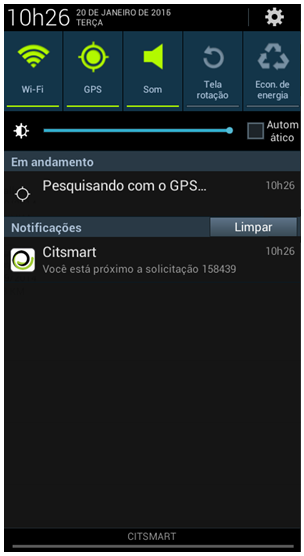

title: Manual do usuário do aplicativo mobile CITSmart Enterprise ITSM (Android)

Description: Este documento tem o propósito de fornecer orientações necessárias
para instalar, configurar e utilizar o aplicativo CITSmart Enterprise Mobile.

# Manual do usuário do aplicativo mobile CITSmart Enterprise ITSM (Android)

Este documento tem o propósito de fornecer orientações necessárias para
instalar, configurar e utilizar o aplicativo CITSmart Enterprise Mobile.

O CITSmart Enterprise Mobile oferece vários recursos, sendo:

1.  Facilidade no atendimento e ter um direcionamento de onde a solicitação está
    localizada;

2.  Filtrar solicitações pessoais e por grupo de trabalho;

3.  Visualização dos detalhes de uma solicitação de serviço;

4.  Visualização de solicitações em mapa;

5.  Visualização da melhor rota para chegar ao local de atendimento da
    solicitação de serviço;

6.  Atualização da localização da unidade latitude longitude a partir do
    aparelho mobile;

7.  Realização de check-out caso o usuário tenha permissão de execução;

8.  Negação de um check-in sugerido pelo sistema;

9.  Recebimento de notificações.

Este documento foi estruturado em **quatro** grandes seções:

1.  Pré - condições;

2.  Instalação e Configuração do App no Celular (Smartphone);

3.  Utilização do App no Celular (Smartphone);

4.  Utilização *Avançada* do App no Celular (Smartphone) - com Mapas.

Pré- condições
--------------

1.  Implantar a versão 7.2.2.0 (ou superior) do **CITSmart Enterprise Mobile**;

2.  Configurar o servidor para uso do aplicativo mobile **CITSmart Enterprise
    Mobile** (ver conhecimento: [Manual de configuração do servidor para uso do
    CITSmart ITSM Enterprise (iOS e
    Android)]().

Instalação e configuração do app no celular (smartphone)
-------------------------------------------------------

Para instalar o CITSmart Enterprise Mobile, deve ser realizada a busca do
aplicativo na loja on-line (Google Play).

1.  Pesquise por CITSmart Enterprise e após a pesquisa, selecione o aplicativo,
    conforme indicado na figura abaixo:

    
    
    **Figura 1 - Google Play - Pesquisa do App CITSmart Enterprise**

1.  Pressione o botão *Instalar* para baixar o aplicativo;

    
    
    **Figura 2 - Botão de instalação**

1.  Após a instalação aparecerá em seus aplicativos o ícone do CITSmart
    Enterprise Mobile;

    
    
    **Figura 3 - App instalado**

1.  Para criar uma conexão, pressione o ícone com formato de chave   ,
    localizado no canto direito superior da tela, conforme indicado na figura
    abaixo:

    
    
    **Figura 4 - Criar conexão**

1.  Será apresentada a tela de conexões, pressione o ícone   , localizado no
    canto direito superior da tela, conforme indicado na figura abaixo:

    
    
    **Figura 5 - Tela de conexões**

1.  Será apresentada a tela “Nova conexão” para registro da conexão;

    
    
    **Figura 6 - Registro de conexão**

1.  Informe os dados:

    -   **Nome**: informe o nome da conexão que deseja conectar;

    -   **URL do servidor**: informe o endereço do servidor para conexão. Deve
        ser colocado o protocolo (http) na URL;

    -   **Usuário**: informe o nome de usuário;

    -   **Senha**: informe a senha de acesso.

    !!! warning "ATENÇÃO"

        Caso o aparelho seja trocado, esta conexão deve ser deletada.

1.  Após informar os dados da conexão desejada, pressione no botão *Adicionar*;

2.  Depois de adicionada a conexão, aparecerá a listagem das conexões criadas.
    Para alterar uma conexão, basta selecionar a conexão desejada e fazer a
    alteração;

3.  Para se conectar, basta selecionar a conexão, na tela inicial do aplicativo;

    
    
    **Figura 7 - Login**

Utilização do app no celular (smartphone)
----------------------------------------

### Visualizando solicitações de serviço

Após realizar a conexão, será apresentada a tela de “Solicitações de Serviço”
onde poderá visualizar as solicitações de acordo com o filtro escolhido e
realizar demais ações, que serão explicadas adiante.

1.  Para escolher o tipo de solicitação que deseja visualizar, clique no ícone
    com formato de barras   localizado no canto esquerdo superior;

    
    
    **Figura 8 - Solicitações de serviço**

1.  É apresentado uma lista com os tipos e as quantidades de solicitações de
    cada tipo, conforme apresentada na figura abaixo:

    
    
    **Figura 9 - Filtros**

1.  Selecione o tipo de solicitação desejado;

2.  Após escolher o tipo desejado, pressione a opção Pessoal para visualizar as
    solicitações pessoais ou Grupo para visualizar as solicitações do grupo de
    trabalho de acordo com o tipo selecionado;

3.  Será apresentada a lista de solicitações de serviço, conforme o filtro
    escolhido:

    
    
    **Figura 10 - Lista de solicitação pessoal**

    
    
    **Figura 11 - Lista de solicitação do grupo**

1.  Para visualizar solicitações específicas, clique no ícone de pesquisa   .
    Será apresentada um campo para informar o dado da solicitação desejada
    (número da solicitação, nome do contrato, nome da unidade ou nome do grupo
    executor). Após informação do dado, pressione “Enter”. Feito isso, será
    redirecionado para a tela de busca, contendo uma lista de solicitações
    resultantes da consulta realizada, conforme exemplo ilustrado na figura
    baixo:

    
    
    **Figura 12 - Lista de solicitações**

    !!! note "NOTA"

        Para que a funcionalidade de busca funcione, é necessário configurar o web
        service (notification_buscaNotificacao) correspondente na tela de “Cadastro
        de Operação Web Service” no CITSmart Enterprise Web.

1.  Em cada solicitação é apresentado um símbolo com a cor que representa sua
    situação, sendo:

    -   Verde (normal/em andamento): indica que a solicitação está em
        atendimento, dentro do prazo estabelecido;

    -   Amarelo (a vencer) : indica que o prazo limite para atendimento da
        solicitação está perto de ser ultrapassado;

    -   Cinza (suspensa) : indica que a solicitação foi suspensa;

    -   Vermelho (vencida) : indica que o prazo limite para atendimento da
        solicitação foi ultrapassado.

2.  Para visualizar os detalhes da solicitação de serviço, clique na solicitação
    desejada que será apresenta a tela de “Detalhes” da mesma. Para as
    solicitações que são de acompanhamento, apenas é possível visualizar a sua
    descrição. Nestas, não existem botões no rodapé;

3.  Ao realizar o pull down na tela, serão atualizadas as solicitações
    existentes e exibidas novas solicitações;

    
    
    **Figura 13 - Atualização da lista com novas solicitações**

1.  Ao realizar o pull up na tela, serão atualizadas as solicitações existentes
    e exibidas as solicitações antigas;

    
    
    **Figura 14 - Atualização da lista com solicitações antigas**

1.  Para ordenar as solicitações, clique no ícone de ordenação  . Será exibida
    uma lista de opções para ordenação (conforme ilustrada na figura abaixo),
    selecione uma opção desejada e clique em Ok;

    
    
    **Figura 15 - Ordenação de solicitações**

    -   **Número da solicitação**: ordena as solicitações pelo número, em ordem
    decrescente;

    -   **Responsável (sem responsável primeiro)**: ordena as solicitações,
    primeiramente, sem o responsável atual. Depois segue o critério de ordenação
    pelo número da solicitação, em ordem decrescente;

    -   **Data de criação**: ordena as solicitações, primeiramente, pela data de
    criação, em ordem crescente. Depois segue o critério de ordenação pelo
    número da solicitação, em ordem decrescente;

    -   **Vencimento**: ordena as solicitações por solicitações vencidas, próximas
    do vencimento, dentro do prazo e suspensas. Depois segue o critério de
    ordenação pelo número da solicitação, em ordem decrescente.

### Criando solicitação de serviço

1.  Para criar uma solicitação de serviço, pressione o ícone   localizado no
    canto direito superior da tela e selecione a opção “Novo
    incidente/requisição”, dependendo da resolução da tela, será exibido o ícone
    com formato de sinal de mais   , basta pressionar o mesmo para criação da
    solicitação, conforme ilustrado abaixo:

    
    
    **Figura 16 – Criação de solicitação de serviço**

    
    
    **Figura 17 - Ícone para criar solicitação de serviço**

1.  Será exibida a tela para criação da solicitação, conforme apresentada na
    figura abaixo:

    
    
    **Figura 18 - Tela de criação de nova solicitação**

    !!! info "IMPORTANTE"

        A solicitação registrada pelo CITSmart Enterprise Mobile utiliza serviços
        que são configurados no CITSmart Enterprise Web.

1.  Informe a descrição da solicitação de serviço e pressione o
    botão *Enviar* para efetuar a operação;

2.  Após efetuar a operação, a mensagem de registro da solicitação será
    apresentada.

    

    **Figura 19 - Solicitação criada**

### Aprovando/rejeitando solicitação de serviço

Algumas solicitações necessitam de aprovação, portanto, para atendê-las é
necessário aprová-las.

1.  Selecione a solicitação que é passível de aprovação;

2.  Será apresentada a tela de “Detalhes” exibindo a descrição da solicitação
    para aprovação/rejeição da mesma;

    
    
    **Figura 20 - Tela de aprovação/rejeição de solicitação**

1.  Para aprovar a solicitação, basta pressionar o botão *Aprovar*;

2.  Para rejeitar a solicitação, pressione o botão *Rejeitar*. Será exibida uma
    tela para escolha da justificativa desta rejeição, conforme apresentada na
    figura abaixo:

    
    
    **Figura 21 - Tela justificava de rejeição da solicitação**

-   Escolha a justificava da rejeição da solicitação e pressione o botão *Ok*.

Utilização avançada da aplicação no celular (smartphone) - com mapas
----------------------------------------------------------------

### Atualizando as coordenadas de uma unidade

Atualize as coordenadas de uma unidade para que o sistema possa identificar a
localização da mesma.

1.  Para visualizar as solicitações de trabalho pelo mapa, pressione a opção
    Pessoal ou Grupo e logo em seguida pressione o ícone   . Será apresentado o
    mapa exibindo a localização das solicitações;

    
    
    **Figura 22 - Solicitação em mapa**

1.  Para atualizar as coordenadas, pressione o ícone  localizado no canto
    direito superior da tela e pressione a opção “Obter Coordenadas”, dependendo
    da resolução da tela, será exibido o ícone com formato de uma bandeira   ,
    basta pressionar o mesmo para atualização das coordenadas;

    
    
    **Figura 23 - Obter coordenadas**

    
    
    **Figura 24 - Ícone para obter coordenadas**

1.  Será apresentada a tela “Obter Coordenadas”:

    
    
    **Figura 25 - Tela de obter coordenadas**

    -   Selecione o contrato e a unidade. Feito isso, pressione o botão *Obter
    Coordenadas* para efetuar a operação;

    -   Será enviado sua latitude e longitude ao servidor (CITSmart Enterprise Web).

### Atendendo solicitação de serviço

    !!! note "NOTA"

       Se estiver na lista de solicitações de grupo, e atender à solicitação, a
       mesma passará a ser pessoal, sendo exibida na lista de solicitações
       pessoais.

1.  Parar atender uma solicitação de serviço, selecione a solicitação desejada;

2.  Se estiver visualizando as solicitações via mapa e caso tenha somente uma
    solicitação de serviço registrada é possível realizar o seu atendimento
    através do mapa, basta pressionar o ponto de localização da solicitação e
    logo em seguinte selecionar a solicitação. Caso tenha mais de uma
    solicitação de serviço, ao pressionar o ponto de localização da solicitação,
    será direcionado para lista de solicitação pessoal ou do grupo.

    
    
    **Figura 26 - Atendimento de solicitação via mapa**

1.  Após selecionar a solicitação, será apresentada a tela de “Detalhes” da
    mesma, conforme o exemplo apresentado na figura abaixo:

    
    
    **Figura 27 - Atender solicitação de serviço**

1.  Pressione o botão *Atender*. Será direcionada para tela da solicitação, onde
    será possível realizar o check-in;

    
    
    **Figura 28 - Solicitação de serviço**

1.  Para visualizar a rota de onde realizará o atendimento, basta pressionar o
    botão *Ver Rota*;

    -   Será exibida uma tela para escolher o aplicativo de visualização da rota;

    
    
    **Figura 29 - Aplicativo para visualizar a rota**

    -   Selecione o aplicativo que irá utilizar para visualizar a rota;

    -   Será exibida a tela de visualização da rota;

    -   O caminho será mostrado a partir da sua localização até o local da
    solicitação.

    !!! note "NOTA"

        Para que seja possível visualizar a rota, é necessário que a unidade tenha
        as coordenadas configuradas a partir de uma longitude e latitude.

1.  Após verificar a rota e chegar no local para atendimento da solicitação de
    serviço, realize o check-in da solicitação;

2.  Para realizar o check-in, pressione o ícone   localizado na barra superior
    da tela;

    -   Será exibida a tela de “Check-in”, conforme exemplo apresentado na figura
    abaixo:

    
    
    **Figura 30 - Tela de check-in**

    -   Pressione o botão *Check-in* para efetuar a operação;

     !!! note "NOTA"

         Ao realizar o check-in, caso a solicitação esteja suspensa, ela será
         reativada e capturada.      

1.  Após realizar o check-in, será exibida a tela para realizar o check-out;

    
    
    **Figura 31 - Tela de check-out**

    -   Informe o status do atendimento da solicitação;

    
    
    **Figura 32 – Check-out - Status da solicitação de serviço**

    -   Selecione o status e pressione *OK*;

    -   Caso tenha selecione o status “Suspensa”, será exibida uma janela para
    registrar o motivo da suspensão, conforme apresentada no exemplo ilustrado
    na figura abaixo:

     
     
     **Figura 33 – Check-out - Registro do motivo da suspensão da solicitação**

    -   Caso tenha selecionado o status “Resolvida”, será exibida uma janela para
    registrar o encerramento da solicitação, conforme apresentada no exemplo
    ilustrado na figura abaixo:

    
    
    **Figura 34 - Check-out - Registro de encerramento da solicitação**

### Notificações

O aplicativo CITSmart Enterprise Mobile fica rodando em background no celular,
através disso, você recebe automaticamente notificações que são passiveis de
ação.

1.  Sempre que você estiver próximo ao local de atendimento de uma solicitação
    de serviço, receberá uma notificação, conforme o exemplo ilustrado na figura
    abaixo:

    
    
    **Figura 35 - Notificação de proximidade do local de atendimento da
    solicitação**

    -   Selecione a notificação, onde será exibida uma tela questionando se deseja
    realizar o Check-in, conforme exemplo ilustrado na figura abaixo:

    
    
    **Figura 36 - Tela de justificava de rejeição da solicitação**

    -   Responda se deseja realizar o Check-in;

    -   Ao pressionar o botão *Sim*, será direcionado para tela de Check-in;

    -   Ao pressionar o botão *Não*, será direcionada para tela de registro da
    negação do Check-in, conforme o exemplo ilustrado na figura abaixo:

    
    
    **Figura 37 - Tela de negação do check-in**

    -   Informe o motivo da negação do Check-in da solicitação.

1.  Quando estiver próximo ao local de atendimento de mais de uma solicitação de
    serviço, receberá uma notificação contendo a quantidade de solicitações,
    conforme o exemplo ilustrado na figura abaixo:

    
    
    **Figura 38 - Notificação de proximidade do local de atendimento de várias
    solicitações**

     -   Ao selecionar a notificação, será exibida uma lista de solicitações próximas
    de sua localização, conforme exemplo ilustrado na figura abaixo:

    
    
    **Figura 39 – Solicitações próximas**

1.  Quando um solicitante delegar uma solicitação de serviço, receberá uma
    notificação, conforme o exemplo ilustrado na figura abaixo:

    
    
    **Figura 40 - Notificação de solicitação recebida**

-   Selecione a notificação para ser direcionado à sua lista de solicitação
    pessoal.

!!! tip "About"

    <b>Product/Version:</b> CITSmart | 8.00 &nbsp;&nbsp;
    <b>Updated:</b>07/22/2019 – Anna Martins
