title: Manual do usuário do aplicativo mobile CITSmart ITSM Enterprise (iOS)

Description: Este documento tem o propósito de fornecer orientações necessárias
para instalar, configurar e utilizar o aplicativo mobile **CITSmart ITSM
Enterprise** na plataforma iOS.

# Manual do usuário do aplicativo mobile CITSmart ITSM Enterprise (iOS)

Este documento tem o propósito de fornecer orientações necessárias para
instalar, configurar e utilizar o aplicativo mobile **CITSmart ITSM
Enterprise** na plataforma iOS.

Ele oferece vários recursos, tais como:

1.  Facilidade no atendimento e ter um direcionamento de onde a solicitação está
    localizada;

2.  Filtrar solicitações pessoais e por grupo de trabalho;

3.  Visualização dos detalhes de uma solicitação de serviço;

4.  Recebimento de notificações.

Este documento foi estruturado em **três** grandes seções:

1.  Pré-condições;

2.  Instalação e Configuração do App no mobile;

3.  Utilização do App no mobile.

Pré-condições
--------------

1.  Implantar a versão 7.2.2.0 (ou superior) do **CITSmart Enterprise ITSM**;

2.  Configurar o servidor para uso do aplicativo mobile **CITSmart ITSM
    Enterprise** (ver conhecimentos: [Manual de configuração do servidor para
    uso do CITSmart ITSM Enterprise (iOS e
    Android)]() e [Cadastro
    e Pesquisa das Configurações das Opções de
    Mobile]().

Instalação e configuração do app no mobile
------------------------------------------

Para instalar o CITSmart ITSM Enterprise, deve ser realizada a busca do
aplicativo na loja on-line (App Store).

1.  Pesquise por **CITSmart ITSM Enterprise** na App Store, selecione e baixe o
    aplicativo;

2.  Após a instalação aparecerá em seus aplicativos o ícone do CITSmart ITSM
    Enterprise:

    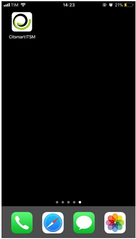

    **Figura 1 - App instalado**

1.  Para criar uma conexão, pressione o ícone com *Criar conexão*, conforme
    indicado na figura abaixo:

    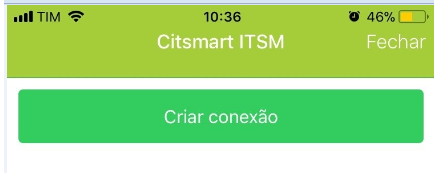
    
    **Figura 2 - Criar conexão**

1.  Será apresentada a tela “Nova conexão” para registro da conexão;

    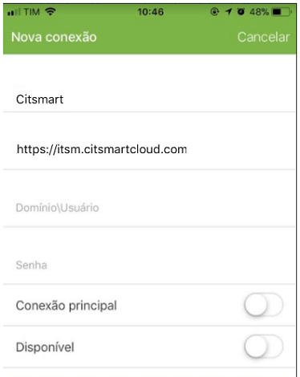
    
    **Figura 3 - Registro de conexão**

1.  Informe os dados:

    -   **Nome da conexão**: informe o nome da conexão que deseja conectar;

    -   **URL do servidor**: informe o endereço do servidor para conexão. Deve
        ser colocado o protocolo (https) na URL;

    -   **Conexão principal?**: informe se a URL escolhida será a principal;

    -   **Domínio\\Usuário**: A partir dessa versão o usuário terá que informar
        o domínio LDAP de uso e seu usuário;

        -   O formato é citsmart.local\\usuario.consultor (exemplo), sendo que a
            primeira parte é a informação do domínio e a segunda parte é o usuário;

    -   **Senha:** o usuário irá digitar a senha de acesso ao sistema;

    -   **Disponível**:

        -   Habilitado: Quando está habilitado, a conexão será a fornecida no campo
            URL, e além disso, para pegar a posição do atendente esse campo deve
            estar habilitado;

        -   Desabilitado: Quando está desabilitado o sistema não permitirá conexão
            ao servidor nem irá pegar a posição do atendente.

    !!! warning "ATENÇÃO"

        Caso o aparelho seja trocado, esta conexão deve ser deletada.

1.  Após informar os dados da conexão desejada, pressione no botão *Criar*;

2.  Depois de adicionada a conexão, aparecerá a listagem das conexões criadas.
    Para alterar uma conexão, basta selecionar a conexão desejada e fazer a
    alteração;

3.  Para se conectar, basta selecionar a conexão, na tela inicial do aplicativo;

4.  Digite usuário e senha:

    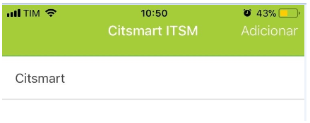
    
    **Figura 4 - Conexão**

    
    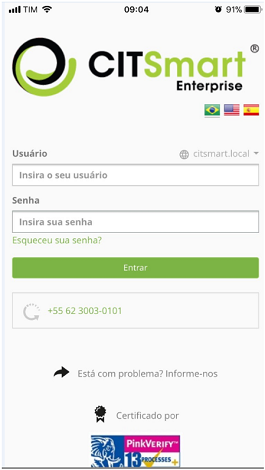
   
    **Figura 5 - Tela de login**

Utilização do app no mobile
--------------------------

### Visualizando solicitações de serviço

1.  Após realizar a conexão, será apresentada a tela menu, onde clicará na opção
    Tickets de Serviços.

    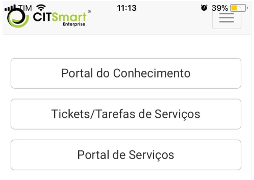
    
    **Figura 6 - Tela de menu**

1.  Para escolher o tipo de solicitação que deseja visualizar, clique no ícone  
     localizado no canto esquerdo superior;

    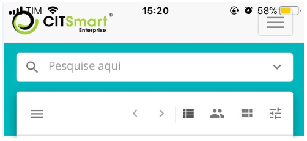
    
    **Figura 7 - Tela de pesquisa de solicitação**

1.  São apresentados filtros (Número, Solicitante, Tipo de Solicitação,
    Situação, Contrato, Grupo executor, Tarefa Atual, Responsável, Situação SLA,
    Ordenar por, Visualizar, Exibição e Exibir Sub-solicitações), conforme
    apresentada na figura abaixo:

    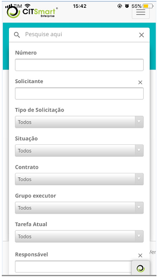 
    
    **Figura 8 - Filtros**

    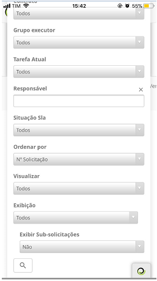
    
    **Figura 9 - Filtros (continuação)**

1.  Selecione o filtro desejado e clique no ícone  , no canto inferior esquerdo;

2.  Será apresentada a lista de solicitações de serviço, conforme o filtro
    escolhido:

    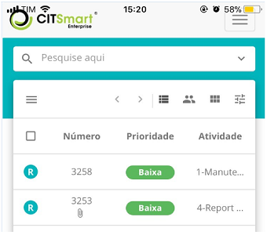

    **Figura 10 - Lista de ticket**

    !!! note "NOTA"

        Para que a funcionalidade de busca funcione, é necessário configurar o
        web service (notification_buscaNotificacao) correspondente na tela de “Cadastro
        de Operação Web Service” no CITSmart Enterprise Web.

1.  Em cada solicitação, quando se clica em cima é apresentado uma listagem de
    opções, sendo:

    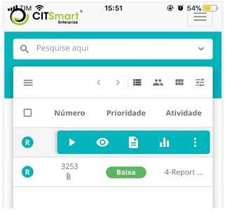
    
    **Figura 11- Lista de ticket**

-    - captura a solicitação para o usuário logado ou apenas visualiza o ticket
    sem capturar;

-    - visualiza o ticket;

-    - mostra o resumo da solicitação;

-    - visualiza mensagens;

-    - mostra relatórios do ticket;

-    - menu de opções de ações para a solicitação (Delegar, Suspender, Alterar
    SLA, Reclassificar, Criar sub-solicitações, Exibir sub-solicitações, Agendar
    atividade, Criar solicitação relacionada e Imprimir Solicitação).

### Criando solicitação de serviço

1.  Para criar uma solicitação de serviço, pressione o ícone   localizado no
    canto direito inferior da tela e selecione o ícone  “Novo ticket”, conforme
    ilustrado abaixo:

    
    
    **Figura 12 – Criação de solicitação de serviço**

    !!! info "importante"

        A solicitação registrada pelo CITSmart ITSM Enterprise utiliza serviços que
        são configurados no CITSmart Enterprise Web.

1.  Será apresentada a tela com campos cadastrais, conforme figuras abaixo:

    
    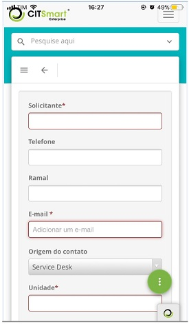
    
    **Figura 13 - Tela de cadastro de nova solicitação**

    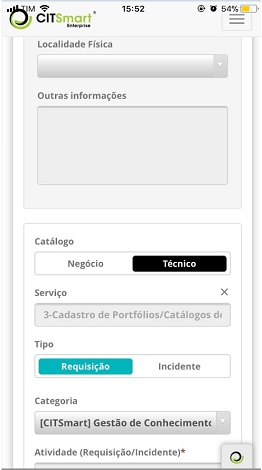
   
    **Figura 14 - Tela de cadastro de nova solicitação (continuação)**

    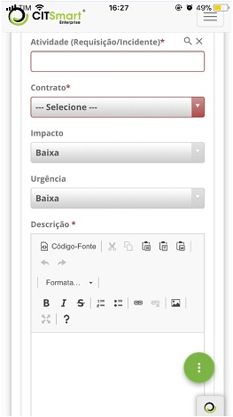
    
    **Figura 15 - Tela de cadastro de nova solicitação (continuação)**

    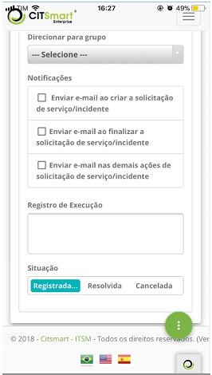
    
    **Figura 16 - Tela de cadastro de nova solicitação (continuação)**

1.  Preencha os campos conforme orientações abaixo:

    -   **Solicitante**: informe o nome do solicitante, ou seja, o nome da pessoa
    que está solicitando a abertura de incidente ou requisição de serviço;

    !!! info "IMPORTANTE"

        Ao informar o solicitante é mostrado um resumo estatístico dos chamados dele
        (por situação), bem como um outro resumo estatístico de satisfação (por tipo de
        resposta) dos serviços já solicitados por ele. Por uma questão de desempenho e
        de preservação do layout da tela, esses dois resumos são paginados, ou seja, é
        possível avançar/retroceder para visualizar todas as informações.

    -   **Telefone**: informe o número de telefone do solicitante;

    -   **Ramal**: informe o número do ramal do solicitante, caso o tenha;

    -   **E-mail**: informe o e-mail do solicitante;

    -   **Origem do contato**: informe a origem do contato para registro da
    solicitação do serviço;

    -   **Unidade**: selecione a unidade na qual o solicitante está lotado;

    -   **Localidade Física**: informe a localização do solicitante;

    -   **Outras Informações**: descreva as observações sobre o solicitante, se
    achar necessário.

1.  Registre as informações da solicitação de serviço:

    -   **Catálogo**: selecione o catálogo de serviços;

    -   **Serviço**: informe o serviço referente ao catálogo de serviços
    selecionado. Se o catálogo de serviços for "**Negócio**", serão
    disponibilizados neste campo os serviços de negócio para seleção, mas se o
    catálogo de serviços for "**Técnico**", serão disponibilizados neste campo
    os serviços de apoio/técnico para seleção;

    -   **Tipo**: selecione o tipo da solicitação, se é uma abertura de incidente ou
    requisição de serviço:

       -   **Incidente**:** **caso a situação apresentada seja uma interrupção não
        planejada, uma redução na qualidade do serviço ou falha de algum item de
        configuração que ainda não tenha impactado um serviço de TI. Ex.: O link
        de rede está fora, a rede está lenta, o servidor inacessível, etc.;

       -   **Requisição**: refere-se aos pedidos de demandas realizados pelos
        usuários dentro do ambiente da Tecnologia da Informação. Podem ser desde
        pedidos de acesso até sugestões de melhoria a baixo custo. Ex.: pedido
        de acesso à rede para um novo usuário, solicitação de configuração de
        algum equipamento, requisição para adicionar algum software na estação
        de trabalho, etc.

    -   **Categoria**: informe a categoria de serviço para facilitar a busca da
    atividade (requisição/incidente). A categoria irá identificar a natureza da
    atividade, posicionando-o dentro de grupos semelhantes de atuação,
    situando-o na hierarquia de sua categoria;

    -   **Atividade (Requisição/Incidente)**: informe a atividade que será realizada
    referente ao tipo de solicitação. Caso a atividade informada tenha um
    “Script de Orientação” associado, o mesmo será exibido na guia de "Scripts"
    representada pelo ícone localizado no canto superior direito da tela;

    -   **Contrato**: após informar a atividade (requisição/incidente), será exibido
    o contrato para o qual será feita a abertura de incidente ou requisição de
    serviço;

    -   **Urgência**: após informar a atividade (requisição/incidente), será exibida
    a informação da urgência a qual indica a velocidade na qual o serviço
    precisa ser realizado;

    -   **Impacto**: após informar a atividade (requisição/incidente), será exibida
    a informação de impacto do serviço ao negócio;

    !!! note "NOTA"

        Após informar a atividade de requisição/incidente, será estabelecido o
        tempo previsto para atendimento da solicitação, conforme configurado no
        registro do tempo de atendimento vinculado à atividade. O tempo de
        atendimento será contabilizado de acordo com o que foi definido no
        calendário vinculado à unidade, mas caso a unidade não tenha um calendário
        vinculado, será contabilizado de acordo com o calendário vinculado ao
        serviço. Porém, ao encerrar o tempo previsto de atendimento é contabilizado
        o atraso em tempo corrido, sendo desconsiderado o calendário.

    -   **Título**: informe o título da solicitação de serviço;

    -   **Descrição**: informe a descrição da solicitação de serviço. A descrição
    deve ser objetiva, incluindo toda informação necessária para o atendimento
    da mesma;

    -   **Direcionar para grupo**: informe o grupo para o qual será direcionada a
    solicitação de serviço. Caso não informe o grupo, a solicitação será
    direcionada para o grupo definido no fluxo de requisição/incidente. Se não
    estiver definido o grupo no fluxo, a solicitação será direcionada para o
    grupo definido no registro do vínculo da atividade de requisição/incidente
    ao contrato. Mas se o grupo não estiver definido no registro do vínculo da
    atividade ao contrato, a solicitação será direcionada para o grupo definido
    no parâmetro "**ID Grupo Nível 1**";

    -   **Notificações**:** **marque as opções de envio de notificação sobre a
    solicitação para serem enviadas ao solicitante;

    -   **Registro de Execução**: não é necessário o preenchimento deste campo, pois
    o mesmo é indicado para o técnico que irá atender à solicitação, descrever
    sobre a execução de sua atividade.

    -   **Situação**: selecione a opção que se encaixa com o atual estado da
    solicitação: **Registrada/Em andamento**.

### Aprovando/rejeitando solicitação de serviço

Algumas solicitações necessitam de aprovação, portanto, para atendê-las é
necessário aprová-las.

1.  Selecione a solicitação que é passível de aprovação;

2.  Será apresentada a tela de “Detalhes” exibindo a descrição da solicitação
    para aprovação/rejeição da mesma;

    
    
    **Figura 17 - Tela de Aprovação/Rejeição de Solicitação**

1.  Para aprovar a solicitação, basta pressionar o botão *Aprovada*;

2.  Para rejeitar a solicitação, pressione o botão *Não aprovada*. Será exibida
    uma tela para escolha da justificativa desta rejeição, conforme apresentada
    na figura abaixo:

    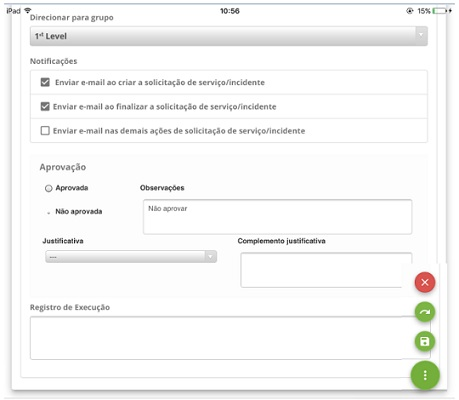
    
    **Figura 18 - Tela justificava de rejeição da solicitação**

-   Escolha a justificava da rejeição/aprovação da solicitação e pressione o
    botão  *Gravar e avançar o fluxo*.

!!! tip "About"

    <b>Product/Version:</b> CITSmart | 8.00 &nbsp;&nbsp;
    <b>Updated:</b>07/22/2019 – Anna Martins
