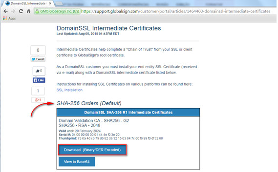
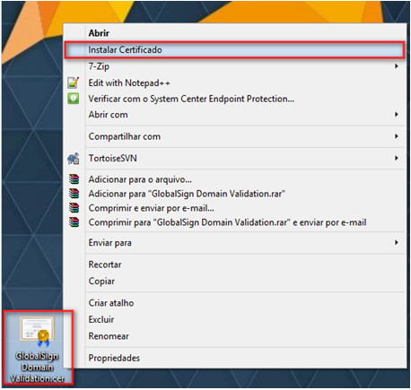
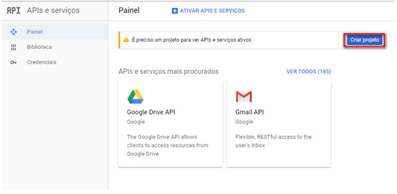
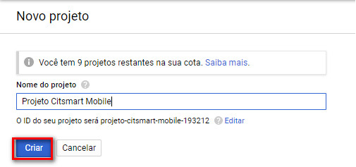
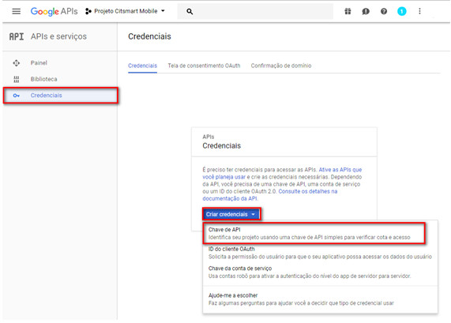
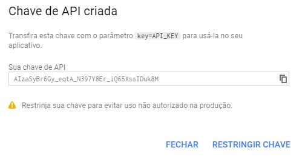
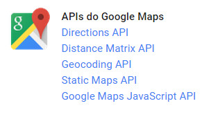
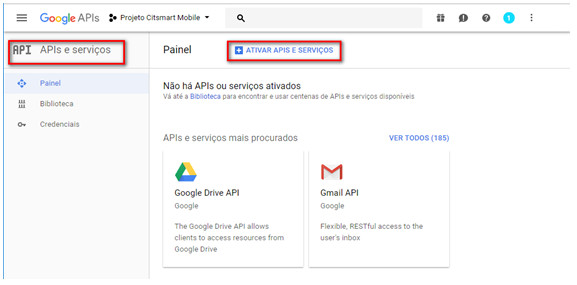
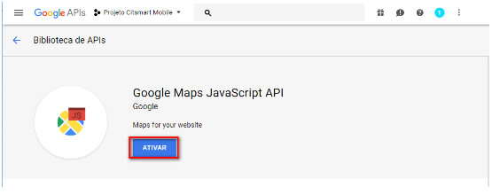

title: Manual de confirguraçãodo servidor CITSmart ENterprise ITSM para uso de APPs (iOS e Android)

Description:Este documento tem o propósito de fornecer orientações necessárias para
configurar o servidor para o uso adequado do CITSmart ITSM Enterprise na
plataforma iOS e Android.

# Manual de confirguraçãodo servidor CITSmart Enterprise ITSM para uso de APPs (iOS e Android)

Este documento tem o propósito de fornecer orientações necessárias para
configurar o servidor para o uso adequado do CITSmart ITSM Enterprise na
plataforma iOS e Android.

## Procedimentos válidos para iOS e Android

Pré-condições
------------

1.  Implantar a versão 7.2.2.0 (ou superior) do **CITSmart Enterprise ITSM**.

2.  Configurar o parâmetro 257 - Tamanho de página para retorno nos serviços
    REST paginados: definir a quantidade de registros retornado em serviços de
    listagem consumidos pelo Mobile (Padrão: 10) (ver conhecimento [Configurar
    parametrização -
    Mobile]();

3.  Configurar o parâmetro 272 - Determina se serão notificados somente
    solicitações sem responsável no CITSmart ITSM Enterprise :

    -   Valores: "S" ou "N" Default: "N"

    -   Caso o valor do parâmetro seja “S”, poderão ser mostradas somente as
        notificações de solicitações sem responsável atual.

    -   Caso o valor do parâmetro seja “N”, poderão ser mostradas as
        notificações de todas as solicitações;

4.  Configurar o parâmetro 255 - Raio de Ação/Visualização do atendente no
    Mobile: definir o raio de ação de um atendente (Padrão: 30);

5.  Configurar o parâmetro 256 - Intervalo (em minutos) de tempo para reporte de
    posição do Atendente: definir o intervalo que o aplicativo Mobile deve
    reportar ao servidor o posicionamento geográfico do atendente (Padrão:10);

6.  Configurar o parâmetro 258 – Intervalo máximo de dias para consulta (Padrão:
    30);

7.  Configurar o parâmetro 267 – Tamanho de página para retorno nos serviços
    REST V1 mobile (Padrão: 200);

8.  Configurar o parâmetro 284 - ID do contrato padrão para a criação de novos
    incidentes/requisições no CITSmart Enterprise Mobile: informar o ID do
    contrato para realizar a abertura de solicitações de serviço;

9.  Configurar o parâmetro 285 - ID do serviço padrão para solicitações de
    serviços e incidentes criados no CITSmart Enterprise Mobile: informar o ID
    do serviço que será padrão para registro de solicitações de serviços;

10. Configurar o parâmetro 286 - ID de origem padrão para as solicitações de
    serviço e incidentes criados no CITSmart Enterprise Mobile: informar o ID da
    origem padrão para abertura de solicitação de serviço.

11. Configurar o parâmetro 350 – Habilita o envio de notificações para celulares
    (Sem default).

12. Configurar o parâmetro 254 - API Key para uso de serviços Google: informar a
    API key (chave) para utilizar os serviços MAPS da Google (ver
    conhecimento [Configurar parametrização -
    sistema]().

Configurando os web services
---------------------------

A configuração dos Web services são fundamentais para o acesso a todas as
funcionalidades do aplicativo. Siga os passos para melhor configurá-lo:

1.  No CITSmart Enterprise (Web), acesse a funcionalidade de Web Services
    referente ao mobile (Sistema > Configurações > Web Services Citsmart
    Mobile);

2.  Clique na aba “Vincular Grupos” e vincule o grupo executor de atividades aos
    Web Services do CITSmart ITSM Mobile.

**No momento que o grupo for selecionado ele será vinculado a todos os Web
Services do CITSmart ITSM Enterprise de forma automatizada.**

Instalação do certificado intermediário globalsign

Para reconhecer o certificado intermediário da GlobalSign (Emissora do
Certificado Digital) é necessário a instalação do mesmo. Segue os procedimentos
abaixo:

1.  Acesso o
    endereço: <https://support.globalsign.com/customer/portal/articles/1464460-domainssl-intermediate-certificates>;

2.  Realize o download do primeiro certificado, conforme indicado na figura
    abaixo:

    
    
    **Figura 1 - Certificado intermediário da GlobalSign**

1.  No mobile: informar o nome genérico (sugestão: GlobalSign) e clicar em
    avançar.

2.  No desktop: clicar com botão direito no certificado baixado (conforme figura
    abaixo), clicar em instalar certificado e avançar até concluir.

    
    
    **Figura 2 - Instalação do certificado no Windows**

1.  Depois de instalado, basta alterar o endereço do aplicativo para suas
    necessidades (exemplo:
    “[https://citsmart.empresa.com.br/citsmart](https://citsmart.centralit.com.br/citsmart)”).

Procedimentos válidos somente para Android
----------------------------------------

### Instalação do app Android

1.  Acesse o Google Play (Play Store) para abaixar o aplicativo CITSmart
    Enterprise Mobile;

2.  Pesquise por CITSmart Enterprise e após a pesquisa, selecione o aplicativo;

3.  Pressione o botão *Instalar* para baixar o aplicativo.

### Criando chave para uso e consumo das APIs Google

Para que seja possível o uso e consumo das APIs Google é necessário que uma API
Key seja criada. Para isso, os seguintes passos devem ser seguidos:

Para realizar esses procedimentos é necessário estar logado com uma conta
Google.

1.  Acesse o console do desenvolvedor
    Google [https://console.developers.google.com](https://console.developers.google.com/);

2.  Clique em Criar um projeto, conforme indicado na figura abaixo:

    
    
    **Figura 3 - Console do desenvolvedor Google**

1.  Será apresentada uma janela, conforme ilustrada na figura abaixo, para
    informar os dados do novo projeto;

    
    
    **Figura 4 - Tela de criação de projeto**

1.  Informe o nome do projeto e clique no botão Criar para criação do projeto.

2.  Após criar o projeto, clique em APIs e serviços. Para criar a API Key,
    clique em APIs e serviços > Credenciais > Criar credenciais > Chave de API,
    conforme indicado na figura abaixo:

    
    
    **Figura 5 - Tela de criação de API Key**

1.  Feito isso, a chave de API será apresentada:

    
    
    **Figura 6 - Tela de opções de API Key para criação**

1.  Escolha a opção que melhor lhe atenda. Para mais informações sobre qual
    chave irá lhe atender,
    acesse <https://developers.google.com/console/help/new/#generatingdevkeys>.

2.  Após as chaves criadas, as APIs já poderão ser consumidas.

APIs a serem utilizadas nas soluções
-----------------------------------

Segue abaixo as APIs do Google a serem consideradas nas soluções:

 
    
**Figura 7 - APIs**

-   **Directions API**: a API de direções do Google é consumida através de
    requisições HTTP. Tal API calcula direções entre dois pontos informados, a
    origem e o destino, possuindo outras diversas opções. Para maiores
    informações sobre o uso dessa API,
    acesse: <https://developers.google.com/maps/documentation/directions>.

-   **Distance Matrix API**: a API Google Distance Matrix permite a recuperação
    de matrizes de distâncias entre dois pontos, ou seja, retorna também
    resultado aproximados. A diferença para a Google Directions API é que a
    Distance Matrix não retorna informações tão detalhadas, como os passos a
    serem realizados. Para maiores informações sobre o uso dessa API,
    acesse: <https://developers.google.com/maps/documentation/distancematrix>.

-   **Geocoding API**: a Google geocoding API é uma API que ajuda a recuperar
    posições geográficas enviando como argumento um endereço por extenso. O
    consume da API é feito por HTTP e os resultados podem ser obtidos em XML ou
    JSON. Para maiores informações sobre o uso dessa API,
    acesse: <https://developers.google.com/maps/documentation/geocoding>.

-   **Statics Maps API**: a API para mapas estáticos do Google será utilizada em
    casos que não será necessário a interação como mapa, apenas visualização. É
    interessante seu uso uma vez que é mais leve, visto que não é necessário o
    download de recurso JS e imagens que não serão utilizadas. Para maiores
    informações sobre o uso dessa API,
    acesse: <https://developers.google.com/maps/documentation/staticmaps>.

-   **Google Maps JavaScript API**: o uso da API é feito por meio de uma API JS.
    Para seu uso, basta linkar o JS na página que irá usar o maps. Para maiores
    informações sobre o uso dessa API,
    acesse: <https://developers.google.com/maps/documentation/javascript>.

Ativando uma API
---------------

Para ativar uma API para uso, proceda conforme os passos descritos abaixo:

1.  Após de executar os passos descritos na seção "Criando chave para uso e
    consumo das APIs Google";

2.  Clique em APIs e serviços > Ativar APIs e serviços , conforme indicado na
    figura abaixo:

    
    
    **Figura 8 - APIs Google**

1.  Será apresentada a biblioteca de APIs. Selecione a API que deseja ativar ( a
    figura abaixo representa um exemplo de API) e clique no botão Ativar API
    conforme indicado na figura abaixo:

    
    
    **Figura 9 - Ativação da APIs Google**

1.  Feito isso, a API estará habilitada para uso.

Utilizando o aplicativo
----------------------

[Manual do usuário do aplicativo mobile CITSmart Enterprise ITSM (Android)]()

[Manual do usuário do aplicativo mobile CITSmart Enterprise ITSM (Android)]()

!!! tip "About"

    <b>Product/Version:</b> CITSmart | 8.00 &nbsp;&nbsp;
    <b>Updated:</b>07/22/2019 – Anna Martins

