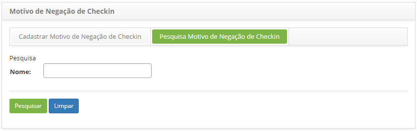
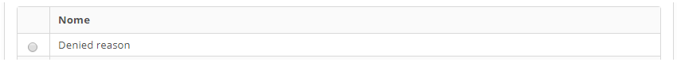
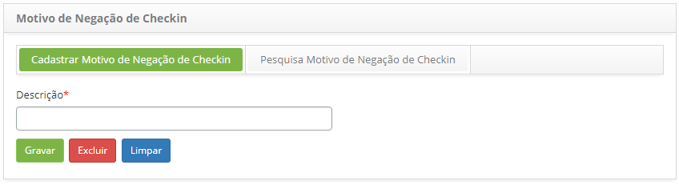

title: Cadastro e pesquisa de motive de negação do check in

Description: Esta funcionalidade permite registrar o motivo de negação do check
in o qual será utilizado ao realizar o check in através do aplicativo CITSmart
Enterprise ITSM Mobile.

# Cadastro e pesquisa de motive de negação do check in

Esta funcionalidade permite registrar o motivo de negação do check in o qual
será utilizado ao realizar o check in através do aplicativo CITSmart Enterprise
ITSM Mobile.

Como acessar
-----------

1.  Acesse a funcionalidade de Motivo de Negação do Check in através da
    navegação no menu principal **Gestão Integrada > Gerência de Força de
    Atendimento > Cadastro de Motivo de Negação de Check in**.

Pré-condições
------------

1.  Não se aplica.

Filtros
-------

1.  O seguinte filtro possibilita ao usuário restringir a participação de itens
    na listagem padrão da funcionalidade, facilitando a localização dos itens
    desejados:

-   Nome.

    
    
    **Figura 1 - Tela de pesquisa de motivo de negação do check in**

1.  Realize a pesquisa de motivo de negação de check in;

-   Informe o nome do motivo de negação do check in que deseja pesquisar e
    clique no botão *Pesquisar*. Após isso, será exibido o registro conforme o
    nome informado;

-   Caso deseje listar todos os registros, basta clicar diretamente no
    botão *Pesquisar*.

Listagem de itens
----------------

1.  O seguinte campo cadastral está disponível ao usuário para facilitar a
    identificação dos itens desejados na listagem padrão da
    funcionalidade:** Nome.**

    
    
    **Figura 2 - Tela de listagem de motivo de negação de check in**

1.  Após a pesquisa, selecione o registro desejado. Feito isso, será direcionado
    para a aba de cadastro exibindo o conteúdo referente ao registro
    selecionado;

2.  Para alterar os dados do motivo de negação de check in, basta modificar as
    informações desejadas e clicar no botão *Gravar*.

Preenchimento dos campos cadastrais
---------------------------------

1.  Será apresentada a tela de **Cadastro de Motivo de Negação de check in**,
    conforme ilustrada na figura abaixo:

    

    **Figura 3 - Tela de cadastro de motivo de negação do check in**

1.  Informe a descrição do motivo de negação do check in;

2.  Clique no botão *Gravar* para efetuar o registro, onde a data, hora e
    usuário serão gravados automaticamente para uma futura auditoria.

!!! tip "About"

    <b>Product/Version:</b> CITSmart | 8.00 &nbsp;&nbsp;
    <b>Updated:</b>07/22/2019 – Anna Martins
