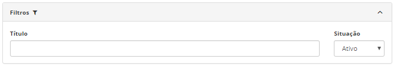
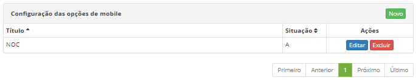
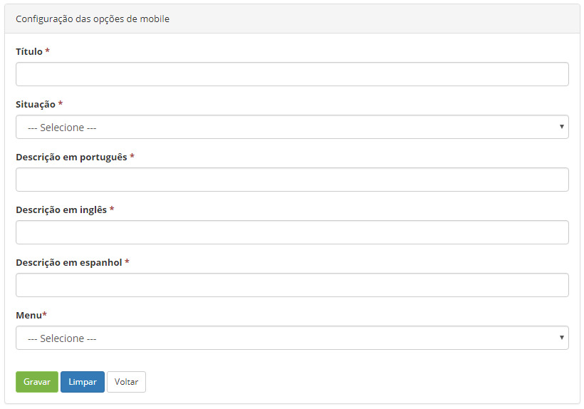
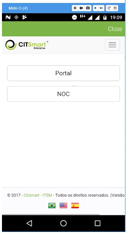

title: Cadastro e pesquisa das configurações das opções de mobile
Description:Esta funcionalidade tem por objetivo a configuração das opções de Menu para o uso via mobile.

# Cadastro e pesquisa das configurações das opções de mobile

Esta funcionalidade tem por objetivo a configuração das opções de Menu para o
uso via mobile.

Como acessar
-----------

1.  Acesse a funcionalidade pela navegação no menu principal **Acesso e
    permissão > Configuração das opções mobile**.

Pré-condições
------------

1.  Ter o aplicativo CITSmart Enterprise ITSM Mobile instalado no dispositivo
    mobile (ver conhecimento [Manual do usuário do aplicativo mobile CITSmart
    ITSM Enterprise (iOS)][1], [Manual do usuário do aplicativo mobile CITSmart Enterprise ITSM
    (Android)][2]);

Filtros
------

1.  Os seguintes filtros possibilitam ao usuário restringir a participação de
    itens na listagem padrão da funcionalidade, facilitando a localização dos
    itens desejados:

    -   Título;

    -   Situação.

1.  Na tela inicial da funcionalidade **Configuração das opções de mobile**, é
    possível realizar a pesquisa de configuração das opções de mobile:

    -   Informe o nome e a situação da configuração que deseja pesquisar.

    
    
    **Figura 1 - Tela de pesquisa de configuração das opções de mobile**

Listagem de itens
-----------------

1.  Os seguintes campos cadastrais estão disponíveis ao usuário para facilitar a
    identificação dos itens desejados na listagem padrão da
    funcionalidade: **Título e Situação**.

2.  Existem botões de ação disponíveis ao usuário em relação a cada item da
    listagem, são eles: *Editar* e *Excluir*.

    
    
    **Figura 2 - Tela de listagem de configuração das opções de mobile**

1.  Para alterar os dados do registro de configuração das opções de mobile,
    basta modificar as informações dos campos desejados e clicar no
    botão *Gravar* para que seja gravada a alteração realizada no registro, onde
    a data, hora e usuário serão gravados automaticamente para uma futura
    auditoria.

Preenchimento dos campos cadastrais
---------------------------------

1.  Ao acessar a tela de Configuração das opções de mobile clique no
    botão *Novo* (conforme ilustrado na figura 2), será então apresentada a tela
    abaixo:

    
    
    **Figura 3 - Tela de configuração de mobile**

1.  Preencha os campos:

-   **Título**: preencher com o nome da prática a ser utilizada (ex: NOC);

-   **Situação**: selecionar opção "Ativo";

-   **Descrição em português**: título da opção de Menu a ser utilizado na
    língua portuguesa no mobile;

-   **Descrição em inglês**: título da opção de Menu a ser utilizado na língua
    inglesa;

-   **Descrição em espanhol**: título da opção de Menu a ser utilizado na língua
    espanhola;

-   **Menu**: selecione a opção que melhor a se ajusta à funcionalidade
    desejada.

Verificando o portal de serviços no mobile
-----------------------------------------

1.  Uma vez já feito a configuração via sistema (seção anterior), a seguinte
    tela será apresentada no mobile:

   
   
   **Figura 4 - Portal de serviços no mobile**

!!! tip "About"

    <b>Product/Version:</b> CITSmart | 8.00 &nbsp;&nbsp;
    <b>Updated:</b>07/22/2019 – Anna Martins
    
[1]:/pt-br/citsmart-platform-7/additional-features/mobile-and-field-service/apps/ios.html

[2]:/pt-br/citsmart-platform-7/additional-features/mobile-and-field-service/apps/android.html
