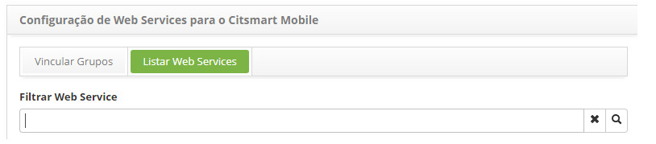
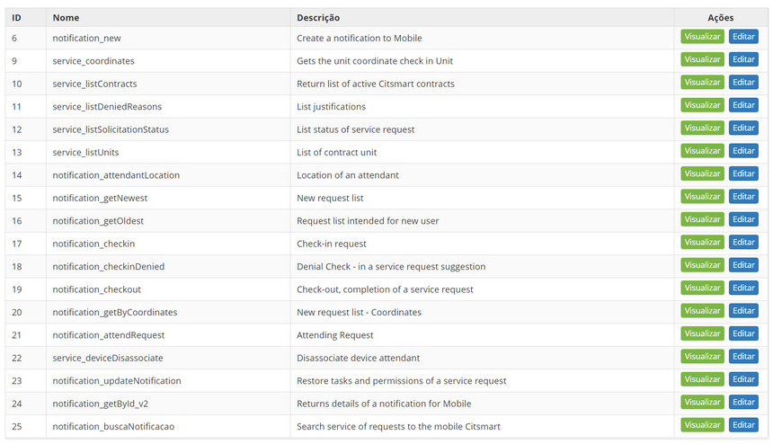
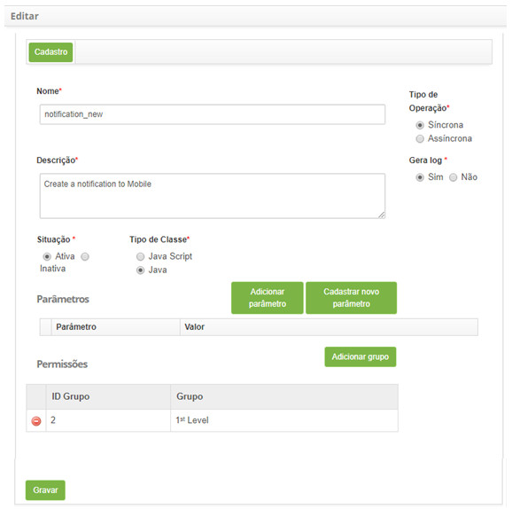
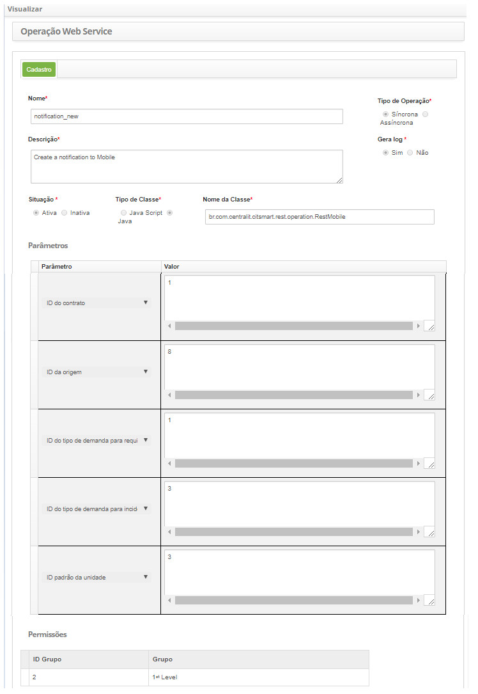
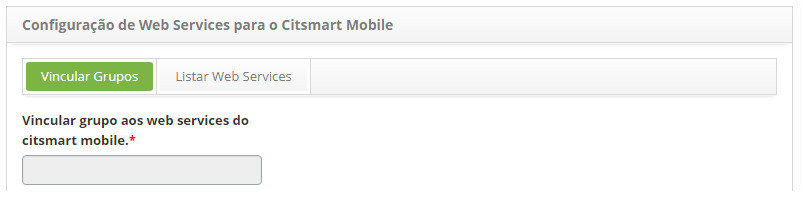

title:  Cadastro e pesquisa de web services do CITSmart Enterprise ITSM Mobile
Description: Tem por objetivo vincular os grupos executores de solicitações aos Web Services do Citsmart Mobile. 
# Cadastro e pesquisa de web services do CITSmart Enterprise ITSM Mobile

Esta funcionalidade tem por objetivo vincular os grupos executores de solicitações aos Web Services do Citsmart Mobile para ter acesso às funcionalidades do 
Mobile.

Como acessar
--------------

1. Acesse a funcionalidade de web services do CITsmart mobile através da navegação no menu principal 
**Sistema > Configurações > Web Services CITSmart Mobile**.

Pré-condições
----------------

1. Não se aplica.

Filtros
-----------

1. O seguinte filtro possibilita ao usuário restringir a participação de itens na listagem padrão da funcionalidade, facilitando a 
localização dos itens desejados:

    
    
    **Figura 1 - Tela de pesquisa de web service para CITSmart mobile**
    
Listagem de itens
--------------------

1. Os seguintes campos cadastrais estão disponíveis ao usuário para facilitar a identificação dos itens desejados na listagem padrão 
da funcionalidade: **ID, Nome** e **Descrição**.

2. Existem botões de ação disponíveis ao usuário em relação a cada item da listagem, são eles: "Visualizar" e "Editar".

**Figura 2 - Tela de listagem de web service para CITSmart mobile**

Preenchmento dos campos cadastrais
--------------------------------------

1. Ao acessar a funcionalidade, será apresentada a tela **Configuração de Web Services para o CITSmart Mobile**, contendo duas abas;

2. Na aba **Listar Web Services** são apresentados os web services;

3. Para editar os dados do Web Service, clique no botão "Editar", conforme a figura abaixo:

**Figura 3 - Tela de cadastro de web service para CITSmart mobile**

Visualizando as configurações de web service para o CITSmart Mobile
---------------------------------------------------------------------

1. Para visualizar as informações do Web Service, clique no botão "Visualizar". Ao selecionar essa opção, será aberta a aba de 
Cadastro do Web Service para a observação de suas informações, não permitindo a alteração do mesmo, conforme a figura abaixo:

**Figura 4 - Visualização de configuração de web services do CITSmart mobile**

Realizando a configuração de grupo de web services
------------------------------------------------------

1. A aba Vincular Grupos permite vincular os grupos aos web services e outra que apresenta os web services do CITSmart Mobile, 
conforme ilustrado na figura abaixo:

    
    
    **Figura 5 - Tela de configuração de web services do CITSmart mobile**
    
2. Na aba **Vincular Grupos**, vincule o grupo executor de atividades aos Web Services do CITSmart Mobile;

3. Selecione o grupo desejado. Após isso, o grupo será vinculado aos Web Services do CITSmart Mobile;

4. Caso queira remover o vínculo do grupo com os web services, basta clicar no ícone .

!!! warning "ATENÇÃO"

    No momento em que o grupo for selecionado, será vinculado a todos os Web Services do CITSmart Mobile de forma automatizada.
    
!!! tip "About"

    <b>Product/Version:</b> CITSmart | 7.00 &nbsp;&nbsp;
    <b>Updated:</b>08/05/2019 - Larissa Lourenço

