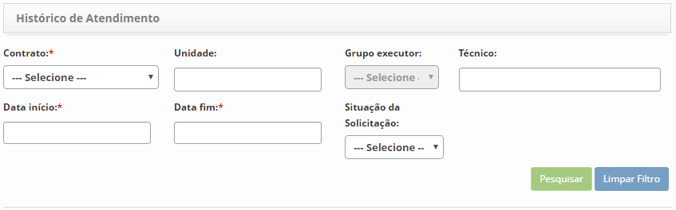
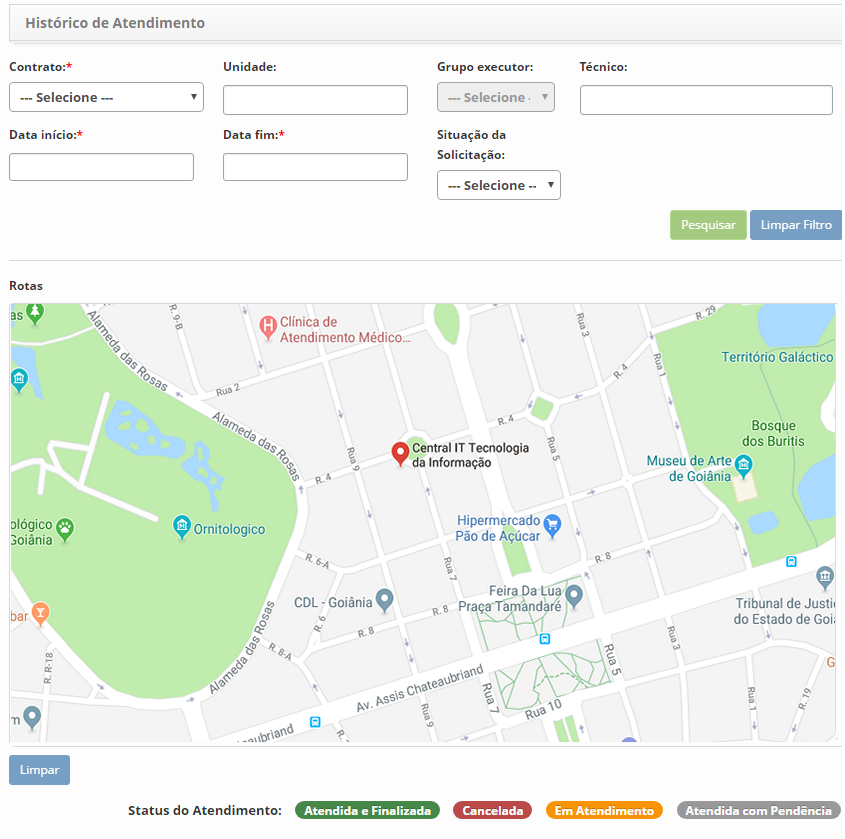
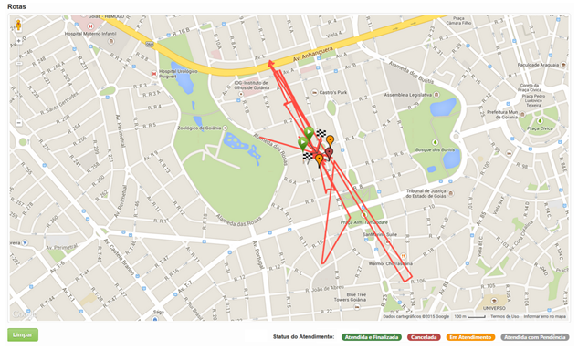

title: Verificação do histórico de atendimento
Description: Esta funcionalidade tem por objetivo verificar o histórico de atendimento das solicitações de serviços feito pelos técnicos de campo.

# Verificação do histórico de atendimento

Esta funcionalidade tem por objetivo verificar o histórico de atendimento das
solicitações de serviços feito pelos técnicos de campo.

Como acessar
-----------

1.  Acesse a funcionalidade de Histórico de Atendimento através da navegação no
    menu principal **Gestão Integrada > Gerência de Força de
    Atendimento > Histórico de Atendimento**.

Pré-condições
------------

1.  Configurar a conexão do sistema com as API's do Google (ver
    conhecimento [Manual de configuração do servidor para uso do CITSmart ITSM
    Enterprise (iOS e Android)] - seções 5 a 7).

Filtros
-------

1.  Os seguintes filtros possibilitam ao usuário restringir a participação de
    itens na listagem padrão da funcionalidade, facilitando a localização dos
    itens desejados:

    -   Contrato;

    -   Unidade;

    -   Grupo executor;

    -   Técnico;

    -   Data início;

    -   Data fim;

    -   Situação da solicitação;

    

    **Figura 1 - Tela de pesquisa de histórico de atendimento**

Listagem de itens
-----------------

1.  Não se aplica.

Preenchimento dos campos cadastrais
-----------------------------------

1.  Não se aplica.

Verificando o histórico de atendimento
-------------------------------------

1.  Será apresentada a tela de Verificação do Histórico de Atendimento, conforme
    ilustrada na figura a seguir. Nesta tela, poderá visualizar o histórico de
    atendimento de solicitação de serviço feito pelo(s) técnico(s) de campo, de
    acordo com os filtros informados:

    
    
    **Figura 2 - Tela de histórico de atendimento**

2.  Defina os filtros de acordo com sua necessidade:

   -  **Estado**: informar o estado das solicitações de serviços que deseja
    verificar o histórico de seu atendimento pelo(s) técnico(s) de campo;

   -  **Cidades**: informar a cidade referente às solicitações de serviços que
    deseja verificar o histórico de seu atendimento pelo(s) técnico(s) de campo;

   -  **Contrato**: informar o contrato referente às solicitações de serviços que
    deseja verificar o histórico de seu atendimento pelo(s) técnico(s) de campo;

   -  **Unidade**: informar a unidade referente às solicitações de serviços que
    deseja verificar o histórico de seu atendimento pelo(s) técnico(s) de campo;

   -  **Grupo Executor**: informar o grupo executor de solicitações de serviços
    para verificar o atendimento;

   -  **Técnico**: informar o técnico para verificar o histórico de atendimento
    das solicitações de serviços;

   !!! note "NOTA"

       Ao selecionar o técnico, serão apresentadas as solicitações de serviços
       que o mesmo atendeu e que faz referência ao(s) contrato(s) que ele pertence.

   -  **Data início**: informar a data inicial que faz referência ao dia
    trabalhado do técnico;

   -  **Data fim**: informar a data final que faz referência ao dia trabalhado do
    técnico;

   -  **Situação da Solicitação**: selecionar a situação de atendimento da
   solicitação de serviço.

3.  Após os filtros definido, clique no botão *Pesquisar*. Feito isso, serão
    exibidos no mapa o histórico de atendimento das solicitações de serviço pelo
    técnico de campo, conforme exemplo ilustrado na figura a seguir:

   
   
   **Figura 3 - Histórico de atendimento de solicitações de serviço pelo
    técnico de campo**

!!! tip "About"

    <b>Product/Version:</b> CITSmart | 8.00 &nbsp;&nbsp;
    <b>Updated:</b>07/22/2019 – Anna Martins
