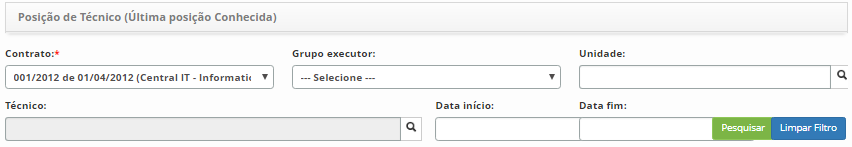
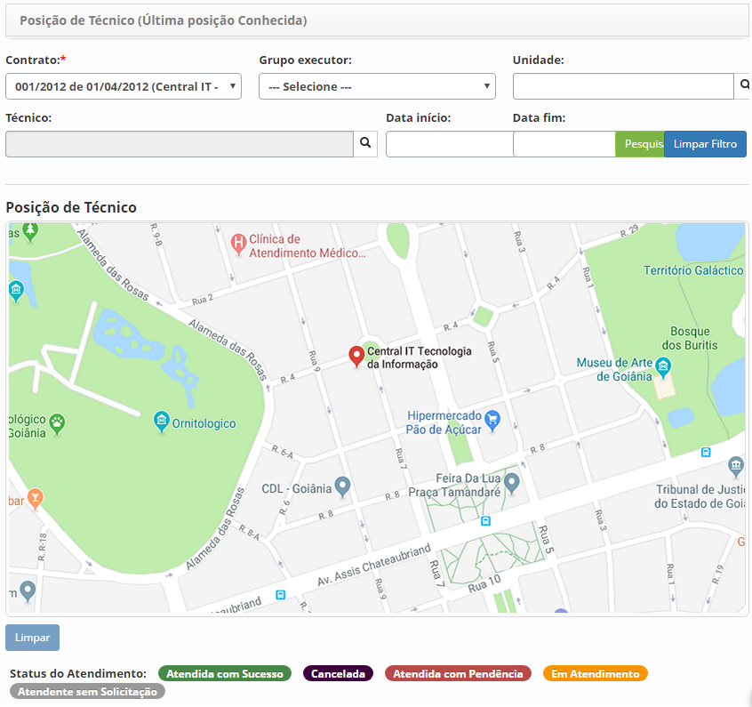
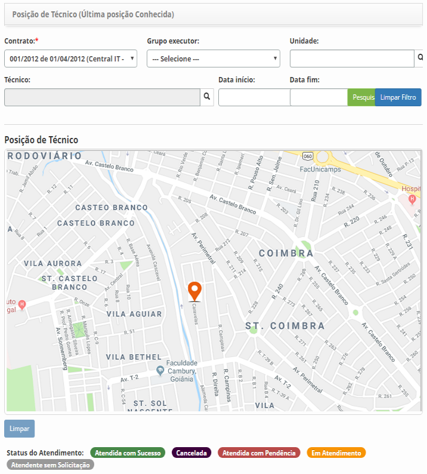

title: Verificação do posicionamento dos atendentes

Description: Esta funcionalidade tem por objetivo verificar o posicionamento dos técnicos, ou seja, a localização atual dos técnicos de campo, responsáveis pelo atendimento das solicitações de serviço.

# Verificação do posicionamento dos atendentes

Esta funcionalidade tem por objetivo verificar o posicionamento dos técnicos, ou
seja, a localização atual dos técnicos de campo, responsáveis pelo atendimento
das solicitações de serviço.

Como acessar
-----------

1.  Acesse a funcionalidade de Posicionamento dos Atendentes através da
    navegação no menu principal **Gestão Integrada > Gerência de Força de
    Atendimento > Posicionamento dos Atendentes**.

Pré-condições
------------

1.  Configurar a conexão do sistema com as API's do Google (ver
    conhecimento [Manual de configuração do servidor para uso do CITSmart ITSM
    Enterprise (iOS e Android)][1]).

Filtros
------

1.  Os seguintes filtros possibilitam ao usuário restringir a participação de
    itens na listagem padrão da funcionalidade, facilitando a localização dos
    itens desejados:

    -   Contrato;

    -   Grupo executor;

    -   Unidade;

    -   Técnico;

    -   Data início;

    -   Data fim.

    

    **Figura 1 - Tela de filtro de posição de técnico**

Listagem de itens
----------------

1.  Não se aplica.

Preenchimento dos campos cadastrais
----------------------------------

1.  Não se aplica.

Verificando o posicionamento dos atendentes
------------------------------------------

1.  Será apresentada a tela de **Verificação da Posição do Técnico**, conforme
    ilustrada na figura a seguir. Nesta tela, poderá visualizar a localização
    do(s) técnico(s) no mapa, de acordo com os filtros informados;

    
    
    **Figura 2 - Tela de posicionamento dos técnicos**

2.  Defina os filtros conforme sua necessidade:

    -   **Contrato**: informar o contrato do técnico para verificar sua localização;

    -   **Grupo Executor**: informar o grupo executor ao qual o técnico pertence
    para verificar sua localização;

    -   **Unidade**: informar a unidade do técnico para verificar sua localização;

    -   **Técnico**: informar o técnico que deseja verificar sua localização no
    mapa;

    -   **Data início**: informar a data inicial do atendimento da solicitação de
    serviço;

    -   **Data fim**: informar a data final do atendimento da solicitação de
    serviço.

3.  Após os filtros definidos, clique no botão *Pesquisar*. Feito isso, serão
    exibidos no mapa os pontos de localização dos técnicos, conforme exemplo
    ilustrado na figura abaixo:

    
    
    **Figura 3 - Visualização do posicionamento (localização) dos técnicos de
    campo**

4.  Clique no ponto de localização do técnico para verificar as informações
    referentes ao atendimento da solicitação de serviço.

!!! tip "About"

    <b>Product/Version:</b> CITSmart | 8.00 &nbsp;&nbsp;
    <b>Updated:</b>07/22/2019 – Anna Martins
    
[1]:/pt-br/citsmart-platform-7/additional-features/mobile-and-field-service/configuration/app-android-ios.html
