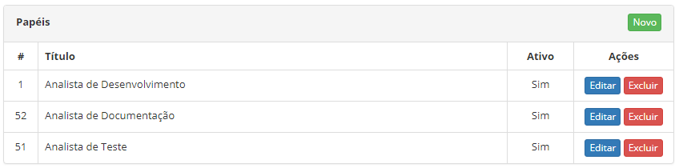
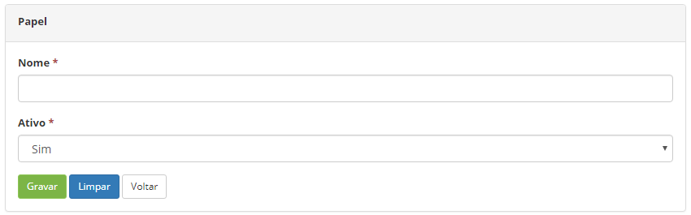

title: Cadastro e pesquisa de papel
Description: Esta funcionalidade tem o objetivo de cadastrar os papéis dos
colaboradores relacionados aos projetos.

# Cadastro e pesquisa de papel

Esta funcionalidade tem o objetivo de cadastrar os papéis dos colaboradores
relacionados aos projetos.

Como acessar
-----------

1.  Acesse a funcionalidade de Cadastro de Papel através da navegação no
    menu principal **Gestão Integrada > Gerência de Projetos > Papel**.

Pré-condições
------------

1.  Não se aplica.

Filtros
-------

1.  Não se aplica.

Listagem de itens
----------------

1.  Os seguintes campos cadastrais estão disponíveis ao usuário para facilitar a
    identificação dos itens desejados na listagem padrão da
    funcionalidade: **Título e Ativo**.

    
    
    **Figura 1 - Tela de listagem de papel**

1.  Existem botões de ação disponíveis ao usuário em relação a cada item da
    listagem, são eles: *Editar* e *Excluir;*

2.  Para alterar os dados do registro de papel, clique no botão *Editar*;

3.  Feito isso, será direcionado para a tela de cadastro exibindo o conteúdo
    referente ao registro selecionado.

Preenchimento dos campos cadastrais
---------------------------------

1.  Será apresentada a tela de **Papel**. Clique no botão *Novo* (conforme
    ilustrado na figura anterior);

2.  Feito isso, será apresentada a tela de **Cadastro de Papel**, conforme
    ilustrada na figura a seguir:

    
    
    **Figura 2 - Tela de cadastro de papel**

1.  Preencha os campos conforme orientações abaixo:

    -   **Nome**: informe o nome do papel;

    -   **Ativo**: informe a situação do papel.

1.  Após os dados informados, clique no botão *Gravar* para efetuar o registro,
    onde a data, hora e usuário serão gravados automaticamente para uma futura
    auditoria.

!!! tip "About"

    <b>Product/Version:</b> CITSmart | 8.00 &nbsp;&nbsp;
    <b>Updated:</b>07/18/2019 – Anna Martins
