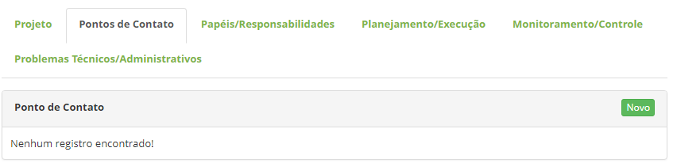
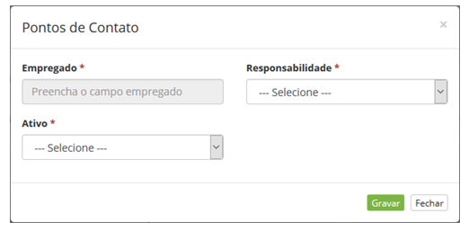
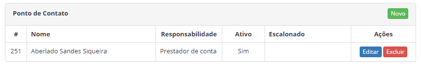

title: Cadastro e gerenciamento de projetos
Description: O Projeto é um processo único, consistindo de um grupo de tarefas
coordenadas e controladas com datas para início e término.

# Cadastro e gerenciamento de projetos

O Projeto é um processo único, consistindo de um grupo de tarefas coordenadas e
controladas com datas para início e término, empreendido para alcance de um
objetivo conforme requisitos específicos, incluindo limitações de tempo, custo e
recursos.

Como acessar
----------

1.  Acesse a funcionalidade de **Projeto** através da navegação no menu
    principal **Gestão Integrada > Gerência de Projetos > Projeto**.

Pré-condições
------------

1.  Cadastrar colaborador (ver conhecimento [Cadastro e pesquisa de
    colaborador]();

2.  Cadastrar usuário (ver conhecimento [Cadastro e pesquisa de
    usuário]().

Filtros
-------

1.  Não se aplica.

Listagem de itens
----------------

1.  Os seguintes campos cadastrais estão disponíveis ao usuário para facilitar a
    identificação dos itens desejados na listagem padrão da
    funcionalidade: Título e Processo.

2.  Existem botões de ação disponíveis ao usuário em relação a cada item da
    listagem, são eles: *Editar* e *Excluir*.

**Figura 1 - Tela de projetos**

Preenchimento dos campos cadastrais
----------------------------------

1.  Será apresentada a tela de **Projetos**. Clique no botão *Novo* (segundo a
    figura anterior). Feito isso, é apresentada a tela de Cadastro de Projeto,
    conforme ilustrada na figura a seguir:

     
     
     **Figura 2 - Tela de cadastro de projeto**

1.  Preencha os campos conforme orientações abaixo:

    -   **Nome**: informe o nome do projeto;

    -   **Nome do gestor**: informe o nome do gerente do projeto;

    -   **Processo**: selecione o processo que provê o projeto. Feito isso, será
    exibido um campo para informar o registro referente ao processo que originou
    a criação do projeto.

1.  O botão *Importar modelo*, permite importar um modelo de projeto para
    criação um projeto a partir do mesmo;

2.  Após os dados iniciais do projeto informados, clique no botão *Gravar* para
    efetuar o registro, onde a data, hora e usuário serão gravados
    automaticamente para uma futura auditoria.

Cadastrando informações complementares do projeto
-----------------------------------------------

1.  Após registrar os dados iniciais do projeto, poderá cadastrar as informações
    complementares do mesmo. A figura abaixo ilustra a tela de Projeto, após a
    gravação dos dados iniciais:

**Figura 3 - Tela de gerenciamento de projeto**

Vinculando conhecimentos
----------------------

1.  Vincule um conhecimento ao projeto, caso seja necessário. No registro do
    Projeto, na área de **Conhecimentos**, clique em *Vincular conhecimento*,
    será apresentada a tela de pesquisa de base de conhecimento. Realize a
    pesquisa do conhecimento desejado, selecione o mesmo e clique no
    botão *Enviar* para efetuar o vínculo.

Adicionando documentos
---------------------

1.  Adicione um documento ao projeto, caso seja necessário.

-   No registro do Projeto, na área de **Documentos**, clique em *Novo
    documento*, será apresentada a tela de adição de documentos;

-   Informe os dados do documento, anexe o mesmo e clique no botão *Gravar* para
    efetuar a operação.

Definindo a matriz de comunicação do projeto
------------------------------------------

1.  Na tela de registro do Projeto, clique na aba **Pontos de Contato**. Feito
    isso, será apresentada uma tela conforme ilustrada na figura abaixo:

    
    
    **Figura 4 – Tela de pontos de contato**

1.  Clique no botão *Novo*, será apresentada a tela de cadastro de pontos de
    contato:

    
    
    **Figura 5 - Tela de cadastro de pontos de contato**

1.  Preencha os campos conforme orientações abaixo:

    -   **Empregado**: informe o nome do colaborador que faz parte do projeto;

    -   **Responsabilidade**: selecione a responsabilidade do colaborador dentro do
    projeto;

    -   **Responsável**: pessoa responsável pela execução da tarefa;

    -   **Prestador de conta**: pessoa que responde pela tarefa;

    -   **Consultado**: pessoa que deve ser consultada para auxílio da execução da
    tarefa;

    -   **Informado**: pessoa que deve ser informada sobre o progresso e status da
    tarefa;

    -   **Ativo**: informe se o colaborador está ativo. Caso não esteja, escalone
    outro colaborador.

    !!! info "IMPORTANTE"

        Somente poderá ser escalonado um colaborador que está ativo no projeto.

1.  Após os dados informados, clique em *Gravar* para efetuar o registro. Após
    isso, será exibido o registro na tela de Projeto.

    
    
    **Figura 6 - Tela de cadastro de pontos de contato**

Cadastrando os papéis/responsabilidades
--------------------------------------

1.  Cadastre as pessoas (recursos) que irão executar as tarefas do projeto;

2.  Na tela de registro do Projeto, clique na aba **Papéis/Responsabilidades**,
    será apresentada uma tela conforme ilustrada na figura abaixo:

    
    
    **Figura 7 – Tela de papéis/responsabilidades**

1.  Clique no botão *Vincular novo recurso*, feito isso, será apresentada a tela
    para vínculo dos recursos:

    
    
    **Figura 8 – Tela de cadastro de recursos**

4.  Realize a pesquisa dos usuários os quais são membros do projeto, selecione
    os mesmos e clique no botão *Enviar* para efetuar a operação. Selecione o
    papel dos usuários e clique no botão *Salvar* para efetuar o vínculo.

    !!! note "NOTA"

         É permitido a seleção de vários usuários para o vínculo.

    !!! example "EXEMPLO"

         Para selecionar vários usuários para o vínculo, realize a busca de um
         usuário e selecione-o e logo após busque por outro usuário e selecione-o. E
         depois disso, basta clicar no botão *Enviar*.

         Caso não tenha os papéis registrados, poderá realizar um cadastro a partir
         dessa tela, basta clicar no botão *Papéis*.

5.  Após vincular os recursos, eles serão exibidos na tela de projeto, conforme
    exemplo ilustrado na figura a seguir:

**Figura 9 – Recursos do projeto**

Cadastrando as tarefas
---------------------

1.  Defina as tarefas do projeto a serem realizadas durante o período estimado
    para execução do mesmo. Na tela de registro do Projeto, clique na
    aba **Planejamento/Execução**, será apresentada a tela de planejamento de
    tarefas do projeto:

    
    
    **Figura 10 – Tela de planejamento/execução**

    !!! info "IMPORTANTE"

        Caso queira importar um modelo de tarefa para facilitar o registro das
        tarefas, clique no botão Importar modelo, será exibida a tela de Modelo de
        Tarefa, clique no botão *Aplicar* do modelo desejado. Feito isso, será
        exibido o modelo de tarefa, e caso irá proceder com o modelo, clique no
        botão *Gravar* e confirme a importação do mesmo

1.  Clique no ícone de ações   do projeto. Feito isso, será exibida a tela de
    Cadastro de Tarefa, conforme ilustrada na figura a seguir:

    
    
    **Figura 11 – Tela de cadastro de tarefa**

1.  Preencha os campos conforme orientações abaixo:

    -   **Título**: informe o título da tarefa;

    -   **Descrição**: informe a descrição da tarefa. A descrição deve ser objetiva,
    incluindo a informação necessária para a execução da tarefa;

    -   **Atribuído a**: informe o recurso que irá executar a tarefa.

1.  Realize o **planejamento** da tarefa:

    -   **Início**: informe a data prevista para o início da execução da tarefa.
    Marque o campo no momento da execução da atividade;

    -   **Fim**: informe a data prevista para o final da execução da tarefa;

    -   **Prioridade**: selecione a prioridade da tarefa para execução;

    -   **Tempo estimado (horas)**: informe a quantidade de horas que levará para
    execução da atividade.

1.  Alguns campos da área de “**execução**” são para simples conferência,
    portanto não é necessário o preenchimento dos mesmos:

    -   **Início**: será exibida a data que iniciou a execução da tarefa;

    -   **Fim**: será exibida a data que finalizou a execução da tarefa;

    -   **Status**: informe a situação da tarefa;

    -   **Percentual executado**: será exibido o quanto foi executado da tarefa;

    -   **Tempo gasto (horas)**: serão apresentadas as horas gastas com a tarefa;

2.  Após informar os dados da tarefa, clique no botão *Adicionar tarefa* para
    efetuar a operação;

3.  Após registro da tarefa, caso queira realizar uma edição na mesma, basta
    clicar no ícone   ;

4.  Se for necessário registrar uma sub-tarefa, basta clicar no ícone   da
    tarefa e prosseguir com o registro.

Criando modelo de tarefa
------------------------

1.  Após os registros das tarefas do projeto, caso queira criar um modelo das
    tarefas para ser utilizado posteriormente com intuito de acelerar o processo
    de criação de tarefas, proceda da seguinte forma:

2.  Na tela de Planejamento de Tarefas do Projeto, clique no botão *Criar modelo
    (Tarefa)*. Após isso, será apresentada a tela de Cadastro de Modelo,
    conforme ilustrada na figura abaixo:

    
    
    **Figura 12 – Tela de cadastro de tarefa**

1.  Informe o nome do modelo e clique no botão *Criar novo modelo* para efetuar
    a operação.

Criando linha de base do projeto
-------------------------------

Uma linha de base de projeto pode ser usada para comparar planos de projeto
iniciais, ou o estado de um projeto em certos pontos chave a medida que ele
avança, com o seu estado atual. Quando você define uma linha de base para um
projeto, os dados em vários campos-chave de tarefas, são capturados e salvos
como um conjunto numerado de dados de linha de base. À medida que o projeto
avança, você pode consultar esses dados capturados para compará-los aos seus
dados atuais.

1.  Para criar uma linha de base das tarefas do projeto, proceda da seguinte
    forma:

-   Na tela de Planejamento de Tarefas do Projeto, clique no botão *Criar linha
    de base* e confirme a criação da mesma. Feito isso, será apresentada a linha
    de base;

-   Clique em *Voltar* para retornar ao planejamento das tarefas do projeto;

-   Após retornar para a tela de planejamento das tarefas, para visualizar a
    linha de base, basta clicar no botão *Visualizar linha de base*.

Monitoramento do projeto
-----------------------

1.  Essa funcionalidade permite monitorar/controlar as tarefas do projeto. No
    registro do Projeto, clique na aba **Monitoramento/Controle**, será
    apresentada a tela de monitoramento, conforme ilustrada na figura a seguir:

    
    
    **Figura 13 – Tela de monitoramento de tarefas do projeto**

-   - Permite editar as informações da tarefa;

-  - Permite registrar as horas gastas com a tarefa;

-  - Permite visualizar as horas que foram registradas na tarefa do projeto.

Problemas técnicos/administrativos
---------------------------------

1.  Essa funcionalidade apresenta os incidentes que foram registrados referente
    ao projeto. No registro do Projeto, clique na aba **Problemas
    Técnicos/Administrativos**, será apresentada a tela de administração de
    problemas técnicos/administrativos, conforme ilustrada na figura a seguir:

**Figura 14 – Tela de problemas técnico/administrativos**

!!! tip "About"

    <b>Product/Version:</b> CITSmart | 8.00 &nbsp;&nbsp;
    <b>Updated:</b>07/18/2019 – Anna Martins
