title:  Manual de criação e uso do componente de painéis (dashboards) sobre tickets do CITSmart Enterprise ITSM via CITSmart Neuro
Description: Este documento contém orientações técnicas para criação de widgets customizados. 
# Manual de criação e uso do componente de painéis (dashboards) sobre tickets do CITSmart Enterprise ITSM via CITSmart Neuro

Este documento contém orientações técnicas para criação de widgets customizados no dashboard do CITSmart Enterprise ITSM que permitam
a exibição e a execução de tarefas associadas aos fluxos de requisição ou incidente.

!!! note "NOTA"

    Este recurso está disponível apenas na versão CITSmart Enterprise ITSM 7.2.3.0 (ou acima).

!!! info "IMPORTANTE"

    Este conhecimento destina-se aos consultores CITSmart com conhecimento prévio sobre os componentes CITSmart Neuro e que dominem
    conceitos básicos de HTML e de Javascript.
    
Modo de usar
--------------

A tela abaixo exibe um exemplo com o painel “**Chamados abertos para os meus grupos**”:

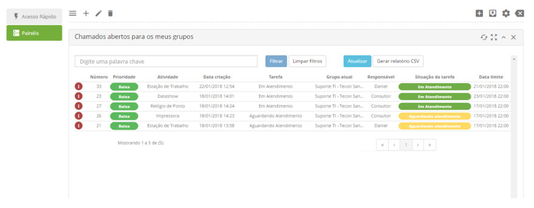
    
**Figura 1 - Tela de chamados**
    
Um duplo clique numa das linhas faz exibir a tela da solicitação e permite que o usuário execute a tarefa (caso tenha permissão):

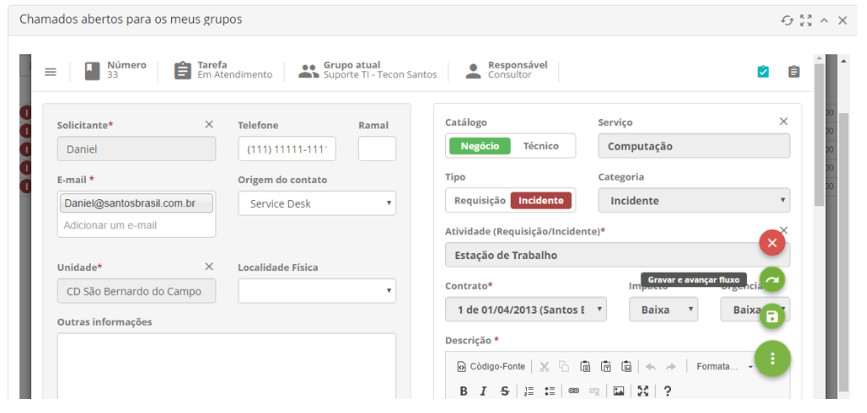
    
**Figura 2 - Tela de exemplo de chamados**
    
Componentes Neuro
-------------------

O pacote neuro **itsm_tasks** contém todos os componentes necessários à criação de painéis no CITSmart Enterprise ITSM:

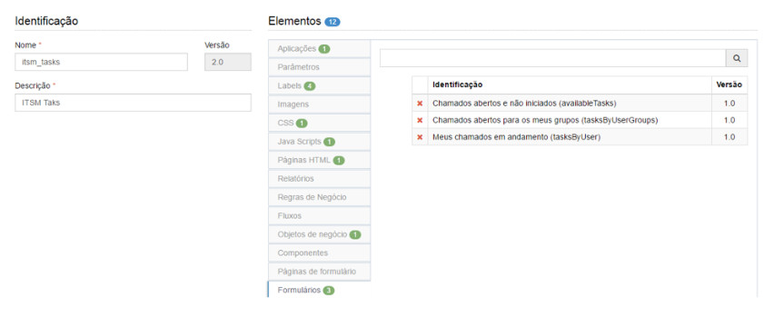
    
**Figura 3 - Tela de componentes Neuro**
    
O pacote é composto dos seguintes elementos:

1. Aplicação ITSM Tasks;
2. Quatro labels para internacionalização;
3. Recurso CSS **itsm-tasks**;
4. Recurso Javascript com a diretiva AngularJS **itsm-tasks**;
5. Recurso HTML **itsm-tasks**;
6. Objeto de negócio **vw_itsm_tasks**;
7. Três formulários pré-configurados para exibição no dashboard do ITSM:

    - Chamados abertos e não iniciados (availableTasks);
    - Chamados abertos para os meus grupos (tasksByUserGroups);
    - Meus chamados em andamento (tasksByUser).
    
Objeto de negócio
--------------------

O objeto de negócio **vw_itsm_tasks**, do tipo VIEW, reúne todos os atributos necessários à exibição das linhas de tarefas nos 
painéis.

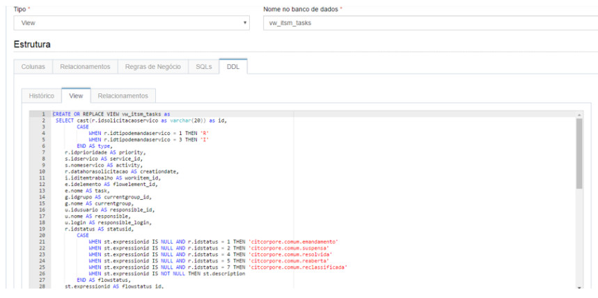
    
**Figura 4 - Tela de DDL**
    
Conforme será explicado, cada SQL do objeto de negócio pode ser associado a um painel através da diretiva **itsm-taks**:

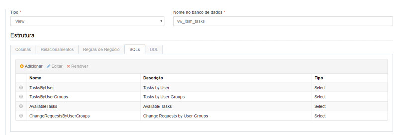
    
**Figura 5 - Tela de SQL**
    
O objeto de negócio do pacote **itsm-tasks** já vem configurado com três SQLs. Porém, conforme a necessidade, esses SQLs podem ser
customizados ou outros SQLs podem ser criados.

As colunas do **relatório CSV** exportado no painel são as mesmas colunas configuradas na aba **Formulário** do objeto de negócio:

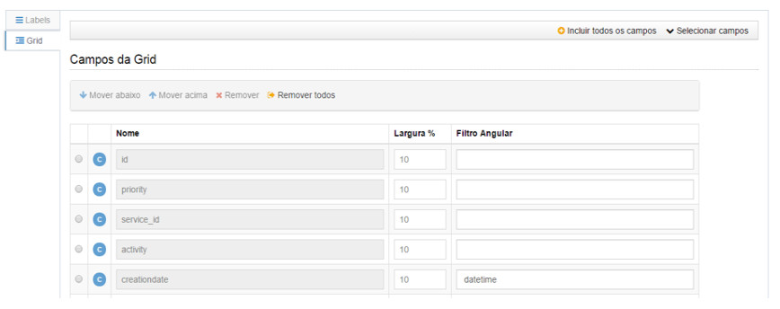
    
**Figura 6 - Tela de campos da grid**
    
Recursos CSS
--------------

O recurso CSS **itsm-tasks** contém as classes CSS específicas para exibição do layout dos formulários e foi criado a partir do
arquivo **serviceRequestIncident.css** do CITSmart Enterprise ITSM.

Diretiva Angular JS
---------------------

A diretiva AngularJS **itsm-tasks-directive** encapsula a lógica para exibição dos painéis de tarefas em qualquer formulário do 
Neuro.

A sintaxe para incorporação da diretiva ao HTML é a seguinte:

<itsm-tasks sql-name="identificação do SQL do objeto de negócio" object-map="objeto JSON com parâmetros para execução do SQL"></itsm-tasks>

A diretiva utiliza o recurso de página HTML itsm-tasks para exibição dos dados:

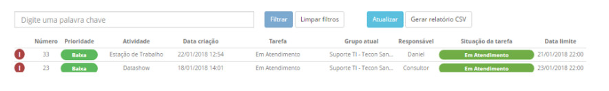
    
**Figura 7 - Tela de listagem de solicitação**
    
Além de possibilitar a exibição e execução das tarefas, a diretiva permite:

1. Filtrar as tarefas por qualquer palavra chave exibida na grid;
2. Atualizar os dados da tela;
3. Gerar um relatório CSV com as tarefas exibidas na tela. O relatório CSV exportado obedece aos filtros da tela e contém todas as
colunas definidas na grid do cadastro do objeto de negócio.

Criação de Smart Report
--------------------------

Os Smart Report exibidos no **dashboard** devem ser do tipo **Neuro**.

Cada Smart Report deve ser associado a um formulário e sua respectiva página:

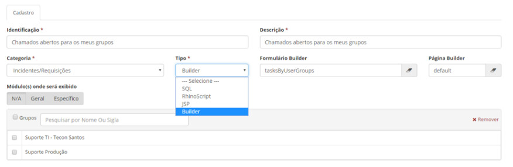

**Figura 8 - Tela de cadastro de Smart Report**

Configuração do dasboard
---------------------------

Para configurar o dashboard do CITSmart Enterprise ITSM com painéis de tarefas, basta criar um **widget** associado ao Smart Report
com o formulário do Neuro:

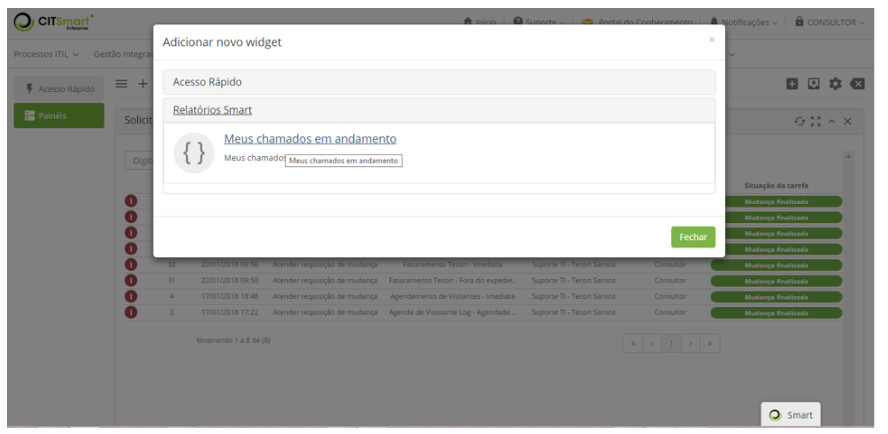

**Figura 9 - Tela de Widget**

Aplicação do componente no desenho de fluxos
----------------------------------------------

A partir daqui são orientações técnicas para configuração do componente de fluxo de criação de tickets.

Esta orientação é destinada a Consultores ou usuários CITSmart que dominem o conhecimento de criação de fluxos ITSM.

O componente **Requisição/Incidente** pode ser acessado na aba **Tarefas** do desenho do fluxo:

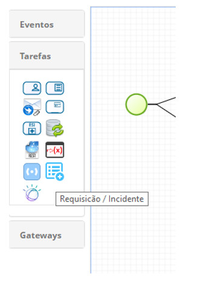
    
**Figura 10 - Tela de tarefas**
    
Ele permite a criação de tickets ou incidentes relacionados ou não ao ticket do fluxo que está sendo executado.

Segue um exemplo de fluxo que utiliza o componente:

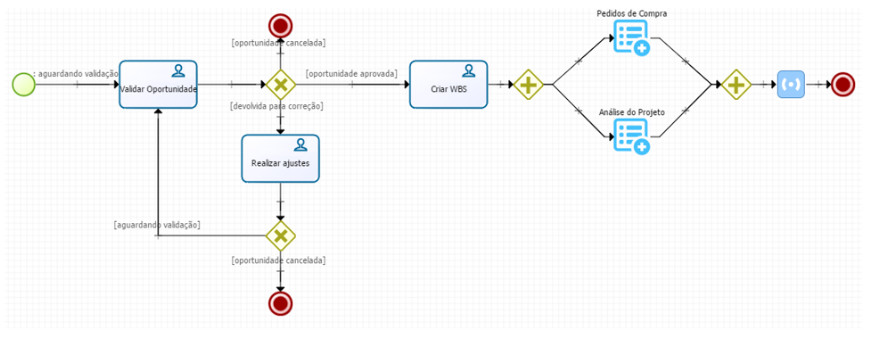
    
**Figura 11 - Exemplo de fluxo**
    
No exemplo anterior, a execução dos componentes **Pedidos de Compra e Análise do Projeto** é disparada paralelamente após a execução
da tarefa **Criar WBS**.

A execução do fluxo é paralisada até que a solicitação criada pelo componente seja finalizada ou cancelada.

O último **gateway paralelo** garante que o fluxo seja concluído somente após a conclusão dos tickets representados pelos 
componentes **Pedidos de Compra e Análise do Projeto**.

Detalhando as propriedades do componente
------------------------------------------

A figura seguinte exibe as propriedades do componente:

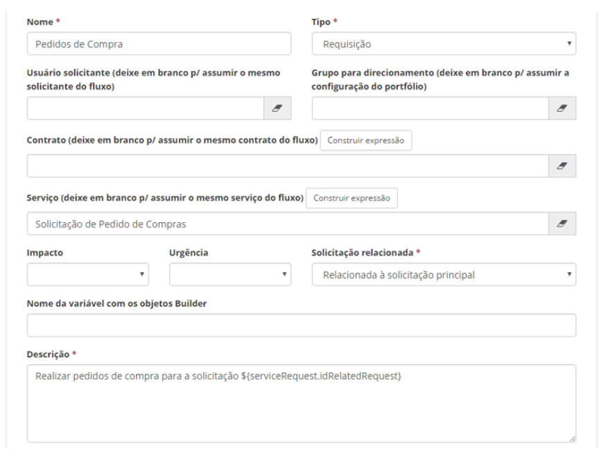
    
**Figura 12 - Tela de propriedades do componente**
    
Segue a descrição de cada propriedade:

- **Tipo**: permite a seleção do tipo da solicitação: **Requisição** ou **Incidente**;
    - Se nenhum valor for informado na propriedade **Usuário solicitante**, a solicitação criada vai assumir o mesmo solicitante da
    solicitação do fluxo. Nessa propriedade pode ser informado:
        - O login do usuário (ex: carlos.santos, marcio.dias);
        - Uma expressão que represente o valor de uma variável do fluxo ou um atributo de algum objeto do fluxo. Exemplos:
            - ${requestTimeOff.days}
            - ${usuarioSolicitante}
    - Se nenhum valor for informado na propriedade **Grupo para direcionamento**, a solicitação criada vai assumir o mesmo grupo 
    atual da solicitação do fluxo. Os valores dessa propriedade permitem informar:
        - A sigla do usuário (ex.: **SDNIVEL1**).
        - Uma expressão que represente o valor de uma variável do fluxo ou um atributo de algum objeto do fluxo. Exemplos:
            - ${requestTimeOff.currentGroup}
            - ${grupoParaDirecionamento}
- **Contrato**: pode ser deixada em branco para assumir o mesmo contrato da solicitação do fluxo ou pode ser informado:
    - O ID do contrato (chave primária da tabela)
    - Uma expressão que represente o valor de uma variável do fluxo ou um atributo de algum objeto do fluxo. Exemplos:
        - ${requestTimeOff.contract}
        - ${contratoAtual}
    - Um script **RHINO** que retorne o ID de contrato. Para construir o script, basta clicar no botão **Construir expressão**.
- **Serviço**: pode ser deixada em branco para assumir o mesmo serviço da solicitação do fluxo ou pode ser informado:
    - O ID do serviço (chave primária da tabela)
    - Uma expressão que represente o valor de uma variável do fluxo ou um atributo de algum objeto do fluxo. Exemplos:
        - ${requestTimeOff.service}
        - ${servicoAtual}
    - Um script **RHINO** que retorne o ID de um serviço. Para construir o script, basta clicar no botão **Construir expressão**.
- **Impacto** e **Urgência**: são opcionais e aceitam os valores:
    - Alto(a)
    - Médio(a)
    - Baixo(a)
- **Solicitação relacionada**: permite que a solicitação criada seja relacionada à solicitação do fluxo ou à solicitação inicial 
que deu origem ao fluxo. Os valores permitidos são:
    - Não relacionada
    - Relacionada à solicitação do fluxo
    - Relacionada à solicitação principal
- **Nome da variável com os objetos Neuro**: pode ser informado o nome do objeto quer será utilizado pelos formulários do Neuro.
- **Descrição**: pode ser informado um texto livre e/ou uma expressão.
    - Exemplo: Realizar pedidos de compra para a solicitação **${serviceRequest.idRelatedRequest}**
    
Anexos deste conhecimento
--------------------------

São anexos deste conhecimento:

- Pacotes Neuro com os componentes para criação de painéis
- Arquivos com os recursos HTML, CSS e Javascript. Esses arquivos já estão incluídos nos pacotes Neuro (apenas para que seja
possível visualizar facilmente o conteúdo)

!!! note "NOTA"

    Vale ressaltar que, como o objeto de negócio Neuro vw_itsm_tasks é implementado por View, a sintaxe da DDL varia de acordo com
    cada gerenciador de banco de dados. Por isso, há anexos de pacotes para cada tipo de banco de dados.
    

!!! tip "About"

    <b>Product/Version:</b> CITSmart | 7.00 &nbsp;&nbsp;
    <b>Updated:</b>08/07/2019 - Larissa Lourenço

