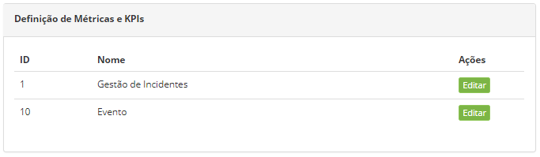
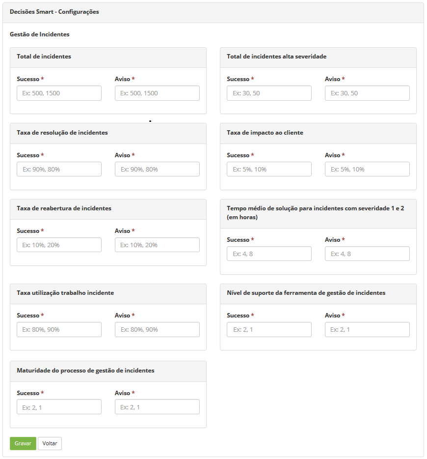

title: Definição de métricas e KPIs
Description: A funcionalidade de Definição de Métricas e KPIs tem por objetivo
definir os alvos dos indicadores do processo de Gerenciamento de Incidentes para
análise gerencial.

# Definição de métricas e KPIs

A funcionalidade de Definição de Métricas e KPIs tem por objetivo definir os
alvos dos indicadores do processo de Gerenciamento de Incidentes para análise
gerencial, os quais são exibidos no widget de "Gestão de Incidentes Gerencial -
KPIs" que pode ser adicionado no dashboard para ser apresentado no painel
gerencial, na tela principal do sistema.

Como acessar
-----------

1.  Acesse o menu principal **Sistema > Configurações > Definição de Métricas e
    KPIs**.

Pré-condições
-----------

1.  Não se aplica.

Filtros
-------

1.  Não se aplica.

Listagem de itens
----------------

1.  Os seguintes campos cadastrais estão disponíveis ao usuário para facilitar a
    identificação dos itens desejados na listagem padrão da
    funcionalidade: **ID** e **Nome**.

2.  Existe um botão de ação disponível ao usuário em relação a cada item da
    listagem, é ele: *Editar*.

**Figura 1 - Tela de listagem de definição de métricas e KPIs**

Definindo as métricas do processo de gerenciamento de incidentes - preenchimento dos campos cadastrais
-------------------------------------------------------------------------------------------------

1.  Após o acesso a funcionalidade, clique em *Editar* (conforme a figura
    anterior), será apresentada a tela de **Definição de Métricas e KPIs**,
    conforme ilustrada na figura abaixo;

    
    
    **Figura 2 - Definição de métricas e KPIs**

1.  Preencha os campos conforme orientação abaixo:

    -   Nos campos "**Sucesso**", informe o valor aceitável para o negócio;

    -   Nos campos "**Aviso**", informe o valor crítico para o negócio.

1.  Após os dados informados, clique no botão *Gravar* para efetuar a operação.

Veja também
-----------

-   [Cadastro de Template de Smart Decisions]().

!!! tip "About"

    <b>Product/Version:</b> CITSmart | 8.00 &nbsp;&nbsp;
    <b>Updated:</b>07/19/2019 – Anna Martins
