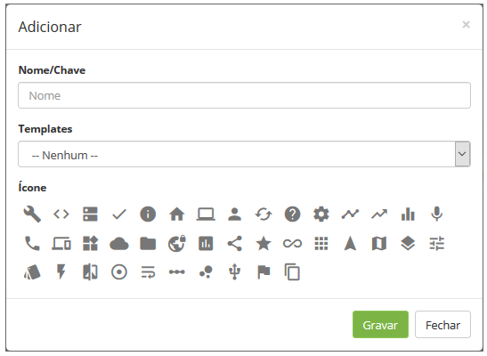
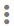
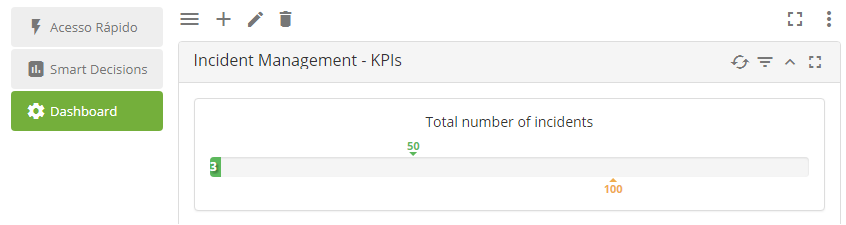
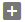
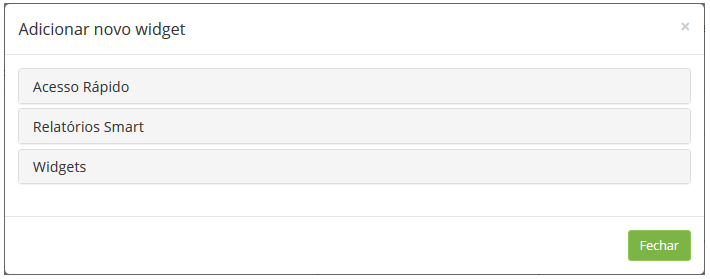
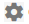
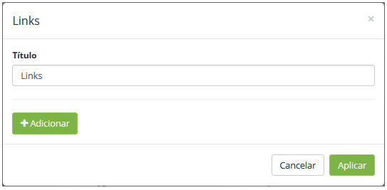
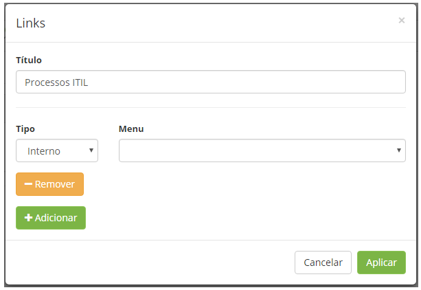

title: Painel gerencial (Smart decision)

Description: Neste painel é possível adicionar dashboard com links de
funcionalidades para acesso rápido, relatórios smart e gráficos que contém
informações relevantes.

# Painel gerencial (Smart decision)

O painel gerencial é exibido na tela principal do sistema. Neste painel é
possível adicionar dashboard com links de funcionalidades para acesso rápido,
relatórios smart e gráficos que contém informações relevantes.

Adicionando dashboard
--------------------

1.  Na tela inicial do sistema, clique no ícone  . Feito isso, será apresentada
    a tela para cadastro do novo dashboard;

    
    
    **Figura 1 - Cadastro de dashboard**

1.  Informe os dados do dashboard;

    -   **Nome/Chave**: informe o nome do dashboard;

    -   **Template**: selecione um template para criação do dashboard com base no
    mesmo, caso ache necessário;

    -   **Ícone**: selecione um ícone para representar o dashboard.

1.  Após os dados informados, clique no botão *Gravar* para efetuar o registro;

2.  Para editar as informações do dashboard, clique no ícone  .

Adicionando widget ao dashboard
------------------------------

1.  Selecione o dashboard e clique no ícone   para habilitar o modo de edição
    que permite adicionar novos widgets. Feito isso, será apresentada a tela de
    edição;

    
    
    **Figura 2 - Edição do dashboard**

1.  Clique no ícone   para adicionar um widget. Será apresentada a tela para
    escolha do widget desejado;

    
    
    **Figura 3 - Widgets**

1.  Clique em uma das opções e logo após clique no widget que deseja adicionar
    ao dashboard:

    -   **Acesso rápido**: permite adicionar links para acesso rápido;

    -   **Relatórios Smart**: permite adicionar relatórios dinâmicos;

    -   **Widgets**: permite adicionar gráficos com informações relevantes.

1.  Caso tenha adicionado o widget de "links", informe os links desejados;

    -   Clique no ícone de configuração   do widget;

    -   Será apresentada a tela de adição dos links, conforme ilustrado na figura
    abaixo:

     
     
     **Figura 4 - Cadastro de Links**

    -   **Título**: é exibido a descrição do widget. Modifique a mesma caso ache
    necessário;

    -   Clique no botão *Adicionar*. Após isso, serão exibidos os campos para
    informar os dados do link;

    
    
    **Figura 5 - Detalhes do cadastro de Links**

    -   **Tipo**: informe o tipo do link:

       -   **Interno**: escolha esse tipo caso o link que será adicionado é referente a
      uma funcionalidade do sistema -\> selecione o menu que corresponde a
      funcionalidade do sistema desejada;

       -   **Externo**: escolha esse tipo caso o link que será adicionado é referente a
       uma fonte externa, como por exemplo, um website -\> informe a descrição do
       link e a URL.

    -   Clique no botão *Aplicar* para efetuar o cadastro.

1.  Após os widgets adicionados e configurados, clique no ícone   para salvar as
    alterações feitas no dashboard.

2.  Caso queira modificar o layout do dashboard, clique no ícone  .

!!! tip "About"

    <b>Product/Version:</b> CITSmart | 8.00 &nbsp;&nbsp;
    <b>Updated:</b>07/19/2019 – Anna Martins
