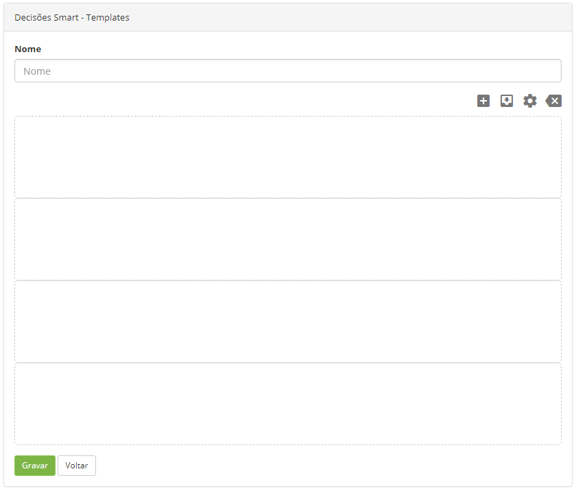

title: Cadastro de template de Smart decisions

Description: A funcionalidade de "Decisões Smart - Templates" tem por objetivo
criar templates para serem utilizados na criação de dashboard na tela principal
do sistema.

# Cadastro de template de Smart decisions

A funcionalidade de "Decisões Smart - Templates" tem por objetivo criar
templates para serem utilizados na criação de dashboard na tela principal do
sistema.

Como acessar
------------

1.  Acesse o menu principal **Sistema > Configurações > Decisões Smart -
    Templates**.

Pré-condições
-------------

1.  Não se aplica.

Filtros
--------

1.  Não se aplica.

Listagem de itens
----------------

1.  Os seguintes campos cadastrais estão disponíveis ao usuário para facilitar a
    identificação dos itens desejados na listagem padrão da
    funcionalidade: **ID** e Nome**.

2.  Existem botões de ação disponíveis ao usuário em relação a cada item da
    listagem, são eles: *Editar* e *Excluir*.

**Figura 1 - Decisões Smart listagem de itens**

Preenchimento dos campos cadastrais
---------------------------------

1.  Será apresentada a tela de **Templates**;

2.  Clique no botão *Adicionar*. Feito isso, será apresentada a tela
    de **Cadastro de Template**, conforme ilustrada na figura abaixo:

    
    
    **Figura 2 - Cadastro de template**

1.  Para criar um template, proceda conforme orientação abaixo:

    -   **Nome**: informe o nome do template;

    -   Para adicionar um widget ao dashboard, clique no ícone  ;

    -   Parar salvar as alterações feitas no dashboard, clique no ícone  ;

    -   Para alterar o formato do dashboard, clique no ícone  ;

    -   Para desfazer o que foi feito no dashboard, basta clicar no ícone  .

1.  Após o template criado, clique no botão *Gravar* para efetuar a operação.

!!! tip "About"

    <b>Product/Version:</b> CITSmart | 8.00 &nbsp;&nbsp;
    <b>Updated:</b>07/19/2019 – Anna Martins
