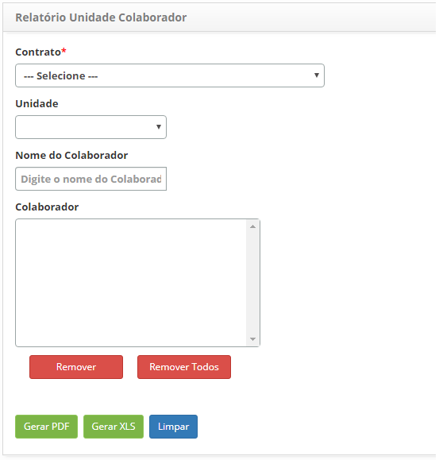

title:Geração de relatórios-Gerência de pessoal

Description: Este relatório tem o objetivo de apresentar as informações dos
colaboradores por unidade.

# Geração de relatórios-Gerência de pessoal

Este relatório tem o objetivo de apresentar as informações dos colaboradores por
unidade.

Como acessar
-----------

1.  Acesse a funcionalidade de Relatório de Unidade Colaborador através da
    navegação no menu principal **Relatórios > Gerência de Pessoal > Relatório
    Unidade Colaborador**.

Pré-condições
------------

1.  Não se aplica.

Filtros
-------

1.  Os seguintes filtros possibilitam ao usuário restringir a participação de
    itens na listagem padrão da funcionalidade, facilitando a localização dos
    itens desejados:

    -   **Contrato**: selecione o contrato desejado;
  
    -   **Unidade**: selecione a unidade que deseja verificar seus respectivos
    colaboradores;

    -   **Nome do Colaborador**: informe o nome do(s) colaborador(es);

    -   **Colaborador**: será(ão) listado(s) o(s) colaborador(es) escolhido(s) no
    campo anterior.

1.  Será apresentada a tela de** Geração de Relatório de Colaborador por
    Unidade**, conforme ilustrada na figura a seguir:

    

    **Figura 1 - Tela de geração de relatório de colaborador por unidade**

1.  Defina os filtros conforme sua necessidade.

    !!! info "IMPORTANTE"

       Caso não seja informado um colaborador, será gerado o relatório contendo
       as informações de todos os colaboradores ativos da(s) respectiva(s)
       unidade(s), referente ao contrato informado.

1.  Se desejar remover algum colaborador, basta selecioná-lo e clicar no
    botão *Remover*. Mas caso deseje remover todos os colaboradores, basta
    clicar diretamente no botão *Remover Todos*;

2.  Clique no botão *Gerar PDF* para gerar o relatório em formato PDF;

3.  Clique no botão *Gerar XLS* para gerar o relatório em formato Excel.

Listagem de itens
----------------

1.  Não se aplica.

Preenchimento dos campos cadastrais
---------------------------------

1.  Não se aplica.

!!! tip "About"

    <b>Product/Version:</b> CITSmart | 8.00 &nbsp;&nbsp;
    <b>Updated:</b>07/22/2019 – Anna Martins
