title:  Painel de gráficos e relatórios
Description: Disponibiliza o painel de relatórios. 
# Painel de gráficos e relatórios

Como acessar
--------------

1. Acesse a funcionalidade de Painel de Gráficos e Relatórios através da navegação no menu principal 
**Relatórios > Gerência de Incidentes/Requisição > Gráficos e Relatórios (Painel)**.

Selecionando grupo de informações
------------------------------------

1. É apresentada a tela de **Painel de Gráficos e Relatórios**, na qual poderá ser gerado os gráficos e relatórios de acordo com os
filtros escolhidos.

    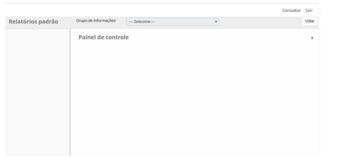
    
    **Figura 1 - Painel de gráficos e relatórios**
    
2. Selecione o grupo de informação para geração de relatórios referente ao mesmo:

    - Incidentes e Requisições;
    - Itens de Configuração;
    - Catálogo de Serviços;
    - Mudanças;
    - Requisição de Mudança.

Legendas de botões
--------------------

1. Na área de representação dos gráficos contém quatro ícones, no qual possibilita a visualização de forma diferente do mesmo.

    - O ícone  ao ser clicado gera uma tabela com informações;
    
    - O ícone   ao ser clicado exibe as opções de gráficos (Pizza 3D, Pizza 2D, Barra 3D, Barra 
    2D, Linha 3D e Linha 2D), para que possa selecionar a forma do gráfico que deseja visualizar;
    
    - O ícone   ao ser clicado gera o relatório no formato ".pdf";
    
    - O ícone  ao ser clicado gera o relatório no formato Excel ".xls".
    
Incidentes e requisições
----------------------------

Na tela de **Painel de Gráficos e Relatórios**, selecione o grupo de informações **Incidentes e Requisições**. Serão apresentados
os gráficos e relatórios existentes no grupo para geração dos mesmos, conforme ilustrado na figura abaixo:

    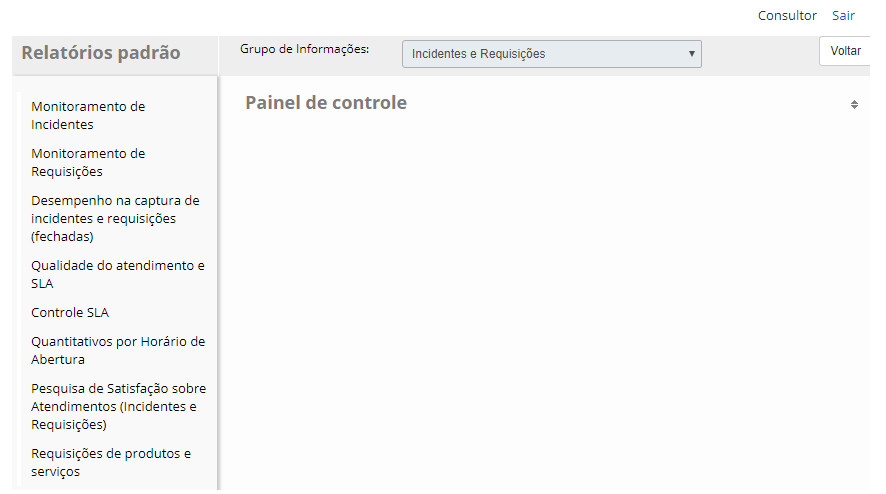
    
    **Figura 2 - Painel de gráficos e relatórios de incidentes e requisições**
    
    !!! note "NOTA"
    
        Os seguintes tópicos serão abordados sobre como gerar gráficos e relatórios para incidentes e solicitações.
        
*Monitoramento de incidentes*

Para verificar as informações dos incidentes, proceda conforme os passos descritos abaixo:

1. No painel de gráficos e relatórios de incidentes e requisições, clique sobre o relatório de **Monitoramento de Incidentes**;

2. Será apresentada uma tela contendo filtros onde poderá defini-los conforme sua necessidade para gerar o relatório. Após 
definição dos filtros, clique no botão "Gerar";

3. Serão apresentados os gráficos de incidentes de acordo com os filtros definidos, conforme exemplo ilustrado na figura abaixo:

    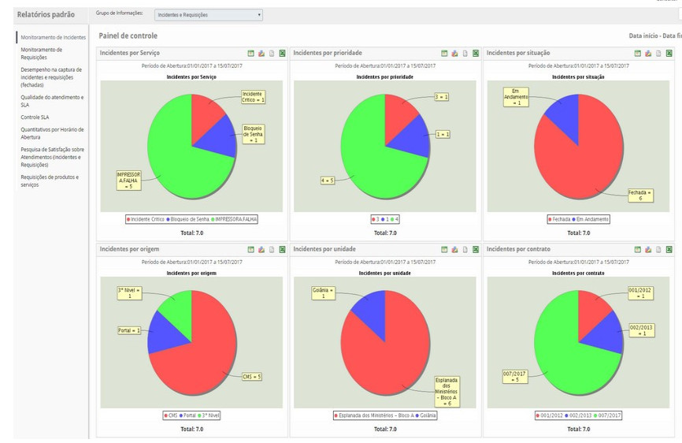
    
    **Figura 3 - Gráficos de monitoramento de incidentes**
    
*Monitoramento de requisições*

Para verificar as informações das requisições de serviço, proceda conforme os passos descritos abaixo:

1. No painel de gráficos e relatórios de incidentes e requisições, clique sobre o relatório de **Monitoramento de Requisições**;

2. Será apresentada uma tela contendo filtros onde poderá defini-los conforme sua necessidade para gerar o relatório. Após 
definição dos filtros, clique no botão "Gerar";

3. Serão apresentados os gráficos de requisições de serviço de acordo com os filtros definidos, conforme exemplo ilustrado na
figura abaixo:

    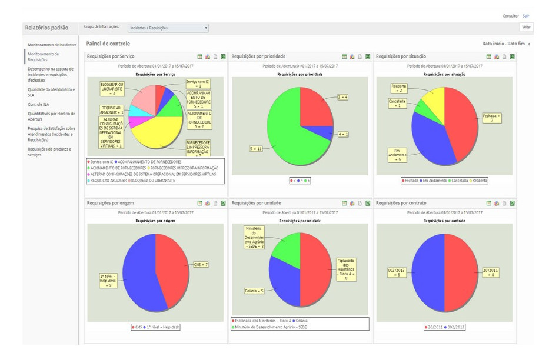
    
    **Figura 4 - Gráficos de monitoramento de requisições de serviço**
    
*Desempenho na captura de incidentes e requisções (fechadas)*

1. Para verificar o desempenho na captura de incidentes e requisições de serviço, proceda conforme os passos descritos abaixo:

    - No painel de gráficos e relatórios de incidentes e requisições, clique sobre o relatório de **Desempenho na captura de 
    incidentes e requisições (fechadas)**;
    - Será apresentada uma tela contendo filtros onde poderá defini-los conforme sua necessidade para gerar o relatório. Após 
    definição dos filtros, clique no botão "Gerar";
    - Será apresentado o relatório de acordo os filtros definidos, conforme exemplo ilustrado na figura abaixo:
    
    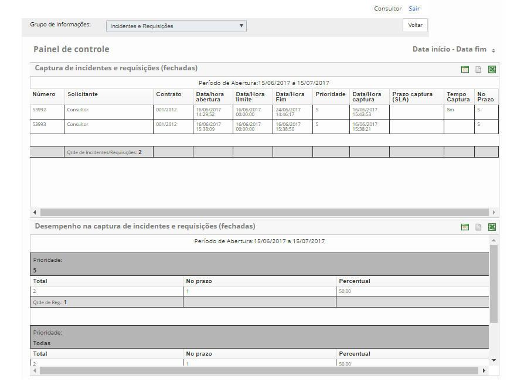
    
    **Figura 5 - Gráfico de controle de SLA**
    
    - O relatório de Captura de Incidentes e Requisições mostra o tempo de captura das solicitações encerradas. O tempo de 
    captura é o tempo decorrido entre o início do SLA e a execução da primeira tarefa que contabiliza SLA;
    - O relatório de Desempenho na Captura de Incidentes e Requisições mostra um quadro resumo com o percentual de solicitações 
    capturadas no prazo por prioridade;
    - Na área de representação do relatório contém quatro ícones, no qual possibilita a visualização de forma diferente do mesmo.
    
*Qualidade do atendimento e SLA*

Para verificar a qualidade do atendimento e SLA dos incidentes e requisições, proceda conforme os passos descritos abaixo:

1. No painel de gráficos e relatórios de incidentes e requisições, clique sobre o relatório de **Qualidade do Atendimento e 
SLA**;
2. Será apresentada uma tela contendo filtros onde poderá defini-los conforme sua necessidade para gerar o relatório. Após 
definição dos filtros, clique no botão "Gerar";
3. Será apresentado o relatório de acordo os filtros definidos.

*Controle de SLA*

Para verificar as informações de SLA, proceda conforme os passos descritos abaixo:

1. No painel de gráficos e relatórios de incidentes e requisições, clique sobre o relatório de **Controle de SLA**;

2. Será apresentada uma tela contendo filtros onde poderá defini-los conforme sua necessidade para gerar o relatório. Após 
definição dos filtros, clique no botão "Gerar";

3. Será apresentado o gráfico de controle de SLA de acordo com os filtros definidos, conforme exemplo ilustrado na figura abaixo:

    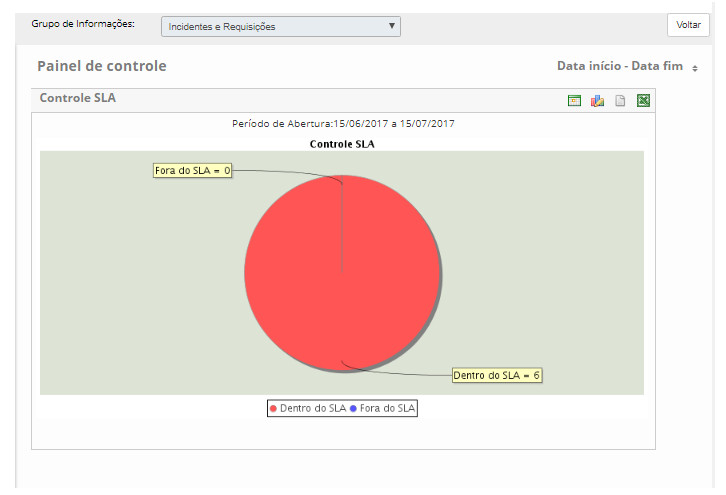
    
    **Figura 6 - Gráfico de controle de SLA**
    
*Quantitativos por horário de abertura*

Para verificar a quantidade de solicitações registradas, proceda conforme os passos descritos abaixo:

1. No painel de gráficos e relatórios de incidentes e requisições, clique sobre o relatório de **Quantitativo por Horário de 
Abertura**;

2. Será apresentada uma tela contendo filtros onde poderá defini-los conforme sua necessidade para gerar o relatório. Após 
definição dos filtros, clique no botão "Gerar";

3. Será apresentado o gráfico "quantitativos por horário de abertura" de acordo com os filtros definidos, conforme exemplo 
ilustrado na figura abaixo:

    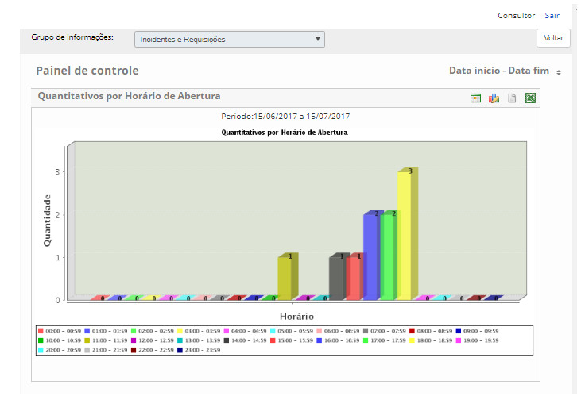
    
    **Figura 7 - Gráfico de quantitativos por horário de abertura**
    
*Pesquisa de satisfação sobre atendimentos (incidentes e requisições)*

Para verificar as informações de pesquisa de satisfação, proceda conforme os passos descritos abaixo:

1. No painel de gráficos e relatórios de incidentes e requisições, clique sobre o relatório de **Pesquisa de Satisfação sobre 
Atendimentos (Incidentes e Requisições)**;

2. Será apresentada uma tela contendo filtros onde poderá defini-los conforme sua necessidade para gerar o relatório. Após 
definição dos filtros, clique no botão "Gerar";

3. Será apresentado o gráfico de pesquisa de satisfação sobre atendimentos (incidentes e requisições) de acordo com os filtros 
definidos, conforme exemplo ilustrado na figura abaixo:

    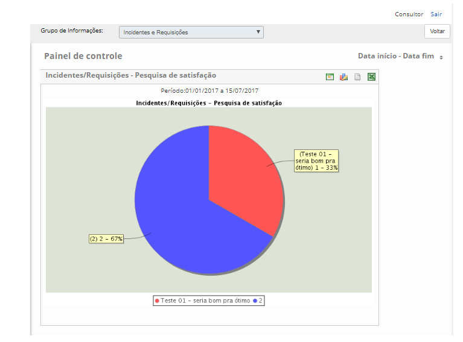
    
    **Figura 8 - Gráfico de pesquisa de satisfação**
    
*Requisições de produtos e serviços*

Para verificar as informações de requisições de produtos e serviços, proceda conforme os passos descritos abaixo:

1. No painel de gráficos e relatórios de incidentes e requisições, clique sobre o relatório de **Requisições de Produtos e 
Serviços**;

2. Será apresentada uma tela contendo filtros onde poderá defini-los conforme sua necessidade para gerar o relatório. Após 
definição dos filtros, clique no botão "Gerar";

3. Será apresentado o relatório de requisições de produtos e serviços de acordo com os filtros definidos.

Item de configuração
-----------------------

Na tela de **Painel de Gráficos e Relatórios**, selecione o grupo de informações **Item de Configuração**. Será apresentado o 
relatório existente no grupo para geração do mesmo, conforme ilustrado na figura abaixo:

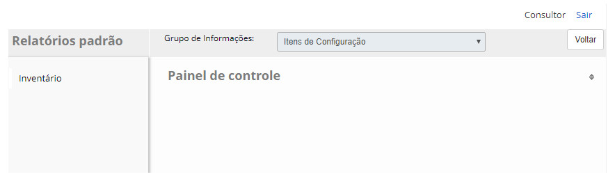

**Figura 9 - Painel de gráficos e relatórios de item de configuração**

!!! note "NOTA"

    O próximo tópico irá discutir como gerar o relatório para o item de configuração.
    
*Inventário*

Para verificar as informações de inventário dos ICs, proceda conforme os passos descritos abaixo:

1. No painel de gráficos e relatórios de itens de configuração, clique sobre o relatório de **Inventário**;

2. Será apresentada uma tela contendo filtros onde poderá defini-los conforme sua necessidade para gerar o relatório. Após 
definição dos filtros, clique no botão "Gerar";

3. Será apresentado o relatório de inventário de acordo com os filtros definidos.

Catálogo de serviços
-----------------------

Na tela de **Painel de Gráficos e Relatórios**, selecione o grupo de informações **Catálogo de Serviços**. Será apresentado o 
relatório existente no grupo para geração do mesmo, conforme ilustrado na figura abaixo:

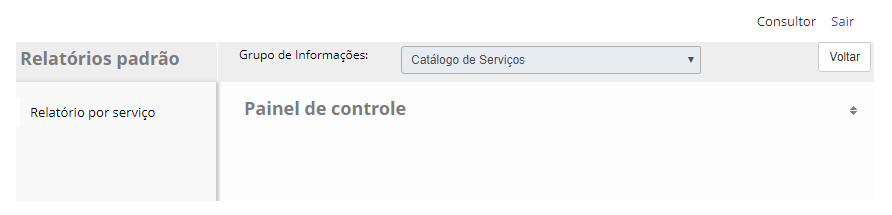

**Figura 10 - Painel de gráficos e relatórios de catálogo de serviços**

!!! note "NOTA"

    O próximo tópico irá discutir como gerar o relatório para gerar o relatório para o catálogo de serviços.
    
*Relatório de serviço*

Para verificar as informações dos serviços, proceda conforme os passos descritos abaixo:

1. No painel de gráficos e relatórios de catálogo de serviços, clique sobre o **Relatório por Serviços**;

2. Será apresentada uma tela contendo filtros onde poderá defini-los conforme sua necessidade para gerar o relatório. Após 
definição dos filtros, clique no botão "Gerar".

3. Será apresentado o relatório de serviços de acordo com os filtros definidos, conforme exemplo ilustrado na figura abaixo:

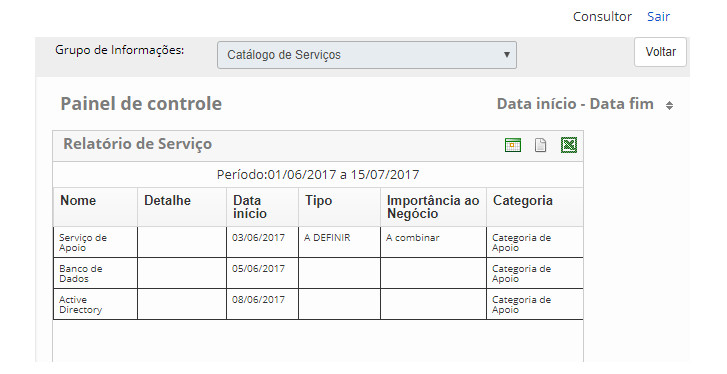

**Figura 11 - Relatório de serviços**

Mudanças
-----------

Na tela de **Painel de Gráficos e Relatórios**, selecione o grupo de informações **Mudanças**. Serão apresentados os gráficos e 
relatórios existentes no grupo para geração dos mesmos, conforme ilustrado na figura abaixo:

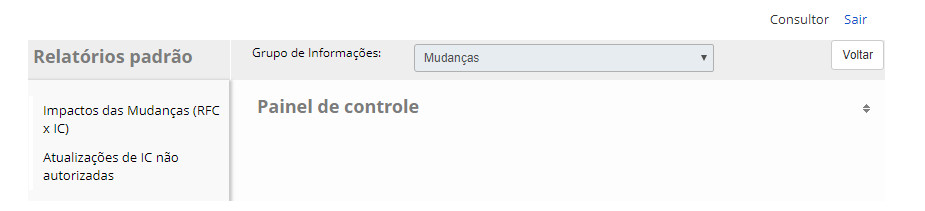

**Figura 12 - Mudanças**

!!! note "NOTA"

    Nos próximos tópicos, você aprenderá como gerar gráficos e relatórios para mudanças.
    
*Impacto das mudanças (RFC x IC)*

Para verificar as informações de impactos de IC nas mudanças, proceda conforme os passos descritos abaixo:

1.Esse relatório oferece ao usuário a possibilidade de verificar os ICs usados em determinada mudança e como eles são afetados. 
No painel de gráficos e relatórios de mudanças, clique sobre o relatório de **Impactos das Mudanças (RFC x IC)**;

2. Será apresentada uma tela contendo filtros onde poderá defini-los conforme sua necessidade para gerar o relatório. Após 
definição dos filtros, clique no botão "Gerar".

3. Será apresentado o relatório de impactos das mudanças de acordo com os filtros definidos, conforme exemplo ilustrado na figura 
abaixo:

    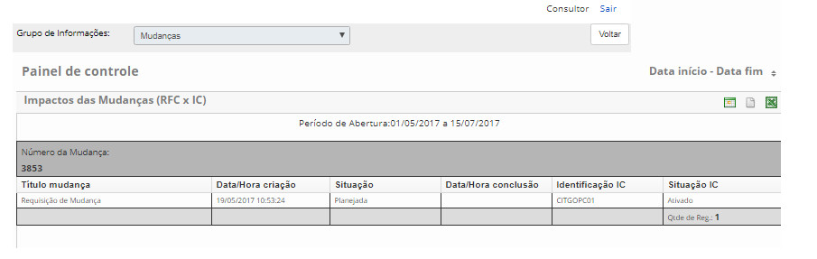
    
    **Figura 13 - Relatório de impactos das mudanças**
    
*Atualizações de IC não autorizadas*

Para verificar as informações de atualização de IC não autorizadas, proceda conforme os passos descritos abaixo:

1. Esse relatório oferece ao usuário a possibilidade de verificar os ICs que não foram autorizados para realização de 
atualizações. No painel de gráficos e relatórios de itens de configuração, clique sobre o relatório de **Atualização de IC não 
autorizadas**;

2. Será apresentada uma tela contendo filtros onde poderá defini-los conforme sua necessidade para gerar o relatório. Após 
definição dos filtros, clique no botão "Gerar".

3. Será apresentado o relatório de atualizações de IC não autorizadas de acordo com os filtros definidos, conforme exemplo 
ilustrado na figura abaixo:

    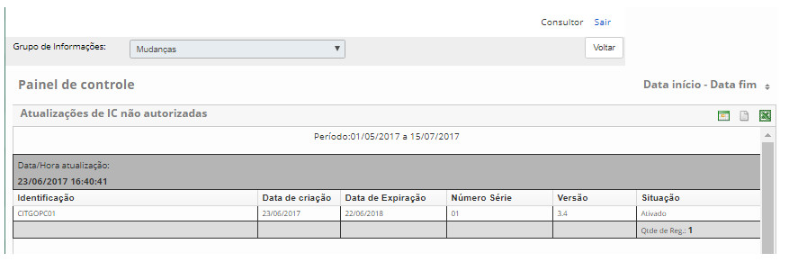
    
    **Figura 14 - Relatório de atualizações de IC não autorizadas**
    
Requisição de mudança
-------------------------

Na tela de **Painel de Gráficos e Relatórios**, selecione o grupo de informações **Requisição de Mudança**. Serão apresentados os gráficos e relatórios existentes no grupo para geração dos mesmos, conforme ilustrado na figura abaixo:

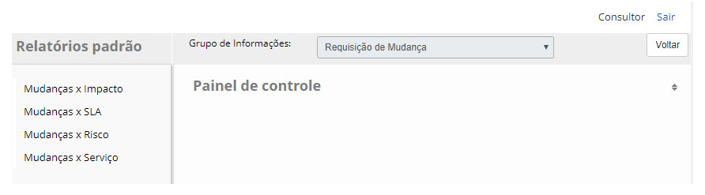

**Figura 15 - Requisição de mudança**

!!! note "NOTA"

    Nos próximos tópicos, você aprenderá como gerar gráficos e relatórios para o pedido de mudança.
    
*Requisição de mudança por impacto*

Para verificar as informações de requisição de mudança por impacto, proceda conforme os passos descritos abaixo:

1. No painel de gráficos e relatórios de requisição de mudança, clique sobre o relatório de **Mudanças x Impacto**;

2. Será apresentada uma tela contendo filtros onde poderá defini-los conforme sua necessidade para gerar o relatório. Após 
definição dos filtros, clique no botão "Gerar";

3. Será apresentado o gráfico de requisição de mudança por impacto de acordo com os filtros definidos, conforme exemplo ilustrado 
na figura abaixo:

    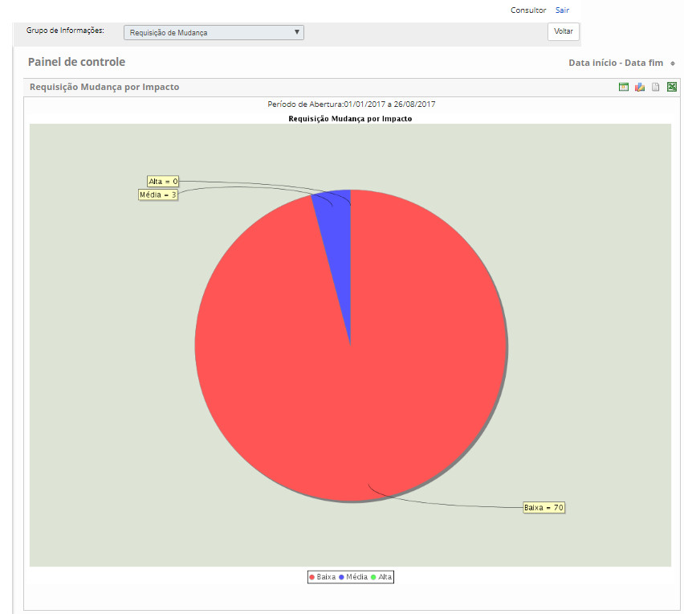
    
    **Figura 16 - Relatório de requisição de mudanças por impacto**
    
*Requisição de mudanças por SLA*

Para verificar as informações de requisição de mudança por SLA, proceda conforme os passos descritos abaixo:

1. No painel de gráficos e relatórios de requisição de mudança, clique sobre o relatório de **Mudanças X SLA**;

2. Será apresentada uma tela contendo filtros onde poderá defini-los conforme sua necessidade para gerar o relatório. Após 
definição dos filtros, clique no botão "Gerar";

3. Será apresentado o gráfico de requisição de mudança por SLA de acordo com os filtros definidos, conforme exemplo ilustrado na 
figura abaixo:

    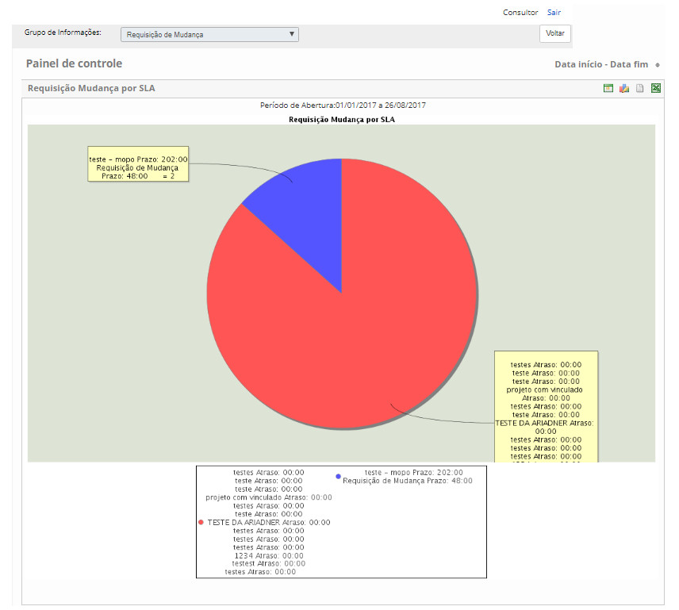
    
    **Figura 17 - Relatório de requisição de mudanças por SLA**
    
*Requisição de mudança por risco*

Para verificar as informações de requisição de mudança por risco, proceda conforme os passos descritos abaixo:

1. No painel de gráficos e relatórios de requisição de mudança, clique sobre o relatório de **Mudanças x Risco**;

2. Será apresentada uma tela contendo filtros onde poderá defini-los conforme sua necessidade para gerar o relatório. Após 
definição dos filtros, clique no botão "Gerar";

3. Será apresentado o gráfico de requisição de mudança por risco de acordo com os filtros definidos, conforme exemplo ilustrado 
na figura abaixo:

    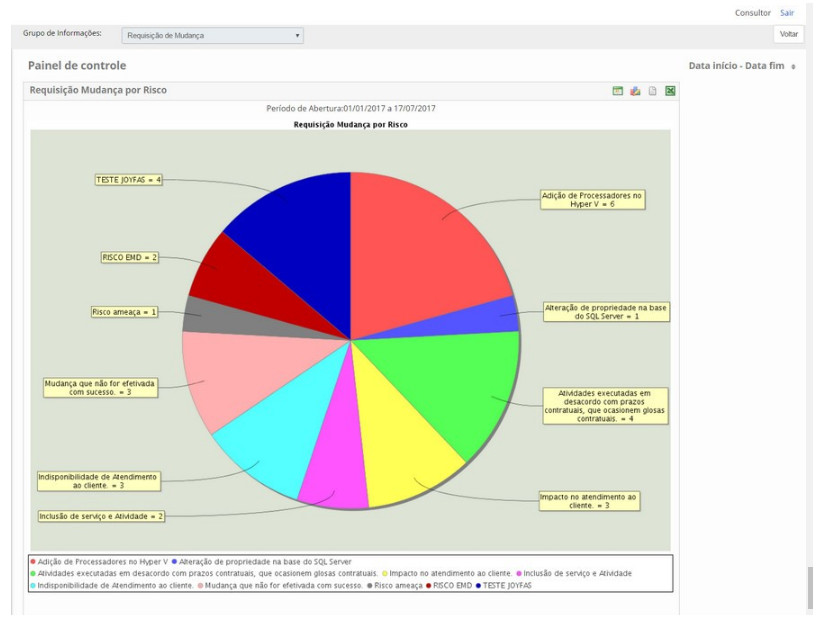
    
    **Figura 18 - Relatório de requisição de mudanças por risco**
    
*Requisição de mudanças por serviço*

Para verificar as informações de requisição de mudança por serviço, proceda conforme os passos descritos abaixo:

1. No painel de gráficos e relatórios de requisição de mudança, clique sobre o relatório de **Mudanças X Serviço**;

2. Será apresentada uma tela contendo filtros onde poderá defini-los conforme sua necessidade para gerar o relatório. Após 
definição dos filtros, clique no botão "Gerar";

3. Será apresentado o gráfico de requisição de mudança por serviço de acordo com os filtros definidos, conforme exemplo ilustrado 
na figura abaixo:

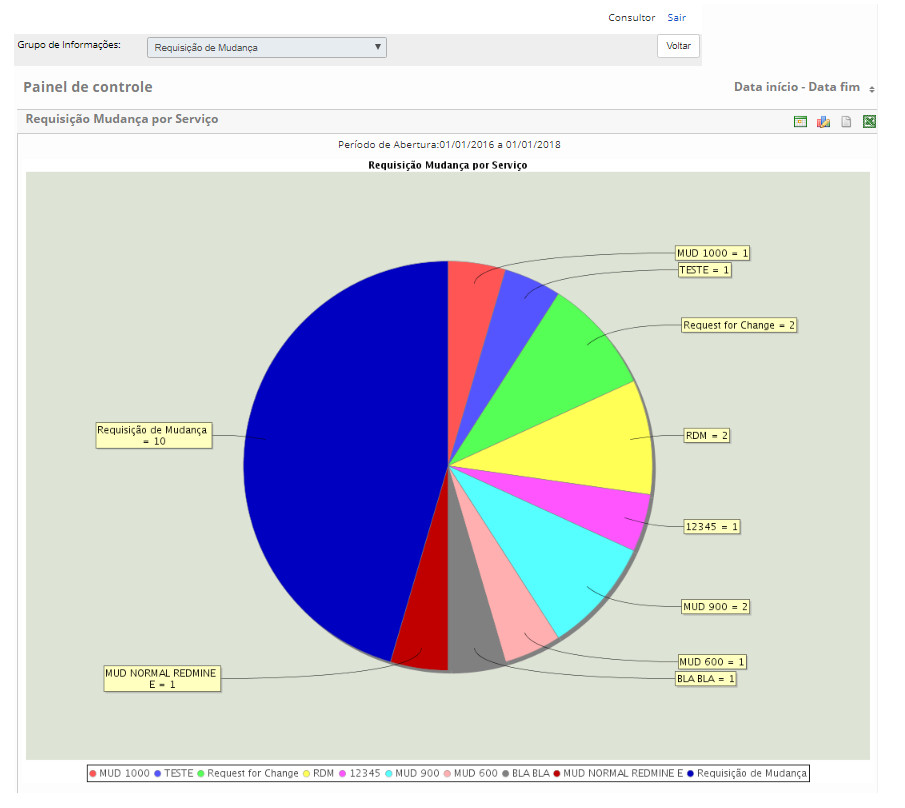

**Figura 19 - Relatório de requisição de mudanças por serviço**

!!! tip "About"

    <b>Product/Version:</b> CITSmart | 7.00 &nbsp;&nbsp;
    <b>Updated:</b>08/05/2019 - Larissa Lourenço
