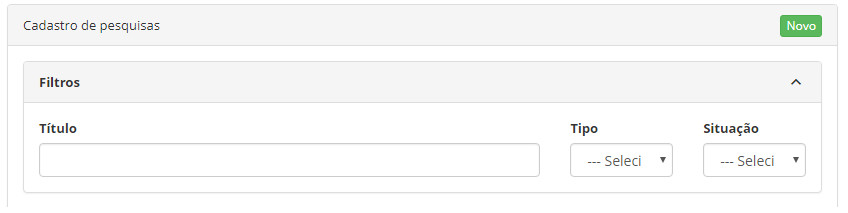
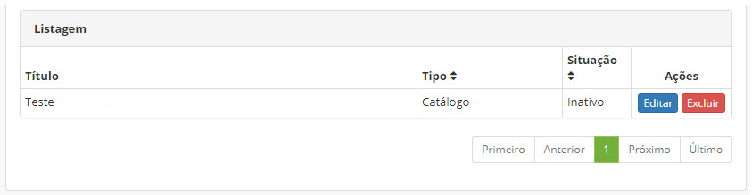
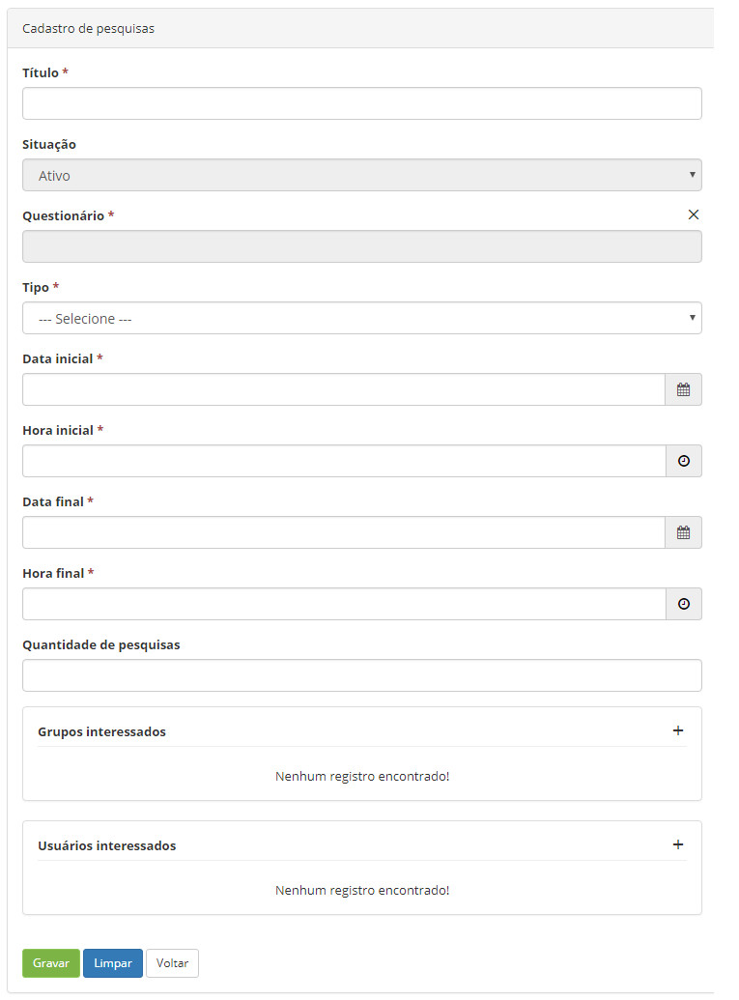

title:  Cadastro e pesquisa de pesquisa de satisfação
Description: Possibilita ao usuário criar e configurar pesquisas de satisfação de acordo com suas necessidades.. 
# Cadastro e pesquisa de pesquisa de satisfação

Esta funcionalidade possibilita ao usuário criar e configurar pesquisas de satisfação de acordo com suas necessidades.

O formulário da pesquisa é construído na forma de um questionário.

Como acessar
---------------

1. Acesse a funcionalidade: Cadastros Gerais → Cadastro de Pesquisas.

Pré-condições
----------------

1. Usuário precisa ter um Questionário cadastrado no sistema (ver conhecimento Cadastro e pesquisa de categoria de questionários);

2. Informe o conteúdo abaixo no parâmetro (ver conhecimento Regras de parametrização - Sistema):

    - Parâmetro 33: URL do Sistema.

Filtros
----------

1. Os seguintes filtros possibilitam ao usuário restringir a participação de itens na listagem padrão da funcionalidade, facilitando
a localização dos itens desejados:

    - Título;
    - Tipo (escolha única);
    - Situação (escolha única).

    
    
    **Figura 1 - Tela de pesquisa de pesquisas**
    
Listagem de registros
---------------------------

1. Os seguintes campos cadastrais estão disponíveis ao usuário para facilitar a identificação dos itens desejados na listagem
padrão da funcionalidade: **Título, Tipo** e **Situação**.

2. Existem botões de ação disponíveis ao usuário em relação a cada item da listagem, são eles: "Editar" e "Excluir".

    
    
    **Figura 2 - Tela de listagem de pesquisas**
    
Preenchimento dos campos cadastrais
-------------------------------------

1. Independentemente do tipo do registro, os seguintes campos devem ser preenchidos:

    
    
    **Figura 3 - Tela de cadastro de pesquisas**
    
    - **Título**: a pesquisa deve ter um título único no sistema;
    - **Situação**: os valores possíveis são Ativo e Inativo;
    - **Questionário**: o sistema permite que ocorra o vínculo da pesquisa a um Questionário cadastrado;
    - **Tipo**: os valores possíveis são Público, Global, Catálogo, Serviço e Atividade/Satisfação;
    - **Data inicial e Hora inicial**: restringem o momento inicial da aplicação da pesquisa;
    - **Data final** e **Hora final**: restringem o momento final da aplicação da pesquisa;
    - **Grupos interessados**: o sistema permite que ocorra o vínculo da pesquisa a um Questionário cadastrado;
    - **Quantidade de pesquisas**: é um limitador opcional, ou seja, se for do interesse do solicitante da pesquisa limitar a
    quantidade de aplicações, basta informar um número. Deixar este campo em branco significa que apenas a data/horário finais 
    servirão para encerrar a pesquisa ;
    - **Grupos interessados**: para definir quem está interessado nas respostas da pesquisa, o sistema permite que ocorra o vínculo 
    da pesquisa a um ou mais Grupos cadastrados;
    - **Usuários interessados**: o sistema também permite que ocorra o vínculo da pesquisa a um ou mais Usuários interessados, 
    independente de grupos;
    - **Link**: trata-se de um campo somente de saída (sem digitações). Assim que a pesquisa é criada (gravada) neste campo surge
    o link completo, baseado na URL do Sistema devidamente parametrizada.
    
    !!! note "NOTA"
    
        O botão  ("Copiar") fica disponível à direita do campo Link, permitindo que o usuário
        facilmente tenha em mãos a URL corretamente montada, ao clicar nele o conteúdo é copiado para a área de transferência.
        
Pesquisa do tipo "Público"
----------------------------

Este tipo permite a participação de todos os usuários sem nenhum tipo de restrição, inclusive eles nem precisam estar autenticados
no sistema
Nesta modalidade, a URL do Sistema (parametrizada) é fornecida ao público-alvo para que participem da pesquisa.

Pesquisa do tipo "Global"
---------------------------

Este tipo restringe a participação de usuários àqueles que se autenticarem no sistema, podendo ser acessada de duas maneiras:

- quando se identificam receberão uma notificação automática (incluindo os passos para responder);
- no Portal de Serviços (menu na lateral esquerda) na opção "Campanhas ativas".

1. Ao selecionar este tipo alguns novos campos surgirão para preenchimento:

    - **Grupos alvos**: para definir quem responderá a pesquisa, o sistema permite que ocorra o vínculo da pesquisa a um ou mais 
    Grupos cadastrados;
    - **Usuários alvos**: o sistema também permite que ocorra o vínculo da pesquisa a um ou mais usuários que responderão,
    independente de seus grupos;
    - **Utilizar notificação do sistema**: os valores possíveis são: Sim ou Não. Ao indicar Sim outros campos surgirão para 
    preenchimento;
    - **Processo**: o sistema permite que ocorra o vínculo da pesquisa a um Processo cadastrado;
    - **Exige confirmação**: os valores possíveis são: Sim ou Não;
    - **Situação**: os valores possíveis são Ativo e Inativo;
    - **Data inicial** e **Hora inicial**: restringem o momento inicial das notificações ;
    - **Data final** e **Hora final**: restringem o momento final das notificações;
    - **Descrição breve**: assunto da notificação para o público-alvo;
    - **Descrição da notificação**: corpo da notificação com um texto que levará orientações ao público-alvo.
    
Pesquisas do tipo "Catálogo"
-----------------------------

Este tipo se destina à avaliação junto ao cliente sobre a eficácia do catálogo implantado para ele.

1. Ao selecionar este tipo um novo campo surgirá para preenchimento:

    - **Catálogo**: o sistema permite que ocorra o vínculo da pesquisa a um Catálogo cadastrado.
    
2. O catálogo escolhido deve estar disponível no Portal de Serviços, pois surgirá a nova aba "Campanhas ativas", além das abas
fixas (Serviços e Conhecimentos).

Pesquisas do tipo "Serviço"
-----------------------------

Este tipo se destina à avaliação junto ao cliente sobre a eficácia de um serviço implantado para ele.

1. Ao selecionar este tipo um novo campo surgirá para preenchimento:

    - **Serviço**: o sistema permite que ocorra o vínculo da pesquisa a um Serviço de um Catálogo cadastrado.
    
2. O serviço escolhido deve estar disponível no Portal de Serviços, pois surgirá a nova aba "Campanhas ativas", além das abas
fixas (Solicitações, Conhecimentos e Avaliações).

Pesquisas do tipo 'Atividade/Satisfação'
------------------------------------------

Este tipo é mais uma opção de pesquisa de satisfação junto ao cliente (além do default do sistema) sobre o desfecho do atendimento
de uma requisição ou incidente.

1. Ao selecionar este tipo um novo campo surgirá para preenchimento:

    - **Grupos interessados**: para definir quem está interessado nas respostas da pesquisa, o sistema permite que ocorra o vínculo
    da pesquisa a um ou mais Grupos cadastrados;
    - **Usuários interessados**: o sistema também permite que ocorra o vínculo da pesquisa a um ou mais Usuários interessados, 
    independente de grupos;
    - **Atividade**: o sistema permite que ocorra o vínculo da pesquisa a uma Atividade de um Serviço cadastrado.
    
2. A forma da pesquisa de satisfação original do sistema não foi eliminada, continua funcionando normalmente.

!!! info "IMPORTANTE"

    No campo Processo podem estar relacionados todos os processos ITIL e também o processo default "Pesquisa". A estratégia de 
    notificação do CITSmart Enterprise ITSM exige a vinculação a um processo quando as notificações são por processo, nesta 
    situação o sistema verifica se o usuário tem acesso ao processo para receber a notificação, isso evita notificações 
    desnecessárias. Ainda não existe uma tela de cadastro para esses processos, deve haver intervenção direta no banco (somente
    autorizados).
    
!!! note "NOTA"

    Como o cliente pode desenvolver seus próprios questionários com infinitas possibilidades de campos e lógica, o desenvolvimento
    de relatórios que recuperam dados dessas pesquisas é um esforço que necessariamente requer uma consultoria especializada a ser 
    planejada e contratada.
    
Regras gerais
----------------

1. Antes do momento inicial configurado, qualquer tentativa de responder a pesquisa causará uma mensagem informando o horário exato
para a liberação;

2. Ao responder uma pesquisa o sistema impede que o mesmo usuário realize novamente o preenchimento das respostas.

!!! tip "About"

    <b>Product/Version:</b> CITSmart | 7.00 &nbsp;&nbsp;
    <b>Updated:</b>08/12/2019 - Larissa Lourenço

