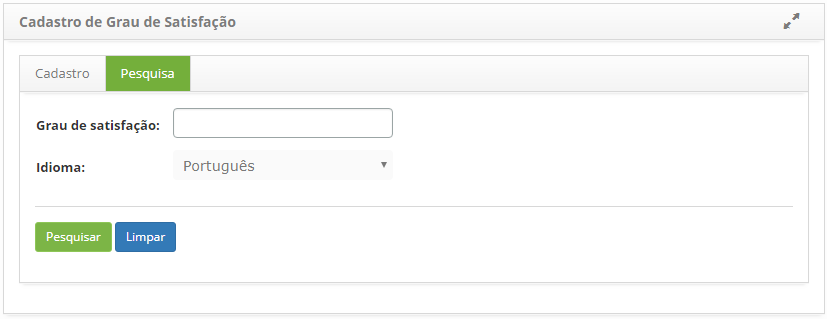
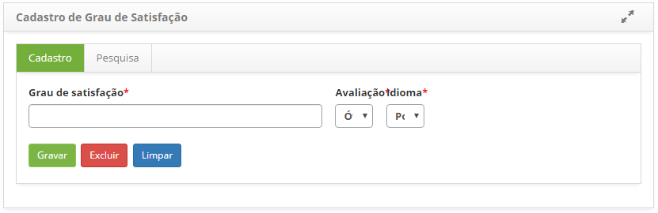

title: Cadastro e pesquisa de grau de satisfação

Description: A finalidade desta funcionalidade é permitir a configuração do grau
de satisfação do atendimento de serviço.

# Cadastro e pesquisa de grau de satisfação

A finalidade desta funcionalidade é permitir a configuração do grau de
satisfação do atendimento de serviço.

Como acessar
-----------

1.  Acesse a funcionalidade de grau de satisfação através da navegação no
    menu principal **Sistema > Grau de satisfação do atendimento**.

Pré-condições
------------

1.  Não se aplica.

Filtros
------

1.  Os seguintes filtros possibilitam ao usuário restringir a participação de
    itens na listagem padrão da funcionalidade, facilitando a localização dos
    itens desejados, conforme ilustrado na figura abaixo:

    -   Grau de satisfação;

    -   Idioma.

1.  Na tela de **Cadastro de Grau de Satisfação**, clique na aba **Pesquisa**,
    será apresentada a respectiva tela de pesquisa conforme ilustrada na figura
    abaixo:

    
    
    **Figura 1 - Tela de pesquisa de grau de satisfação**

1.  Realize a pesquisa do grau de satisfação;

-   Informe a descrição do grau de satisfação, selecione o idioma e clique no
    botão *Pesquisar*. Após isso, será exibido o registro conforme os dados
    informados;

-   Caso deseje listar todos os registros, basta clicar diretamente no
    botão *Pesquisar*.

Listagem de itens
----------------

1.  Os seguintes campos cadastrais estão disponíveis ao usuário para facilitar a
    identificação dos itens desejados na listagem padrão da
    funcionalidade: **Grau de satisfação** e **ID**.

    
    
    **Figura 2 - Tela de listagem de pesquisa de grau de satisfação**

1.  Após a pesquisa, selecione o registro desejado. Feito isso, será direcionado
    para a tela de cadastro exibindo o conteúdo referente ao registro
    selecionado;

2.  Para alterar os dados do registro de grau de satisfação, basta modificar as
    informações desejadas e clicar no botão *Gravar*.

Preenchimento dos campos cadastrais
---------------------------------

1.  Será apresentada a tela de **Cadastro de Grau de Satisfação**, conforme
    ilustrada na figura abaixo:

    
    
    **Figura 3 - Tela de cadastro de grau de satisfação**

1.  Preencha os campos conforme orientação abaixo:

    -   **Grau de satisfação**: defina o grau de satisfação do atendimento de
    serviço;

    -   **Avaliação**: informe avaliação referente ao grau de satisfação;

    -   **Idioma**: informe o idioma do sistema.

1.  Após preenchimento dos campos, clique no botão *Gravar* para efetuar o
    registro, onde a data, hora e usuário serão gravados automaticamente para
    uma futura auditoria.

!!! tip "About"

    <b>Product/Version:</b> CITSmart | 8.00 &nbsp;&nbsp;
    <b>Updated:</b>07/22/2019 – Anna Martins
