title: Manual de configuração da integração com Asterisk e Atendimento VoIP
Description: Este documento tem o objetivo de orientar na configuração e utilização da funcionalidade de Atendimento (VoIP) que integra o CITSmart ao
framework de PABX Asterisk.

# Manual de configuração da integração com Asterisk e Atendimento VoIP

Este documento tem o objetivo de orientar na configuração e utilização da
funcionalidade de Atendimento (VoIP) que integra o CITSmart ao framework de PABX
Asterisk.

Asterisk
--------

O Asterisk é um software de PABX que usa o conceito de software livre (GPL),
criado pela Digium Inc. e uma base de usuários em contínuo crescimento. O
Asterisk roda em plataforma Linux e outras plataformas Unix com ou sem hardware
conectando a rede pública de telefonia, PSTN (Public Service Telephony Network).

O Asterisk permite conectividade em tempo real entre as redes PSTN e redes VoIP.

Para esta funcionalidade estar disponível no CITSmart foi necessário a junção do
mesmo com a tecnologia Asterisk.

Dependendo do modo que foi implementado o PABX, o CITSmart irá conseguir obter
as informações da origem e destino das ligações das seguintes formas:

-   Ramal para ramal;

-   Ramal para fila de atendimento;

-   Número externo PSTN para ramal e fila de atendimento;

-   Agente estático e dinâmico.

Integração citsmart-asterisk
-----------------------------

A integração do CITSmart com o Asterisk permite alertar o atendente sobre uma
ligação recebida, o colaborador que originou a chamada e permitir o registro de
uma nova solicitação de serviço, atribuindo este colaborador identificado como
solicitante.

Configuração do log do jboss 7
------------------------------

Para que não sejam apresentadas as mensagens de INFO do Asterisk, que são
constantes, no LOG do JBoss, proceda conforme os passos descritos abaixo:

1.  Entre no servidor de aplicação JBoss, clique em Administration Console
    conforme indicado na figura abaixo:

2.  Será apresentada a tela de administração do console do servidor de aplicação
    JBoss 7;

3.  Adicione o console handler para o asterisk;

    -   Clique em Profile > Core > Logging > Handler > Console e no botão *Add* conforme indicado na figura abaixo:

    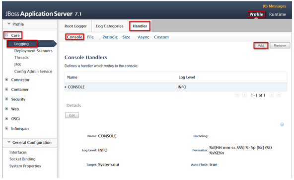
    
    **Figura 2 – Inserção do console Handler**

    -   Será exibida uma janela para informar os dados do console handler asterisk,
    informe os mesmos conforme apresentados na figura abaixo:

    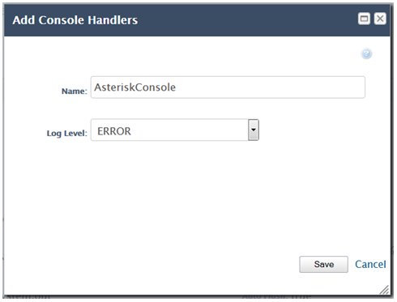
    
    **Figura 3 – Cadastro do console Handler**

    -   Após informar os dados, clique no botão *Save*;

    -   Clique em AsteriskConsole que acabou de adicionar e edite suas informações;

    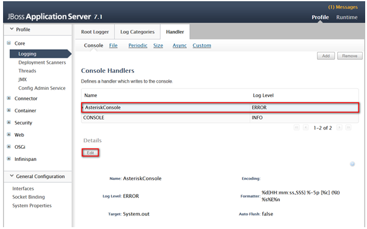
    
    **Figura 4 – Edição do console Handler**

    -   Marque o campo Auto flush e clique no botão *Save* conforme indicado na
    figura abaixo:

    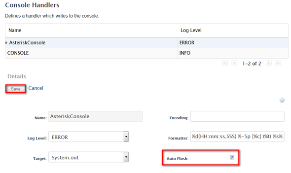
    
    **Figura 5 – Edição das informações do console Handler**

    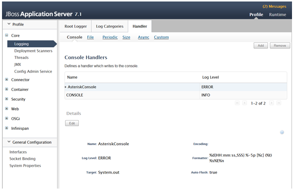
    
    **Figura 6 – Console Handler para Asterisk**

4.  Registre o handler de arquivo para o asterisk (essa configuração define o
    handler que criará o arquivo de LOG para o asterisk);

    -   Clique em File e logo em seguida clique no botão *Add*;

    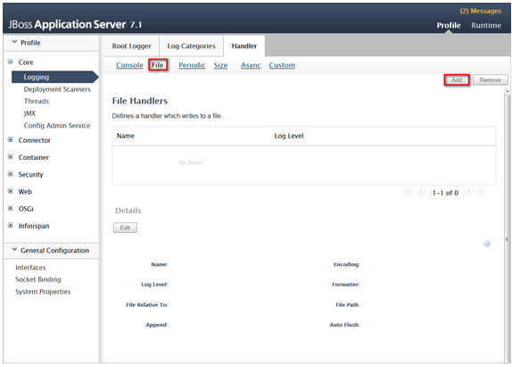
    
    **Figura 7 – Inserção do Handler de arquivo**

    -   Será exibida uma janela para informar os dados do handler de arquivo para o
    asterisk, informe os mesmos conforme apresentados na figura abaixo:

    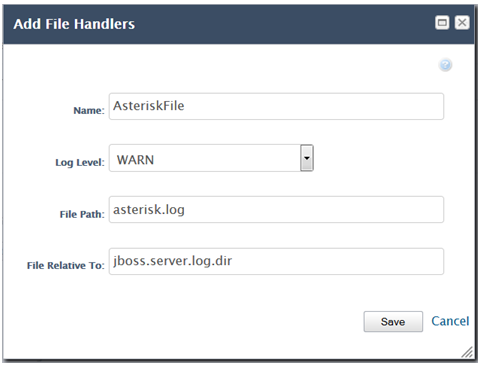
    
    **Figura 8 – Cadastro do Handler de arquivo**

    -   Após informar os dados, clique no botão *Save*;

    -   Clique em AsteriskFile que acabou de adicionar e edite suas informações;

    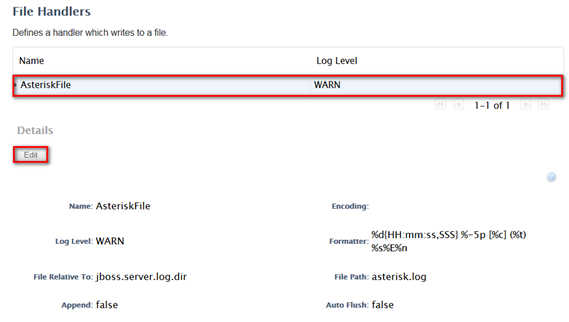
    
    **Figura 9 – Edição do Handler de arquivo**

    -   Marque os campos Append e Auto flush e clique no botão *Save* conforme
    indicado na imagem abaixo:

    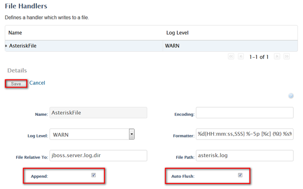
    
    **Figura 10 – Edição das informações do Handler de arquivo**

    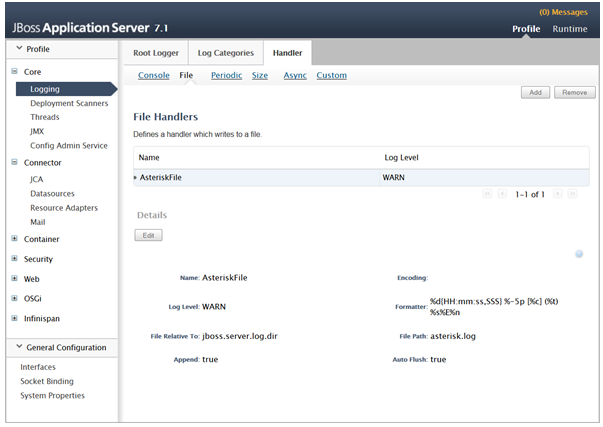
    
    **Figura 11 – Handlers de arquivo para Asterisk**

5.  Configure as categorias de LOG:

    -   Clique em Log Categories e logo em seguida clique no botão *Add* para
    adicionar uma categoria;

    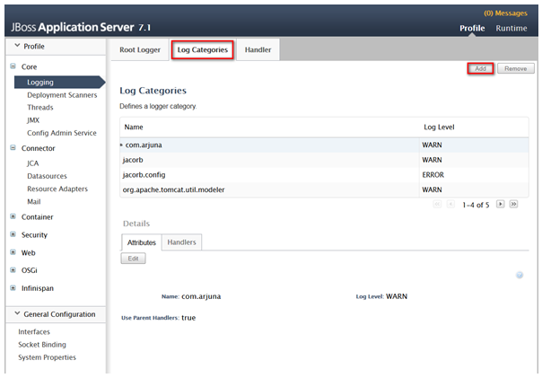
    
    **Figura 12 – Inserção de categorias de LOG**

    -   Será exibida uma janela para informar dos dados da categoria, informe os
    mesmos conforme apresentados na figura abaixo:

    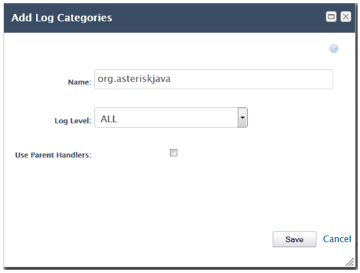
    
    **Figura 13 – Cadastro de categoria de LOG**

    -   Após informar os dados, clique no botão *Save*;

    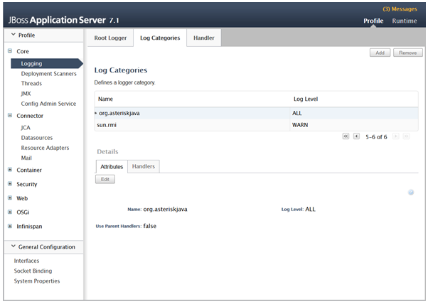
    
    **Figura 14 – Categoria de LOG**

    -   Clique na aba Handlers e logo em seguida no botão *Add*;

    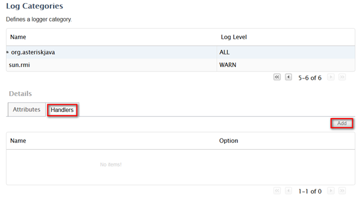
    
    **Figura 15 – Adição de Handlers da categoria de LOG**

    -   Será exibida uma janela para informar o handler da categoria. Adicione o
    handler AsteriskConsole e AsteriskFile;

    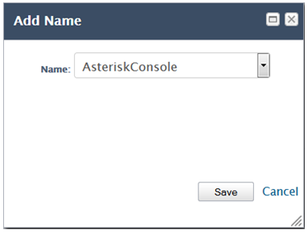
    
    **Figura 16 – Adição do Handler AsteriskConsole**

     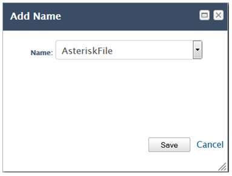
     
    **Figura 17 – Adição do Handler AsteriskFile**

    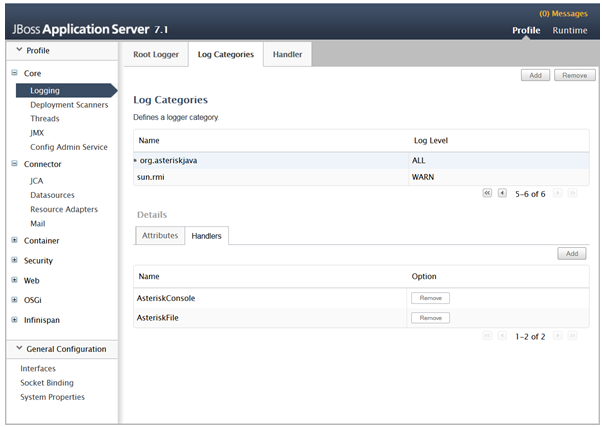
   
    **Figura 18 – Categoria de LOG para o Asterisk**

6.  Feito isso, feche a página de administração do console do servidor de
    aplicação JBoss 7 e reinicie o mesmo.

Configuração dos parâmetros do CITSmart
--------------------------------------

Para executar a funcionalidade de VoIP, é necessário configurar os parâmetros do
sistema:

1.  Preencher os parâmetros conforme conhecimento relacionado "Regras de
    parametrização - Telefonia".

!!! warning "ATENÇÃO"

    O CITSmart só emitirá alerta de ligação das filas de atendimento
    configuradas.

Utilização da funcionalidade de VoIP
-----------------------------------

Para trabalhar com a funcionalidade de VoIP é necessário registrar o ramal a ser
utilizado para o atendimento, conforme os passos descritos abaixo:

1.  Na tela inicial do CITSmart, clique em Atendimento, conforme indicado na
    imagem abaixo:

    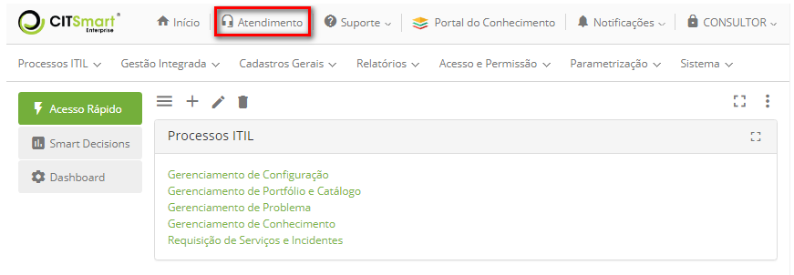
    
    **Figura 19 - Funcionalidade de atendimento (VoIP)**

2.  É apresentada a janela Ramal contendo um campo, onde se informa o número do
    ramal a ser utilizado para o atendimento;

    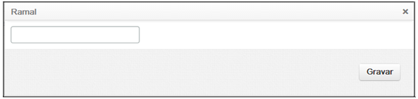
    
    **Figura 20 - Tela de configuração do ramal**

3.  Informe o número do ramal e clique no botão *Gravar* para efetuar a
    operação.

4.  Após a inserção do número do ramal, o sistema irá monitorá-lo, quando
    ocorrer uma chamada recebida, ou seja, quando uma ligação for direcionada
    para o número do ramal configurado, será exibida uma janela apresentando o
    número do telefone e o nome da pessoa que está ligando, conforme apresentada
    na imagem abaixo:

    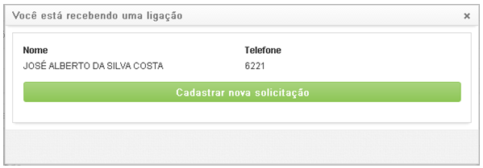
    
    **Figura 21 - Tela de aviso de ligação**

    !!! note "NOTA"

        É necessário que a pessoa que está ligando já possua cadastro no CITSmart,
        com os dados referentes.

5.  Caso o atendente queira registrar um ticket, basta clicar no
    botão *Cadastrar* nova solicitação que será aberta uma janela para que uma
    nova solicitação seja criada;

!!! note "NOTA"

     Para efetuar o registro da solicitação de serviço, o solicitante, ou seja,
     a pessoa que está solicitando o serviço deve estar cadastro no sistema e
     vinculado ao mesmo contrato do atendente.

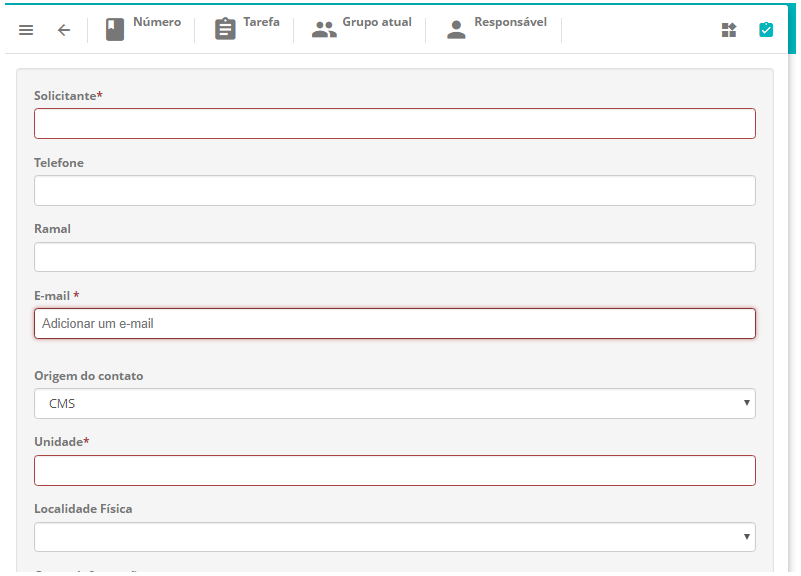

**Figura 22 - Tela de registro de ticket**

Veja também
-----------

[Regras de parametrização - Telefonia](1).

[1]:/pt-br/citsmart-platform-7/plataform-administration/parameters-list/parametrization-telephony.html

!!! tip "About"

    <b>Product/Version:</b> CITSmart | 8.00 &nbsp;&nbsp;
    <b>Updated:</b>7/26/2019 – Anna Martins
