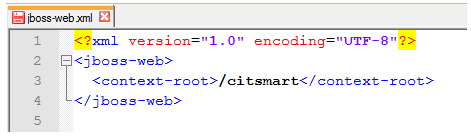
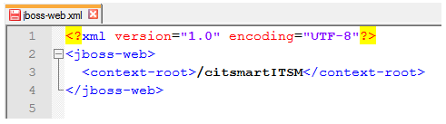
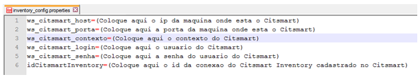
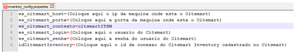
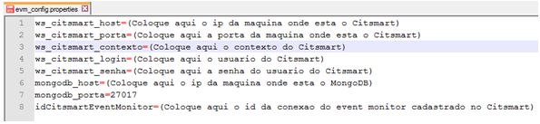
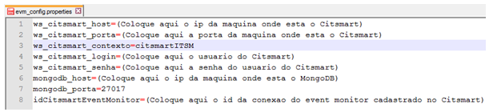
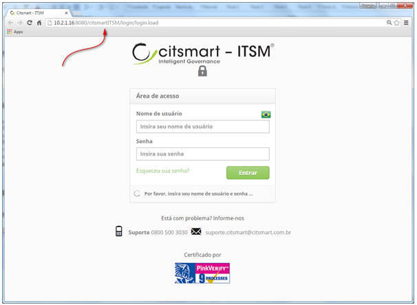

title: Manual de mudança de contexto
Description: Este documento tem por objetivo fornecer orientações para realizar a mudança do contexto do CITSmart.

# Manual de mudança de contexto

Este documento tem por objetivo fornecer orientações para realizar a mudança do
contexto do CITSmart.

Arquivo de deploy do citsmart (.war)
-----------------------------------

!!! note "NOTA"

    É necessário que a alteração do arquivo "jboss-web.xml"
    (\*.war/WEB-INF/jboss-web.xml) seja feita antes de subir a aplicação.

Configure o arquivo de deploy do CITSmart conforme orientação abaixo:

1.  Abra o arquivo “.war” do CITSmart, por exemplo: **citsmartITSM-JB7.war**;

2.  Entre no diretório **WEB-INF** e abra o arquivo **jboss-web.xml**. Feito
    isso, será exibido o script conforme ilustrado na figura abaixo:

    

    **Figura 1 - Script**

3.  Altere o contexto “citsmart” da forma que deseja. A figura abaixo ilustra um
    exemplo do contexto modificado:

    
   
    **Figura 2 - Script**

4.  Após a alteração, salve o arquivo.

    Após configuração do arquivo **jboss-web.xml**, e caso esteva utilizando os
    módulos Inventory e/ou EVM - Event Monitor deverá realizar uma alteração no
    arquivo de configuração do servidor de aplicação JBoss de ambos
    (**evm_config.properties** e **inventory_config.properties**). Caso não
    esteja utilizando esses módulos, poderá subir o sistema normalmente.

Inventory
---------

Caso esteja utilizando o módulo de Inventory, altere o arquivo de
configuração do servidor de aplicação JBoss conforme orientação abaixo:

1.  Abra o arquivo de configuração **inventory_config.properties** do JBoss
    (**\\standalone\\configuration\\inventory_config.properties**). Feito isso,
    será exibido o script conforme ilustrado na figura abaixo:

    
    
    **Figura 3 - Propriedades do Inventory**

2.  Na linha “**ws_citsmart_contexto**”, informe o novo contexto do CITSmart
    ITSM, conforme exemplo ilustrado na figura abaixo:

    
    
    **Figura 4 - Propriedades do Inventory**

3.  Após a alteração, salve o arquivo.

EVM - Event Monitor
------------------

Caso esteja utilizando o módulo de EVM - Event Monitor, altere o arquivo de
configuração do servidor de aplicação JBoss conforme orientação abaixo:

1.  Abra o arquivo de configuração **evm_config.properties** do JBoss
    (**\\standalone\\configuration\\evm_config.properties**). Feito isso, será
    exibido o script conforme ilustrado na figura abaixo:

    
    
    **Figura 5 - Propriedades do EVM**

2.  Na linha “**ws_citsmart_contexto**”, informe o novo contexto do CITSmart ,
    conforme exemplo ilustrado na figura abaixo:

    
    
    **Figura 6 - Propriedades do EVM**

3.  Após a alteração, salve o arquivo.

Novo contexto
------------

Após realizada a configuração para alteração do contexto, ao subir o sistema
será apresentado o novo contexto conforme exemplo ilustrado na figura abaixo.

    
**Figura 7 - Novo contexto**

!!! tip "About"

    <b>Product/Version:</b> CITSmart | 8.00 &nbsp;&nbsp;
    <b>Updated:</b>07/26/2019 – Anna Martins
