title: Manual de instalação on-premise (ITSM)
Description: Esse guia prático visa demostrar o passo a passo da instalação e
atualização da ferramenta CITSmart Enterprise.

# Manual de instalação on-premise (ITSM)

Esse guia prático visa demostrar o passo a passo da instalação e atualização da
ferramenta CITSmart Enterprise.

Pré-condições
------------

1.  O protocolo **https** é obrigatório, porém o Administrador pode optar por um
    certificado auto assinado.

2.  Segue a versão de cada Sistema Gerenciador de Banco de Dados compatível com
    a solução:

    -   PostGreSQL (9.2+)

    -   Microsoft SQL Server (2008+)

    -   ORACLE (10g+)

    -   MongoDB (3.4.5)

3.  Segue a versão de cada navegador compatível com a solução:

    -   Internet Explorer (10+)

    -   Mozilla Firefox (50+)

    -   Google Chrome (50+)

4.  Segue a versão de cada software básico compatível com a solução:

    -   Sistema operacional GNU / Linux com um kernel de 3.10+

    -   JBoss (7.1.2)

    -   Apache Solr (6.4.2)

    -   Java (1.7.0.80+)

    -   JMS Apache ActiceMQ (5.14.5+)

5.  A instalação do CITSmart é um processo automatizado e sua principal premissa
    é que a integridade do resultado só pode ser garantida se a instalação
    estiver completa e bem sucedida, desde o início até o fim. Em caso de falha,
    desligamento ou falha no ambiente operacional durante o processo de
    instalação, quando esta instalação for disparada novamente, uma mensagem
    será exibida para a equipe responsável pela instalação **("AVISO IMPORTANTE:
    Identificamos que algum tipo de problema ocorreu em uma execução anterior
    desse mesmo processo de instalação do Citsmart, que pode ter causado danos
    ao banco de dados. Portanto, como precaução, o arquivo de banco de dados
    atual não pode mais ser usado. Recomendamos que, manualmente, a equipe
    responsável por esta instalação substitua esse banco de dados por um novo e
    reinicia o processo de instalação")**. As etapas mais detalhadas são estas:

    -   Termine este processo de instalação;

    -   Exclua (manualmente) o arquivo de banco de dados;

    -   Crie o arquivo de banco de dados novamente;

    -   Reinicie o processo de instalação.

Requisitos mínimos
-----------------

-   O ambiente de execução do **servidor de aplicação** Jboss e o servidor de
    JMS Apache ActiceMQ deve possuir como requisitos mínimos:

|  Máquina                                                        |1 x GNU/Linux RedHat ou Debian (incluindo derivados)  |
|-----------------------------------------------------------------|------------------------------------------------------|
|                         **Memória**                             |                     **16 GB RAM**                    |
|                         **Disco**                               |                      **120 GB**                      |
|                     **Processadores**                           |                     **4 (vCPU)**                     |
|             **Leitura/Escrita em disco (I/O)**                  |                    **> 150 MB/s**                    |
|                          **Rede**                               |                    **> 100 Mbps**                    |
|**Saltos para soluções(Bancos, EVM, INV, MongoDB, Coletor WMI)** |              **Mesma rede, sem saltos**              |


**Tabela 1 - Requisitos Mínimos**

-   O ambiente de execução do **servidor de banco de dados** deve possuir como
    requisitos mínimos:

|                           Máquina                           | 1 x GNU/Linux RedHat ou Debian (incluindo derivados) |
|:-----------------------------------------------------------:|:----------------------------------------------------:|
|                         **Memória                           |                         4 GB                         |
|                            Disco                            |                        120 GB                        |
|                        Processadores                        |                       2 (vCPU)                       |
|                Leitura/Escrita em disco (I/O)               |                      > 150 MB/s                      |
|                             Rede                            |                      > 100 Mbps                      |
| Saltos para soluções (ISTM, EVM, INV, MongoDB, Coletor WMI) |                Mesma rede, sem saltos**              |


**Tabela 2 - Requisitos Mínimos**

   O ambiente de execução do **servidor de banco de dados
   não-relacional** MongoDB deve possuir como requisitos mínimos:

|                           Máquina                          | 1 x GNU/Linux RedHat ou Debian (incluindo derivados) |
|:----------------------------------------------------------:|:----------------------------------------------------:|
|                         **Memória                          |                         4 GB                         |
|                            Disco                           |                        120 GB                        |
|                        Processadores                       |                       2 (vCPU)                       |
|               Leitura/Escrita em disco (I/O)               |                      > 150 MB/s                      |
|                            Rede                            |                      > 100 Mbps                      |
| Saltos para soluções (Bancos, EVM, INV, ITSM, Coletor WMI) |                Mesma rede, sem saltos**              |


**Tabela 3 - Requisitos Mínimos**

-   O ambiente de execução do **servidor de indexação** Apache Solr deve
    possuir como requisitos mínimos:

|                           Máquina                           | 1 x GNU/Linux RedHat ou Debian (incluindo derivados) |
|:-----------------------------------------------------------:|:----------------------------------------------------:|
|                         **Memória                           |                         4 GB                         |
|                            Disco                            |                        120 GB                        |
|                        Processadores                        |                       2 (vCPU)                       |
|                Leitura/Escrita em disco (I/O)               |                      > 150 MB/s                      |
|                             Rede                            |                      > 100 Mbps                      |
| Saltos para soluções (ISTM, EVM, INV, MongoDB, Coletor WMI) |                Mesma rede, sem saltos**              |

**Tabela 4 - Requisitos Mínimos**

-   O ambiente de execução do **servidor ms-windows para coletas via WMI** deve
    possuir como requisitos mínimos:

|                         Máquina                        |       1 x Windows       |
|:------------------------------------------------------:|:-----------------------:|
|                       **Memória                        |          8 GB           |
|                          Disco                         |          80 GB          |
|                      Processadores                     |        8 (vCPU)         |
|             Leitura/Escrita em disco (I/O)             |       > 150 MB/s        |
|                          Rede                          |       > 100 Mbps        |
| Saltos para soluções (Bancos, EVM, INV, ITSM, MongoDB) |Mesma rede, sem saltos** |

**Tabela 5 - Requisitos Mínimos**

Software e download
------------------

  !!! info "IMPORTANTE"

      Recomendamos Red Hat, CentOS, Debian ou Ubuntu.

  !!! Abstract "SAIBA MAIS"

      Todos os nossos arquivos citados neste documento podem ser baixados
      acessando a área de download da CITSmart Corporation
      ([http://files.citsmart.com](http://files.citsmart.com/))

Para execução do CITSmart, baixaremos os pacotes necessários conforme o
procedimento relativo ao produto.

#### Servidor de Aplicação Jboss

Download do pacote conforme seu banco de dados (no manual utilizaremos o pacote
com PostgreSQL):

   -   Jboss (PostgreSQL) : jboss-7.1.2_postgres.tar.gz

   -   Jboss (Oracle): jboss-7.1.2_oracle.tar.gz

   -   Jboss (MSSQL): jboss-7.1.2_mssql.tar.gz

   -   Java JDK (qualquer banco): jdk1.7.0_80_x64.tar.gz

#### Servidor de JMS Apache ActiveMQ

   -   Apache ActiveMQ 5.14.5: apache-activemq-5.14.5.tar.gz

   -   Java JDK: jdk1.7.0_80_x64.tar.gz

#### Servidor de Banco de Dados MongoDB

   -   Para localizar o download conforme sua
    distribuição: <https://www.mongodb.com/download-center#community>

   -   Para o download do MongoDB para Ubuntu Server LTS
    16.04: <https://fastdl.mongodb.org/linux/mongodb-linux-x86_64-ubuntu1604-3.4.5.tgz>

#### Servidor de Banco de Dados PostgreSQL/Oracle/MSSQL

O CITSmart é compatível com o PostgreSQL ou superior e o download será feito no
momento da configuração dos pacotes.

Recomenda-se que instalações de Oracle ou MSSQL sejam efetuados conforme
informações e melhores práticas de cada fabricante:

-   *Oracle:* <https://docs.oracle.com/cd/E11882_01/server.112/e10897/toc.htm>

-   *MSSQL:* <https://docs.microsoft.com/en-us/sql/database-engine/install-windows/install-sql-server>.

#### Servidor de Indexação Apache Solr

-   Configurações para base de conhecimento:
    http://files.citsmart.com/base_conhecimento_configs.zip

Configuração dos pacotes
-----------------------

!!! note "NOTA"

     Utilizaremos o diretório /opt para instalação de todos os pacotes. O
     GNU/Linux com instalação mínima deve estar configurado nas 4 máquinas. Neste
     exemplo usaremos Unbuntu, caso queira usar outra distribuição altere os
     comandos conforme o gerenciamento de pacotes.

Com os downloads finalizados podemos dar início a instalação da solução
CITSmart.

## Servidor de Aplicação Jboss

1.  Devemos descompactar o pacote JAVA JDK no diretório /opt e criar dois links
    simbólicos para o /usr/bin. Recomendamos que seu ambiente não possua nenhum
    JAVA instalado. Execute java –version e confira a versão do java.

    ```sh
    # tar -xvzf jdk-1.7.0_80-linux-x64.tar.gz -C /opt/
    # ln -s /opt/jdk1.7.0_80/bin/java /usr/bin
    # ln -s /opt/jdk1.7.0_80/bin/keytool /usr/bin
    # java -version
    java version "1.7.0_80"
    ***Java(TM) SE Runtime Environment (build 1.7.0_80-b15)***
    ***Java HotSpot(TM) 64-Bit Server VM (build 24.80-b11, mixed mode)***
    ```

2.  Extraia o Jboss para o diretório /opt.

3.  No exemplo abaixo utilizamos o Jboss com o PostgreSQL configurado.

   ```sh
   # tar -xvzf jboss-7.1.2_postgres.tar.gz -C /opt/
   ```

4.  Agora devemos configurar o arquivo standalone-full.xml.

**Algumas configurações só serão possíveis após a instalação de todos os
componentes da solução**.

    ```sh
    <!-- SET TRUE TO ENABLE EVM -->
    <property name="citsmart.evm.enable" value="false"/>
    <!-- SET TRUE TO ENABLE INVENTORY -->
    <property name="citsmart.inventory.enable" value="false"/>
    <!-- SET MONGODB IP -->
    <property name="mongodb.host" value="IP_MONGODB"/>
    <!-- SET MONGODB PORT -->
    <property name="mongodb.port" value="PORT_MONGODB"/>
    <!-- SET MONGODB USER -->
    <property name="mongodb.user" value="USER_MONGODB"/>
    <!-- SET MONGODB PASSWORD -->
    <property name="mongodb.password" value="PASSWD_MONGODB"/>
    <!-- SET CITSMART IP -->
    <property name="citsmart.host" value="127.0.0.1"/>
    <!-- SET CITSMART PORT -->
    <property name="citsmart.port" value="8080"/>
    <!-- SET CITSMART CONTEXT -->
    <property name="citsmart.context" value="citsmart"/>
    <!-- SET CITSMART ADMINISTRATOR LOGIN -->
    <property name="citsmart.login" value="consultor"/>
    <!-- SET CITSMART ADMINISTRATOR PASSWORD -->
    <property name="citsmart.password" value="password"/>
    <!-- SET CITSMART INVENTORY ID -->
    <property name="citsmart.inventory.id" value="inventory_local"/>
    <!-- SET CITSMART EVM ID -->
    <property name="citsmart.evm.id" value="evm_local"/>
    ```
    
5.  As seções necessárias de configuração estão demonstradas abaixo e estarão
    explicadas na seção **"Parâmetros CITSmart"**.

6.  Para o banco de dados precisaremos de duas bases, chamadas de
    CITSMART_NAME_DB e CITGRP_NAME_DB.

7.  Existem **4 entradas** de datasource para o **CITSMART_NAME_DB**.

    ```sh
    <!-- SET YOUR DATABASE INFORMATION - CHANGE IP_DB, PORT_DB, CITSMART_NAME_DB, CITGRP_NAME_DB, USER_DB, PASSWD_DB -->
    <connection-url>jdbc:postgresql://IP_DB:PORT_DB/CITSMART_NAME_DB</connection-url>
    <driver>postgres</driver>
    <pool>
    <min-pool-size>10</min-pool-size>
    <max-pool-size>1000</max-pool-size>
    <prefill>true</prefill>
    <flush-strategy>FailingConnectionOnly</flush-strategy>
    </pool>
    <security>
    <user-name>USER_DB</user-name>
    <password>PASSWD_DB</password>
    ```

8.  Existem **9 entradas** de datasource para o **CITGRP_NAME_DB**.

    ```sh
    <!-- SET YOUR DATABASE INFORMATION - CHANGE IP_DB, PORT_DB, CITSMART_NAME_DB, CITGRP_NAME_DB, USER_DB, PASSWD_DB -->
    <connection-url>jdbc:postgresql://IP_DB:PORT_DB/CITGRP_NAME_DB</connection-url>
    <driver>postgres</driver>
    <pool>
    <min-pool-size>10</min-pool-size>
    <max-pool-size>1000</max-pool-size>
    <flush-strategy>IdleConnections</flush-strategy>
    </pool>
    <security>
    <user-name>USER_DB</user-name>
    <password>PASSWD_DB</password>
    ```
    
**Servidor de JMS Apache ActiveMQ**

Descomprima o ActiveMQ e JAVA no diretório /opt e crie o link simbólico do JAVA.

    ```sh
    # tar -xvzf apache-activemq-5.14.5.tar.gz -C /opt/
    # tar -xvzf jdk-1.7.0_80-linux-x64.tar.gz -C /opt/
    # ln -s /opt/jdk1.7.0_80/bin/java /usr/bin
    ```

**Servidor de Banco de Dados MongoDB**

1.  Após baixar o MongoDB para sua correta distribuição, deve-se efetuar a
    descompressão para o diretório /opt.

    ```sh
    # tar -xvzf mongodb-linux-x86_64-ubuntu1604-3.4.5.tgz -C /opt/
    ```

2.  Devemos criar um diretório para a base e iniciar o MongoDB. Repare que ele
    irá subir com permissões irrestritas de acesso.

    ```sh
    # mkdir -p /data/db
    # cd /opt/mongodb-linux-x86_64-ubuntu1604-3.4.5/bin/
    #./mongod
    <mensagens de acesso irrestrito>
    ```

3.  Com o MongoDB iniciado, abra outro terminal, acesse o diretório bin do
    MongoDB e crie a base CITSmart definindo seu usuário e senha.

4.  O retorno “**Successfully added user**” deve ser observado.

5.  Digite exit para sair do console do MongoDB.

    ```sh
    # cd /opt/mongodb-linux-x86_64-ubuntu1604-3.4.5/bin/
    # ./mongo
    <mensagens de acesso irrestrito>
    use admin
    db.createUser({
    user: "admin",
    pwd: "yourpassword",
    roles:[
    { role: "root", db: "admin" },
    { role: "dbOwner", db: "citsmart" }
    ]
    })
    ```

6.  Retorne ao terminal anterior e finalize o processo do mongodb com um CTRL+C.
   
Servidor de banco de dados postgresql/oracle/mssql
-------------------------------------------------

1.  O PostgreSQL podemos instalar diretamente do repositório da distribuição
    caso seja igual ou superior a versão 9.2.

2.  No manual estamos utilizando o Ubuntu Server LTS 16.0.4 que possuí a versão
    9.5 no repositório.
    
    ```sh
    # apt-get update
    # apt-get install postgresql-9.5
    ```
3.	Após instalar o PostgreSQL precisamos criar a base de dados, usuário e senha.

    ```sh
    # systemctl start postgresql
    # su – postgres
    $ psql
    postgres=# create user citsmart with password 'yourpassword';
    <mensagem CREATE ROLE>
    postgres=# create database citsmartdb with owner citsmart encoding 'UTF8' tablespace pg_default;
    <mensagem CREATE DATABASE>
    postgres=# create database citgrpdb with owner citsmart encoding 'UTF8' tablespace pg_default;
    <mensagem CREATE DATABASE>
    postgres=# alter role citsmart superuser;
    <mensagem ALTER ROLE>
    postgres=#exit
    ```
    !!! info "IMPORTANTE"
    
        Observe o retorno dos comandos analisando a correta execução.
    
4.	Agora iremos configurar o /etc/postgresql/9.5/main/pg_hba.conf para permitir a conexão do Jboss para a database e usuário do citsmart. No final do arquivo altere as linhas:    
    
    ````sh
    Padrão:
    host all all 127.0.0.1/32 md5
    Alterado:
    host CITSMART_NAME_DB USER_DB IP_JBOSS/32 md5
    host CITGRP_NAME_DB USER_DB IP_JBOSS/32 md5
    ````

5.	Hora de abrir o listening no arquivo /etc/postgresql/9.5/main/postgresql.conf .
6.	Após as configurações, de um restart no postgresql.


    ````sh
    Padrão está comentado:
    #listen_addresses = 'localhost'
    Alterado:
    listen_addresses = ‘0.0.0.0'
    # systemctl restart postgresql
    ````
    
Servidor de indexação apache Solr
-------------------------------

1.  Instale o pacote unzip conforme sua distribuição.

2.  Descompacte o JAVA e Solr para /opt/.
    
    ````sh 
    # apt-get install unzip
    # unzip -x solr-6.4.2.zip -d /opt/
    # tar -xvzf jdk-8u131-linux-x64.tar.gz -C /opt
    # ln -s /opt/jdk1.8.0_131/bin/java /usr/bin/
    # java -version
    java version "1.8.0_131"
    Java(TM) SE Runtime Environment (build 1.8.0_131-b11)
    Java HotSpot(TM) 64-Bit Server VM (build 25.131-b11, mixed mode)
    ````

3.	Crie um usuário para execução do Solr com shell falso e de permissão no diretório do Solr para ele e inicie.

    ````sh
    # useradd -s /bin/false solr
    # chown -R solr /opt/solr-6.4.2/
    # sudo -u solr /opt/solr-6.4.2/bin/solr start
    ````
4.	Descomprima o arquivo para configurações da base de conhecimento e execute a criação da collection.

    ````sh
    # unzip -x base_conhecimento_configs.zip -d /opt/solr-6.4.2/
    # cd /opt/solr-6.4.2
    # sudo -u solr /opt/solr-6.4.2/bin/solr create -c base_conhecimento -d base_conhecimento_configs -s 2 -rf 2
    ````
5.	Observe o retorno do comando com “Creating new core 'base_conhecimento” e o “status”:0.


 Parâmetros CITSmart
 ------------------

!!! warning "ATENÇÃO"

    Todos os parâmetros devem ser configurados antes do start completo da
    solução.

    
-   ***False ou true para habilitar/desabilitar o EVM. Padrão false.***

       *\<property name="citsmart.evm.enable" value="false"/\>*

-   ***False ou true para habilitar/desabilitar o INV. Padrão False.***

       *\<property name="citsmart.inventory.enable" value="false"/\>*

-   ***Configure o IP do MongoDB conforme rede do servidor do MongoDB.***

       *\<property name="mongodb.host" value="IP_MONGODB"/\>*

-   ***Configure a PORTA do MongoDB conforme sua instalação. Padrão 27017.***

       *\<property name="mongodb.port" value="PORT_MONGODB"/\>*

-   ***Configure o USER do MongoDB conforme. Manual padrão admin.***

       *\<property name="mongodb.user" value="USER_MONGODB"/\>*

-   ***Configure a SENHA do MongoDB conforme. Manual padrão yourpassword.***

       *\<property name="mongodb.password" value="PASSWD_MONGODB"/\>*

-  ***Configure o IP do Jboss conforme sua rede. Manual padrão 127.0.0.1.***

       *\<property name="citsmart.host" value="127.0.0.1"/\>*

-   ***Configure a PORTA do Jboss conforme sua rede. Manual padrão 8080.***

       *\<property name="citsmart.port" value="8080"/\>*

-   ***Configure o contexto do deploy citsmart. Manual padrão citsmart.***

       *\<property name="citsmart.context" value="citsmart"/\>*

-   ***Configure o contexto do deploy citsmart. Manual padrão consultor.***

       *\<property name="citsmart.login" value="consultor"/\>*
    
-   ***Configure a SENHA do citsmart. Manual padrão password.***

       *\<property name="citsmart.password" value="password"/\>*

-   ***INV ID para criação no citsmart. Padrão inventory_local.***

       *\<property name="citsmart.inventory.id" value="inventory_local"/\>*

-   ***EVM ID para criação no citsmart. Padrão evm_local.***

       *\<property name="citsmart.evm.id" value="evm_local"/\>*

-   ***DataSource do standalone-full.xml***

       *\<connection-url\>jdbc:postgresql://IP_DB:PORT_DB/CITSMART_NAME_DB\</connection-url\>*

       *\<connection-url\>jdbc:postgresql://IP_DB:PORT_DB/CITGRP_NAME_DB\</connection-url\>*

       *\<user-name\>USER_DB\</user-name\>*

       *\<password\>PASSWD_DB\</password\>*

-   ***IP_DB: configuração de rede do servidor de banco de dados PostgreSQL.***

-   ***PORT_DB: Padrão 5432(PostgreSQL).***

-   ***CITGRP_NAME_DB: Manual criado como citgrpdb.***

-   ***CITSMART_NAME_DB: Manual criado como citsmartdb.***

-   ***USER_DB: Usuário de acesso a base. Manual criado com citsmart.***

-   ***PASSWD_DB: Senha de acesso do usuário de banco. Manual criado com
    yourpassword.***
   
 Configuração do processamento batch (arquivo quartz.properties)
 ----------------------------------------------------------

### Ambiente Cluster

Abaixo são apresentados os passos que devem ser realizados para configurar a
rotina de **processamento batch** do CITSmart para ambiente clusterizado.

   !!! warning "ATENÇÃO"

      Nunca utilize a rotina de processamento batch em ambiente clusterizado,
      sem que o horário dos servidores seja sincronizado. Portanto, não realize as
      configurações sem que, primeiramente, os servidores estejam com esta
      sincronização ativa.

1.  Adicionar o arquivo *quartz.properties* disponibilizado no deploy da versão
    e correspondente ao banco de dados utilizado, diretamente na pasta
    “configuration” do diretório standalone ou domain do JBoss, dependendo da
    instalação desejada. Edite este arquivo e realize as seguintes
    configurações:

-   Verificar se a propriedade *org.quartz.jobStore.driverDelegateClass* é
    correspondente ao banco de dados da instalação:

    -   Postgresql = *org.quartz.impl.jdbcjobstore.PostgreSQLDelegate*

        -   Oracle = *org.quartz.impl.jdbcjobstore.oracle.OracleDelegate*

        -   Microsoft SQL Server = *org.quartz.impl.jdbcjobstore.MSSQLDelegate*

    -   Alterar a propriedade *org.quartz.jobStore.dataSource* para que seja
        exatamente igual ao **pool-name** que foi informado no arquivo de
        configuração do JBoss: standalone.xml ou domain.xml;

    -   Se o ambiente for clusterizado a
        propriedade *org.quartz.jobStore.isClustered* deverá estar *true*;

    -   Alterar a propriedade *org.quartz.dataSource.citsmart.jndiURL* para a
        mesma URL do **jndi-name** presente no arquivo de configuração do JBoss.

2.  Abaixo é apresentada uma imagem ilustrando os locais do
    arquivo *quartz.properties *que devem ser avaliados:

    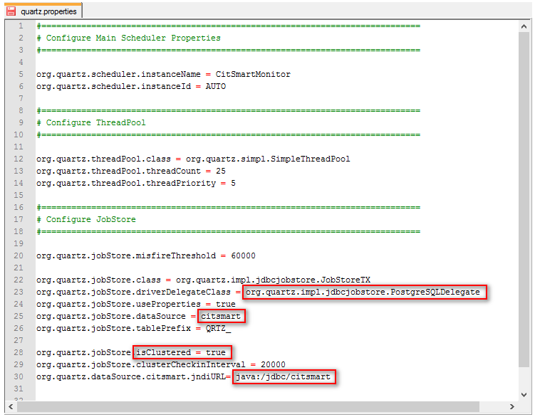
    
    **Figura 1 - Arquivo quartz.properties**

3.	No arquivo de configuração do JBoss standalone.xml ou domain.xml, incluir na tag system-properties a propriedade                org.quartz.properties, conforme indicado abaixo: 
 
    ````sh
    <system-properties>
    <property name="org.apache.tomcat.util.http.Parameters.MAX_COUNT" value="2000"/>
    <property name="mongodb.host" value="localhost"/>
    <property name="mongodb.port" value="27017"/>
    <property name="mongodb.user" value="admin"/>
    <property name="mongodb.password" value="admin"/>
    <property name="citsmart.evm.enable" value="true"/>
    <property name="citsmart.inventory.enable" value="false"/>
    <property name="esper.threads" value="4"/>
    <property name="org.quartz.properties" value="${jboss.server.config.dir}/quartz.properties"/>
    </system-properties>
    ````
    
### Ambiente Standalone

Abaixo são apresentados os passos que devem ser realizados para configurar a
rotina de **processamento batch** do CITSmart em ambiente standalone.

1.  Adicionar o arquivo *quartz.properties* disponibilizado no deploy da versão
    para ambiente standalone, diretamente na pasta “configuration” do diretório
    standalone do JBoss.

2.  No arquivo de configuração do JBoss *standalone.xml, *incluir na
    tag *system-properties* a propriedade** org.quartz.properties**, conforme
    indicado abaixo:

    ````sh
    \<system-properties\>

    \<property name="org.apache.tomcat.util.http.Parameters.MAX_COUNT"
    value="2000"/\>

    \<property name="mongodb.host" value="localhost"/\>

    \<property name="mongodb.port" value="27017"/\>

    \<property name="mongodb.user" value="admin"/\>

    \<property name="mongodb.password" value="admin"/\>

    \<property name="citsmart.evm.enable" value="true"/\>

    \<property name="citsmart.inventory.enable" value="false"/\>

    \<property name="esper.threads" value="4"/\>

    \<property name="org.quartz.properties"
    value="\${jboss.server.config.dir}/quartz.properties"/\>

    \</system-properties\>
    ````
    
3.  Configure o arquivo *citsmart.cfg*. A configuração padrão do CITSmart não
    utiliza o banco de dados para armazenar os Jobs do quartz, portanto,
    torna-se necessária a carga deles, na memória, durante a inicialização. Para
    isso, é necessário adicionar no arquivo *citsmart.cfg* o
    parâmetro:* *INICIAR_PROCESSAMENTOS_BATCH=TRUE

Download dos deploys do CITSmart
--------------------------------

Com os deploys em mãos, mova-os para o diretório deployments do Jboss.
 
    ````sh
    # cp <deploy 1>.war /opt/jboss-7.1.2/standalone/deployments/
    # cp <deploy 2>.war /opt/jboss-7.1.2/standalone/deployments/
    # cp <deploy 3>.war /opt/jboss-7.1.2/standalone/deployments/
    <continue conforme os deploys disponíveis para sua subscrição>
    ````

Criação de diretórios para instalação
------------------------------------

Crie os diretórios abaixo para serem configurados nos 3 passos de instalação
web.
    
    ````sh
    ***Para GED***:
    mkdir /opt/citsmart/ged
    ***Para Base de Conhecimento***:
    mkdir /opt/citsmart/kb
    ***Para Palavras Gêmeas***:
    mkdir /opt/citsmart/twinwords
    ***Para Anexos de Base de Conhecimento***:
    mkdir /opt/citsmart/attachkb
    ***Para Upload***:
    mkdir /opt/citsmart/upload

Geração de certificado auto assinado SSL
---------------------------------------

!!! info "IMPORTANTE"

    Para o JBoss será gerado um certificado auto-assinado. Caso você possua um
    certificado é importante usá-lo.

1.  Conecte no servidor do Jboss.

    ````sh
    ***Deletando alias antigos***.
    # /opt/jdk1.7.0_80/bin/keytool -keystore /opt/jdk1.7.0_80/jre/lib/security/cacerts -delete -alias GRPv1
    ***Criando alias novo com DNS (exemplo sub.example.com)***:
    # /opt/jdk1.7.0_80/bin/keytool -genkey -alias GRPv1 -keyalg RSA -keystore /opt/jboss-                 7.1.2/standalone/configuration/GRPv1.keystore -ext san=dns:sub.example.com -validity 3650 -storepass 123456
    ***Criando alias com IP do serviodor do Jboss (exemplo 10.2.1.82)***:
    # /opt/jdk1.7.0_80/bin/keytool -genkey -alias GRPv1 -keyalg RSA -keystore /opt/jboss-  7.1.2/standalone/configuration/GRPv1.keystore -ext san=ip:10.2.1.82 -validity 3650 -storepass 123456
    ***Exportando certificado para extensão .cer***:
    # /opt/jdk1.7.0_80/bin/keytool -export -alias GRPv1 -keystore /opt/jboss-7.1.2/standalone/configuration/GRPv1.keystore -    validity 3650 -file /opt/jboss-7.1.2/standalone/configuration/GRPv1.cer
    ***Adicionando certificado no cacerts do Java***:
    # /opt/jdk1.7.0_80/bin/keytool -keystore /opt/jdk1.7.0_80/jre/lib/security/cacerts -importcert -alias GRPv1 -file /opt/jboss-7.1.2/standalone/configuration/GRPv1.cer
    ````
    
    ````sh
    ***Atual***:
    <!-- SET YOUR SSL OPTIONS
    <connector name="https" protocol="HTTP/1.1" scheme="https" socket-binding="https" secure="true">
    <ssl name="citsmart-ssl" key-alias="GRPv1" password="123456" certificate-key-file="${jboss.server.config.dir}/GRPv1.keystore"/>
    </connector>
    -->
    ***Remova o “<!-- SET YOUR SSL OPTIONS” e “-->”***:
    <connector name="https" protocol="HTTP/1.1" scheme="https" socket-binding="https" secure="true">
    <ssl name="citsmart-ssl" key-alias="GRPv1" password="123456" certificate-key-file="${jboss.server.config.dir}/GRPv1.keystore"/>
    </connector>
    ````
1.  Após a geração do certificado, descomente
    no **/opt/jboss-7.1.2/standalone/configuration/standalone-full.xml** do
    jboss.

Iniciando as soluções seguindo dependências
-----------------------------------------

Você pode criar as daemons conforme padrão de sua empresa ou iniciar as soluções
no terminal.
    
***Servidor de Banco de Dados PostgreSQL***
    
````sh
# systemctl postgresql start
````

***Servidor de Banco de Dados MongoDB***

````sh
# systemctl postgresql start
````
***Servidor de Indexação Apache Solr***

````sh
# sudo -u solr /opt/solr/bin/solr start
````

***Servidor de JMS Apache ActiveMQ***

````sh
# /opt/apache-activemq-5.14.5/bin/activemq start
````

***Servidor de Aplicação Jboss***

````sh
# /opt/jboss-7.1.2/bin/standalone.sh -Djboss.bind.address=0.0.0.0
````
 

Acesso ao CITSmart Enterprise
----------------------------

-   Para acessar o CITSmart, devemos acessar o IP ou DNS seguido da porta e
    contexto.
    
    **Exemplo de URL: https://10.2.1.82:8080/citsmart**

    -   O IP é o endereçamento da máquina onde o Jboss está em execução. Ao invés do
    IP pode-se utilizar um endereço DNS. O IP 10.2.1.82 é um exemplo de ip
    utilizado para a criação desse ambiente.

    -   O contexto citsmart é o padrão do CITSmart Enterprise ITSM.

    **Primeiro Acesso: **Digite a URL

    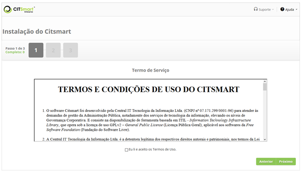
    
    **Figura 2 - Tela inicial da instalação**

1.  Aceite o termo de uso e clique em *Próximo*;

    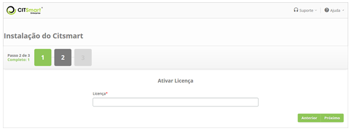
    
    **Figura 3 - Tela de ativação de licença**

1.  Informe a licença e clique em *Próximo*.

    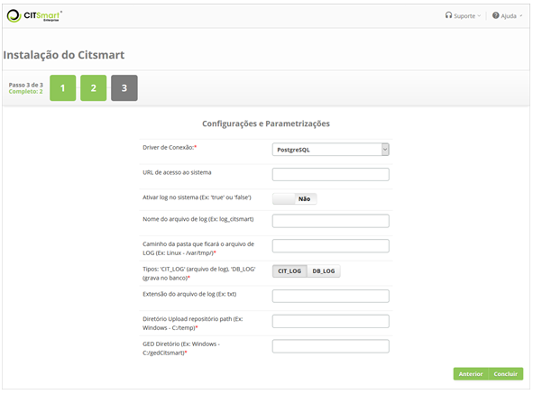
    
    **Figura 4 - Tela de configuração**

1.  Configure os parâmetros do sistema, informando para cada atributo seu
    respectivo valor e clique em *Concluir*;

    -   **32 - DB - nome do SCHEMA do Banco de dados - (Ex: Postgres - public)**;

    -   **33 - URL de acesso ao sistema**: informe a URL do sistema;

    -   **52 - Ativar log no sistema (Ex: ‘true’ ou ‘false’)**: defina se deseja
    ativar o LOG de auditoria no sistema;

    -   **55 - Nome do arquivo de log (Ex: log_citsmart)**: informe o nome para o
    arquivo de LOG. Os arquivos de LOG serão gravados com nome conforme definido
    neste parâmetro;

    -   **54 - Caminho da pasta que ficará o arquivo de LOG (Ex: Linux -
    /var/tmp/):** informe o diretório para armazenar os arquivos de LOG;

    -   **53 - Tipos: 'CIT_LOG' (arquivo de log), 'DB_LOG' (grava no banco)**:
    Defina o tipo de LOG. Se o tipo de LOG selecionado for 'CIT_LOG', será salvo
    o arquivo de LOG no diretório (definido no parâmetro anterior). Se for
    selecionado 'DB_LOG', será gravado o arquivo de LOG em banco de dados;

    -   **56 - Extensão do arquivo de log **(**Ex: txt):** informe a extensão do
    arquivo de LOG: txt;

    -   **44 - Diretório Upload repositório path (Ex: Windows -
    C:/temp)**:* *informe o* *diretório padrão para armazenar os arquivos que
    serão feitos upload;

    -   **18 - GED Diretório (Ex: Windows - C:/gedCitsmart)**: informe o diretório
    para manipulação dos arquivos do GED (Gerenciamento Eletrônico de
    Documento).

    -   **363 - URL do Help (Ex.: https://help.citsmart.com/citsmart)**: informe
    exatamente o conteúdo **https://help.citsmart.com/citsmart) **para que esta
    nova instalação possa usufruir do Guia do Usuário (o help do produto).

    !!! note "NOTA"

        Se for utilizado um servidor de arquivos separado, incluir no caminho
        do diretório o link de acesso ao servidor.

1.  Depois de concluído o processo de instalação, será exibida a tela de login
    do CITSmart, conforme apresentada na imagem abaixo:

    

    **Figura 5 - Tela de login**

1.  Informe as credenciais de acesso ao sistema (login: admin, senha: citsmart)
    e clique no botão *Entrar*. Feito isso, será exibida a tela inicial do
    CITSmart, conforme ilustrada na imagem abaixo:

    
    
    **Figura 6 - Tela inicial do sistema**
 
Utilizando o postfix no centos7 para envio de e-mails a partir do citsmart (apenas para versão community)
--------------------------------------------------------------------------------------------------------

#### Pré-condições

1.  Ter acesso como root no servidor.

#### Instalando e configurando o postfix

Siga os passos:

1.  Atualizar o sistema: **yum update –y;**

2.  Instalação dos pacotes centos: **yum -y install postfix cyrus-sasl-plain
    mailx;**

3.  Reiniciar o sistema: **systemctl restart postfix;**

4.  Habilitar no boot do sistema: **systemctl enable postfix;**

5.  Entre no diretório:** cd /etc/postfix:**

6.  Fazer uma cópia dos arquivos: **cp main.cf main.cf.original;**

7.  Limpar todo o conteúdo do: **rm –rf /etc/postfix.main.cf;**

8.  Após apagar os arquivos adicionamos essas configurações:
 
***vim /etc/postfix/main.cf
myhostname = hostname.example.com
relayhost = [smtp.gmail.com]:587
smtp_use_tls = yes
smtp_sasl_auth_enable = yes
smtp_sasl_password_maps = hash:/etc/postfix/sasl_passwd
smtp_tls_CAfile = /etc/ssl/certs/ca-bundle.crt
smtp_sasl_security_options = noanonymous
smtp_sasl_tls_security_options = noanonymous***
 
1.  Entre no diretório do postfix: **cd /etc/postfix;**

2.  Criar o Arquivo de Senha: **touch sasl_passwd;**

3.  Adicionar o seguinte conteúdo: **vim
    /etc/postfix/sasl_passwd[smtp.gmail.com]:587 seuemail :sua senha**;

4.  Permissão usuário dono para postfix: **chown root:postfix
    /etc/postfix/sasl_passwd\* ;**

5.  Permissão para o grupo dono: **chmod -Rvf 640 /etc/postfix/sasl_passwd ;**

6.  Validar as configurações. Após executar esse comando se não der erro
    significa que as configurações, estão corretas: **postmap
    /etc/postfix/sasl_passwd ;**

7.  Reiniciar o postfix: **systemctl restart postfix** ;

8.  Testar o envio com o comando: **echo "This is a test." \| mail -s "test
    message" seuemail**;

9.  Ver os logs de envio: **tail -f /var/log/maillog**;

10. Observar a linha Status=sent 250.2.0.0 OK significa que o e-mail foi enviado
    corretamente ao destinatário:
    
    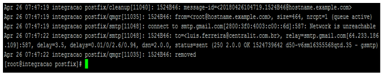
    
    **Figura 7 - Status=sent 250.2.0.0 OK**

1.  Configurar os parâmetros do CITSmart :

    -   10, 11, 12, 13, 14, 199 e 269 (ver conhecimento [Regras de parametrização -
    e-mail]().

1.  Desta forma, o CITSmart utiliza o servidor local como relay para envio de
    e-mails.
    
Utilizando o postfix no Ubuntu para envio de e-mails a partir do citsmart (apenas para versão Community)
----------------------------------------------------------------------------------------------------

#### Pré-condições

1.  Possuir acesso ao admin ao Postfix e garantir relação de confiança entre
    servidores.

### Instalação e configuração do postfix

Siga os passos:

1.  Atualizar o sistema: **apt update && apt upgrade -y;**

2.  Instalação dos pacotes Ubuntu Server 16.04: **apt-get install postfix
    mailutils libsasl2-2 ca-certificates libsasl2-modules -y;**

3.  Escolha a opção **Site da Internet;**

4.  Colocar **hostname;**

5.  Edite as configurações do postfix adcione a linha e abaixo dela, coloque o
    resto das configurações:

    **vim /etc/postfix/main.cf**

    **relayhost = [smtp.gmail.com]:587**

    **smtp_sasl_auth_enable = yes**

    **smtp_sasl_password_maps = hash:/etc/postfix/sasl_passwd**

    **smtp_sasl_security_options = noanonymous**

    **smtp_tls_CAfile = /etc/postfix/cacert.pem**

    **smtp_use_tls = yes**

1.  Criar password e db files colocar e-mail válido e senha que substitua o
    exemplo\@gmail.com pelo e-mail. Depois coloque a senha e e-mail. Entre no
    diretório: **cd /etc/postfix/sasl** e depois crie o arquivo: **touch
    sasl_passwd**;

2.  Editar: **vim sasl_passwd **;

3.  Coloque o e-mail real logo depois seguido dois pontos e a
    senha: **[smtp.gmail.com]:587 exemplo\@gmail.com:123** ;

4.  Criar o hash e database do postfix, após executar esse comando se não
    apresentar erro significa, que as configurações foram adicionadas de forma
    correta: **postmap /etc/postfix/sasl/sasl_passwd**;

5.  Adicionar usuário root criando o dono e suas permissões: **chmod 400 -Rvf
    /etc/postfix/sasl/sasl_passwd**:

6.  Criar o certificado de cadeia: **cat
    /etc/ssl/certs/thawte_Primary_Root_CA.pem \| sudo tee -a
    /etc/postfix/cacert.pem** :
    
    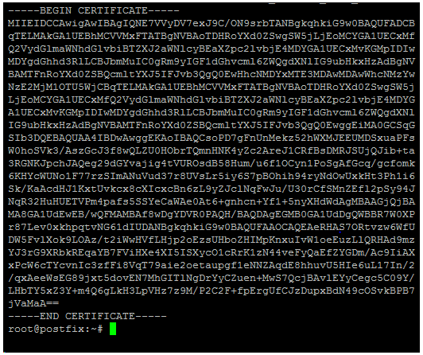
    
    **Figura 8 - Certificado gerado**

1.  Testando o envio de e-mail substitua, pelo meu e-mail que foi atribuído:
    echo "**Test Email message cerbody" \| mail -s "Email test subject"
    test\@example.com **;

2.  Checar se realmente o e-mail foi enviado: **tail -f /var/log/mail.log**:

    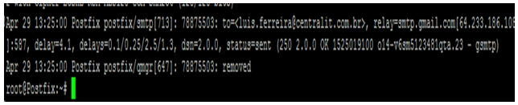
    
    **Figura 9 - Observar status=sent 250.2.0.0 OK**

1.  Configurar os parâmetros do CITSmart:

    -   10, 11, 12, 13, 14, 199, 269 (ver conhecimento [Regras de parametrização -
    e-mail]()

1.  Desta forma, o CITSmart utiliza o servidor local como relay para envio de
    e-mails.
    
Recomendações para a atualização de versão deste produto
------------------------------------------------------

#### Pré-condições

Para realizar o processo de atualização do Citsmart deve realizar os
procedimentos de segurança que são:

-   Backup das Visões;

-   Backup da Aplicação;

-   Backup do Servidor.

!!! note "NOTA"

    A partir da versão 7.2.2.0 o parâmetro 363 passou a ser essencial para o
    acesso automático da sua instância com o Guia do Usuário (o help do
    produto). Ele deve ser preenchido com: https://help.citsmart.com/citsmart

Backup das visões
-----------------

1.  No menu principal, posicione o mouse nas opções **Sistema > Visões e
    Meta dados > Manutenção de Visões**;

2.  Será exibida tela de Visão;

    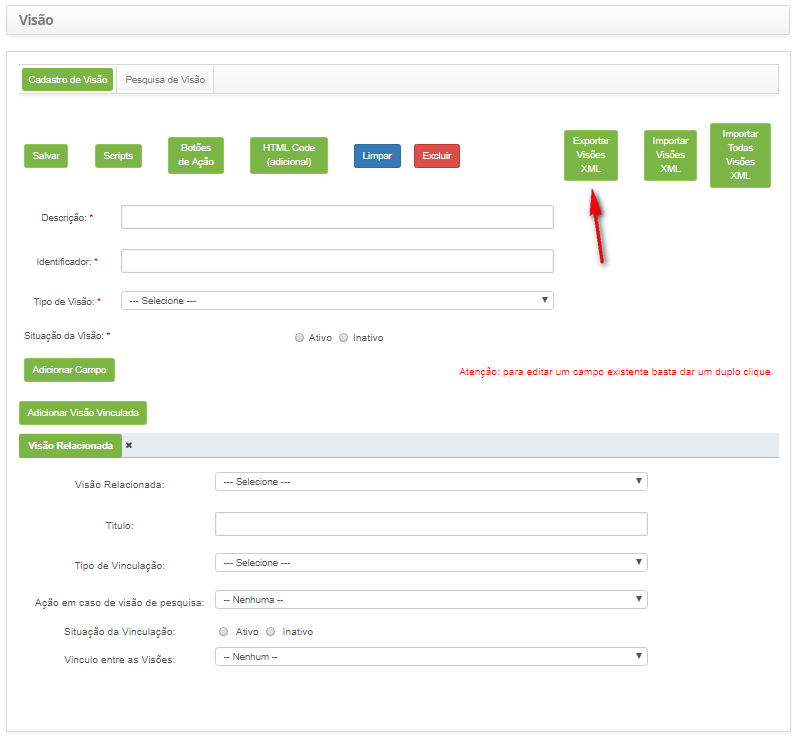
    
    **Figura 10 - Visões**

1.  Clique no botão “Exportar Visões XML”;

2.  Será exibida uma janela para seleção das visões a serem exportadas;

    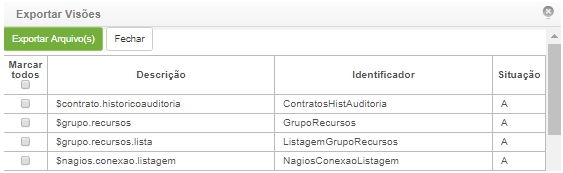
    
    **Figura 11 - Exportação de visões**

1.  Selecione todas as visões, marcando a opção “Marcar todos” e clique no botão
    “Exportar Arquivo(s)”.

2.  Será exibida uma janela para realização da exportação (download) do arquivo
    de visões;

3.  Realize o download do arquivo de visões;

4.  O arquivo será salvo no local de download padrão no computador.

Backup da aplicação
-------------------

Realize o backup da aplicação conforme os passos descritos abaixo:

-   Entre na pasta deployments do JBoss (\\standalone\\deployments);

-   Copie o projeto “citsmart_\*\*\*.war” para um local seguro.

Backup do servidor
------------------

É recomendado realizar o backup da base de dados do CITSmart e utilizar a
prática de snapshot da máquina virtual para acelerar o processo de rollback,
pois é uma prática segura e disponível em todas as plataformas de virtualização
disponíveis no mercado.

Caso tenha alguma dúvida para realizar o backup da base de dados, entre em
contato com a equipe de suporte do CITSmart.

Backup de integrações
---------------------

É recomendado verificar integrações e realizar backup da base independente de
cada uma. Consultar orientações de backup diretamente do proprietário do
serviço.

Possíveis integrações:

-   Nagios;

-   Zabbix;

-   Asterisk;

-   Solr;

-   MongoDB.

Checklist
---------

Para realização da atualização da versão, proceder conforme as rotinas descritas
abaixo:

1.  Realize o download dos arquivos: Software CITSmart, CITSmart help e
    documentação atualizada, conforme os passos abaixo:

2.  Acesse o site, realize o login e clique na aba “Downloads”;

    -   Será exibida uma página contendo os links para download dos arquivos
    necessários para atualização do Software CITSmart que são:

       -   Documentação da versão;

       -   Versão do CITSmart atualizado.

1.  Efetue o download de todos os arquivos citados acima;

    -   Será exibida uma janela para realização do download do arquivo. As
    documentações no formato.pdf e o arquivo de atualização (.zip);

1.  Realize o download do arquivo;

    -   O arquivo será salvo no local de download padrão no computador;

1.  Após conclusão do download, abra a pasta na qual o arquivo está armazenado e
    descompacte o mesmo.

2.  Pare o JBoss (Esta rotina é necessária devido às várias rotinas feitas no
    momento em que o JBoss é iniciado);

3.  Na pasta deployments do JBoss (\\standalone\\deployments), copie o arquivo
    citsmart_\*\*\*.war para um diretório de backup, caso seja necessário voltar
    à versão, este arquivo será necessário;

4.  Copie o arquivo (citsmart_\*\*\*.war), o qual foi feito download e
    descompactado para a pasta deployments do JBoss
    (jboss-as-7.1.1.Final\\standalone\\deployments)

5.  Delete as pastas “tmp/” do diretório
    (jboss-as-7.1.1.Final\\standalone\\deployments);

6.  Feito isso, inicie o JBoss;

7.  Realize a validação da atualização conforme tópico seguinte.
    
    !!! warning "ATENÇÃO"

       Siga corretamente a validação do passo 11, pois o sistema ficará bloqueado
       aos usuários até este passo tenha sido realizado.

Validação da atualização
------------------------

1.  É necessário que o Administrador realize a validação da atualização para que
    o sistema opere de forma correta.

2.  Após realizar o Login no sistema, será exibida uma tela para validação da
    atualização;

3.  Clique no botão *Validar Atualização* para que seja concluída a atualização;

    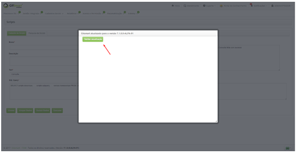
    
    **Figura 12 - Validando a atualização**

1.  Caso ocorra alguma inconsistência durante a execução de scripts automática
    no sistema, será exibida uma tela, onde serão indicados os scripts com
    inconsistência, conforme abaixo:

    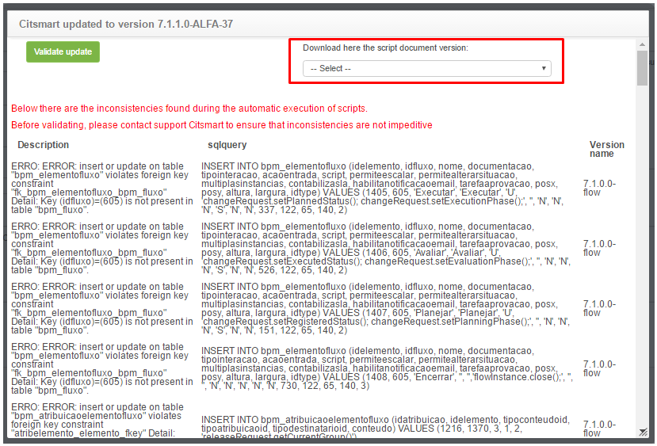
    
    **Figura 13 - Scripts**

1.  Para realizar as tratativas dos scripts com inconsistência, selecione a
    versão desejada no campo Baixe aqui o documento de script da versão para
    visualizar o script;

    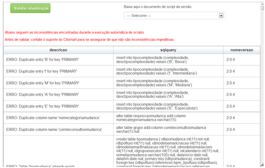
    
    **Figura 14 - Escolha da versão**

1.  Após selecionar a versão desejada, será exibida uma janela apresentando os
    scripts;

    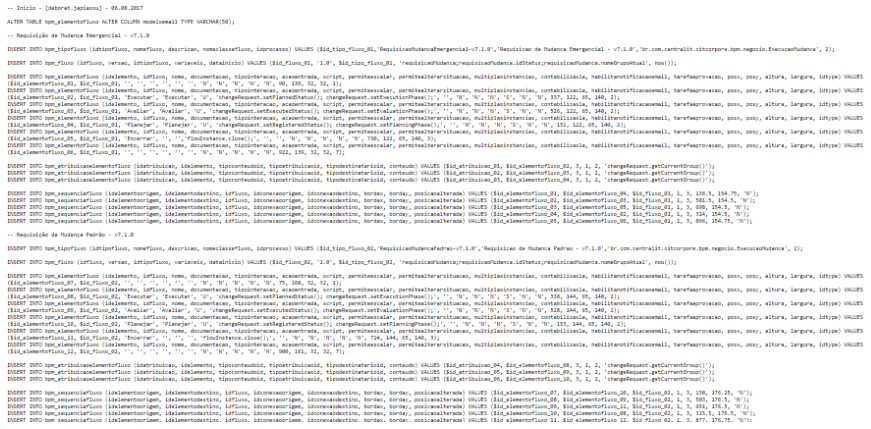
    
    **Figura 15 - Detalhes do Script**

1.  Copie os scripts indicados e rode no banco de dados;

2.  Após rodar os scripts no banco de dados, clique no botão Validar Atualização
    para que a atualização do sistema seja validada. Caso não tenha efetuado a
    validação da atualização, o sistema ficará bloqueado para os usuários até
    que o mesmo seja validado;

3.  Feito isso, a atualização do sistema será validada com sucesso e poderá ser
    utilizado normalmente.

    !!! info "IMPORTANTE"

        Se for necessário fazer Rollback, deverá importar as visões. As visões
        refletem o código da versão atual, ao voltar a uma versão anterior as visões
        também deverão voltar.

Refazer a indexação (reindex)
---------------------------

1.  Realize a indexação dos index da base de conhecimento, através da Plataforma
    CITSmart, conforme os passos descritos abaixo:

2.  No menu principal, posicione o mouse nas opções **Sistema >
    Configurações > Gerência de Conhecimento (Indexação)**;

3.  Será exibida tela de Indexação;

    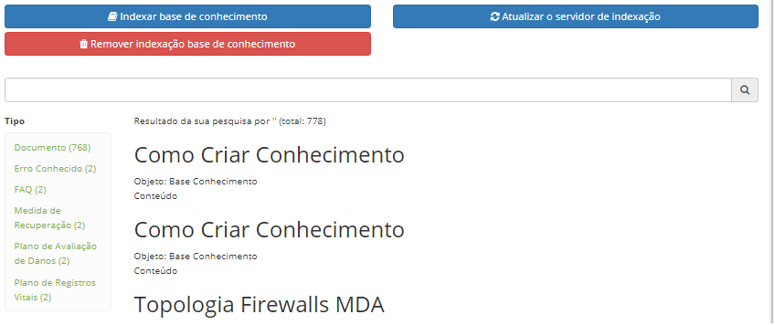
    
    **Figura 16 - Tela indexação**

1.  Clicar no botão “Remover indexação base de conhecimento” e aguardar a
    remoção;

2.  Clicar no botão “Indexar base de conhecimento” e aguardar listar os
    conhecimentos.

Importando o certificado sms do servidor de e-mail para o JRE
-----------------------------------------------------------

Para realização da instalação do certificado SMS, proceder conforme as rotinas
descritas abaixo:

1.  Instale o OPENSSL:

    -   https://slproweb.com/products/Win32OpenSSL.html

2.  Salve o certificado:

    -   C:\\OpenSSL-Win64\\bin\>openssl s_client -connect smtp.prf.gov.br:587
        -starttls smtp \> smtp.txt

3.  Crie o arquivo smtp.cer:

    -   Abra o arquivo smtp.txt. Será apresentado uma cadeia de certificados
        seguida por um certificado do servidor.

    -   Copie o bit começando com BEGIN CERTIFICATE e END CERTIFICATE em um
        arquivo smtp.crt. Ao abrir este arquivo, será possível verificar as
        propriedades do certificado e suas respectivas impressões digitais.

**Exemplo do conteúdo:**
    
-----BEGIN CERTIFICATE-----
MIIFBjCCA+6gAwIBAgIBAzANBgkqhkiG9w0BAQUFADCBjDELMAkGA1UEBhMCQlIx
CzAJBgNVBAgTAkRGMRIwEAYDVQQHFAlCcmFzw61saWExDDAKBgNVBAoTA1BSRjEO
MAwGA1UECxMFRElURUwxDzANBgNVBAMTBlBSRi1DQTEPMA0GA1UEKRMGUFJGLUNB
MRwwGgYJKoZIhvcNAQkBFg1jYUBwcmYuZ292LmJyMB4XDTE0MDIyNTIyNDcyMFoX
DTI0MDIyMzIyNDcyMFowgZ4xCzAJBgNVBAYTAkJSMQswCQYDVQQIEwJERjESMBAG
A1UEBxQJQnJhc8OtbGlhMQwwCgYDVQQKEwNQUkYxDjAMBgNVBAsTBURJVEVMMRcw
FQYDVQQDEw5teDMucHJmLmdvdi5icjERMA8GA1UEKRMIY2hhbmdlbWUxJDAiBgkq
hkiG9w0BCQEWFXBvc3RtYXN0ZXJAcHJmLmdvdi5icjCCASIwDQYJKoZIhvcNAQEB
BQADggEPADCCAQoCggEBAMqLX1/yDGC9cFWovRljsGPr7tk8sdPccgx1UH+TkL8h
n8TxJIjgO40MNsUdsIVL+xO7aulIWmWhB9bNQDmCuCjBeXnp3vND8OFXThKXBd64
OxVzLHhG9DpIK+9i28jRhcjBNTNVrMKLAGiUFYWw2luKYl6HE96ftovn1UUm013b
n7SZXDF0fUKWObOPl1UIQKh1Yy/+h5B8hAhcqNlSVZGGkTAdTGe/NcTjqyGTuwIB
WUVPPO24WfqvgDukP68gT5e6D2REis7GSR+pcxpwH242iFCFQli4ATt1kvmglCQ5
OjXO+/1s7tt4u8FYzBXk2KiDqtajnqZT+AoLnMsRpDcCAwEAAaOCAV0wggFZMAkG
A1UdEwQCMAAwEQYJYIZIAYb4QgEBBAQDAgZAMDQGCWCGSAGG+EIBDQQnFiVFYXN5
LVJTQSBHZW5lcmF0ZWQgU2VydmVyIENlcnRpZmljYXRlMB0GA1UdDgQWBBSOtZGL
2GmIO5K6xH5l7TwhPLDQfTCBwQYDVR0jBIG5MIG2gBScCoQRvlGi++0ILaLpd0zU
6gJu5KGBkqSBjzCBjDELMAkGA1UEBhMCQlIxCzAJBgNVBAgTAkRGMRIwEAYDVQQH
FAlCcmFzw61saWExDDAKBgNVBAoTA1BSRjEOMAwGA1UECxMFRElURUwxDzANBgNV
BAMTBlBSRi1DQTEPMA0GA1UEKRMGUFJGLUNBMRwwGgYJKoZIhvcNAQkBFg1jYUBw
cmYuZ292LmJyggkAsb36xutVAGkwEwYDVR0lBAwwCgYIKwYBBQUHAwEwCwYDVR0P
BAQDAgWgMA0GCSqGSIb3DQEBBQUAA4IBAQBH76r7YW7pch2ck6S1BQlJOQpI6SlK
pntOPzn98vvkzaRTKdYDronGGy2RZ21ced6+Zyh34Vv2CQMpCY7N5wH1/XFJNP0G
MIydH/SAOY6stJH4CRadLa0Lb5Q5dKTB5BfJAwNRqkkQLMGFDWw6r4MEJpSgP6QL
QTDcJcIvmjnRdbzddA6IspUG0sSs8wE4QUksRJyFfwAFrQ+7cMcpbcWSn8+gVOTg
p5+eRgCCjBzl4E7DcLIgB10izTgQqik06WbTlcSXr2NqZRcrJaULxPT7GL8WCP8W
4NkW/oi8jSORUHd8YoOZKOO7v6s4+9WlT8tf7YrcyuRuo1e4l+NzevJ8
-----END CERTIFICATE-----    
    
1.  Importe o arquivo cacerts da pasta /jre/lib/security:

    -   keytool -import -keystore cacerts -file smtp.cer

   !!! note "NOTA"

      No Windows, é necessário copiar o arquivo cacerts para uma pasta que não
      necessite de permissão de administrador ou abrir o console em modo
      administrador.

1.  Reinicie o servidor.

Veja também
-----------

-   [Conexão CITSmart Event
    Monitor]();

-   [Configuração da conexão do Citsmart
    inventory]();

-   [Manual de instalação do componente
    Inventory]();

-   [Manual de instalação do Central Authentication Service (CAS) - versão 3.0
    (ITSM)]();

-   [Manual de instalação do componente
    EVM]().
    
    
!!! tip "About"

    <b>Product/Version:</b> CITSmart | 8.00 &nbsp;&nbsp;
    <b>Updated:</b>07/23/2019 – Anna Martins
