title:  Manual de instalação do componente Inventory
Description: Tem por objetivo fornecer as orientações necessárias para a instalação e configuração do CITSmart Inventory.. 
# Manual de instalação do componente Inventory

Este documento tem por objetivo fornecer as orientações necessárias para a instalação e configuração do CITSmart Inventory.

Rotina de inventório
----------------------

A rotina de Inventário quando em execução localiza os ativos e itens de configuração na rede e grava ou atualiza as informações, 
obtidas de cada hardware, no banco de dados de itens de configuração.

A aplicação de Inventário realiza a captura dos dados por meio da porta SNMP (161) e/ou pelo Agente de Captura Citsmart.Net (porta
7103, desenvolvido pela Central IT). Inicialmente, o Inventory realiza um comando “ping” para verificar se a máquina está ativa. Se
conseguir realizar o comando, tenta acessar a porta SNMP do item de configuração. Se o acesso à porta não for obtido com sucesso, o 
Inventory tenta realizar o acesso através do agente de captura.

!!! note "NOTA"

    As configurações relativas ao CITSmart Inventory são realizadas no CITSmart, no menu 
    Processos ITIL > Gerência de Eventos > Conexões Inventory.
    
O Agente de Captura Citsmart.Net pode ser utilizado como um “centralizador” de captura, para o qual seriam direcionadas as
solicitações de captura de Inventário para todas as demais máquinas de uma rede. É possível realizar o Inventário também sem o 
Agente de Captura Citsmart.Net. Neste caso, é necessário configurar o serviço “SNMP” de cada máquina. Por outro lado, o Agente de 
Captura Citsmart.Net também pode ser instalado individualmente em cada máquina (neste caso eliminando a necessidade de configurar a 
porta SNMP de cada máquina).

Abaixo segue os desenhos explicativos da rotina de inventório
----------------------------------------------------------------

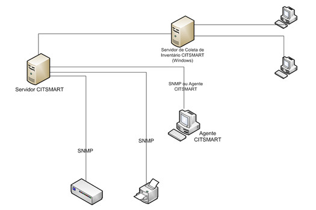

**Figura 1 - Rotina de execução do agente CITSmart**

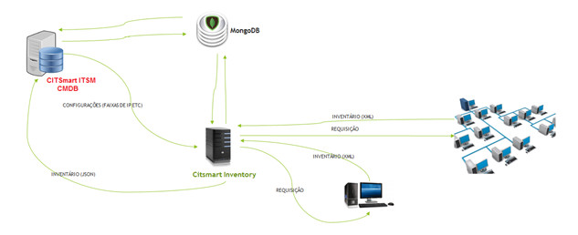

**Figura 2 - Rotina de execução do CITSmart Inventory**

Detalhamento dos componentes e tecnologias
----------------------------------------------

- **Servidor CITSmart**: É o servidor onde o sistema CITSmart é executado, ou seja, servidor de aplicação Java (geralmente JBOSS
ou compatível) com a aplicação CITSmart instalada.
-  **Servidor de Coleta de Inventário CITSmart (Windows)**: É um servidor Windows com o Agente Server instalado com serviço que
tem a função de coletar informações de outras estações Windows remotas. A conversa do Servidor CITSmart com este servidor é feita
através de Protocolo TCP/IP, conexão TCP, pela porta 7103. Devem ser feitas as devidas liberações nos firewalls para que este 
processo de comunicação funcione corretamente. Deve-se também atribuir um usuário e senha com permissões de administração de rede
para a execução do Serviço do Windows (Windows Service), pois este componente fará acesso às máquinas remotas utilizando o 
recurso WMI, disponibilizado pela plataforma Windows.
- O WMI (instrumentação de gerenciamento do Windows) é a implementação da Microsoft do WBEM, uma iniciativa da indústria que visa
estabelecer padrões para acessar e compartilhar informações de gerenciamento por meio de uma rede empresarial. O WMI é compatível
com WBEM e fornece suporte integrado ao modelo CIM (modelo de informação comum), o modelo de dados que descreve os objetos 
existentes em um ambiente de gerenciamento.
- WBEM - Web-Based Enterprise Management, é um conjunto de gerenciamento de sistemas e tecnologias desenvolvidas para unificar o
gerenciamento de ambientes de computação distribuída.
- **Agente CITSMART.NET**: É um componente da solução CITSmart, que executa em equipamentos Windows (é o mesmo componente que
roda no Servidor de Coleta de Inventário, a diferença é que executa localmente com diretivas de Local System Account – sem 
permissões de acesso à rede e outros equipamentos).
- **SNMP**: O protocolo SNMP (do inglês *Simple Network Management Protocol* - Protocolo Simples de Gerência de Rede) é um 
protocolo, da camada de aplicação, de gerência típica de redes IP, que facilita o intercâmbio de informação entre os dispositivos
de rede, como placas e computadores (*switches*) e impressoras. Para que o SNMP funcione em ambiente Windows e Linux é necessário
instalar os componentes/pacotes e habilitar permissões.
- **CMDB**: É um repositório de informações relacionadas a todos os componentes do CITSmart. Ele contém os detalhes dos itens de
configuração (IC) na infraestrutura de TI.
- **Citsmart Inventory**: Aplicação responsável por realizar o inventário dos ativos e itens de configuração na rede e enviar os 
dados obtidos para o CITSmart armazenar no banco de dados.
- Loja CITSmart no banco de dados.
- **MongoDB**: Banco de dados orientado a documentos, diferente dos bancos de dados tradicionais que seguem o modelo relacional.
Ele é de [grande armazenamento de dados][1] e de maior velocidade. Utilizado para o controle de fila e comunicação entre as 
aplicações.

Configurações iniciais
-------------------------

Para executar a rotina de Inventário é necessário realizar as configurações descritas nos tópicos abaixo.

Agente de captura CITSMARTNET e SNMP
-------------------------------------

*Agente de Captura CITSMART.NET*: É um componente da solução CITSmart, que roda em equipamentos Windows (é o mesmo componente que
roda no Servidor de Coleta de Inventário, a diferença é que executa localmente com diretivas de Local System Account – sem 
permissões de acesso à rede e outros equipamentos).

1. Instale o Agente CITSmart. Para realizar essa instalação, bastar utilizar o setup **SetupAgCITSMART.msi**. (Para downloads 
acesse o http://files.citsmart.com).

Ao terminar a instalação do Agente, **não esqueça** de iniciar o serviço no Windows. No caso do Servidor de Coleta de Inventário,
utilize um usuário e senha com permissões de Administração da rede Windows (somente assim será feito a coleta remota).

Caso o Agente já esteja instalado e você queira desinstalar para instalação de uma nova versão, basta proceder da seguinte forma:

- Em “Painel de Controle” > “Ferramenta Administrativas” → “Serviços”, clique em Parar no Serviço agCITSmart.NET;
- Em “Painel de Controle” → “Programas e Recursos”, localize o software AgentCITSmart.NET e escolha a opção Desinstalar;
- Caso o serviço ainda esteja instalado, basta entrar em uma janela de comandos (Prompt do DOS) e digitar o comando 
**sc delete agCITSmart.NET**. Após isso, dê um refresh na janela de serviços do Windows.
    
*SNMP*: O protocolo SNMP (do inglês Simple Network Management Protocol - Protocolo Simples de Gerência de Rede) é um protocolo, 
da camada de aplicação, de gerência típica de redes IP, que facilita o intercâmbio de informação entre os dispositivos de rede, 
como placas e computadores (switches) e impressoras. Para que o SNMP funcione em ambiente Windows e Linux é necessário instalar 
os componentes/pacotes e habilitar permissões.

Instalação/Configuração do SNMP no ambiente Windows
-----------------------------------------------------

Para realizar a instalação/configuração do serviço SNMP no ambiente *Windows*, proceda conforme os passos descritos abaixo:

1. Abra a tela de recursos do Windows **Painel de Controle > Programas e Recursos > Ativar ou desativar recursos do Windows**;

    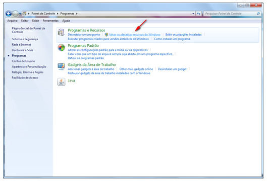
    
    **Figura 3 - Tela de recurso do Windows**
    
2. Verifique se o recurso **Protocolo SNMP** está ativo, ou seja, se está selecionado, caso não esteja, selecione o mesmo e 
clique em Ok para ativação do protocolo SNMP, conforme indicado na figura abaixo;

    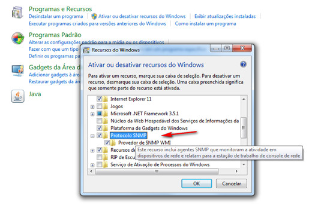
    
    **Figura 4 - Tela de ativação de recursos do Windows**
    
3. Feito isso, abra a tela de serviços do Windows para configurar o SNMP;

    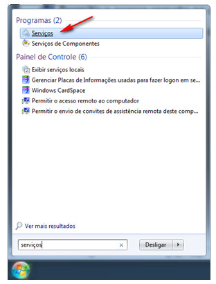
    
    **Figura 5 - Busca do serviços do Windows**
    
4. Após abrir a tela de serviços do Windows, clique com o botão direito do mouse sobre o serviço SNMP e logo em seguida clique 
em **Propriedades**, conforme indicado na figura abaixo;

    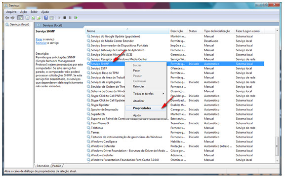
    
    **Figura 6 - Tela de serviços do Windows**
    
5. Será apresentada a tela de Propriedades do Serviço SNMP. Clique na aba **Segurança**, marque a opção **Aceitar pacotes SNMP de 
qualquer host** e clique em "Adicionar" para cria uma nova comunidade, conforme indicado na figura abaixo;

    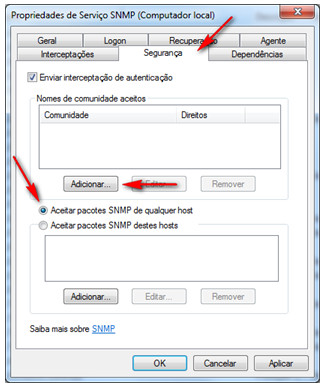
    
    **Figura 7 - Tela de propriedades de serviço SNMP**
    
6. Será apresentada a tela para informar os dados da nova comunidade. Informe o nome **public** para a comunidade e permaneça com
a opção **Somente Leitura** para os direitos da comunidade e clique em Adicionar, conforme indicado na figura abaixo;

    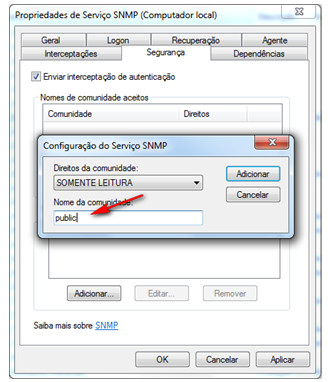
    
    **Figura 8 - Tela de configuração da comunidade do serviço SNMP**
    
7. Feito isso, será apresentada a nova comunidade na tela de Propriedades do Serviço SNMP, conforme ilustrado na figura abaixo;

    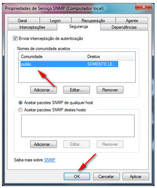
    
    **Figura 9 - Configuração do serviço SNMP**
    
8. Para efetuar a configuração do Serviço SNMP, basta clicar no botão "Ok".
    
Instalação/Configuração do SNMP no ambiente Linux
-----------------------------------------------------

Para realizar a instalação/configuração do SNMP no ambiente *Linux*, proceda conforme os passos descritos abaixo:

*Instalação do SNMP no Sistema Operacional CentOS*

1. Execute o seguinte comando para instalar o pacote net-snmp:

    
    
2. O comando seguinte fará o backup do arquivo de configuração original do SNMP:

    
    
*Configurando o Arquivo snmpd.conf*

1. Edite o arquivo /etc/snmp/snmpd.conf;

    - Existem algumas premissas básicas ao configurar o SNMP, são elas:
        - Configuração da comunidade
        
        - Caso esta linha não exista você deverá criá-la, porém caso ela exista, deixe-a de acordo como está mostrado abaixo:
        
    
    
2. Configuração do grupo

    - Caso estas linhas não existam você deverá criá-las, porém caso elas existem, deixe-as de acordo como está demonstrado abaixo:
    
    
    
    
    
3. Configuração da árvore SNMP

    - Caso esta linha não exista você deverá criá-la, porém caso ela exista, deixe-a de acordo como está mostrado abaixo:
    
    
    
4. Configuração de acesso do grupo

    - Caso esta linha não exista você deverá criá-la, porém caso ela exista, deixe-a de acordo como está mostrado abaixo:
    
    
    
5. A configuração completa deverá ficar similar ao apresentado abaixo:

    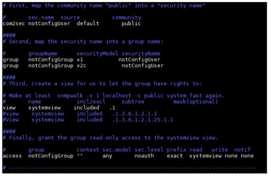
    
6. Reinicie o serviço SNMP com o seguinte comando:

    
    
7. Após “restartar” o SNMP, realize o teste local com o objetivo de verificar se o SNMP está rodando:

    
    
8.  teste deverá retornar o seguinte resultado:

    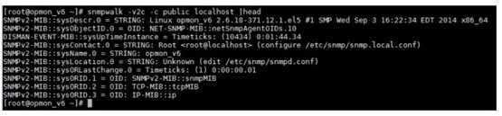
     
Configuração de regra de Firewall - liberação de ICMPV4 no Windows
--------------------------------------------------------------------

Para liberar o Ping no Windows 7 é necessário entrar no Firewall em “Regras de Entrada” e ativar a regra “Compartilhamento de 
Arquivo e Impressora (Solicitação de Eco - ICMPv4-In)”

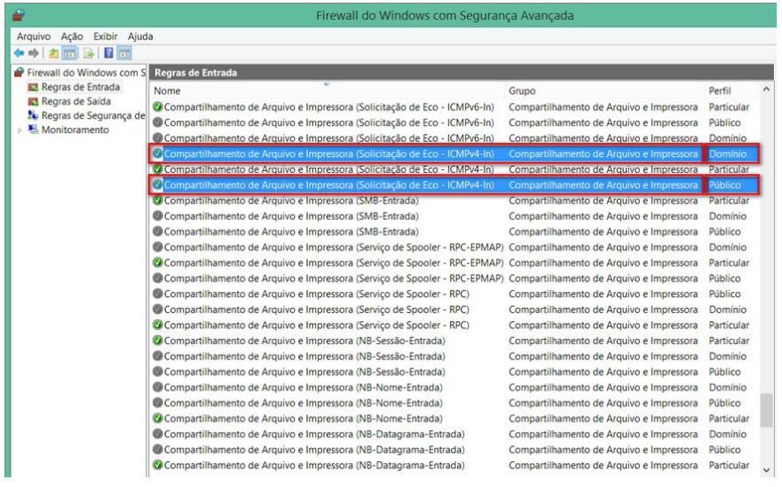

**Figura 10 - Firewall do Windows com segurança avançada**

Instalação do MongoDB
------------------------

Instale o MongoDB através do link: [https://www.mongodb.org/][2].

Para mais detalhes sobre a instalação e configuração de serviços verifique a documentação através do link:
[https://docs.mongodb.com/manual/administration/install-community/][3].

Configuração das aplicações
------------------------------

*Servidor de aplicação*

!!! info "IMPORTANTE"

    Não é necessário realizar configurações em arquivos “.properties”.
    
Para realizar a configuração do CITSmart Inventory, é necessário, proceder conforme os passos indicados abaixo:

1. Baixar o JBoss para ITSM Community 6.0+ e ITSM Enterprise 7.0.0+: **jboss-as-7.2.Final - Citsmart**;

2. Baixar o JBoss para Inventory: **jboss-as-7.1.Final - Inventory**;

3. Copie as últimas versões das aplicações CITSmart e CITSmart Inventory (arquivos com extensão **.war**) para a pasta 
**deployments** das respectivas instâncias do JBoss;

4. Altere o arquivo **standalone-full.xml** das respectivas instâncias do Jboss:

!!! note "NOTA"

    Esses downloads podem ser executados acessando a área de downloads da CITSmart Corporation (http://files.citsmart.com);
    
!!! warning "ATENÇÃO"

    Os arquivos de configuração do JBoss se encontram na pasta configuration (jboss\standalone\configuration) de cada instância 
    do JBoss, disponibilizadas pela CITSmart Corporation.
    
Standalone-full.xml (CITSmart)
---------------------------------

Altere a seguinte seção deste arquivo, conforme indicado abaixo.

**standalone-full.xml (CITSmart Inventory)**

Altere a seguinte seção deste arquivo, conforme indicado abaixo.

!!! warning "ATENÇÃO"

    Na tag property das configurações acima **<property name="citsmart.login" value=""/>**  , referente a seção 
    tandalone-full.xml (CITSmart Inventory), na propriedade "nome" o valor que normalmente é o login do usuário, desde a
    versão 7.2.2.0 é preciso informar o "contexto".
    
Cadastro de conexão
-----------------------

Após as instâncias do JBoss de cada aplicação estiverem inicializadas, acesse o CITSmart no endereço:
http://<ip>[:<porta>]/citsmart, feito isso, realize a configuração do cadastro mencionado abaixo:

Cadastro de Conexões do CITSmart Inventory

1. Acesse o menu **Processos ITIL > Gerência de Evento > Conexões Inventory**;

    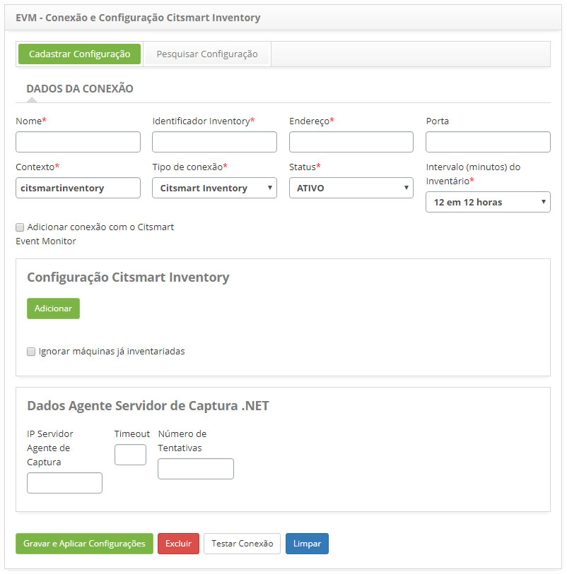
    
    **Figura 11 - Cadastro de conexão do CITSmart Inventory**
    
2. Cadastre todas as propriedades referentes à conexão do CITSmart Inventory, de acordo com o IP e porta onde está instalado o 
JBoss do CITSmart Inventory.

3. Caso deseje utilizar o Citsmart Inventory para geração de eventos, a opção “Adicionar conexão com o Citsmart Event Monitor” 
deve ser checada e selecionada uma conexão.

!!! note "NOTA"

    O campo “Identificador Inventory” corresponde à propriedade “citsmart.inventory.id” do “standalone-full.xml” do servidor de 
    aplicações onde está instalado o CITSmart Inventory.
    
!!! note "NOTA"

    O campo “IP Servidor Agente de Captura” refere-se ao IP do servidor onde está instalado o Agente de Captura das informações
    das máquinas.
    
!!! warning "ATENÇÃO"

    Caso seja adotada a integração do CITSmart Inventory com o OCS Inventory, é obrigatório observar as instruções contidas no
    conhecimento [Configuração da Conexão do CITSmart Inventory][4].

[1]:https://pt.wikipedia.org/wiki/Very_Large_Database
[2]:https://www.mongodb.com/
[3]:https://docs.mongodb.com/manual/administration/install-community/
[4]:/pt-br/citsmart-platform-7/processes/event/inventory-connection-setup.html

!!! tip "About"

    <b>Product/Version:</b> CITSmart | 7.00 &nbsp;&nbsp;
    <b>Updated:</b>07/29/2019 - Larissa Lourenço
