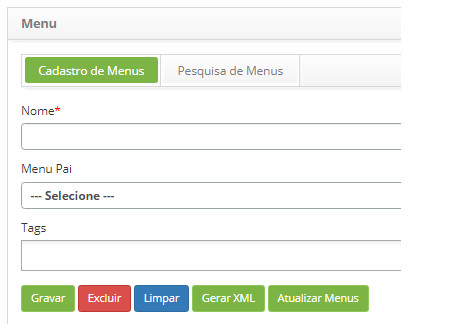
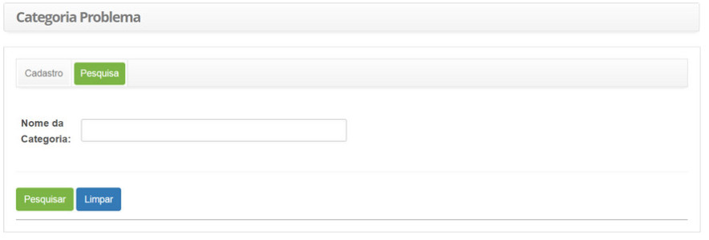
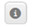
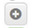
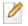
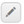
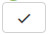
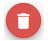
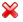

title:  Como navegar pelas telas usando os controles presentes no CITSmart Enterprise ITSM?
Description:  É esclarecer algumas regras de navegabilidade e usabilidade. 
# Como navegar pelas telas usando os controles presentes no CITSmart Enterprise ITSM?

O propósito deste documento é esclarecer algumas regras de navegabilidade e usabilidade que valerão para a grande maioria das telas
(funcionalidades) desta solução.

Tais regras se aplicam aos processos ITIL que esta solução tem certificação Pink Verify junto a Pink Elephant, quais são:

1. Gerenciamento de Portfólio (SPM)

2. Gerenciamento de Catálogo de Serviços (SCM)

3. Gerenciamento de Nível de Serviços (SLM)

4. Gerenciamento de Mudança (CHG)

5. Gerenciamento de Liberação (REL)

6. Gerenciamento de Conhecimento (KM)

7. Gerenciamento de Ativos e Configuração (SACM)

8. Gerenciamento de Evento (EV)

9. Gerenciamento de Evento (EV)

10. Gerenciamento de Incidente (IM)

11. Gerenciamento de Problema (PM)

12. Gerenciamento de Continuidade (ITSCM)

13. Gerenciamento de Disponibilidade (AVM)

Reunindo essas regras em um só documento evita-se redundância de textos muito básicos que uma vez entendidos, não agregam valor 
diluídos em todos os documentos da base de conhecimento.

Preenchimento dos campos cadastrais
--------------------------------------

Em todas as telas pode haver um ou mais campos obrigatórios. Para facilitar a identificação visual deles, esta solução adota um 
asterisco em cor vermelha bem próximo ao rótulo do campo.

A gravação/exclusão do registro, ou mesmo a execução da tarefa correspondente à tela não ocorrerá enquanto pelo menos um desses
campos marcados estiverem vazios (não-preenchidos).

**Figura 1 - Exemplo de campo marcado com asterisco**

Capacidade de busca por aproximação
--------------------------------------

Em todas as funcionalidades que têm a aba "Pesquisa" há um comportamento comum de busca pelas palavras digitas por aproximação,
ou seja, não exige que seja exatamente a palavra digitada, podendo ser parte da palavra, por exemplo, ao digitar a palavra "falta
de" a busca poderá retornar os títulos de Categoria de Problemas: "falta de toner", "falta de espaço em disco", etc..

**Figura 2 - Exemplo de tela que aceita pesquisa por aproximação**

Menu
-------

**Objetivo**

- Permitir a navegação dos usuários pelas opções do menu principal

**Opções de links e ícones**

- Ícone - neste caso mostra um menu suspenso com outros botões

Avançar/Voltar/Fechar
-----------------------

**Objetivo**

- Permitir a navegação dos usuários se movimentando pelas diversas telas

**Opções de links e ícones**

1. Botão "Voltar"

2. Botão "Voltar"

3. Botão "Fechar"

Detalhamento
---------------

**Objetivo**

- Permitir mostrar ao usuário mais detalhes sobre um registro/informação

**Opções de links e ícones**

1. Ícone 

2. Ícone 

3. Ícone 

4. Ícone 

5. Ícone 

6. Ícone 

7. Ícone 

8. Ícone  - visualiza o histórico do registro atual

9. Ícone - visualiza os anexos do registro atual

Inclusão
----------

**Objetivo**

- Permitir ao usuário cadastrar novo registro

**Opções de links e ícones**

1. Ícone 

2. Ícone - neste caso específico serve para abrir um cadastro básico

3. Ícone - neste caso específico trata-se de uma inclusão de novo registro com cópia de dados 
a partir do registro atual

4. Botão "Adicionar"

5. Botão "Gravar"

6. Botão "Gravar Dados"

Edição
----------

**Objetivo**

- Permitir ao usuário alterar dados de um registro

**Opções de links e ícones**

1. Ícone 

2. Ícone 

3. Ícone 

4. Ícone 

5. Ícone 

6. Ícone 

7. Ícone 

8. Ícone 

9. Ícone - neste caso especificamente a alteração se refere a aprovação de uma informação

10. Ícone - neste caso especificamente a alteração se refere a vínculos que o registro atual pode 
ter com outros registros

11. Ícone - neste caso especificamente a alteração se refere a vínculos que o registro atual 
pode ter com outros registros

12. Ícone  - neste caso especificamente a alteração se refere a vínculos que o registro atual 
pode ter com outros registros

13. Ícone - neste caso especificamente a alteração se refere a vínculos que o registro 
atual pode ter com alguma situação

14. Ícone - neste caso especificamente a alteração se refere a vínculos que o registro atual 
pode ter com alguma situação

15. Ícone - neste caso especificamente a alteração se refere a vínculos que o registro atual 
pode ter com alguma situação

16. Ícone - neste caso especificamente a alteração se refere a vínculos que o registro atual 
ter com outros registros

17. Ícone - neste caso especificamente a alteração se refere a vínculos que o registro 
atual pode ter com outros registros

18. Ícone  - neste caso especificamente a remoção de vínculos que o registro atual pode ter com outros registros

19. Botão "Gravar"

20. Botão "Gravar Dados"

Exclusão ou Desvinculação
---------------------------

**Objetivo**

- Permitir ao usuário excluir um registro

**Opções de links e ícones**

1. Ícone 

2. Ícone 

3. Ícone 

4. Ícone 

5. Ícone 

6. Ícone 

7. Ícone 

8. Ícone 

9. Ícone 

10. Botão "Excluir"

11. Botão "Excluir Dados"

Gravação
----------

**Objetivo**

-Permitir ao usuário efetivar a gravação (inclusão ou alteração) dos dados de um registro

**Opções de links e ícones**

1. Ícone 

2. Ícone 

3. Ícone 

Limpar
----------

**Objetivo**

- Permitir ao usuário limpar os campos de um formulário de entrada de dados

**Opções de links e ícones**

1. Ícone 

2. Botão "Limpar"

3. Botão "Limpar Dados"

Anexos
----------

**Objetivo**

- Permitir ao usuário adicionar anexos a um registro

**Opções de links e ícones**

1. Ícone 

Pesquisa
----------

**Objetivo**

- Permitir ao usuário realizar pesquisas de registros usando filtros

**Opções de links e ícones**

1. Ícone 

2. Ícone 

3. Ícone 

4. Botão "Pesquisar"

Exportação
------------

**Objetivo**

- Permitir ao usuário exportar o resultado de consultas e de relatórios

**Opções de links e ícones**

1. Ícone - neste caso exporta para um formato compatível com Acrobat Reader (extensão PDF)

2. Ícone - neste caso exporta para um formato compatível com MS-Excel

3. Ícone  - neste caso exporta gráficos para formato PDF ou formato de imagem

4. Botão "Salvar tabela" - neste caso exporta para um formato compatível com MS-Excel

5. Botão "Gerar Relatório (XLS)"

6. Botão "Gerar Relatório (PDF)"

Gráfico
------------

**Objetivo**

- Permitir ao usuário visualizar gráfico sobre o resultado de consultas e de relatórios

**Opções de links e ícones**

1. Ícone 

2. Botão "Atualizar Gráficos"

Execução
------------

**Objetivo**

- Permitir ao usuário iniciar a execução de uma atividade

**Opções de links e ícones**

1. Ícone 

2. Botão "Executar"

!!! tip "About"

    <b>Product/Version:</b> CITSmart | 7.00 &nbsp;&nbsp;
    <b>Updated:</b>07/29/2019 - Larissa Lourenço
