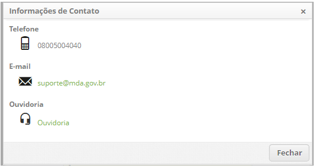
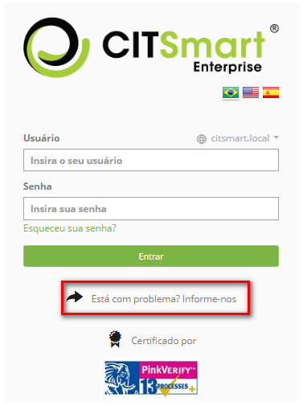
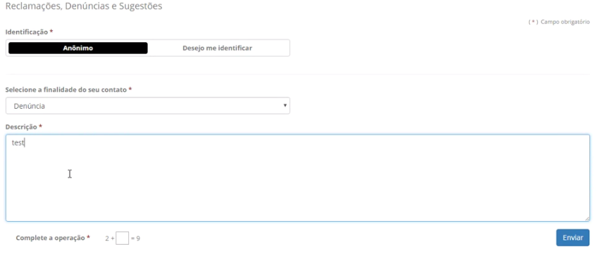
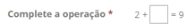

title: Manual de configuração e utilização da ouvidoria

Description: Esta funcionalidade tem por objetivo criar um canal direto para registros de Denúncia, Reclamação, Sugestão e Elogio sobre os atendimentos da
empresa.

# Manual de configuração e utilização da ouvidoria

Esta funcionalidade tem por objetivo criar um canal direto para registros de
Denúncia, Reclamação, Sugestão e Elogio sobre os atendimentos da empresa (de
forma anônima ou não), desta forma a organização terá números e evidências
suficientes para avaliar seus processos e profissionais com base nos
atendimentos realizados, possíveis desvios de conduta, etc.

Pré-condições
------------

1.  Deve existir cadastrado ao menos um Portfólio com ao menos um Serviço
    vinculado (ver conhecimentos [Cadastro de portfólio de
    serviços](1) e [Cadastro de serviços](2));

2.  Deve existir cadastrado ao menos um Acordo de Nível de Serviço (ver
    conhecimento [Cadastro e pesquisa de acordo de nível de serviço
    geral](3));

3.  Todos os pré-requisitos típicos de criação de nova Atividade dentro de um
    Serviço em um Portfólio já devem ter sido atendidos :

    -   template de e-mail de notificação de abertura/finalização/ocorrências
        (ver conhecimento [Cadastro e pesquisa de notificação via e-mail](4))

    -   calendário (ver conhecimento [Cadastro e pesquisa de calendário](5))

    -   tempo de Atendimento (ver conhecimento [Cadastro e pesquisa de tempo de
        atendimento](6))

    -   grupo de usuários (executor) (ver conhecimento [Cadastro e pesquisa de
        grupo](7))

    -   fluxo (ver conhecimento [Manutenção e fluxo de trabalho](8))

    -   contrato (ver conhecimento [Cadastro e pesquisa de contrato](9))

4.  Deve existir um formulário cadastrado que atenderá os seguintes motivos:

    -   Denúncia

    -   Reclamação

    -   Sugestão/Elogio

5.  Deve estar configurado o template para a abertura do chamado (ver
    conhecimento [Gerenciamento de ticket (serviços)](10));

6.  Deve existir cadastrada ao menos uma Operação de Web Service específica para
    a abertura do chamados (ex.: create_request) (ver conhecimento [Cadastro e
    pesquisa de operações web services](11));

7.  Deve existir cadastrada ao menos uma Origem (a origem do contato), cadastro
    disponível no menu de Tickets (ver conhecimento [Cadastro e pesquisa de
    origem de tickets](12)).

Passos para configurar a ouvidoria
---------------------------------

1.  Cadastrar três atividades (do tipo requisição) vinculadas ao
    Portfólio/Serviço adequado à organização, as quais servirão para atender as
    ocorrências, uma para cada tipo de ocorrência, podendo usar os nomes abaixo
    a título de sugestão:

    -   Denúncia;

    -   Reclamação;

    -   Sugestão/Elogio.

2.  Vincular e configurar o vínculo dessas três atividades a um Contrato
    existente;

3.  Usar o ID das três Atividades criadas para as seguintes parametrizações:

    -   345 - Ouvidoria - ID do serviço de denúncia;

    -   346 - Ouvidoria - ID do serviço de reclamação;

    -   347 - Ouvidoria - ID do serviço de sugestão.

4.  Configurar os seguintes parâmetros (para entender o efeito deles veja
    a **Figura 1**):

    -   341 - Configuração do contato para Ouvidoria na tela de login

        -   Ex.: Ouvidoria.

    -   244 - Mensagem da tela inicial

        -   Ex.: +55 62 3003-0101.

5.  Cadastrar um novo usuário para ser usado a criação de ocorrências anônimas
    (ex.: anônimo);

6.  Configurar os seguintes parâmetros:

    -   344 - Ouvidoria - URL padrão para logo da tela (opcional);

        -   Sugestão da URL:
            citsmart/pages/OmbusManregister/OmbusManregister.load\#

    -   348 - Ouvidoria - Login do usuário para autenticação (obrigatório);

    -   349 - Ouvidoria - ID da origem do contato (obrigatório).

    
    
    **Figura 1 - Informações de contato**

    !!! note "NOTA"

        O usuário escolhido para o parâmetro 348 (para ocorrências anônimas)
        deverá possuir permissão de criação no fluxo e permissão para trabalhar no
        Contrato usado para atendimento das ocorrências de ouvidoria.

7.  Configurar os parâmetros exigidos pelo Web Service que serão usados para
    abertura de chamados, ou seja, para a criação de Ticket de atendimento das
    ocorrências de ouvidoria (opção **Sistema Web Service Operação de Web
    Service**). Vincule na mesma tela o Web Service aos grupos de usuário que
    poderão trabalhar com o recurso Ouvidoria.

!!! note "NOTA"

    A configuração do Web Service para a Ouvidoria atualmente permite apenas
    um único Contrato.

    Para descobrir o ID do Acordo de Nível de Serviço (exigido na configuração
    do Web Service) é necessário executar um comando SELECT (SQL) na tabela
    "acordonivelservico" e identificar o ID pelo nome dado ao acordo desejado.

   !!! info "IMPORTANTE"

       Sugestão de texto para o parâmetro "Default description complement" do Web
       Service: "Aberto via Ouvidoria".

      Este texto vai aparecer no campo "Outras informações" do Ticket criado

Passos para registrar uma ocorrência para a ouvidoria
---------------------------------------------------

1.  Na tela de login no sistema, clicar no link "Está com problemas?
    Informe-nos", ocorrerá o redirecionamento para a tela de canais de
    atendimento;

    
    
    **Figura 2 - Tela de login**

    
    
    **Figura 3 - Tela da ouvidoria**

3.  Selecionar o modo de identificação que são:

    -   anônimo: identifica o solicitante como 'Anônimo';

    -   desejo me identificar: identifica o solicitante com o nome que o mesmo
        colocar no formulário;

4.  Na opção *Desejo me identificar*, as seguintes opções serão
    disponibilizadas:

    -   nome: campo obrigatório - nome do solicitante;

    -   telefone: campo não obrigatório que guardará o número do telefone do
        solicitante, caso o usuário inserir a informação, então a solicitação de
        serviço deverá possuir esse campo, conforme informado;

    -   e-mail: campo não obrigatório que guardará o e-mail do solicitante, caso
        o usuário inserir a informação, então a solicitação de serviço deverá
        possuir esse campo, conforme informado;

5.  Selecionar uma das finalidades do contato: Denúncia, Reclamação ou Sugestão;

6.  Digitar a descrição da ocorrência;

7.  Autenticar a sua solicitação por meio do **Captcha** (exemplo:  ) para
    que o sistema tenha garantias de que não se trata de uma tentativa de
    invasão via automação de robôs;

8.  Enviar a ocorrência (uma mensagem de envio com sucesso será apresentada).

!!! info "IMPORTANTE"

     Recomendamos que o usuário anote o número da ocorrência (Ticket) que é
     mostrado na mensagem de sucesso.

     Possíveis causas de uma mensagem de falha após solicitado o envio da
     ocorrência: banco de dados indisponível, indisponibilidade de rede e falta
     de configuração nos serviços.

Passos para atender uma ocorrência enviada para a ouvidoria
----------------------------------------------------------

1.  Na principal funcionalidade de controle e execução dos Tickets do sistema,
    basta que o atendente faça parte do grupo executor da Atividade aberta
    (chamado aberto) para que ele visualize, capture e trate das ocorrências;

2.  Se o teor (descrição) da ocorrência não estiver compatível com o tipo
    selecionado no parâmetro de Atividade default no Web Service, basta o
    atendente reclassificar para a Atividade adequada, exemplos:

    -   O ID default é de uma "Reclamação", mas o texto digitado pelo usuário é
        de um elogio;

    -   O ID default é de uma "Denúncia", mas o texto digitado pelo usuário é de
        uma sugestão.

!!! info "IMPORTANTE"

    No campo "Solicitante" do Ticket estará o título "Anônimo" para quando o
    usuário fizer esta opção na tela de abertura do chamado (ocorrência).

[1]:/pt-br/citsmart-platform-7/processes/portfolio-and-catalog/register.html
[2]:/pt-br/citsmart-platform-7/processes/portfolio-and-catalog/services.html
[3]:/pt-br/citsmart-platform-7/processes/service-level/register-sla.html
[4]:/pt-br/citsmart-platform-7/additional-features/communication-and-notification/email/notification.html
[5]:/pt-br/citsmart-platform-7/plataform-administration/time/create-calendar.html
[6]:/pt-br/citsmart-platform-7/processes/service-level/time-attendance.html
[7]:/pt-br/citsmart-platform-7/initial-settings/access-settings/user/group.html
[8]:/pt-br/citsmart-platform-7/workflow/workflow-management.html
[9]:/pt-br/citsmart-platform-7/additional-features/contract-management/use/register-contract.html
[10]:/pt-br/citsmart-platform-7/processes/tickets/ticket-management.html
[11]:#
[12]:/pt-br/citsmart-platform-7/processes/tickets/register-ticket-source.html

!!! tip "About"

    <b>Product/Version:</b> CITSmart | 8.00 &nbsp;&nbsp;
    <b>Updated:</b>7/26/2019 – Anna Martins
