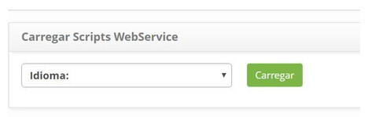
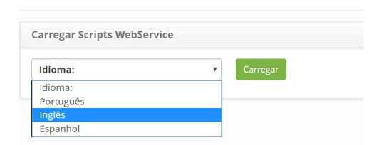
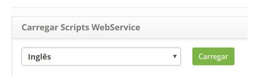
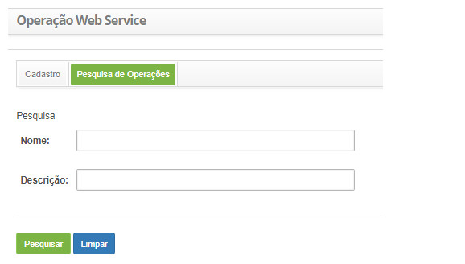
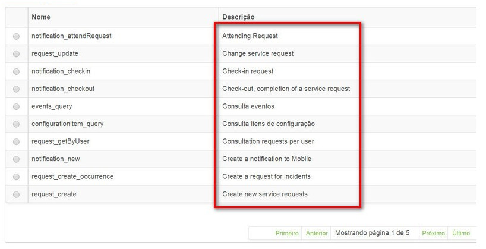

title:  Carga de scripts web service
Description: O objetivo é realizar a carga dos scripts das operações do Web Service no idioma selecionado. 
# Carga de scripts web service

O objetivo é realizar a carga dos scripts das operações do Web Service no idioma selecionado.

Pré-condições
----------------

1. Não se aplica.

Carregar scripts web service
-----------------------------

*Como acessar*

1. Acesse a funcionalidade de carregar scripts web services através da navegação no menu principal 
**Sistema > Banco de Dados > Carregar Scripts WebService**.

*Filtros*

1. Não se aplica.

*Listagem de itens*

1. Não se aplica.

*Preenchimento dos campos cadastrais*

1. Não se aplica.

Carregando scripts
--------------------

1. Será apresentada a tela **Carregar Scripts WebService** contendo uma listagem dos idiomas, conforme ilustrada na figura abaixo:

    
    
    **Figura 1 - Tela carga de idiomas**
    
2. Selecione o idioma desejado e clique no botão "Carregar";

3. Será exibida uma mensagem confirmando o sucesso da carga do idioma ou se já foi realizada alguma carga anteriormente será 
exibida uma mensagem perguntando se deseja sobrescrever carga de dados.

*Exemplo*

**Figura 2 - Tela carga de idiomas**

**Figura 3 - Tela carga de idiomas**

Verificando carga de idiomas
------------------------------

*Como acessar*

1. Acesse a funcionalidade de carregar scripts web services através da navegação no menu principal 
**Sistema > Web Service > Operação de Web Service**.

*Filtros*

1. Os seguintes filtros possibilitam ao usuário restringir a participação de itens na listagem padrão da funcionalidade,
facilitando a localização dos itens desejados:
 
    - Nome
    - Descrição
    
    
    
    **Figura 4 - Tela de pesquisa de operação web service**
    
*Listagem de itens*

1. Os seguintes campos cadastrais estão disponíveis ao usuário para facilitar a identificação dos itens desejados na listagem 
padrão da funcionalidade: **Nome** e **Descrição**.

    
    
    **Figura 5 - Tela de listagem de operação web service**
    
*Preenchimento dos campos cadastrais*

1. Não se aplica.

!!! tip "About"

    <b>Product/Version:</b> CITSmart | 7.00 &nbsp;&nbsp;
    <b>Updated:</b>08/05/2019 - Larissa Lourenço
