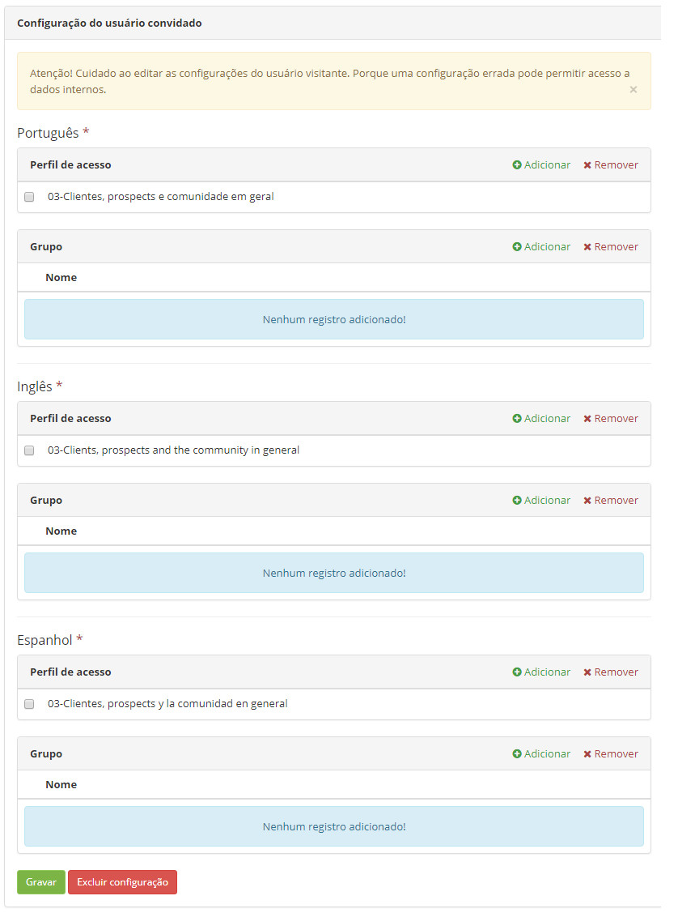
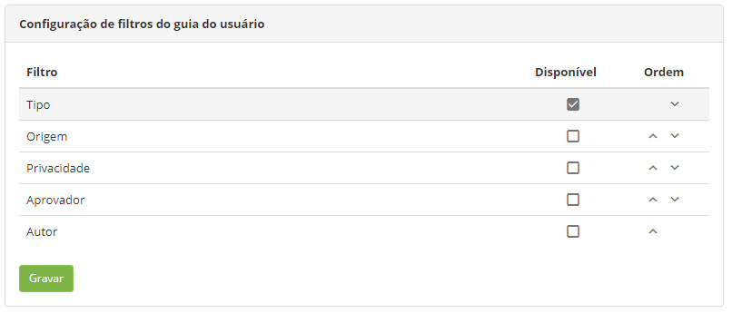

title:  Manual de configuração do Guia do Usuário
Description: Tem o objetivo de esclarecer os procedimentos mínimos necessários para configurar o Guia do Usuário. 
# Manual de configuração do Guia do Usuário

Este documento tem o objetivo de esclarecer os procedimentos mínimos necessários para configurar o Guia do Usuário, recurso essencial
para os clientes terem acesso à documentação dos produtos da CITSmart Corporation. A priori este conhecimento tem como público-alvo a 
equipe CITSmart que faz manutenção das pastas da base de conhecimento que contém esse tipo de documentação.

Pré-condições
-----------------

1. O Guia do Usuário somente está integrado às instâncias dos clientes a partir da versão 7.2.2.0.

2. Preencher o parâmetro **363 - URL do Help (Ex.: https://help.citsmart.com/citsmart)** com o conteúdo 
**https://help.citsmart.com/citsmart**

Configuração do usuário convidado/visitante
----------------------------------------------

Esta funcionalidade tem como objetivo definir cada perfil de acesso ou grupo que será assumido dependendo do idioma escolhido pelo
usuário, atualmente apenas Português, Inglês e Espanhol.

*Como acessar*

1. Acesse a funcionalidade através do menu Acesso e Permissão → Configuração do usuário convidado.

**Figura 1 - Tela de configuração do usuário convidado**

!!! note "NOTA"

    Esta funcionalidade é acessada usando a URL: /citsmart/pages/guest/guest.load

!!! warning "ATENÇÃO"

    O administrador deve ter bastante cuidado na escolha dos perfis de acesso ou grupos, a configuração errada pode revelar ao
    público em geral documentos sigilosos.
    
!!! info "IMPORTANTE"

    O usuário não precisa realizar outro login para acessar o Guia do Usuário (ao menos não de forma explícita), todas as instâncias
    de clientes da CITSmart Corporation (cloud ou não) pode ter parametrizado o link para este tipo de acesso na tela de Sistema.
    
Controle de visibilidade dos subfiltros
-------------------------------------------

Esta funcionalidade tem como objetivo definir a visibilidade de cada subfiltro que o Guia do Usuário mostra após a consulta por 
pastas ou por texto. Fica a critério do cliente esta definição.

*Como acessar*

1. Acesse a funcionalidade através do menu **Sistema > Configurações > Configuração de Filtros do Guia do Usuário**.

**Figura 2 - Tela de configuração de filtros do guia do usuário**

!!! note "NOTA"

    Esta funcionalidade é acessada usando a URL: /citsmart/pages/userGuideFiltersCustomization/userGuideFiltersCustomization.load

Configurações de aparência do Guia
--------------------------------------

Esta funcionalidade tem como objetivo definir qual a identidade visual básica do Guia do Usuário:

1. Logomarca;
2. Tamanho do cabeçalho;
3. Configuração de cor para fundo e texto do cabeçalho.

*Como acessar*

1. Acesse a funcionalidade através do menu **Sistema > Configurações > Guia do Usuário**.

Também nesta tela é possível configurar o acesso à documentação de cada produto da CITSmart Corporation, ou seja, para cada par
produto-idioma há um conjunto de atributos possíveis de alteração:

1. Pasta (fora da pasta indicada ao produto não será visualizado nada que estiver em outras pastas)
2. Ícone

**Figura 3 - Tela de configuração do guia do usuário**

!!! info "IMPORTANTE"

    Para evitar distorções na visualização final, o administrador deve respeitar ao máximo as dimensões (pixels) mostradas acima na
    imagem.
    
!!! note "NOTA"

    Os arquivos de imagem podem ter os seguintes formatos/extensões: JPEG, PNG, GIF e IMG.

!!! note "NOTA"

    É possível encontrar na Internet tabelas com os valores hexadecimais das possíveis cores, exemplo: [link][1]
    
!!! tip "About"

    <b>Product/Version:</b> CITSmart | 7.00 &nbsp;&nbsp;
    <b>Updated:</b>08/08/2019 - Larissa Lourenço

[1]:https://www.rapidtables.com/web/color/RGB_Color.html

